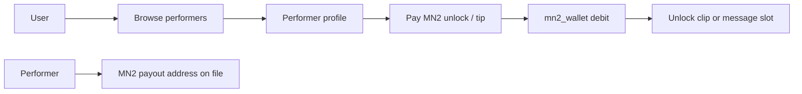

# Camgirls platform — Phase 0 spec

**Domain:** `camgirls.masternoder.dk`  
**Date:** 2026-06-17  
**Status:** Draft for review

---

## 1. Product intent

Build a **performer aggregation hub** where users spend **MN2** for access, tips, and optional AI-enhanced chat. The subdomain name reflects the vertical; today it hosts the **block explorer** (E1). Phase 0 defines how explorer and platform coexist and what ships first.

**Non-goals (Phase 0):** live WebRTC cam ingest, custodial fiat payouts to performers, bypassing age verification.

---

## 2. Current state

| Layer | Today |
|-------|--------|
| `camgirls.masternoder.dk/` | eiquidus explorer (blocks, tx, address, richlist) |
| `masternoder.dk` | Flask app: MN2 wallet, shop, generator MN2 rails, `/monetization`, staking |
| Performer catalog | **Not built** |
| AI chat / avatar | **Not built** |

**Existing rails to reuse**

- `mn2_wallet_service` — user balances, debit on purchase
- `shop_mn2_purchase_core` — atomic MN2 charge + fulfillment
- `generator_mn2_service` — per-action / per-minute pricing pattern
- `customer_aggregator_service` — user directory
- `mn2_copy_trading` — follow-leader pattern (optional for “follow performer”)

---

## 3. User flows (Phase 1 MVP — directory)



| Flow | MN2 action | Fulfillment |
|------|------------|-------------|
| Browse catalog | Free | List from `data/camgirls_performers.json` |
| Unlock profile / clip | Fixed MN2 (e.g. 10–500) | Mark unlock in `data/camgirls_unlocks.json` |
| Tip performer | User-chosen MN2 | Credit performer ledger + activity log |
| Message slot (async) | Per message MN2 | Queue message; performer replies off-platform initially |

**Age gate:** checkbox + DOB or external verifier before first paid action (store `age_verified_at` on user record).

---

## 4. AI options (Phase 2+)

| Option | Stack | Cost model | Fit |
|--------|-------|------------|-----|
| **B1 — Text persona** | OpenAI / Anthropic API | MN2 per message (markup on token cost) | Fastest; no GPU on server |
| **B2 — Local LLM** | Ollama + Llama 3.x on **separate VPS** | Flat MN2 per session | Privacy; not on 1.9 GB prod box |
| **B3 — Voice** | LiveKit Agents + TTS (ElevenLabs / Piper) | MN2 per minute | Cam-style UX; needs dedicated host |
| **B4 — Video clip** | Extend `video_generator_service` | MN2 per clip (existing generator quote) | Reuses queue + MN2 charge |
| **B5 — Avatar stream** | LiveKit + Simli/Tavus/HeyGen | Premium MN2/min | Phase 3 spike only |

**Recommendation:** Ship **directory MVP (Phase 1)** on `masternoder.dk/camgirls/` first. Add **B1 text chat** behind MN2 debit. Defer voice/avatar until performer catalog proves demand.

---

## 5. URL / hosting plan

| Path | Host | Notes |
|------|------|-------|
| Explorer home | `camgirls.masternoder.dk/` | Keep eiquidus (PM2 :3000) |
| Platform UI | `masternoder.dk/camgirls/` **or** `camgirls.masternoder.dk/app/` | nginx proxy to Flask static + API |
| API | `masternoder.dk/api/camgirls/*` | Same uwsgi app as rest of site |

**nginx (later):** add `location /app/ { proxy_pass http://127.0.0.1:5000/camgirls/; }` on camgirls vhost if product moves to subdomain.

---

## 6. Data model (Phase 1)

**`data/camgirls_performers.json`**

```json
{
  "performers": [
    {
      "id": "performer_1",
      "display_name": "…",
      "tagline": "…",
      "avatar_url": "/static/camgirls/…",
      "unlock_price_mn2": 50,
      "tip_min_mn2": 5,
      "payout_address": "J…",
      "featured": true,
      "active": true
    }
  ]
}
```

**`data/camgirls_unlocks.json`** — `{ "user_id": { "performer_id": { "unlocked_at": "…" } } }`

**Ledger:** append `camgirl_unlock` / `camgirl_tip` types to `mn2_ledger.json` (same pattern as shop).

---

## 7. API sketch (Phase 1)

| Method | Route | Auth | Purpose |
|--------|-------|------|---------|
| GET | `/api/camgirls/performers` | Public | Catalog |
| GET | `/api/camgirls/performers/<id>` | User | Profile + unlock state |
| POST | `/api/camgirls/performers/<id>/unlock` | User + MN2 balance | Debit + grant access |
| POST | `/api/camgirls/performers/<id>/tip` | User | Debit user, record tip |
| POST | `/api/camgirls/ops/performers` | Ops secret | CRUD performers |

---

## 8. Compliance & ops

- **18+ gate** before any MN2 spend on camgirls routes
- **Performer onboarding:** ops adds row + verified payout MN2 address
- **Content policy:** static clips / links only in MVP (no user-upload stream until moderation pipeline exists)
- **Reconcile:** tips + unlocks must appear in `mn2_ledger` and conservation checks

---

## 9. Phase checklist

| Phase | Deliverable | Depends on |
|-------|-------------|------------|
| **0** | This spec + URL decision | — |
| **1a** | Performer JSON + GET catalog API + static browse page | Deploy `camgirls` manifest |
| **1b** | MN2 unlock + tip endpoints | shop_mn2_purchase_core |
| **1c** | Age gate on paid routes | user profile flag |
| **2** | Text AI chat per performer persona | API key + MN2 metering |
| **3** | Voice/avatar spike on separate VPS | LiveKit eval |

---

## 10. Open decisions

1. **Subdomain split:** explorer-only on `camgirls.` vs `/app` platform on same host?
2. **Performer payouts:** manual ops transfer vs automated `sendtoaddress` batch?
3. **AI provider:** API (fast) vs self-hosted (private)?
4. **Link to staking:** “tip with staked MN2” or spendable balance only?

---

## References

- [MN2_TODO.md](MN2_TODO.md) — Camgirls track
- [MN2_EXPLORER_PLAN.md](MN2_EXPLORER_PLAN.md) — E1 explorer
- [MN2_OPS.md](MN2_OPS.md) — daemon / wallet ops
- [MONETIZATION_PAYPAL.md](MONETIZATION_PAYPAL.md) — chargeback rules (keep fiat separate)
