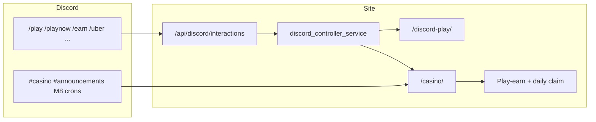

# Discord Casino Bot — unified guide

**Gate S:** Discord is the **controller** only. PayPal, MN2, USD, and withdrawals happen on **masternoder.dk** — never in chat.

See also: [DISCORD_SERVER_SETUP.md](DISCORD_SERVER_SETUP.md) · [CASINO_EXPANSION_PLAN.md](CASINO_EXPANSION_PLAN.md) · `data/casino_monetization_v13.json`

---

## Architecture (one loop)



| Piece | Role |
|-------|------|
| **Controller bot** | 17 slash commands — `data/discord_controller_config.json` |
| **App manifest** | 12 deep-link activities — `data/discord_app_manifest.json` |
| **Discord Play site** | Uber games, USD/MN2, session tokens — `/discord-play/` |
| **Casino UI** | Discord tab, social chat portal, earn hooks — `/casino/?tab=discord` |
| **M8 streams** | Promo rotator, quest digest, alerts, spider bot — `discord_m8_streams.py` |
| **Monetization map** | `/uber` `/deposit` `/vip` `/bundle` — `casino_monetization_v13.json` |

### User journey (happy path)

1. User runs `/play` or `/casino` in Discord → deep link to site.
2. On casino **Discord** tab → copy link code → `/link CODE` in Discord.
3. `/playnow` → 1h session on **Discord Play** (uber lounge, real currency).
4. `/earn` → daily claim + play-earn while betting (linked account).
5. Big wins / network bonuses → on-site MN2 credit (`casino_network_rewards_service`).

---

## Post-deploy checklist

Run after `deploy.py mn2_staking static_pages` (and uwsgi restart):

```bash
python scripts/discord_casino_bot_post_deploy.py
python scripts/discord_casino_bot_post_deploy.py --base-url https://masternoder.dk --json
```

### Automated checks

- Repo files: controller, play site, configs, register script, spider script
- Cron scripts present locally (market / promo / game fan-out)
- `.env`: `DISCORD_BOT_TOKEN`, `DISCORD_APPLICATION_ID`, `DISCORD_PUBLIC_KEY`, guild + casino webhooks
- Live API: `/api/discord/interactions`, `/api/discord/controller/status`, platform hub, app manifest
- Page: `/discord-play/`
- Slash command payloads build (17 commands)

### Manual (ops) — required to go live in Discord

| Step | Action |
|------|--------|
| 1 | [Developer Portal](https://discord.com/developers/applications) → **Interactions URL** `https://masternoder.dk/api/discord/interactions` (no trailing slash) |
| 2 | Set **Public Key** in `.env` as `DISCORD_PUBLIC_KEY` · restart uwsgi |
| 3 | Register commands: `python scripts/discord_register_commands.py` on server (or ops `POST /api/discord/setup/register-commands`) |
| 4 | Invite bot to server with `applications.commands` scope |
| 5 | **Smoke in Discord:** `/play` → `/link` → `/playnow` → `/earn` |
| 6 | Confirm `#casino` webhook posts (optional: `python scripts/discord_mn2_channel.py test-post`) |

### M8 cron install (server)

If deploy skipped missing cron files, install via:

```bash
python scripts/mn2_next_ops_remote.py --ask-pass --optionals
```

Covers: market fan-out, promo rotator, game fan-out, monetization emails.

---

## Spider bot (Google Play launch)

When the **Casino Social TWA** is published on Google Play:

```bash
python scripts/casino_play_app_discord_spider.py --play-store-url "https://play.google.com/store/apps/details?id=dk.masternoder.casino"
```

Posts to `#casino` + `platform_news` channel `casino`. **Deferred** until Play listing is live — see [PLATFORM_TODO.md](PLATFORM_TODO.md).

---

## What's next (priority order)

| P | Task | Owner |
|---|------|-------|
| **P0** | **Portal registration** — Interactions URL + register slash commands + Discord smoke | Ops |
| **P1** | **Post-deploy script green** — `discord_casino_bot_post_deploy.py` all PASS on prod | Ops |
| **P2** | **Quest bot cron** — daily `run_quest_bot_digest()` to `#quests` | Ops cron |
| **P3** | **Google Play TWA publish** → run spider bot announce | Product |
| **P4** | Facebook Graph live post + YouTube auto-publish (parallel social fan-out) | Integration |

Code backlog (casino bot surface already broad):

- Wire more casino bet events → Discord earn strip + optional `#casino` win highlights (opt-in, RG-safe)
- Guild-scoped command registration (faster updates than global) if command churn is high

---

## Quick reference

```bash
# Status
curl -s https://masternoder.dk/api/discord/controller/status | python -m json.tool
curl -s https://masternoder.dk/api/discord/interactions | python -m json.tool

# Register commands (server)
cd /var/www/html && python3 scripts/discord_register_commands.py

# Deploy stack
python scripts/deploy.py mn2_staking static_pages --ask-pass
```
