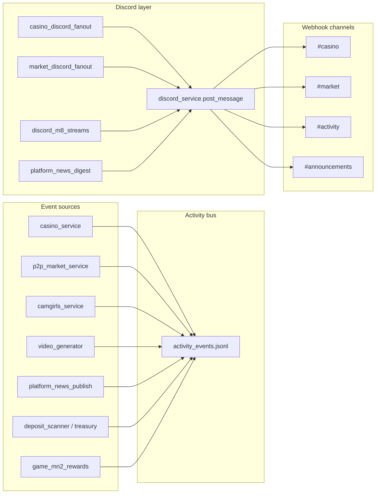

# Discord cross-roads — integration map

**Last updated:** 2026-06-17

How Discord connects to the rest of the platform, what's live, and where to extend next.

**Related:** [PLAN.md](PLAN.md) (M8) · [MN2_OPS.md](MN2_OPS.md) §10 · [MN2_TRADER_MARKET.md](MN2_TRADER_MARKET.md) · [CAMGIRLS_PHASE1C.md](CAMGIRLS_PHASE1C.md) · [RULEBOOK_READERS.md](RULEBOOK_READERS.md) · [MN2_TODO.md](MN2_TODO.md)

**Core:** `backend/services/discord_service.py` · `discord_m8_streams.py` · `logs/discord_outbox.jsonl` · `logs/activity_events.jsonl`

---

## Platform cross-road matrix

| Platform area | Site path | Activity channel | Discord destination | Status |
|---------------|-----------|------------------|---------------------|--------|
| Trader market | `/explorer?tab=market` | `market` | `#market` via fan-out | Code ready |
| Casino | `/casino/` | `casino` | `#casino` via fan-out | Live |
| Camgirls | `/camgirls/` | `camgirls` | `#activity` via alert funnel | Live |
| Generator | `/generator/` | `generator` | `#generator` + news | Live |
| Compendium | `/compendium/?calm=1` | — | Affiliate rotator only | Partial |
| Game Hub | `/game/` | `game` | `#game` via fan-out | **Live** (code) |
| Quests | `/quests/` | — | `#quests` quest bot | Live |
| Staking | `/profile/` | `ops` | Alert funnel (stall/stop) | Live |
| Shop | `/shop/` | — | Affiliate rotator | Partial |
| News | `/news/` | any | Digest + optional publish flag | Live |

---

## Key files

| File | Role |
|------|------|
| `backend/services/discord_service.py` | Webhook POST, outbox, click tracking |
| `backend/services/discord_m8_streams.py` | M8 #53–60 (alert funnel, rotator, FAQ, showcase) |
| `backend/services/market_discord_fanout.py` | Market channel → `#market` |
| `backend/services/game_discord_fanout.py` | Game/battle channel → `#game` |
| `backend/services/discord_link_service.py` | Profile Discord link status (M8 #51) |
| `backend/services/shop_discord_promo_service.py` | Shop-wide promo codes (M8 #52) |
| `backend/services/platform_news_digest.py` | Daily news digest |
| `backend/services/platform_news_publish.py` | News + optional `platform_news` emit |
| `backend/routes/discord_routes.py` | All `/api/discord/*` endpoints |
| `backend/services/activity_events_service.py` | Shared activity bus |
| `cron/discord_*.sh` | Server cron wrappers |
| `static/js/mn2-staking-monitor.js` | Health Ops Hub — discord outbox tile |

## Architecture (today)



**Gate S rule:** Discord never moves funds. Link account → redeem promos → claim rewards **on-site only**.

---

## M8 streams 51–60 (status)

| # | Stream | Status | Cross-road with |
|---|--------|--------|-----------------|
| 51 | Role gating | Partial | `casino_social_service.check_vip_discord_eligibility`, `/api/discord/link` — no Profile UI yet |
| 52 | Promo codes | Casino only | `casino_discord_promos.json` — shop-wide `discord_promo_codes.json` not built |
| 53 | Alert funnel | Live | `activity_events` → `#activity` (cron: `discord_activity_funnel.sh`) |
| 54 | Partner spotlight | Live | `platform_news` channel=market + Discord `#market` |
| 55 | Daily digest | Live | `platform_news.json` → `#announcements` (cron: `discord_digest.sh`) |
| 56 | Quest bot | Live | `user_engagement` daily quests → `#quests` |
| 57 | Affiliate rotator | Live | Daily link rotation → `#announcements` |
| 58 | Casino highlights | Live | `casino_discord_fanout` → `#casino` (cron: `discord_casino_fanout.sh`) |
| 59 | Generator showcase | Live | `video_generator_service` → news + `#generator` |
| 60 | Support FAQ | Live | `GET /api/discord/support/faq?q=` |

---

## Activity events → Discord (by channel)

| Channel | Event types emitted | Discord fan-out |
|---------|---------------------|-----------------|
| **market** | `p2p_market_order`, `p2p_market_fill`, `p2p_market_cancel`, `trader_market_tick` | `market_discord_fanout` → `#market` |
| **casino** | `casino_jackpot_win`, `casino_big_win`, `casino_tournament_*`, `casino_mn2_promo`, agent play | `casino_discord_fanout` → `#casino` |
| **camgirls** | `camgirl_unlock`, `camgirl_tip`, `camgirl_chat` | M8 alert funnel → `#activity` |
| **generator** | `generator_complete`, `generator_mn2_*` | M8 #59 + alert funnel |
| **agents** | `agent_funded`, `agent_treasury_*` | M8 alert funnel |
| **game** | `game_mn2_reward` | Alert funnel |
| **ops** | `staking_stopped`, `height_stall`, `security_cron_sweep`, `discord_post_failed` | Alert funnel |
| **any** | `platform_news` | Digest + optional `discord:true` on publish |

### Alert funnel types (M8 #53)

Included in `discord_m8_streams._ALERT_TYPES`:

`platform_news` · `generator_complete` · `casino_jackpot_win` · `casino_big_win` · `casino_tournament_end` · `casino_tournament_prize` · `casino_mn2_promo` · `casino_discord_promo_created` · `p2p_market_fill` · `p2p_market_order` · `trader_market_tick` · `camgirl_unlock` · `camgirl_tip` · `agent_funded` · `agent_treasury_deposit` · `game_mn2_reward` · `staking_stopped` · `height_stall` · `discord_post_failed`

### Affiliate rotator destinations (M8 #57)

Daily UTC rotation among: Casino · Market · Shop · Generator · Staking · Camgirls · Compendium · Explorer · Quests.

---

## Cross-road opportunities (prioritized)

### Quick wins (implemented 2026-06-17)

1. **Market fan-out** — `market_discord_fanout.py` + cron (fills + trader tick summaries → `#market`)
2. **Alert funnel types** — market, camgirls, agent treasury events in M8 #53 filter
3. **Affiliate rotator** — added Market, Camgirls, Compendium, Explorer to daily rotation
4. **Support FAQ** — market + camgirls answers for Discord bot / web widget
5. **Trader tick emit** — `run_all_traders()` logs `trader_market_tick` to activity bus

### Next (recommended)

| Idea | Cross-road | Effort |
|------|------------|--------|
| Profile Discord link UI | #51 role gating ↔ casino VIP, shop promos | Medium |
| Shop promo codes (M8 #52) | `data/discord_promo_codes.json` + shop redeem | Medium |
| Progress reader webhooks | Aggregator level-up → Discord (idea #14) | Small |
| Auto-discord on `publish()` featured | News ↔ Discord without ops flag | Small |
| Game Hub quest claim toast | Quest complete → activity → alert funnel | Small |
| Compendium milestone | 25/25 pages read → news + Discord `#game` | Small |
| Camgirls performer live | New performer → partner spotlight API | Small |
| Inbound slash commands | `/mn2price`, `/market`, `/faq` via bot token | Large |
| SSE → Discord bridge | High-signal only, rate-limited | Medium |

### Not recommended on Discord

- Withdrawals, staking moves, market fills that auto-credit users
- Camgirls unlock/tip without site auth
- Raw wallet balances or PII

---

## Ops commands

```bash
# Status
curl -s http://127.0.0.1:5000/api/discord/status | jq

# M8 streams (X-Ops-Secret: DISCORD_OPS_SECRET)
curl -s -X POST -H "X-Ops-Secret: $SECRET" http://127.0.0.1:5000/api/discord/m8/alert-funnel | jq
curl -s -X POST -H "X-Ops-Secret: $SECRET" http://127.0.0.1:5000/api/discord/m8/affiliate-rotator | jq
curl -s -X POST -H "X-Ops-Secret: $SECRET" http://127.0.0.1:5000/api/discord/m8/quest-bot | jq

# Fan-outs
curl -s -X POST -H "X-Ops-Secret: $SECRET" http://127.0.0.1:5000/api/discord/casino/fanout | jq
curl -s -X POST -H "X-Ops-Secret: $SECRET" http://127.0.0.1:5000/api/discord/market/fanout | jq

# Publish news + Discord
curl -s -X POST -H "X-Ops-Secret: $SECRET" -H "Content-Type: application/json" \
  -d '{"title":"…","summary":"…","channel":"market","discord":true}' \
  http://127.0.0.1:5000/api/news/publish | jq
```

---

## Env vars

| Variable | Purpose |
|----------|---------|
| `DISCORD_WEBHOOK_URL` | Default webhook (all channels if no per-channel URL) |
| `DISCORD_CHANNEL_ID_MARKET` | Optional per-channel webhook for `#market` |
| `DISCORD_CHANNEL_ID_CASINO` | … |
| `DISCORD_OPS_SECRET` | Cron + ops POST auth |
| `BASE_URL` | Links in embeds (default `https://masternoder.dk`) |
| `MARKET_DISCORD_MIN_MN2` | Min fill size to post to Discord (default 5) |

---

## Crons (server)

| Script | Schedule | Endpoint |
|--------|----------|----------|
| `cron/discord_digest.sh` | Daily | `/api/discord/digest/run` |
| `cron/discord_activity_funnel.sh` | Periodic | `/api/discord/m8/alert-funnel` |
| `cron/discord_casino_fanout.sh` | Periodic | `/api/discord/casino/fanout` |
| `cron/discord_market_fanout.sh` | Periodic (recommend */15) | `/api/discord/market/fanout` |
| `cron/agents_trader.sh` | */15 min | Feeds `trader_market_tick` events |

### Install market fan-out cron

After `mn2_staking` deploy:

```bash
chmod +x /var/www/html/cron/discord_market_fanout.sh
crontab -e
# Add (reads DISCORD_OPS_SECRET from env if exported, or edit script):
*/15 * * * * /var/www/html/cron/discord_market_fanout.sh >> /var/log/mn2-discord-market.log 2>&1
```

Verify:

```bash
/var/www/html/cron/discord_market_fanout.sh
tail -5 /var/www/html/logs/discord_outbox.jsonl
```

---

## Health monitoring

- `GET /api/mn2/health` → `components.discord_outbox` (success rate, last post)
- Staking monitor Health Ops Hub shows Discord outbox tile via `mn2-staking-monitor.js`

---

## Deploy

Included in `mn2_staking` manifest: discord services, routes, crons, `market_discord_fanout.py`.

```powershell
python scripts/deploy.py mn2_staking --ask-pass
```
