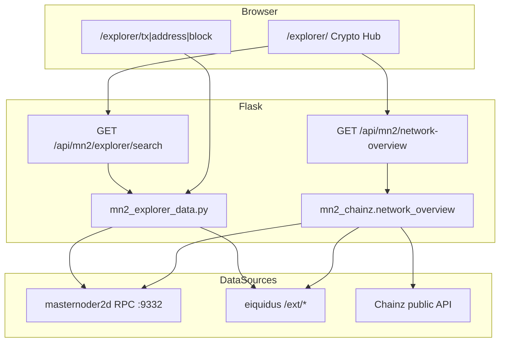
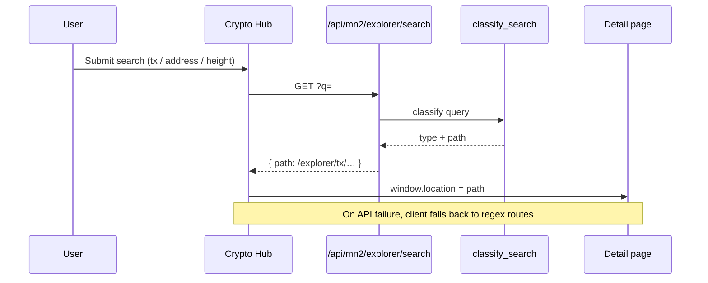

# MN2 Explorer — Architecture

How the Crypto Hub (`/explorer/`), Flask APIs, eiquidus, and the MN2 daemon fit together.

## System diagram (P6 #215)

**Priority chain for tiles:** local eiquidus (when `explorer_use_local_stats`) → daemon RPC → Chainz fallback. Each field records its origin in `source`.

**URL shapes:** in-page hub routes (`/explorer/address/…`) vs full block explorer (`explorer_base_url` from config).

---

## Search sequence (P6 #216)

Classifier rules (`mn2_explorer_data.classify_search`):

| Input | Type | Route |
|-------|------|-------|
| 64-char hex | tx | `/explorer/tx/<txid>` |
| MN/J address | address | `/explorer/address/<addr>` |
| Integer | block height | `/explorer/block/<height>` |
| 64-char hex (block hash) | block | `/explorer/block/<hash>` |

Deep links from profile/shop: `/explorer/?tab=explorer&q=<address>` prefills search.

---

## Related docs

- [MN2_EXPLORER_PLAN.md](MN2_EXPLORER_PLAN.md) — phase plan
- [EXPLORER_OPS_P4.md](EXPLORER_OPS_P4.md) — deploy & ops
- [EXPLORER_RUNBOOKS.md](EXPLORER_RUNBOOKS.md) — incident runbooks
- [EXPLORER_FAQ.md](EXPLORER_FAQ.md) — user-facing FAQ
- [EXPLORER_CONTRIBUTING.md](EXPLORER_CONTRIBUTING.md) — adding tiles
