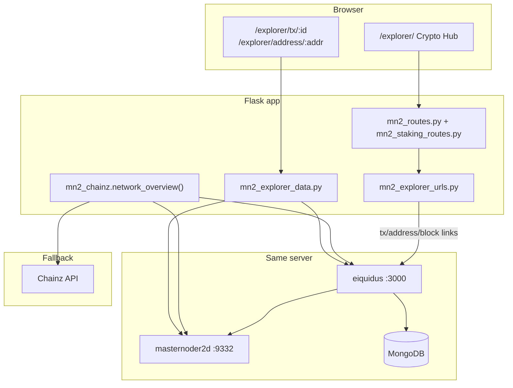

## Goal Capsule

Ship the MN2 explorer as a **fully operational, self-hosted system**: finish the eiquidus cutover (E2), enable local-first stats (E3), and expand the on-site Crypto Hub with in-page tx/address views and rich-list APIs — so users, operators, and agents get a fast, reliable explorer without depending on Chainz.

---

## Summary

The MN2 explorer is already **two layers**: (1) the on-site **Crypto Hub** at `/explorer/` (tiles, charts, blocks, masternodes, staking, market) and (2) the **self-hosted eiquidus block explorer** at `the configured explorer host (see MN2_EXPLORER_PLAN §E1)`. E1 (server explorer) and E4/E5 (hardening + RPC-backed tables) are largely done. The critical gap is **Phase E2**: wallet/shop routes and `network-overview` still use legacy Chainz URL builders in `mn2_routes.py`, while `mn2_explorer_urls.py` already supports iquidus/eiquidus shapes and env overrides.

This plan sequences: verify eiquidus sync → centralize all explorer URLs → flip live config → enable local-first stats → add on-site tx/address detail and rich list → ops hardening and docs.

---

## Problem Frame

Users and agents see a polished `/explorer/` hub, but deep links still point at Chainz, stats still prefer RPC/Chainz over the local eiquidus API, and there is no in-page tx/address experience. That undermines the hybrid architecture locked in `docs/MN2_EXPLORER_PLAN.md` and blocks ecosystem Phase 5 explorer goals in `docs/plans/masternoder_mn2_ecosystem.plan.md`.

**Success looks like:**
- All on-site explorer links use the self-hosted eiquidus URL shape
- `network-overview` prefers local eiquidus for height/supply/difficulty when available
- `/explorer/` search and tables deep-link to self-hosted explorer (or in-page detail where built)
- Operators can verify eiquidus health from `/api/mn2/services`
- Unit tests cover cutover and new data routes

**Non-goals (this plan):**
- Discord integration and multi-channel news (ecosystem Phase 5 sibling work)
- Replacing eiquidus with another explorer engine
- Multi-server / dedicated explorer host
- Multi-source price median (#6 in MN2_EXPLORER_PLAN §8 — deferred)

---

## Requirements

| ID | Requirement |
|----|-------------|
| R1 | Verify eiquidus index is complete: `/ext/getmoneysupply`, sample `/tx/<txid>`, `/address/<addr>`, rich list |
| R2 | Single source of truth for explorer URLs via `backend/services/mn2_explorer_urls.py` across all Flask routes |
| R3 | Live config/env points primary explorer at self-hosted eiquidus; Chainz remains fallback |
| R4 | `network-overview` uses local eiquidus stats tier when `explorer_use_local_stats: true` |
| R5 | `/explorer/` UI copy and "Open full explorer" link reflect self-hosted primary |
| R6 | In-page tx and address detail routes on the main Flask site (read-only, display-only) |
| R7 | Rich list and supply stats exposed via JSON API for hub and agents |
| R8 | eiquidus health probe in services hub; ops runbook updated |
| R9 | Tests for URL cutover, local-stats gating, and new explorer data endpoints |

---

## Key Technical Decisions

| # | Decision | Rationale |
|---|----------|-----------|
| KTD1 | Keep eiquidus at `the configured explorer host (see MN2_EXPLORER_PLAN §E1)`; add optional `a dedicated explorer subdomain` nginx alias later | E1 already live; renaming is ops-only and can follow cutover |
| KTD2 | Delete duplicate `_explorer_*` helpers in `mn2_routes.py`; import from `mn2_explorer_urls` | Fixes base-url vs kind desync in `network-overview` |
| KTD3 | Config cutover via `.env` on the deployed server first; then update `data/mn2_config.json` defaults | Env overrides already implemented; avoids breaking dev without eiquidus |
| KTD4 | In-page tx/address: Flask proxies eiquidus `/ext` + RPC; no crediting logic | Preserves display-only constraint from MN2_EXPLORER_PLAN §0 |
| KTD5 | Rich list from eiquidus `/ext/getrichlist` (or equivalent); cache 60–120s | Avoid hammering Mongo during sync; display-only |
| KTD6 | Hold subdomain rename until after E2 verified | Reduces simultaneous moving parts |

---

## High-Level Technical Design



**Stats priority (unchanged from MN2_EXPLORER_PLAN):** eiquidus (local) → RPC → Chainz.

---

## Scope Boundaries

### In scope
- E2 Flask cutover (URLs + config)
- E3 local-first stats enablement
- On-site tx/address detail (ecosystem Phase 5 items 1–2, 3 partial)
- Rich list + supply API (items 4–5)
- Health probe + deploy/docs

### Deferred for later
- Masternode detail pages per-MN (ecosystem item 6)
- Mempool/pending view (item 7)
- Tx-volume charts beyond existing network-history (item 8)
- Multi-source price median (MN2_EXPLORER_PLAN #6)

### Deferred to Follow-Up Work
- `a dedicated explorer subdomain` subdomain alias (after stable cutover)
- Discord + multi-channel news auto-publish from explorer events
- B2B market data API packaging

### Outside this product's identity
- Using explorer for balance crediting or withdrawal confirmation

---

## Assumptions

- local eiquidus is reachable from the app host at `127.0.0.1:3000`
- Deployed `.env` can be updated and uwsgi restarted via existing `scripts/deploy.py mn2_staking`
- Initial eiquidus index may already be complete; U1 verifies before flip

---

## Implementation Units

### U1. Verify eiquidus live readiness

**Goal:** Confirm the self-hosted block explorer is fully synced and serving tx/address/rich-list pages before any cutover.

**Requirements:** R1

**Dependencies:** None

**Files:**
- `docs/EXPLORER_REINSTALL_CHECKLIST.md` (verification section only, if gaps found)
- `docs/MN2_EXPLORER_PLAN.md` (mark E1 verification complete)

**Approach:**
- On the live server: `curl` `/ext/getmoneysupply`, `/api/getblockcount`, rich-list endpoint
- Hit sample `/tx/<known_txid>` and `/address/<known_addr>` from recent chain activity
- Confirm PM2 eiquidus process healthy, cron `/etc/cron.d/eiquidus` present, Mongo `explorerdb` growing
- If index incomplete: resume `node scripts/sync.js index update`; do not proceed to U3 config flip

**Execution note:** Smoke-first verification on the live server before any Flask changes ship.

**Test scenarios:**
- Covers R1. `/ext/getmoneysupply` returns numeric supply
- Covers R1. Sample `/tx/<txid>` returns 200 with tx body (not empty shell)
- Covers R1. Sample `/address/<addr>` returns balance/history after index complete
- Covers R1. Rich list endpoint returns ranked addresses

**Verification:** Checklist in `docs/MN2_EXPLORER_PLAN.md` E1 items marked done; blocker documented if sync still running.

---

### U2. Centralize explorer URL builders (Phase E2)

**Goal:** Remove duplicate Chainz-hardcoded URL logic from `mn2_routes.py` and wire all call sites through `mn2_explorer_urls.py`.

**Requirements:** R2, R3

**Dependencies:** U1 (recommended; can merge in parallel if cutover flag stays off)

**Files:**
- `backend/routes/mn2_routes.py`
- `backend/routes/mn2_staking_routes.py`
- `tests/unit/test_mn2_explorer_urls.py`
- `tests/unit/test_mn2_routes_explorer_links.py` (new)

**Approach:**
- Delete `_explorer_base_url`, `_explorer_tx_url` from `mn2_routes.py`
- Import `explorer_base_url`, `explorer_tx_url`, `explorer_address_url`, `explorer_block_url` from `mn2_explorer_urls`
- Replace all `f"{base}/address.dws?addr=..."` patterns with `explorer_address_url(addr)`
- In `mn2_staking_routes.py` `network_overview` handler: use `explorer_base_url()` from `mn2_explorer_urls` (not `mn2_routes._explorer_base_url`)
- Add tests asserting wallet/shop/ledger responses emit iquidus-shaped URLs when config kind is `iquidus`

**Patterns to follow:** `backend/services/mn2_explorer_urls.py`, existing tests in `tests/unit/test_mn2_explorer_urls.py`

**Test scenarios:**
- Covers R2. `network-overview` returns matching `explorer_base_url` and `explorer_kind` when env sets iquidus
- Covers R2. Wallet withdraw response `explorer_tx_url` uses `/tx/<id>` shape for iquidus config
- Covers R2. Shop revenue `explorer_address_url` uses `/address/<addr>` for iquidus config
- Covers R2. Chainz config still produces `.dws` URLs (regression)

**Verification:** `pytest tests/unit/test_mn2_explorer_urls.py tests/unit/test_mn2_routes_explorer_links.py -v` passes; no remaining `_explorer_` helpers in `mn2_routes.py`.

---

### U3. Live config cutover and local-first stats (Phase E2 + E3)

**Goal:** Point the live deployment at self-hosted eiquidus and enable the local stats tier in `network_overview()`.

**Requirements:** R3, R4

**Dependencies:** U1, U2

**Files:**
- `data/mn2_config.json`
- `.env.example`
- `backend/services/mn2_chainz.py`
- `docs/MN2_OPS.md`

**Approach:**
- Add to `mn2_config.json`:
  ```json
  "explorer_kind": "iquidus",
  "explorer_local_api_url": "http://127.0.0.1:3000",
  "explorer_fallback_base_url": "https://chainz.cryptoid.info/mn2/",
  "explorer_use_local_stats": true
  ```
- Flip `explorer_base_url` to the self-hosted eiquidus URL (after U1 passes)
- Document deployed `.env` mirror: `MN2_EXPLORER_*` vars per `docs/MN2_EXPLORER_PLAN.md` E2 config table
- Confirm `mn2_chainz.network_overview()` sets `source.block_height`, `source.circulating_supply`, `source.difficulty` to `iquidus` when local API responds
- Deploy via `python scripts/deploy.py mn2_staking mn2_env --ask-pass`; restart uwsgi

**Test scenarios:**
- Covers R4. With mocked local eiquidus responses and `explorer_use_local_stats: true`, overview prefers iquidus for height/supply/difficulty
- Covers R4. When local API down, overview falls back to RPC then Chainz without 500
- Covers R3. `load_explorer_config()` env overlay overrides json base URL

**Verification:** Live `GET /api/mn2/network-overview` shows `explorer_kind: iquidus`, self-hosted `explorer_base_url`, and `source` map includes `iquidus` fields.

---

### U4. Crypto Hub frontend cutover

**Goal:** Update `/explorer/` copy, default links, and dynamic "Open full explorer" behavior for self-hosted primary.

**Requirements:** R5

**Dependencies:** U3

**Files:**
- `explorer/index.html`
- `static/js/mn2-explorer-overview.js`

**Approach:**
- Remove hardcoded Chainz links in `explorer/index.html`; use `explorer_base_url` from `network-overview` response for `#ex-open` and `.ex-open` anchors
- Update hero copy: "On-site links use our block explorer; stats: local eiquidus → daemon RPC → Chainz fallback"
- Ensure search box in `mn2-explorer-overview.js` builds URLs from API `explorer_kind` + `explorer_base_url` (verify existing E4 #5 behavior post-cutover)
- Bump cache-bust query params on JS/CSS

**Test expectation:** none — UI wiring; verify via browser smoke on `/explorer/`

**Verification:** Search for a known txid opens `the configured explorer host (see MN2_EXPLORER_PLAN §E1)/tx/...`; tile links consistent.

---

### U5. In-page tx and address detail routes

**Goal:** Add read-only on-site pages for tx and address lookup without leaving the main site.

**Requirements:** R6

**Dependencies:** U2, U3

**Files:**
- `backend/services/mn2_explorer_data.py`
- `backend/routes/mn2_staking_routes.py`
- `backend/routes/all_page_routes.py`
- `explorer/tx.html`, `explorer/address.html` (new)
- `static/js/mn2-explorer-detail.js` (new)
- `tests/unit/test_mn2_explorer_data.py`

**Approach:**
- Add `tx_detail(txid)` and `address_detail(address)` in `mn2_explorer_data.py`:
  - Primary: fetch from eiquidus `/ext/gettransaction` / address endpoints (or HTML scrape fallback — prefer JSON ext API)
  - Fallback: RPC `getrawtransaction` + `gettxout` for tx; limited address view if eiquidus down
- New API routes: `GET /api/mn2/explorer/tx/<txid>`, `GET /api/mn2/explorer/address/<address>`
- New page routes: `/explorer/tx/<txid>`, `/explorer/address/<address>` serving lightweight templates
- JS renders summary (confirmations, inputs/outputs, balance, recent txs for address)
- Link "View on full explorer" to self-hosted external page
- Update hub search: if user submits on-site, route to `/explorer/tx/...` or `/explorer/address/...` when input validates as txid vs address; else external

**Patterns to follow:** `mn2_explorer_data.recent_blocks()`, `mn2_explorer_urls` validators

**Test scenarios:**
- Covers R6. Valid txid returns structured JSON with txid, confirmations, vout count
- Covers R6. Valid address returns balance and tx count (or empty history)
- Covers R6. Invalid txid/address returns 404 JSON
- Covers R6. eiquidus timeout falls back to RPC-only partial tx view without raising

**Verification:** Manual browse `/explorer/tx/<known>` and `/explorer/address/<known>`; APIs documented in `docs/AGENTS_MN2.md`.

---

### U6. Rich list and supply JSON API

**Goal:** Expose rich list and emission/supply stats for hub tiles and agents.

**Requirements:** R7

**Dependencies:** U1, U3

**Files:**
- `backend/services/mn2_explorer_data.py`
- `backend/routes/mn2_staking_routes.py`
- `static/js/mn2-explorer-overview.js`
- `explorer/index.html`
- `tests/unit/test_mn2_explorer_data.py`

**Approach:**
- Add `rich_list(limit)` calling eiquidus rich-list ext endpoint; cache ~90s
- Add `GET /api/mn2/rich-list?limit=100`
- Extend `network-overview` or add `GET /api/mn2/supply-stats` for max supply, emitted, % staked (from eiquidus + pool metrics)
- Optional hub section: top 10 addresses table with link to `/explorer/address/<addr>`
- Compute **true pool % of rich-list stake** when pool staking address balance available (MN2_EXPLORER_PLAN #8)

**Test scenarios:**
- Covers R7. Rich list returns list of `{rank, address, balance}` with correct limit
- Covers R7. Empty/unavailable eiquidus returns graceful empty list, not 500
- Covers R7. Supply stats include circulating and max when eiquidus provides them

**Verification:** Hub shows rich list section; agent can `GET /api/mn2/rich-list`.

---

### U7. Ops hardening, health probe, and documentation

**Goal:** Make explorer operable long-term: health checks, deploy manifest, runbook, agent docs.

**Requirements:** R8

**Dependencies:** U3

**Files:**
- `backend/services/mn2_services_hub.py`
- `scripts/fix_explorer_subdomains_remote.py`
- `docs/MN2_OPS.md`
- `docs/AGENTS_MN2.md`
- `docs/MN2_EXPLORER_PLAN.md`
- `README.md` or `docs/MN2_QUICKSTART.md` (new, minimal)

**Approach:**
- Extend `_probe_explorer()` to HTTP GET local eiquidus `/ext/getmoneysupply` or `/api/getblockcount`; surface latency and ok/degraded
- Document post-upgrade nginx fix: `python scripts/fix_explorer_subdomains_remote.py --ask-pass`
- Update `AGENTS_MN2.md` §12: iquidus URL examples, new `/api/mn2/explorer/*` endpoints
- Mark E2/E3 complete in `MN2_EXPLORER_PLAN.md`
- Add MN2 explorer quickstart: local `python run.py`, required `MN2_RPC_*`, optional eiquidus env

**Test scenarios:**
- Covers R8. Services hub explorer probe returns `ok` when mocked eiquidus 200
- Covers R8. Probe returns `degraded` when eiquidus unreachable

**Verification:** `GET /api/mn2/services` shows explorer service healthy on the live server.

---

### U8. CI test coverage gate

**Goal:** Prevent regressions on explorer URL shapes and data layer.

**Requirements:** R9

**Dependencies:** U2, U5, U6

**Files:**
- `tests/unit/test_mn2_explorer_data.py`
- `tests/unit/test_mn2_routes_explorer_links.py`
- `.github/workflows/*` (if CI exists; else document pytest command in plan)

**Approach:**
- Ensure all explorer unit tests run in CI or documented pre-deploy check
- Add integration-style tests with `responses`/`unittest.mock` for eiquidus HTTP

**Test scenarios:**
- Full explorer test module passes in under 5s
- New route tests cover iquidus and chainz config branches

**Verification:** `pytest tests/unit/test_mn2_explorer*.py tests/unit/test_mn2_routes_explorer_links.py -v` green.

---

## Verification Contract

| Gate | Check |
|------|-------|
| G1 | eiquidus sample tx/address pages return 200 on the live server |
| G2 | `pytest` explorer unit tests pass |
| G3 | `/api/mn2/network-overview` reports `explorer_kind: iquidus` and self-hosted base URL |
| G4 | Wallet withdraw / shop responses use `/tx/` and `/address/` links |
| G5 | `/explorer/` search and tables link to self-hosted explorer |
| G6 | `/api/mn2/explorer/tx/<id>` and `/address/<addr>` return JSON |
| G7 | `/api/mn2/services` explorer probe healthy |

---

## Definition of Done

- [ ] E2 and E3 marked complete in `docs/MN2_EXPLORER_PLAN.md`
- [ ] No duplicate explorer URL helpers in `mn2_routes.py`
- [ ] Live config points at self-hosted eiquidus with Chainz fallback
- [ ] Local-first stats active when eiquidus healthy
- [ ] In-page tx/address routes live
- [ ] Rich list API live
- [ ] Ops docs and agent docs updated
- [ ] All verification gates G1–G7 pass

---

## Risks and Dependencies

| Risk | Mitigation |
|------|------------|
| eiquidus index not complete | U1 gate; keep Chainz fallback URLs until verified |
| 1.9 GB RAM host under load during sync | Monitor swap; single PM2 worker; schedule heavy work off-peak |
| `explorer` host naming confuses studio product | Document clearly; optional `explorer.` alias in follow-up |
| Local API downtime | Silent fallback to RPC/Chainz in `network_overview()` and detail routes |
| Display-only constraint violated | Code review: no ledger/credit paths in new explorer routes |

---

## Open Questions

| # | Question | Default if unresolved |
|---|----------|----------------------|
| Q1 | Add `a dedicated explorer subdomain` alias now or after cutover stabilizes? | After cutover (follow-up) |
| Q2 | Hub search default: in-page detail vs external eiquidus tab? | In-page for tx/address; external link prominent |
| Q3 | Include rich list table on hub in v1 or API-only first? | Hub table + API |

---

## Sources and Research

- `docs/MN2_EXPLORER_PLAN.md` — hybrid architecture, phases E1–E5, locked decisions
- `docs/EXPLORER_REINSTALL_CHECKLIST.md` — server install/runbook
- `docs/plans/masternoder_mn2_ecosystem.plan.md` — Phase 5 explorer top 10 scope
- `backend/services/mn2_explorer_urls.py` — centralized URL builders (already built)
- `backend/services/mn2_chainz.py` — local stats tier (built, gated off)
- `explorer/index.html`, `static/js/mn2-explorer-overview.js` — hub UI (built)
- Live eiquidus: `the configured explorer host (see MN2_EXPLORER_PLAN §E1)` (E1, 2026-06-04)
