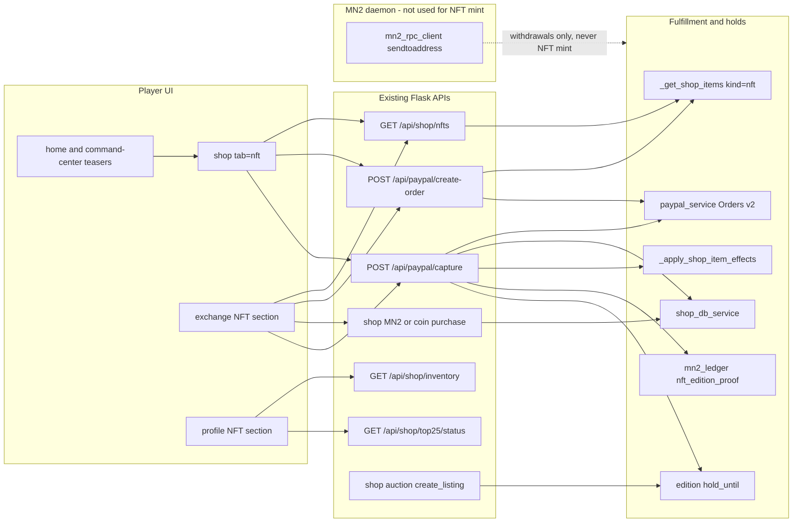
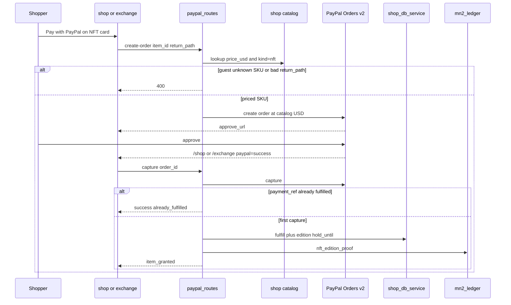
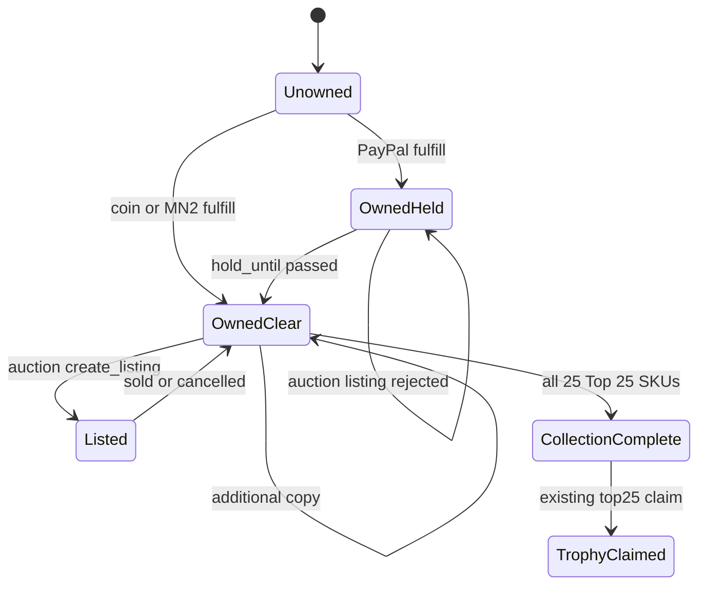
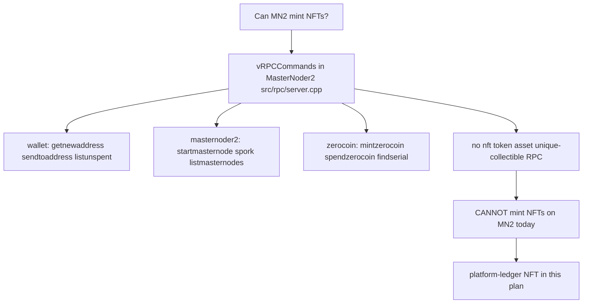
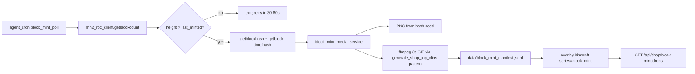

# PayPal NFT Shop and Exchange - Plan

Product Contract created in this run (`ce-plan-bootstrap`).
No upstream brainstorm existed.
This file was first written for shop PayPal NFT sections, then enriched in place for the follow-ups: add NFTs to the exchange, check whether MasterNoder2 can mint NFTs, and whether **one platform NFT per new MN2 block** (static image or 3s encoder GIF) can ship as a new shop area.

Product Contract preservation: R1–R12 and KD1–KD5 meaning unchanged.
Added R13–R18, KD6–KD7, KTD9–KTD12, U5–U7 for chain capability, exchange, and PayPal chargeback hold.

---

## Goal Capsule

**MN2 cannot mint or issue NFTs today.**
MasterNoder2 is a PIVX-style UTXO coin with masternode, staking, InstantSend, and zerocoin RPCs.
It has no NFT standard, no unique-asset opcode, and no mint/transfer RPC for non-fungible tokens.
`mintzerocoin` mints fungible zMN2 privacy coins, not collectibles.

Ship platform-ledger NFTs: serialized unique collectibles in shop inventory, sold with PayPal and MN2 on both Shop and Exchange, with honest copy that they are not on-chain tokens.
Reuse PayPal Orders v2 create-approve-capture.
Do not send irreversible on-chain MN2 or a unique chain object as PayPal fulfillment.

Authority order: Product Contract R-IDs, then Key Technical Decisions, then unit approach.
Fulfillment stays on `fulfill_shop_purchase` plus `_apply_shop_item_effects`.
Checkout stays on `POST /api/paypal/create-order` and `POST /api/paypal/capture` (shop and exchange return URLs from a server allowlist).

Stop if the work expands to daemon NFT opcodes, an EVM wrap/bridge, a new PSP, casino real-money NFT betting, or a standalone `/nft` app.

Execution profile: characterize shop listing and PayPal capture first, then catalog kind + server-priced checkout + shop/exchange/profile sections + PayPal hold.
Tail ownership: implement `U1` through `U7` in dependency order.

---

## Product Contract

### Summary

Users browse dedicated NFT sections on Shop and Exchange, pay with PayPal or in-app MN2/coins, and see owned collectibles in Profile.
The first series is Top 25 Legends (`top25-01`…`top25-25` plus the three Top 25 bundles).
These are licensed off-chain digital collectibles branded as NFTs in the UI.
The MN2 chain does not mint them.

### Problem Frame

Users asked for PayPal NFT purchase, NFT sections, NFTs in shop and exchange, and whether “our blockchain” can mint NFTs.
This repo has no NFT module and no chain NFT primitive.
Shop already sells numbered Top 25 collectibles and already derives `price_usd` so catalog cards can show PayPal.
Those items are buried in Catalog / Deals, have no NFT branding, and PayPal create-order trusts the client `amount`.
Inventory stacks quantity and does not record edition or `payment_ref`, so a refreshed capture can double-grant.
Exchange shop sells MN2 boosts and rentals only (`data/exchange_shop_catalog.json`); its renderer has no NFT category and no PayPal CTA on those cards.
A PayPal chargeback can reverse fiat after the buyer has already listed the collectible or withdrawn MN2.
The product that fits the chain is a platform ledger collectible, not an MN2 token.

### Requirements

**Issuance and honesty**

- R12. UI must not claim on-chain uniqueness, wallet minting, or resale investment value.
- R16. Shop, Exchange, and Profile NFT copy must state that MN2 cannot mint these items on-chain today.
- R18. Each granted NFT edition records a platform-ledger proof hash (not a chain mint).

**PayPal checkout**

- R1. Logged-in users can buy flagged NFT SKUs with PayPal and receive them in shop inventory.
- R2. Guests (`default_user`) cannot start PayPal NFT checkout.
- R3. PayPal order amount is the server catalog `price_usd`, not the client-supplied amount.
- R4. A successful capture is idempotent for the same PayPal `order_id` / `capture_id`.
- R5. PayPal purchase-unit copy describes a licensed digital collectible, not an investment or on-chain token.
- R17. A PayPal-acquired NFT edition cannot be listed on Auction House or turned into withdrawable MN2 until the hold window ends.

**Surfaces**

- R6. Shop exposes a first-class NFT tab at `/shop?tab=nft` with PayPal-first CTAs.
- R7. Profile shows an NFT collection section fed by `/api/shop/inventory`.
- R8. Home and Command Center show a short NFT teaser that deep-links to `/shop?tab=nft`.
- R9. NFT listing APIs return only items with `kind=nft` (or equivalent tag) plus series progress for Top 25.
- R10. Coin and MN2 rails remain available on the same SKUs.
- R11. Casino and mobile TWA do not add PayPal NFT checkout.
- R13. Exchange exposes a first-class NFT section that lists the same `kind=nft` SKUs.
- R14. Logged-in users can start PayPal NFT checkout from Exchange and return to `/exchange`.
- R15. MN2 or coin purchase of an NFT SKU from Exchange writes the same shop inventory as Shop checkout.

### Actors

- A1. Logged-in shopper with a Profile account.
- A2. Guest (`default_user`).
- A3. Returning PayPal payer hitting `/shop?paypal=success` or `/exchange?paypal=success`.
- A4. Exchange trader buying from `#cex-exchange-shop` / the NFT section.

### Key Flows

- F1. Browse Shop NFT tab → choose SKU → PayPal → return → capture → inventory + collection card updates.
- F2. Guest taps PayPal on an NFT → blocked with Profile account prompt.
- F3. Buyer already owns copies → quantity increments, new edition metadata is recorded, collection still shows the SKU as owned.
- F4. Duplicate capture (refresh) → payment already captured, no second inventory grant.
- F5. Browse Exchange NFT section → PayPal or MN2 → same inventory row as Shop.
- F6. PayPal-acquired edition inside hold → Auction House listing rejected; MN2 withdrawal of sale proceeds blocked.

### Acceptance Examples

- AE1. Covers R1 / F1. A logged-in user completes PayPal for `top25-01` and `/api/shop/inventory` contains that item with `price_type=paypal`.
- AE2. Covers R2 / F2. `default_user` posting to `/api/paypal/create-order` for an NFT SKU receives `ACCOUNT_REQUIRED`.
- AE3. Covers R3. Create-order for `top25-01` with client `amount=0.01` still creates a PayPal order at catalog `price_usd`.
- AE4. Covers R4 / F4. Two captures of the same `order_id` grant inventory once.
- AE5. Covers R6. `/shop?tab=nft` shows Top 25 cards with a visible PayPal button and an on-chain-mint disclaimer.
- AE6. Covers R7. Profile NFT section lists owned Top 25 items and empty-state CTA to the NFT tab when none are owned.
- AE7. Covers R13 / R14 / F5. Exchange NFT section lists `top25-01` with PayPal and MN2 actions; PayPal return lands on `/exchange`.
- AE8. Covers R15. Exchange MN2 purchase of `top25-01` appears in `/api/shop/inventory` and Profile, not only exchange shop state.
- AE9. Covers R17 / F6. `create_listing` for a PayPal-held `top25-01` edition fails until `hold_until`.
- AE10. Covers R16. NFT APIs include `on_chain_mint: false` (or equivalent) so clients cannot invent a mint claim.

### Success Criteria

- A shopper can discover, buy with PayPal, and view at least one NFT from Shop or Exchange without using the generic Catalog filter.
- PayPal capture for an NFT SKU is server-priced and safe to retry.
- Copy on PayPal and in-app matches licensed digital collectible, not crypto mint.
- Implementers can cite the MN2 RPC table as the reason native mint is out of scope.
- PayPal-bought editions cannot be flipped to irreversible MN2 before the hold clears.

### Scope Boundaries

In scope:

- Off-chain NFT kind on existing collectible SKUs.
- PayPal Orders v2 hardening for those SKUs on Shop and Exchange.
- Shop NFT tab, Exchange NFT section, profile collection, home/Command Center teasers.
- Edition metadata, ledger proof hash, and PayPal hold on the existing inventory row.

Out of scope / outside this product's identity:

- On-chain ERC-721 / MN2 NFT mint, gas, or wallet-connect mint.
- Using `mintzerocoin` / zMN2 as an NFT stand-in.
- Wrapping MN2 onto an EVM chain to mint ERC-721.
- PayPal NFT marketplace, Pay with Crypto, or a new PSP.
- Casino USD / real-money NFT wagering.
- Mobile TWA or Play Store IAP for NFTs.
- Secondary-market royalties or OpenSea export.

Deferred for later:

- New NFT series beyond Top 25.
- True global 1/1 scarcity and per-copy inventory rows.
- Auction House NFT-specific fees or royalties.
- Legal ToS page rewrite beyond checkout microcopy.
- On-chain mint if a future MasterNoder2 release adds NFT opcodes or contracts.

### Key Decisions

- KD1. Treat "NFT" as a platform collectible brand, not a blockchain token. Governs R5, R12, R16.
- KD2. Launch series is Top 25 Legends plus its three bundles. Governs R6, R9, R13.
- KD3. PayPal remains Orders v2 digital-goods checkout. Governs R1, R3, R5.
- KD4. Shop NFT tab + Profile gallery + two teasers remain required surfaces. Governs R6, R7, R8.
- KD5. Casino and TWA stay out of NFT checkout. Governs R11.
- KD6. Exchange is a first-class NFT surface over the same SKUs and inventory, not a second catalog. Governs R13, R14, R15.
- KD7. MN2 cannot mint NFTs in this release; platform ledger is the issuance model. Governs R16, R18.

---

## Planning Contract

### Assumptions

- “Make NFT from our blockchain” means MasterNoder2 / MN2, not Ethereum.
- Users want visible NFT shopping and PayPal payment on Shop and Exchange, not a new chain feature.
- Top 25 is enough first inventory because it already exists, has bundles, and has a completion trophy.
- 100 coins = $1 remains the USD derivation unless a SKU already sets `price_usd`.
- PayPal NFT hold hours default to the on-ramp `hold_hours` (72) unless `nft_paypal_hold_hours` is added to config.
- Exchange MN2 debit for NFT SKUs uses unified `mn2_balance` via the shop MN2 purchase path, not only the exchange quote wallet.
- Slack tools were present but not searched; the user did not ask for Slack context.
- Headless planning recorded these bets instead of a live product interview.

### Key Technical Decisions

- KTD1. Add `kind: nft` (and keep `tags` including `collectible`) on Top 25 SKUs and Top 25 bundles. Do not create a parallel catalog. Chosen over a new `nft_items` table because shop already lists and fulfills these ids. Overlay kind/tags by `item_id` after DB load: `get_shop_items_from_db` drops tags and `price_usd`.
- KTD2. Stop overwriting an existing `price_usd` in `_get_shop_items`. Derived USD applies only when `price_usd` is missing. Chosen over always using coins/100 so bundle USD in `data/monetization_config.json` stays authoritative.
- KTD3. `POST /api/paypal/create-order` resolves amount from the catalog for NFT and other direct shop `item_id`s. Reject unknown NFT ids. Keep the guest block. Chosen over trusting the client amount because that lets a shopper underpay. Apply the lock to all direct shop items in the same function so NFT is not a special hole.
- KTD4. Persist `payment_ref` on the purchase row in both DB and file mode, then skip fulfill when that ref exists. Chosen over reading `monetization_ledger` JSONL because ledger append happens after fulfill today and is not a lock. `record_purchase` and `_record_purchase_file` do not write `payment_ref` yet even though `ShopPurchase.payment_ref` exists. Extend those helpers. Do not add a new table.
- KTD5. NFT ownership stays one inventory row per `item_id`. Quantity is copy count. Metadata stores `editions[]` (`edition_no`, `acquired_via`, `payment_ref`, `acquired_at`, `hold_until`, `proof_hash`) on the same row (DB `metadata_json` or file-mode item dict). Chosen over one row per copy because `reserve_inventory` and Auction House key on `item_id`.
- KTD6. Add `GET /api/shop/nfts` that filters the overlaid catalog and optional ownership. Reuse `GET /api/shop/top25/status` for completion. Chosen over client-only `?category=top25` because bundles are `category=bundles` and would drop out of a category filter. Response includes `on_chain_mint: false` (R16 / AE10).
- KTD7. Shop UI version bumps from `9.2.0` when the NFT tab ships.
- KTD8. PayPal `description` / `item_name` uses `Digital collectible — {name}`. No mint, blockchain, or return-percentage language. Chosen over calling the PayPal line item an NFT because PayPal has no merchant NFT checkout API and NFT wording can trip Acceptable Use / Purchase Protection reviews.
- KTD9. Do not mint NFTs on MN2. Chosen over native chain mint because the MasterNoder2 RPC table has no NFT/token/asset commands; this repo’s client only wraps fungible MN2 plus masternode/staking helpers; and `docs/plans/masternoder_mn2_ecosystem.plan.md` item 49 already rejected on-chain NFT complexity. `mintzerocoin` is zMN2 privacy mint, not an NFT API. Future on-chain mint is allowed only if a later daemon release adds a documented unique-asset primitive.
- KTD10. Exchange NFT section is a second UI over `GET /api/shop/nfts` and the same fulfill path. Chosen over adding `category: nft` rows to `data/exchange_shop_catalog.json` because `exchange_shop_service.fulfill_item` has no NFT branch and would trap ownership in `logs/.../exchange_shop` instead of shop inventory (R15). MN2 buy from Exchange calls shop MN2 purchase / `fulfill_shop_purchase`. PayPal from Exchange uses the same create-order endpoint with an allowlisted return path `/exchange`.
- KTD11. PayPal-acquired editions carry `hold_until`. Auction listing and any path that turns that edition into withdrawable MN2 must fail until the hold ends. Chosen over immediate tradability because PayPal is reversible and MN2 sends are not (`content/digital_goods/paypal-mn2-rails-onepager.md`, `docs/MN2_STAKING_PLAN.md` §17). Reuse on-ramp hold + clawback patterns in `backend/services/mn2_onramp_service.py`. Coin/MN2-paid editions are not PayPal-held.
- KTD12. On first grant, append `mn2_ledger` type `nft_edition_proof` with a SHA-256 over `{user_id, item_id, edition_no, payment_ref, acquired_at}`. This is idea-49 ledger proof, not an RPC send. Chosen over OP_RETURN/raw tx embedding because that would still not create a transferable NFT and would mix hot-wallet sends into collectible issuance.

### High-Level Technical Design

Components:



PayPal purchase sequence:



Collection and hold states:



MN2 chain capability (planning-time finding):



### Sequencing

U1 catalog contract, then U2 money path and ledger proof, then U3 shop tab, then U5 exchange section (needs listing + PayPal return allowlist), then U6 hold enforcement (needs edition metadata from U2), then U4 teasers/profile, then U7 docs.

U4 can start after U3; U5 can start after U2 in parallel with U3.

### Sources and Research

**MN2 cannot mint NFTs (load-bearing):**

- This repo’s RPC wrapper (`backend/services/mn2_rpc_client.py`) exposes fungible MN2 wallet, chain, masternode, and staking methods only (`getnewaddress`, `sendtoaddress`, `listunspent`, `getstakingstatus`, `startmasternode`, …). There is no mint-NFT / issue-asset helper.
- Upstream daemon RPC table `src/rpc/server.cpp` `vRPCCommands[]` in [jonK341/MasterNoder2](https://github.com/jonK341/MasterNoder2) lists control, network, blockchain, mining, rawtransactions, masternoder2, wallet, and zerocoin. Grep of `src/rpc/server.cpp`, `src/rpc/misc.cpp`, `src/rpc/rawtransaction.cpp`, and `src/wallet/rpcwallet.cpp` finds no `nft`, `issuetoken`, `createtoken`, or colored-asset command. The table ends at `clearspendcache` under zerocoin.
- `mintzerocoin` / `getserials` / `findserial` are zMN2 privacy-coin mints and zerocoin serials, not unique collectibles.
- `docs/MASTERNODER2_CRYPTO_INTEGRATION_PLAN.md` describes JSON-RPC as Bitcoin/Dash-style `getbalance` / `sendtoaddress` / `listtransactions`.
- `docs/MONETIZATION_CONTENT_CRYPTO_PLAN.md` states MN2 recurring is hard without smart contracts.
- `docs/MN2_STAKING_PLAN.md` calls the custody model smart-contractless.
- `docs/plans/masternoder_mn2_ecosystem.plan.md` item 49: Agent Performance NFT-Alternative hashes P&L to `mn2_ledger` to avoid on-chain NFT complexity.
- `backend/services/shop_serial_service.py` builds catalog index keys `MN2-{CLASS}-{NNNNNN}-{TAG4}`, not chain token ids.

**Shop, PayPal, exchange (local patterns to follow):**

- Top 25 seed: `backend/routes/shop_routes.py` (`_seed_shop_items` ranks `#01`–`#25`, `_get_shop_items`, `_get_paypal_shop_items`).
- PayPal create/capture: `backend/routes/paypal_routes.py`, `backend/services/paypal_service.py`.
- Inventory: `backend/services/shop_db_service.py`, `src/db/models.py` (`UserInventory.metadata_json`, `ShopPurchase.payment_ref`).
- Shop UI tabs: `shop/index.html` (Catalog, Auction, PayPal & coins, MN2 wallet, Boosters, Deals & VIP, My Stall). Category label already maps `top25` to Top 25 Legends.
- Exchange shop: `backend/services/exchange_shop_service.py`, `data/exchange_shop_catalog.json`, `GET /api/exchange/shop/catalog`, renderer `static/js/agent-marketplace.js` `renderShop`.
- Exchange PayPal already exists for crypto and MN2 packs: `backend/routes/crypto_exchange_routes.py` (`/api/exchange/paypal/create-mn2-order`). NFT PayPal should not invent a third capture stack; extend shop paypal_routes with allowlisted return path.
- Chargeback hold pattern: `backend/services/mn2_onramp_service.py`, `docs/MN2_STAKING_PLAN.md` §17, `content/digital_goods/paypal-mn2-rails-onepager.md`.
- Payment rails catalog: `data/monetization_config.json` `payment_rails_catalog`.
- Auction reserve-by-item_id: `backend/services/shop_auction_service.py` `create_listing`.

**External (load-bearing for KTD8 / KTD9):**

- PayPal Orders v2 is the live merchant path. There is no launched PayPal merchant NFT checkout API to adopt.
- MasterNoder2 README/features: SHA256CSM, masternodes, InstantSend, PrivateSend, staking. No NFT roadmap item in the chain README.

No `docs/solutions/` learnings existed to apply.
No `STRATEGY.md` / `CONCEPTS.md` existed.

---

## Implementation Units

### U1. NFT catalog contract and listing API

**Goal:** Mark Top 25 SKUs as NFTs, preserve explicit USD prices, and list them for UI sections.

**Requirements:** R9, R10, R16, KD2, AE10. KTD1, KTD2, KTD6

**Dependencies:** none

**Files:**

- `backend/routes/shop_routes.py`
- `backend/services/shop_serial_service.py`
- `tests/unit/test_11_shop_routes.py`
- `tests/unit/test_shop_serial_service.py`

**Approach:**

1. Keep a seed/config overlay of NFT ids (`top25-*`, `bundle-top25-*`) with `kind: nft` and collectible tags.
2. After `_get_shop_items` loads DB or seed, merge that overlay by `item_id` so DB-backed catalogs still get `kind`, tags, and listing fields (KTD1).
3. Map category `top25` and `kind=nft` to serial class `NFT` in `SERIAL_CLASS_BY_CATEGORY`.
4. Set derived `price_usd` only when absent (KTD2).
5. Add `GET /api/shop/nfts` that returns items plus series progress and `on_chain_mint: false`. Include bundles. Optional `user_id` adds owned flags from inventory.
6. Leave coin/MN2 fields unchanged (R10).

**Patterns to follow:** `_get_paypal_shop_items`, `/api/shop/items?category=`, `serial_class_for_category`.

**Test scenarios:**

- Happy path: `/api/shop/nfts` includes `top25-01` and `bundle-top25-starter` with `kind=nft`, numeric `price_usd`, and `on_chain_mint` false.
- Happy path: `/api/shop/items?category=top25` still returns the series.
- Edge: a SKU with explicit `price_usd=12.99` and coin `price=500` keeps `12.99`.
- Edge: `top25` serial class is `NFT`, not `OTH`.
- Edge: a DB-shaped row for `top25-01` that lacks `tags` still receives `kind=nft` after overlay.
- Error: listing succeeds with empty inventory when `user_id` is missing (no 500).

**Verification:** NFT list is filterable without scanning the full catalog in the client.

### U2. Server-priced PayPal NFT checkout, edition fulfill, and ledger proof

**Goal:** Buy an NFT with PayPal at the catalog price, once per capture, with edition metadata and a ledger proof hash.

**Requirements:** R1, R2, R3, R4, R5, R18, AE1–AE4. KTD3, KTD4, KTD5, KTD8, KTD12

**Dependencies:** U1

**Files:**

- `backend/routes/paypal_routes.py`
- `backend/services/paypal_service.py`
- `backend/services/shop_db_service.py`
- `backend/services/mn2_ledger.py`
- `tests/unit/test_12_paypal.py`
- `tests/unit/test_shop_payment_safety.py`

**Approach:**

1. On create-order, if `item_id` is a shop/NFT SKU, replace client amount with catalog `price_usd` (KTD3).
2. Keep the existing `default_user` account gate.
3. Set PayPal description per KTD8. Accept `return_path` only from allowlist `/shop` and `/exchange` (needed by U5; implement here).
4. Extend `record_purchase` / `_record_purchase_file` / `fulfill_shop_purchase` to accept and store `payment_ref` and `price_paid_usd` in both persistence modes (KTD4).
5. Before fulfill, look up `payment_ref` (`paypal:<order_id>` preferred; also accept capture id). If found, return success with `already_fulfilled`.
6. First successful NFT/direct-item capture fulfills with `price_type=paypal`, appends one edition (KTD5), sets `hold_until` for PayPal editions (KTD11 data; enforcement is U6).
7. Append `nft_edition_proof` to `mn2_ledger` (KTD12).
8. Keep `_apply_shop_item_effects` so Top 25 bundles still grant child inventory.

**Execution note:** Start with failing tests for amount lock and duplicate capture before changing `paypal_routes`.

**Patterns to follow:** `paypal_capture` shop_item branch; `test_paypal_direct_item_applies_shop_effects_after_fulfillment`; MN2 pack `reference` idempotency style.

**Test scenarios:**

- Happy path: capture of `top25-01` calls fulfill once, returns `item_granted`, writes `proof_hash`, and appends ledger type `nft_edition_proof`.
- Happy path: create-order for `top25-01` sends catalog USD to `create_order`, ignoring client `0.01`.
- Covers AE2. Guest create-order is 400 `ACCOUNT_REQUIRED`.
- Covers AE4. Second capture with the same order/capture id does not call fulfill again.
- Error: unknown `item_id` that is presented as NFT returns 400 and does not call PayPal.
- Error: PayPal capture failure returns 500 and does not write inventory.
- Error: `return_path=https://evil.example` is rejected.
- Integration: fulfill failure after capture still returns `payment_captured` + `manual_fulfillment_required` (existing safety).
- Edge: bundle `bundle-top25-starter` remains in the PayPal shop map and still applies child grants.

**Verification:** No client-chosen NFT price can be charged. Refreshing the return URL does not duplicate the collectible.

### U3. Shop NFT tab and PayPal-first cards

**Goal:** Shoppers can open a dedicated NFT section and start PayPal from it.

**Requirements:** R6, R10, R12, R16, AE5. KTD7

**Dependencies:** U1, U2

**Files:**

- `shop/index.html`
- `backend/routes/shop_routes.py` (`SHOP_UI_VERSION`)

**Approach:**

1. Add tab `nft` and panel `shop-panel-nft` beside existing tabs.
2. Honor `?tab=nft` in `showShopTab`.
3. Render series cards from `/api/shop/nfts` with rarity, serial, owned badge, PayPal button (`buyItemWithPayPal`), plus coin/MN2 actions already used in Catalog.
4. Surface Top 25 completion progress on this tab (reuse `loadTop25` / `/api/shop/top25/status`).
5. After PayPal return, if `item_id` is an NFT, switch to the NFT tab and refresh inventory.
6. Disclaimer line per R12 and R16.
7. Bump `SHOP_UI_VERSION` (KTD7).

**Patterns to follow:** Deals & VIP tab wiring; `renderShopGrid` PayPal button gate (`price_usd` + `buyItemWithPayPal`); `handlePayPalReturn`.

**Test scenarios:**

- Test expectation: none for HTML structure in pytest.
- Behavioral coverage for checkout stays in U2.
- Manual/smoke: `/shop?tab=nft` shows PayPal on `top25-01` for a logged-in user and does not say the item is minted on MN2.

**Verification:** NFT tab is reachable from a URL and leads through the existing PayPal redirect.

### U4. Profile collection and discovery teasers

**Goal:** Owned NFTs appear as a collection, and other hubs can send users to the NFT tab.

**Requirements:** R7, R8, R11, R16, AE6

**Dependencies:** U1, U3

**Files:**

- `profile/index.html`
- `index.html`
- `static/js/command-center-hub.js`
- `static/css/frontpage-home.css` (only if the home teaser needs a small layout rule)

**Approach:**

1. On Profile, add an NFT collection card that filters inventory to `kind=nft` or `item_id` prefix `top25-` / bundle ids, using catalog metadata from `/api/shop/nfts`.
2. Empty state links to `/shop?tab=nft`.
3. On the home MN2 band, add one link: NFT collectibles → `/shop?tab=nft`.
4. In Command Center `LINKS.overview` (or a shop group), add “NFT collectibles — PayPal or MN2”.
5. Do not add PayPal buttons on casino or TWA (R11).
6. Disclaimer per R16.

**Patterns to follow:** existing `profile-shop-v9-inventory` fetch; `fp-mn2-band-actions` links; command-center card helper.

**Test scenarios:**

- Happy path: profile renderer given inventory containing `top25-01` shows that name in the NFT section.
- Edge: inventory without NFT ids shows empty-state link to `/shop?tab=nft`.
- Error: inventory API failure does not blank the rest of Profile.
- Integration: `/api/shop/nfts?user_id=` owned flags match inventory ids used by the profile section.

**Verification:** A buyer can find NFTs from Home, Command Center, Shop, and Profile without hunting Catalog chips.

### U5. Exchange NFT section on the shared catalog

**Goal:** Exchange lists the same NFT SKUs and can sell them with PayPal or MN2 into shop inventory.

**Requirements:** R13, R14, R15, AE7, AE8. KTD10

**Dependencies:** U1, U2

**Files:**

- `exchange/index.html`
- `static/js/agent-marketplace.js`
- `backend/routes/paypal_routes.py` (return_path already in U2; Exchange client must send it)
- `backend/routes/shop_routes.py` or `backend/services/shop_mn2_purchase_core.py` (MN2 buy from Exchange)
- `tests/unit/test_exchange_rental_shop.py`
- `tests/unit/test_12_paypal.py`

**Approach:**

1. Add an NFT subsection under `#cex-exchange-shop` (or a sibling section) that loads `GET /api/shop/nfts`.
2. Cards show PayPal and MN2 actions plus the R16 disclaimer. Do not use `data-shop` → `/api/exchange/shop/purchase` for these ids.
3. MN2 buy calls the shop MN2 purchase helper so `fulfill_shop_purchase` runs (R15).
4. PayPal buy calls `/api/paypal/create-order` with `return_path=/exchange`.
5. Handle `/exchange?paypal=success` capture the same way shop `handlePayPalReturn` does.
6. Leave existing exchange boost/rental SKUs on MN2-only `renderShop`.

**Patterns to follow:** `renderShop` in `static/js/agent-marketplace.js`; exchange MN2 pack PayPal return on `exchange/index.html`; `shop_mn2_purchase_core`.

**Test scenarios:**

- Happy path: shop NFT list used by Exchange includes `top25-01`.
- Happy path: an MN2 purchase helper for `top25-01` from an exchange-tagged source writes shop inventory (AE8).
- Happy path: create-order with `return_path=/exchange` builds a return URL under `/exchange?paypal=success`.
- Edge: `POST /api/exchange/shop/purchase` for `top25-01` does not succeed as an unknown exchange boost (either unknown_item or explicit redirect error).
- Error: guest PayPal from Exchange is still `ACCOUNT_REQUIRED`.
- Integration: coin-pack and rental SKUs in `renderShop` still buy via `/api/exchange/shop/purchase`.

**Verification:** Exchange NFT ownership is visible in Profile/Shop inventory.

### U6. PayPal chargeback hold vs irreversible transfer

**Goal:** PayPal-bought NFT editions cannot be auctioned or cashed into withdrawable MN2 during the hold window.

**Requirements:** R17, AE9. KTD11

**Dependencies:** U2

**Files:**

- `backend/services/shop_auction_service.py`
- `backend/services/shop_db_service.py`
- `backend/services/mn2_onramp_service.py` (hold-hours helper or shared constant)
- `tests/unit/test_shop_monetization.py` or new `tests/unit/test_nft_paypal_hold.py`

**Approach:**

1. PayPal editions store `hold_until` from on-ramp `hold_hours` (KTD11).
2. `create_listing` computes available unheld quantity for `kind=nft` items and rejects if the requested qty exceeds it.
3. Do not credit withdrawable MN2 as change, cash-out, or P2P sale proceeds for a held edition.
4. Do not add a new PayPal dispute product in this unit. `paypal_webhook_service.py` has no dispute/chargeback handler today. Hold plus auction block is the required control.
5. Coin/MN2-acquired editions have `hold_until=null` and list normally. Dispute clawback is Q6, not this unit.

**Patterns to follow:** `mn2_onramp_service` `hold_hours`; `reserve_inventory` quantity checks.

**Test scenarios:**

- Happy path: after simulated PayPal fulfill, `create_listing` for that item_id fails until `hold_until` is in the past.
- Happy path: after hold expiry, listing succeeds and reserves quantity.
- Edge: user owns one PayPal-held copy and one MN2-clear copy; listing qty 1 succeeds (clear copy), qty 2 fails.
- Edge: MN2-only purchase can be listed immediately.
- Error: guest listing still fails for the existing account gate.

**Verification:** A chargeback-prone PayPal NFT cannot be flipped to irreversible MN2 in the hold window.

### U7. Docs: rails, hold, and chain capability

**Goal:** Operators and implementers see the mint verdict and the PayPal hold rule next to existing payment docs.

**Requirements:** R16, R17. KTD9, KTD11

**Dependencies:** U2, U6

**Files:**

- `docs/PAYPAL_INTEGRATION_GUIDE.md`
- `docs/MN2_OPS.md`
- `content/digital_goods/paypal-mn2-rails-onepager.md`

**Approach:**

1. Short PayPal guide subsection: NFT SKUs are digital collectibles, server-priced, allowlisted return paths.
2. MN2 ops note: daemon cannot mint NFTs; `mintzerocoin` is not an NFT API; collectibles live in shop inventory + `nft_edition_proof`.
3. One-pager bullet: PayPal NFT SKUs stay on the fiat rail until hold clears; do not settle unique collectibles with `sendtoaddress`.

**Patterns to follow:** existing one-pager two-rail wording; MN2 ops daemon/RPC sections.

**Test scenarios:**

- Test expectation: none (docs only).

**Verification:** A future implementer reading `docs/MN2_OPS.md` sees the mint verdict without re-deriving the RPC table.

---

## Verification Contract

Repo tests are pytest from the repo root.

Plan-proving commands:

- `pytest tests/unit/test_11_shop_routes.py tests/unit/test_shop_serial_service.py tests/unit/test_12_paypal.py tests/unit/test_shop_payment_safety.py -q`
- `pytest tests/unit/test_shop_monetization.py tests/unit/test_exchange_rental_shop.py -q`
- After U6: `pytest tests/unit/test_nft_paypal_hold.py -q` if that file is added.

Quality gates:

- No live PayPal calls in unit tests (mock `create_order` / `capture_order`).
- Guest cannot create an NFT order.
- Duplicate capture does not double fulfill.
- `kind=nft` items appear on `/api/shop/nfts` with `on_chain_mint` false.
- Exchange MN2 NFT buy writes shop inventory.
- PayPal-held editions cannot be auction-listed.

Smoke (implementer, sandbox PayPal):

- Logged-in user buys `top25-01` from `/shop?tab=nft`, returns, sees inventory and Profile NFT section.
- Same SKU is visible on Exchange NFT section.
- Immediate Auction House list of that PayPal copy fails until hold expiry (can be clock-stubbed in tests).

`release:validate` is not required for this plan.

---

## Definition of Done

Global:

- R1–R18 are met or explicitly deferred above.
- U1–U7 merged with their tests (U3/U7 may be smoke/docs-only as marked).
- Abandoned debug code is removed.
- Docs in U7 name the mint verdict and the PayPal hold.

Per unit:

- U1. Listing API, serial class, and `on_chain_mint: false` shipped.
- U2. Server price lock, idempotent capture, edition proof, allowlisted return path shipped.
- U3. `/shop?tab=nft` shipped with PayPal CTA and disclaimer.
- U4. Profile section + two teasers shipped. Casino/TWA untouched for checkout.
- U5. Exchange NFT section uses shop inventory, not exchange_shop state.
- U6. Hold blocks auction/MN2 cash-out for PayPal editions.
- U7. PayPal guide, MN2 ops, and rails one-pager updated.

---

## System-Wide Impact

Money path: create-order amount lock should apply to all direct shop item_ids in the same function so NFT is not a special hole.
Inventory metadata grows but the row key stays `user_id` + `item_id`, so Auction House reserve-by-item_id still works once U6 subtracts held qty.
Exchange quote wallet and unified `mn2_balance` stay separate; NFT MN2 spend must not silently debit the wrong book.
Agent/tool parity: no new agent blueprint. Shop purchase and PayPal routes remain the automation surface; Exchange NFT must use those, not a one-off `exchange_shop` effect.
Daemon RPC is unchanged. Do not add NFT methods to `mn2_rpc_client.py`.

---

## Risks and Dependencies

- MN2 has no NFT primitive. Mitigation: KTD9; UI disclaimers R12/R16; do not ship wallet-connect mint.
- Operators may confuse `mintzerocoin` with NFT mint. Mitigation: U7 ops note.
- PayPal chargebacks on digital collectibles, then irreversible MN2 withdrawal or auction flip. Mitigation: R17, KTD11, U6, account required.
- Gambling AUP if NFTs are sold next to USD casino deposits. Mitigation: R11, shop/exchange-only checkout.
- Double fulfill on return refresh. Mitigation: KTD4.
- Users expect withdrawable on-chain NFTs. Mitigation: R12/R16 on Shop, Exchange, and Profile.
- DB catalog rows omit tags/`kind`. Overlay-by-id is required or the NFT tab is empty when migrations are applied.
- File-mode purchases currently omit `payment_ref`. Idempotency must land in both stores.
- Depends on existing `PAYPAL_CLIENT_ID` / `PAYPAL_CLIENT_SECRET` and shop file-or-DB inventory.
- Exchange `renderShop` uses `innerHTML` for catalog names; NFT names must stay catalog-controlled, not user HTML.

---

## Documentation / Operational Notes

Rollout: sandbox PayPal first; do not enable live PayPal NFT SKUs until U2 amount lock, U2 idempotency, and U6 hold are green.
Monitoring: reuse PayPal capture logs and `mn2_ledger` `nft_edition_proof` rows for support lookup.
No daemon upgrade is required for this feature.

---

## Block Mint NFTs (companion scope)

Follow-up question: *mint an NFT every time MN2 creates a new block, with a still or (better) a 3-second GIF from the encoder, as a new shop starting point.*

### Verdict (planning-time, 2026-09-16)

| Question | Answer | Why |
|----------|--------|-----|
| Can MN2 **on-chain** mint one NFT per new block today? | **No** | MasterNoder2 has no NFT/token/asset RPC; `mintzerocoin` is fungible zMN2 only (see KTD9 and MN2 chain capability diagram above). |
| Can the **platform** issue one block-tied collectible per new height with a 3s GIF? | **Yes — phased MVP** | Block height is already readable via RPC; shop media already supports `gif_url`; `scripts/generate_shop_top_clips.py` already builds ~3s MP4+GIF with ffmpeg. No on-chain mint required. |
| Can this ship as a **shop starting point** without blocking U1–U7? | **Yes** | Add a **Block Drops** sub-area under the NFT tab after U1/U3; reuse PayPal/MN2 checkout from U2 and disclaimers from R16. |

**Short answer for the user:** block-per-mint on the MN2 chain is **not** feasible today. Block-per-drop as a **platform ledger collectible** with encoder GIF media **is** feasible and fits the existing off-chain NFT model.

### Evidence (file:line)

**Chain — no native mint**

- `backend/services/mn2_rpc_client.py:293-543` — RPC surface is fungible wallet + chain queries (`getblockcount`, `getblock`, `sendtoaddress`, …); no `mintnft` / `issuetoken` helper.
- `backend/services/mn2_rpc_client.py:315-317` — `sendtoaddress` moves MN2; it does not create a unique collectible token.
- Plan KTD9 / Sources — upstream `vRPCCommands[]` has zerocoin + wallet only; no NFT opcode.

**Block detection — exists, poll-based (no push hook)**

- `backend/services/mn2_explorer_data.py:40-74` — `recent_blocks()` walks tip via `getblockcount` → `getblockhash` → `getblock`; cached ~30s.
- `backend/routes/mn2_staking_routes.py:510-518` — `GET /api/mn2/recent-blocks` exposes that list to the UI.
- `backend/services/mn2_network_stats.py:104-115` — height stall detection compares `block_height` across snapshots (pattern for a listener, not a mint hook).
- **Gap:** no `blocknotify`, ZMQ subscriber, or daemon callback in this repo today. A block-mint job must **poll** `getblockcount` (cron or background thread), not rely on chain push events.

**Encoder / 3s GIF — exists for shop media**

- `scripts/generate_shop_top_clips.py:4-18` — docstring: “Build ~3s MP4 + animated GIF from existing shop hero JPGs”; writes `static/shop/clips/<id>.gif`.
- `scripts/generate_shop_top_clips.py:156-177` — `_run_gif()` uses ffmpeg palette pipeline (`palettegen` / `paletteuse`).
- `backend/services/shop_media_service.py:57-58` — manifest merge attaches `gif_url` onto catalog items.
- `shop/index.html:1760-1761` — shop cards already render `gif_url` previews and “GIF” links.
- `backend/services/generator_thumbnail_service.py:62-111` — related ffmpeg+PIL frame extraction (poster/sprites); reuse ffmpeg binary resolution pattern, not the full generator queue.

**Shop / exchange patterns — reuse NFT tab plan**

- U3 — `/shop?tab=nft` tab + panel pattern in `shop/index.html`.
- U5 — Exchange NFT section over `GET /api/shop/nfts` (same inventory path).
- `data/shop_item_media.json` — existing rows already include `gif_url` for several SKUs (proof the static hosting path works).

### Product shape (block drops)

One **global edition per block height**, not one mint per user per block:

- SKU id: `block-{height}` (e.g. `block-1842031`).
- **Supply:** 1 platform edition per height (first claimant or ops pre-mint to treasury; see BM-U2).
- **Media:** deterministic still from block hash seed → optional 3s zoom GIF (encoder pipeline).
- **Honesty:** `on_chain_mint: false`, `series: block_mint`, copy: “Block Drop collectible — tied to MN2 block #{height}, issued on platform ledger, not an on-chain token.”
- **Pricing:** MN2-only or low fixed USD for MVP; PayPal optional in phase B (inherits U2 hold rules).

### Shop starting point (recommended)

| Surface | Recommendation |
|---------|----------------|
| **Tab** | Keep primary tab **`nft`** (U3). Add inner nav chip **“Block Drops”** → URL `/shop?tab=nft&series=block-mint`. Avoid a top-level eighth shop tab until volume proves out. |
| **Exchange** | Second subsection under Exchange NFT area (U5): “Latest block drops” fed by the same API. |
| **Profile** | Filter `series=block_mint` in the NFT collection card (U4). |
| **Empty state** | “Next drop mints when MN2 height advances — watch Explorer” with link to `/explorer` (recent blocks table already live). |

### API sketch (new; does not exist yet)

```
GET  /api/shop/block-mint/drops?limit=24&cursor=height
     → { drops: [{ item_id, block_height, block_hash, time, gif_url, image_url,
                   price_mn2, owned, on_chain_mint: false, series: "block_mint" }],
         tip_height, next_drop_eta_hint }

GET  /api/shop/block-mint/drops/<height>
     → single drop + media URLs + claim/ownership

POST /api/shop/block-mint/claim   (auth required)
     body: { block_height }
     → grants inventory row block-{height} via fulfill_shop_purchase pattern;
       debits MN2 or starts PayPal (reuse U2)

GET  /api/shop/nfts?series=block-mint
     → optional filter extension on U1 list endpoint (preferred over a third catalog)
```

Internal only (cron):

```
POST /api/agents/cron/run  jobs=block_mint_poll
     → secured like agent_cron_routes.py; or new preset in agent_cron_service.py
```

### Block listener job (design)



**Implementation notes:**

1. **State file:** `data/block_mint_state.json` with `{ last_minted_height, last_run_ts }` — idempotent per height.
2. **Poll interval:** 30–60s cron (MN2 PoS block time is not sub-second; `mn2_network_stats` uses 30min stall window as reference). Do not mint inside the HTTP request path.
3. **Catch-up:** if daemon was down, mint at most **N heights per run** (e.g. 5) to avoid ffmpeg storms.
4. **Media path:** `static/shop/block-mint/{height}.png` + `{height}.gif`; manifest row mirrors `shop_item_media.json` fields.
5. **Ledger proof:** append `mn2_ledger` type `block_drop_proof` with `{ block_height, block_hash, media_sha256, minted_at }` (KTD12 cousin).
6. **No daemon change:** do not embed metadata in OP_RETURN unless a future chain release adds a real NFT transfer primitive.

### Encoder pipeline (3s GIF)

Reuse `scripts/generate_shop_top_clips.py` mechanics:

1. **Input:** procedural still or Pollinations still from prompt seeded by `sha256(block_hash)`.
2. **MP4:** `_run_mp4(..., duration=3.0, fps=30)` zoompan on still.
3. **GIF:** `_run_gif(ffmpeg, mp4, out_gif)` palette pipeline.
4. **Service wrapper (planned):** `backend/services/block_mint_media_service.py` — thin wrapper calling the same ffmpeg helpers; **not** the full `video_generator_service` queue (too heavy per block).
5. **Fallback:** if ffmpeg missing, ship PNG only and set `gif_url: null` (shop already handles missing GIF).

### Phased roadmap (Block Mint units)

Depends on U1 (catalog `kind=nft`) and U2 (checkout) for paid claims; can demo **free/treasury claims** after BM-U1 only.

| Unit | Goal | Depends |
|------|------|---------|
| **BM-U1** | Block listener + manifest + `GET /api/shop/block-mint/drops` | RPC reachable |
| **BM-U2** | Media: PNG + 3s GIF per new height | BM-U1 |
| **BM-U3** | Shop NFT sub-tab “Block Drops” + Explorer teaser | U3, BM-U1 |
| **BM-U4** | MN2/PayPal claim into shop inventory + `block_drop_proof` ledger | U2, BM-U2 |
| **BM-U5** | Exchange subsection + Profile filter | U5, BM-U3 |
| **BM-U6** | (Deferred) On-chain anchor if MN2 ships unique-asset RPC | daemon release |

**MVP starting point:** ship **BM-U1 + BM-U2 + BM-U3** as read-only gallery (“latest 24 block drops” with GIF previews). Add **BM-U4** when U2 PayPal/MN2 path is green.

### Risks (block mint specific)

- **Volume:** one drop per block × 24/7 can flood the catalog. Mitigate: show latest 24 in UI; archive older heights; optional “milestone blocks only” mode (heights divisible by 100).
- **Encoder load:** GIF per block on a slow VPS. Mitigate: catch-up cap, PNG-first, queue ffmpeg in BM-U2.
- **User expectation of on-chain mint:** stronger disclaimer than Top 25; link to Explorer block, not wallet token.
- **Duplicate poll:** two cron workers could double-mint same height. Mitigate: file lock or `last_minted_height` check before media write.
- **Claim race:** two users claim the single edition. Mitigate: first successful `fulfill` wins; second gets `SOLD_OUT`.

### Open questions (block mint)

- Q7. Free treasury mint vs MN2-priced claim vs PayPal for block drops.
- Q8. Mint every block vs milestone blocks only (supply control).
- Q9. Whether block-drop GIF should use crypto-themed encoder templates (ecosystem plan item 10: price ticker / masternode stats intro).

---

## Open Questions

Deferred, not blocking:

- Q1. Later series after Top 25 (names, art, supply caps).
- Q2. Whether ops wants curated USD that diverges from 100 coins = $1 for flagship ranks.
- Q3. Whether a future ToS page should add a collectibles license paragraph beyond checkout microcopy.
- Q4. If a future MasterNoder2 release adds unique-asset RPCs, whether to optionally mint then (still behind PayPal hold).
- Q5. Exact `nft_paypal_hold_hours` if ops does not want the 72h on-ramp default.
- Q6. PayPal dispute webhook clawback for NFT editions after a chargeback lands (depends on adding dispute handling to `paypal_webhook_service.py`).
