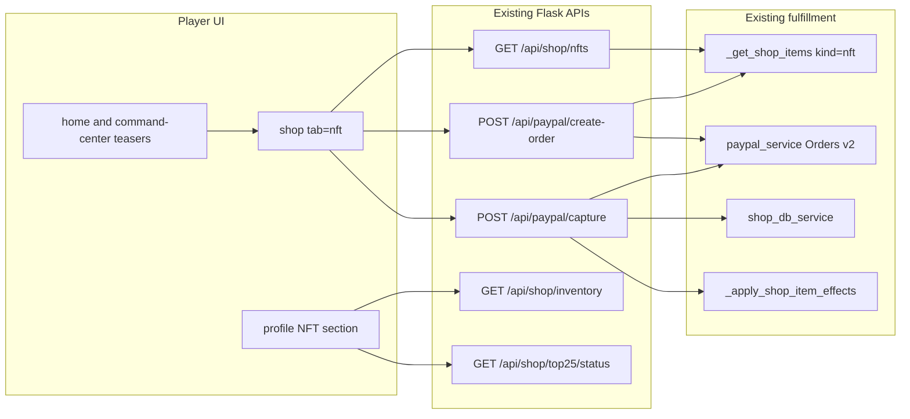
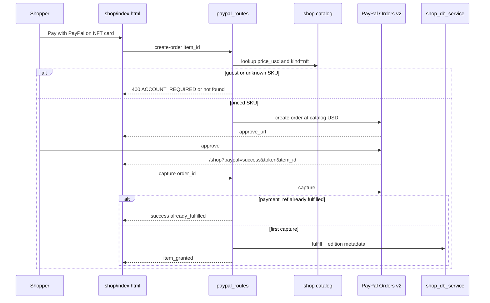
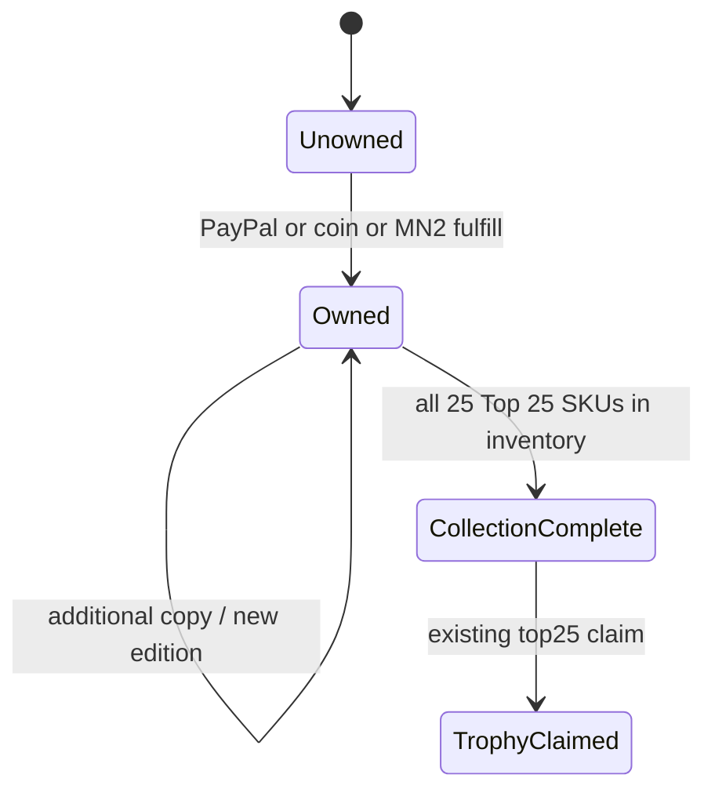

# PayPal NFT Purchase and NFT Sections - Plan

Product Contract created in this run (`ce-plan-bootstrap`).
No upstream brainstorm existed.
No same-topic plan existed to resume.

---

## Goal Capsule

Make platform NFTs buyable with PayPal, and give them dedicated UI sections, by extending the existing shop catalog and PayPal Orders v2 create-approve-capture path.

Do not mint on-chain tokens.
Do not integrate a PayPal NFT marketplace API.
PayPal has no launched merchant NFT checkout product to adopt.

Authority order: Product Contract R-IDs, then Key Technical Decisions, then unit approach.
Fulfillment stays on `fulfill_shop_purchase` plus `_apply_shop_item_effects`.
Checkout stays on `POST /api/paypal/create-order` and `POST /api/paypal/capture`.

Stop if the work expands to on-chain minting, a new PSP, casino real-money NFT betting, or a standalone `/nft` app.

Execution profile: characterize the current shop listing and PayPal capture path first, then add NFT kind + server-priced checkout + sections.
Tail ownership: implement `U1` through `U4` in dependency order.

---

## Product Contract

### Summary

Users can browse a dedicated NFT section, pay with PayPal, and see owned collectibles in a collection gallery.
The first NFT series is the existing Top 25 Legends catalog (`top25-01`…`top25-25` plus the three Top 25 bundles).
These are licensed off-chain digital collectibles branded as NFTs in the UI.

### Problem Frame

The repo has no NFT module.
Shop already sells numbered collectibles and already derives `price_usd` so catalog cards can show PayPal.
Those items are buried in Catalog / Deals, have no NFT branding, and PayPal create-order trusts the client `amount`.
Inventory stacks quantity and does not record edition or payment_ref, so a refreshed capture can double-grant.
Users asked for PayPal NFT purchase and NFT sections.
The codebase can deliver that as a shop surface, not as a blockchain product.

### Requirements

- R1. Logged-in users can buy flagged NFT SKUs with PayPal and receive them in shop inventory.
- R2. Guests (`default_user`) cannot start PayPal NFT checkout.
- R3. PayPal order amount is the server catalog `price_usd`, not the client-supplied amount.
- R4. A successful capture is idempotent for the same PayPal `order_id` / `capture_id`.
- R5. PayPal purchase-unit copy describes a licensed digital collectible, not an investment or on-chain token.
- R6. Shop exposes a first-class NFT tab at `/shop?tab=nft` with PayPal-first CTAs.
- R7. Profile shows an NFT collection section fed by `/api/shop/inventory`.
- R8. Home and Command Center show a short NFT teaser that deep-links to `/shop?tab=nft`.
- R9. NFT listing APIs return only items with `kind=nft` (or equivalent tag) plus series progress for Top 25.
- R10. Coin and MN2 rails remain available on the same SKUs.
- R11. Casino and mobile TWA do not add PayPal NFT checkout.
- R12. UI must not claim on-chain uniqueness, wallet minting, or resale investment value.

### Actors

- A1. Logged-in shopper with a Profile account.
- A2. Guest (`default_user`).
- A3. Returning PayPal payer hitting `/shop?paypal=success`.

### Key Flows

- F1. Browse NFT tab → choose SKU → PayPal → return → capture → inventory + collection card updates.
- F2. Guest taps PayPal on an NFT → blocked with Profile account prompt.
- F3. Buyer already owns copies → quantity increments, new edition metadata is recorded, collection still shows the SKU as owned.
- F4. Duplicate capture (refresh) → payment already captured, no second inventory grant.

### Acceptance Examples

- AE1. Covers R1 / F1. A logged-in user completes PayPal for `top25-01` and `/api/shop/inventory` contains that item with `price_type=paypal`.
- AE2. Covers R2 / F2. `default_user` posting to `/api/paypal/create-order` for an NFT SKU receives `ACCOUNT_REQUIRED`.
- AE3. Covers R3. Create-order for `top25-01` with client `amount=0.01` still creates a PayPal order at catalog `price_usd`.
- AE4. Covers R4 / F4. Two captures of the same `order_id` grant inventory once.
- AE5. Covers R6. `/shop?tab=nft` shows Top 25 cards with a visible PayPal button.
- AE6. Covers R7. Profile NFT section lists owned Top 25 items and empty-state CTA to the NFT tab when none are owned.

### Success Criteria

- A shopper can discover, buy with PayPal, and view at least one NFT without using the generic Catalog filter.
- PayPal capture for an NFT SKU is server-priced and safe to retry.
- Copy on PayPal and in-app matches licensed digital collectible, not crypto mint.

### Scope Boundaries

In scope:

- Off-chain NFT kind on existing collectible SKUs.
- PayPal Orders v2 hardening for those SKUs.
- Shop NFT tab, profile collection, home/Command Center teasers.
- Edition metadata on the existing inventory row.

Out of scope / outside this product's identity:

- On-chain ERC-721 / MN2 mint, gas, or wallet-connect mint.
- PayPal NFT marketplace, Pay with Crypto, or a new PSP.
- Casino USD / real-money NFT wagering.
- Mobile TWA or Play Store IAP for NFTs.
- Secondary-market royalties or OpenSea export.

Deferred to follow-up:

- New NFT series beyond Top 25.
- True global 1/1 scarcity and per-copy inventory rows.
- Auction House NFT-specific fees.
- Legal ToS page rewrite beyond checkout microcopy.

### Key Decisions

- KD1. Treat "NFT" as a platform collectible brand, not a blockchain token. Governs R5, R12.
- KD2. Launch series is Top 25 Legends plus its three bundles. Governs R6, R9.
- KD3. PayPal remains Orders v2 digital-goods checkout. Governs R1, R3, R5.
- KD4. NFT sections are Shop tab + Profile gallery + two teasers, not a new site. Governs R6, R7, R8.
- KD5. Casino and TWA stay out of NFT checkout. Governs R11.

---

## Planning Contract

### Assumptions

- Users mean visible NFT shopping and PayPal payment, not Ethereum minting.
- Top 25 is enough first inventory because it already exists, has bundles, and has a completion trophy.
- 100 coins = $1 remains the USD derivation unless a SKU already sets `price_usd`.
- Headless planning recorded these bets instead of a live product interview.

### Key Technical Decisions

- KTD1. Add `kind: nft` (and keep `tags` including `collectible`) on Top 25 SKUs and Top 25 bundles. Do not create a parallel catalog. Chosen over a new `nft_items` table because shop already lists and fulfills these ids. Overlay kind/tags by `item_id` after DB load: `get_shop_items_from_db` drops tags and `price_usd`.
- KTD2. Stop overwriting an existing `price_usd` in `_get_shop_items`. Derived USD applies only when `price_usd` is missing. Chosen over always using coins/100 so bundle USD in `data/monetization_config.json` stays authoritative.
- KTD3. `POST /api/paypal/create-order` resolves amount from the catalog for NFT and other direct shop `item_id`s. Reject unknown NFT ids. Keep the guest block. Chosen over trusting the client amount because that lets a shopper underpay. Apply the lock to all direct shop items in the same function so NFT is not a special hole.
- KTD4. Persist `payment_ref` on the purchase row in both DB and file mode, then skip fulfill when that ref exists. Chosen over reading `monetization_ledger` JSONL because ledger append happens after fulfill today and is not a lock. `record_purchase` and `_record_purchase_file` do not write `payment_ref` yet even though `ShopPurchase.payment_ref` exists. Extend those helpers. Do not add a new table.
- KTD5. NFT ownership stays one inventory row per `item_id`. Quantity is copy count. Metadata stores `editions[]` (`edition_no`, `acquired_via`, `payment_ref`, `acquired_at`) on the same row (DB `metadata_json` or file-mode item dict). Chosen over one row per copy because `reserve_inventory` and Auction House key on `item_id`.
- KTD6. Add `GET /api/shop/nfts` that filters the overlaid catalog and optional ownership. Reuse `GET /api/shop/top25/status` for completion. Chosen over client-only `?category=top25` because bundles are `category=bundles` and would drop out of a category filter.
- KTD7. Shop UI version bumps from `9.2.0` when the NFT tab ships.
- KTD8. PayPal `description` / `item_name` uses `Digital collectible — {name}`. No mint, blockchain, or return-percentage language. Chosen over calling the PayPal line item an NFT because PayPal has no merchant NFT checkout API and NFT wording can trip Acceptable Use / Purchase Protection reviews.

### High-Level Technical Design

Components:

PayPal purchase sequence:

Collection states:

### Sequencing

U1 catalog contract, then U2 money path, then U3 shop tab (needs listing + PayPal), then U4 other sections (needs the tab URL and inventory shape).

### Sources and Research

- Shop seed and Top 25 series: `backend/routes/shop_routes.py` (`_seed_shop_items`, `_get_shop_items`, `_get_paypal_shop_items`).
- PayPal create/capture: `backend/routes/paypal_routes.py`, `backend/services/paypal_service.py`.
- Inventory: `backend/services/shop_db_service.py`, `src/db/models.py` (`UserInventory.metadata_json`).
- Shop UI tabs and PayPal return: `shop/index.html`.
- Profile inventory: `profile/index.html`.
- Top 25 status: `backend/services/shop_monetization_service.py`.
- Prior NFT avoidance: `docs/plans/masternoder_mn2_ecosystem.plan.md` idea 49.
- PayPal: Orders v2 is the live merchant path. Public NFT-marketplace work is patent/legacy, not a drop-in API. Purchase Protection typically excludes NFTs; treat as digital goods.

Load-bearing external finding: do not wait for a PayPal NFT product.

---

## Implementation Units

### U1. NFT catalog contract and listing API

**Goal:** Mark Top 25 SKUs as NFTs, preserve explicit USD prices, and list them for UI sections.

**Requirements:** R9, R10, KD2

**Dependencies:** none

**Files:**

- `backend/routes/shop_routes.py`
- `backend/services/shop_serial_service.py`
- `tests/unit/test_11_shop_routes.py`
- `tests/unit/test_shop_serial_service.py`

**Approach:**

1. Keep a seed/config overlay of NFT ids (`top25-*`, `bundle-top25-*`) with `kind: nft` and collectible tags.
2. After `_get_shop_items` loads DB or seed, merge that overlay by `item_id` so DB-backed catalogs still get `kind`, tags, and listing fields (KTD1).
3. Map category `top25` and `kind=nft` to serial class `NFT` in `SERIAL_CLASS_BY_CATEGORY`.
4. Set derived `price_usd` only when absent (KTD2).
5. Add `GET /api/shop/nfts` that returns items plus series progress. Include bundles. Optional `user_id` adds owned flags from inventory.
6. Leave coin/MN2 fields unchanged (R10).

**Patterns to follow:** `_get_paypal_shop_items`, `/api/shop/items?category=`, `serial_class_for_category`.

**Test scenarios:**

- Happy path: `/api/shop/nfts` includes `top25-01` and `bundle-top25-starter` with `kind=nft` and a numeric `price_usd`.
- Happy path: `/api/shop/items?category=top25` still returns the series.
- Edge: a SKU with explicit `price_usd=12.99` and coin `price=500` keeps `12.99`.
- Edge: `top25` serial class is `NFT`, not `OTH`.
- Edge: a DB-shaped row for `top25-01` that lacks `tags` still receives `kind=nft` after overlay.
- Error: listing succeeds with empty inventory when `user_id` is missing (no 500).

**Verification:** NFT list is filterable without scanning the full catalog in the client.

### U2. Server-priced PayPal NFT checkout and edition fulfill

**Goal:** Buy an NFT with PayPal at the catalog price, once per capture.

**Requirements:** R1, R2, R3, R4, R5, AE1–AE4. KTD3, KTD4, KTD5, KTD8

**Dependencies:** U1

**Files:**

- `backend/routes/paypal_routes.py`
- `backend/services/paypal_service.py`
- `backend/services/shop_db_service.py`
- `tests/unit/test_12_paypal.py`
- `tests/unit/test_shop_payment_safety.py`

**Approach:**

1. On create-order, if `item_id` is a shop/NFT SKU, replace client amount with catalog `price_usd` (KTD3).
2. Keep the existing `default_user` account gate.
3. Set PayPal description per KTD8. Return URL stays `/shop?paypal=success&item_id=&user_id=`.
4. Extend `record_purchase` / `_record_purchase_file` / `fulfill_shop_purchase` to accept and store `payment_ref` and `price_paid_usd` in both persistence modes (KTD4).
5. Before fulfill, look up `payment_ref` (`paypal:<order_id>` preferred; also accept capture id). If found, return success with `already_fulfilled`.
6. First successful NFT/direct-item capture fulfills with `price_type=paypal` and appends one edition on the inventory row (KTD5). File mode writes the same fields on the JSON item.
7. Keep `_apply_shop_item_effects` so Top 25 bundles still grant child inventory.

**Execution note:** Start with failing tests for amount lock and duplicate capture before changing `paypal_routes`.

**Patterns to follow:** `paypal_capture` shop_item branch; `test_paypal_direct_item_applies_shop_effects_after_fulfillment`; MN2 pack `reference` idempotency style.

**Test scenarios:**

- Happy path: capture of `top25-01` calls fulfill once and returns `item_granted`.
- Happy path: create-order for `top25-01` sends catalog USD to `create_order`, ignoring client `0.01`.
- Covers AE2. Guest create-order is 400 `ACCOUNT_REQUIRED`.
- Covers AE4. Second capture with the same order/capture id does not call fulfill again.
- Error: unknown `item_id` that is presented as NFT returns 400 and does not call PayPal.
- Error: PayPal capture failure returns 500 and does not write inventory.
- Integration: fulfill failure after capture still returns `payment_captured` + `manual_fulfillment_required` (existing safety).
- Edge: bundle `bundle-top25-starter` remains in the PayPal shop map and still applies child grants.

**Verification:** No client-chosen NFT price can be charged. Refreshing the return URL does not duplicate the collectible.

### U3. Shop NFT tab and PayPal-first cards

**Goal:** Shoppers can open a dedicated NFT section and start PayPal from it.

**Requirements:** R6, R10, R12, AE5. KTD7

**Dependencies:** U1, U2

**Files:**

- `shop/index.html`
- `backend/routes/shop_routes.py` (`SHOP_UI_VERSION`)

**Approach:**

1. Add tab `nft` and panel `shop-panel-nft` beside existing tabs.
2. Honor `?tab=nft` in `showShopTab`.
3. Render series cards from `/api/shop/nfts` with rarity, serial, owned badge, PayPal button (`buyItemWithPayPal`), plus coin/MN2 actions already used in Catalog.
4. Surface Top 25 completion progress on this tab (reuse `loadTop25` / `/api/shop/top25/status`).
5. After PayPal return, if `item_id` is an NFT, switch to the NFT tab and refresh inventory.
6. Disclaimer line: licensed digital collectible, not an on-chain token (R12).
7. Bump `SHOP_UI_VERSION` (KTD7).

**Patterns to follow:** Deals & VIP tab wiring; `renderShopGrid` PayPal button gate (`price_usd` + `buyItemWithPayPal`); `handlePayPalReturn`.

**Test scenarios:**

- Test expectation: none for HTML structure in pytest.
- Behavioral coverage for checkout stays in U2.
- Manual/smoke: `/shop?tab=nft` shows PayPal on `top25-01` for a logged-in user.

**Verification:** NFT tab is reachable from a URL and leads through the existing PayPal redirect.

### U4. Profile collection and discovery teasers

**Goal:** Owned NFTs appear as a collection, and other hubs can send users to the NFT tab.

**Requirements:** R7, R8, R11, AE6

**Dependencies:** U1, U3

**Files:**

- `profile/index.html`
- `index.html`
- `static/js/command-center-hub.js`
- `static/css/frontpage-home.css` (only if the home teaser needs a small layout rule)

**Approach:**

1. On Profile, add an NFT collection card that filters inventory to `kind=nft` or `item_id` prefix `top25-` / bundle ids, using catalog metadata from `/api/shop/nfts`.
2. Empty state links to `/shop?tab=nft`.
3. On the home MN2 band, add one link: NFT collectibles → `/shop?tab=nft`.
4. In Command Center `LINKS.overview` (or a shop group), add “NFT collectibles — PayPal or MN2”.
5. Do not add PayPal buttons on casino or TWA (R11).

**Patterns to follow:** existing `profile-shop-v9-inventory` fetch; `fp-mn2-band-actions` links; command-center card helper.

**Test scenarios:**

- Happy path: profile renderer given inventory containing `top25-01` shows that name in the NFT section.
- Edge: inventory without NFT ids shows empty-state link to `/shop?tab=nft`.
- Error: inventory API failure does not blank the rest of Profile.
- Integration: `/api/shop/nfts?user_id=` owned flags match inventory ids used by the profile section.

**Verification:** A buyer can find NFTs from Home, Command Center, Shop, and Profile without hunting Catalog chips.

---

## Verification Contract

Repo tests are pytest from the repo root.

Plan-proving commands:

- `pytest tests/unit/test_11_shop_routes.py tests/unit/test_shop_serial_service.py tests/unit/test_12_paypal.py tests/unit/test_shop_payment_safety.py -q`
- After U2, also run `pytest tests/unit/test_shop_monetization.py -q` so Top 25 claim still works.

Quality gates:

- No live PayPal calls in unit tests (mock `create_order` / `capture_order`).
- Guest cannot create an NFT order.
- Duplicate capture does not double fulfill.
- `kind=nft` items appear on `/api/shop/nfts`.

Smoke (implementer, sandbox PayPal):

- Logged-in user buys `top25-01` from `/shop?tab=nft`, returns, sees inventory and Profile NFT section.

`release:validate` is not required for this plan.

---

## Definition of Done

Global:

- R1–R12 are met or explicitly deferred above.
- U1–U4 merged with their tests.
- Abandoned debug code is removed.
- Docs that describe shop PayPal mention NFT collectibles: `docs/PAYPAL_INTEGRATION_GUIDE.md` (short subsection only).

Per unit:

- U1. Listing API and serial class shipped.
- U2. Server price lock + idempotent capture shipped.
- U3. `/shop?tab=nft` shipped with PayPal CTA.
- U4. Profile section + two teasers shipped. Casino/TWA untouched for checkout.

---

## System-Wide Impact

Money path: create-order amount lock should apply to all direct shop item_ids in the same function so NFT is not a special hole.
Inventory metadata grows but the row key stays `user_id` + `item_id`, so Auction House reserve-by-item_id still works.
Agent/tool parity: no new agent tool required. Shop purchase APIs remain the automation surface.

---

## Risks and Dependencies

- PayPal chargebacks on digital collectibles. Mitigation: account required, clear digital-goods copy, existing capture/fulfill split.
- Gambling AUP if NFTs are sold next to USD casino deposits. Mitigation: R11, shop-only checkout.
- Double fulfill on return refresh. Mitigation: KTD4.
- Users expect withdrawable on-chain NFTs. Mitigation: R12 disclaimer on tab and profile.
- Depends on existing `PAYPAL_CLIENT_ID` / `PAYPAL_CLIENT_SECRET` and shop file-or-DB inventory.
- DB catalog rows omit tags/`kind`. Overlay-by-id is required or the NFT tab is empty when migrations are applied.
- File-mode purchases currently omit `payment_ref`. Idempotency must land in both stores or sandbox refresh tests will look green only on one mode.

---

## Open Questions

Deferred, not blocking:

- Q1. Later series after Top 25 (names, art, supply caps).
- Q2. Whether ops wants curated USD that diverges from 100 coins = $1 for flagship ranks.
- Q3. Whether a future ToS page should add a collectibles license paragraph beyond checkout microcopy.
