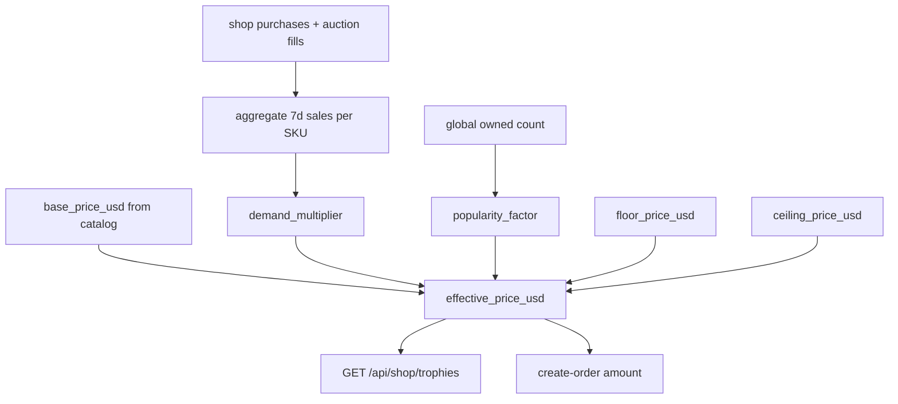
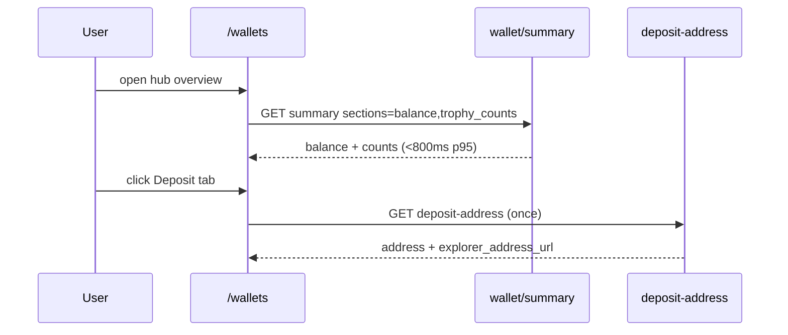

# Trophy Shop, Wallet Hub, and Exchange - Plan

Product Contract created in this run (`ce-plan-bootstrap`).
No upstream brainstorm existed.
This file was first written for shop PayPal NFT sections, then enriched for Exchange, chain capability, Block Mint companion scope, and **revised in place (2026-09-16)** for the Trophy rebrand: platform-ledger trophies with edition numbering, shop + marketplace selling with adjustable/dynamic pricing, per-edition trading, a new wallet hub UI, and shorter wallet load times.

**Previous filename:** `docs/plans/2026-09-16-001-feat-paypal-nft-purchase-plan.md`

Product Contract preservation: R1–R18 meaning unchanged where applicable (renamed NFT→Trophy in IDs and copy).
Added R19–R26, KD8–KD10, KTD13–KTD18, P-U1–P-U2, T-U1–T-U3, W-U1–W-U6 for pricing, trading, and wallet hub.

---

## Goal Capsule

**MN2 cannot mint or issue trophies on-chain today.**
MasterNoder2 is a PIVX-style UTXO coin with masternode, staking, InstantSend, and zerocoin RPCs.
It has no NFT/trophy standard, no unique-asset opcode, and no mint/transfer RPC for non-fungible tokens.
`mintzerocoin` mints fungible zMN2 privacy coins, not collectibles.

Ship **platform-ledger Trophies**: serialized unique collectibles in shop inventory, sold with PayPal and MN2 on Shop and Exchange, shown in a **new wallet hub**, tradable per edition via Auction House and peer transfer, with **dynamic pricing** driven by popularity and sales velocity.
Reuse PayPal Orders v2 create-approve-capture.
Do not send irreversible on-chain MN2 or a unique chain object as PayPal fulfillment.

**Product language:** call them **Trophies** in UI, API `kind=trophy`, routes `/api/shop/trophies`, `/shop?tab=trophies`. Internal ledger types may keep `trophy_edition_proof` (replacing planned `nft_edition_proof`).

Authority order: Product Contract R-IDs, then Key Technical Decisions, then unit approach.
Fulfillment stays on `fulfill_shop_purchase` plus `_apply_shop_item_effects`.
Checkout stays on `POST /api/paypal/create-order` and `POST /api/paypal/capture` (shop and exchange return URLs from a server allowlist).

Stop if the work expands to daemon trophy opcodes, an EVM wrap/bridge, a new PSP, casino real-money trophy betting, or a standalone `/trophy` app unrelated to shop/wallet.

Execution profile: U1 catalog + listing → U2 money path → P-U1 pricing engine → U3 shop tab → U5 exchange section → T-U1–T-U3 trading → U6 hold → W-U1–W-U5 wallet hub + perf → U4 teasers/profile → U7 docs.
Tail ownership: implement units in dependency order below.

---

## Product Contract

### Summary

Users browse dedicated **Trophy** sections on Shop and Exchange, pay with PayPal or in-app MN2/coins, see owned trophies (with **edition numbers**) in Profile and the **new wallet hub**, adjust or observe **dynamic prices** in shop and marketplace, and **trade individual trophy editions** via Auction House listing or peer transfer.
The first series is Top 25 Legends (`top25-01`…`top25-25` plus the three Top 25 bundles).
These are licensed off-chain digital collectibles branded as **Trophies** in the UI (not on-chain tokens).
The MN2 chain does not mint them.

### Problem Frame

Users asked for collectible purchase, shop/exchange surfaces, PayPal checkout, edition numbering, adjustable pricing tied to popularity/sales, trading each trophy, a faster wallet load, and a **whole new wallet interface** with explorer links.
This repo has no on-chain trophy module.
Shop already sells numbered Top 25 collectibles and derives `price_usd` for PayPal cards.
Those items are buried in Catalog / Deals, lack Trophy branding/edition UX, and PayPal create-order trusts the client `amount`.
Inventory stacks quantity and does not record edition or `payment_ref`, so a refreshed capture can double-grant.
Exchange shop sells MN2 boosts and rentals only (`data/exchange_shop_catalog.json`); its renderer has no Trophy category.
Wallet today is split across Profile (`profile-mn2-wallet.js`), Shop MN2 tab, and a stub `/wallets` page — each firing **3–4 parallel API calls on load**, with `deposit-address` RPC as the slow path (12–20s timeouts in UI).
PayPal chargeback risk remains: fiat can reverse after a buyer lists or withdraws MN2.

### Requirements

**Issuance and honesty**

- R12. UI must not claim on-chain uniqueness, wallet minting, or resale investment value.
- R16. Shop, Exchange, Profile, and Wallet copy must state that MN2 cannot mint these trophies on-chain today.
- R18. Each granted trophy edition records a platform-ledger proof hash (not a chain mint).
- R19. Every trophy grant assigns a monotonic **`edition_no`** per `item_id` for that user (and globally unique **`edition_key`** for trade/listing).
- R20. Trophy cards and wallet rows display edition number, serial class/key (`shop_serial_service`), and acquisition rail.

**PayPal checkout**

- R1. Logged-in users can buy flagged trophy SKUs with PayPal and receive them in shop inventory.
- R2. Guests (`default_user`) cannot start PayPal trophy checkout.
- R3. PayPal order amount is the **server effective price** (`price_usd` after dynamic pricing rules), not the client amount.
- R4. A successful capture is idempotent for the same PayPal `order_id` / `capture_id`.
- R5. PayPal purchase-unit copy describes a licensed digital collectible trophy, not an investment or on-chain token.
- R17. A PayPal-acquired trophy edition cannot be listed, transferred, or turned into withdrawable MN2 until the hold window ends.

**Surfaces**

- R6. Shop exposes a first-class **Trophies** tab at `/shop?tab=trophies` with PayPal-first CTAs and live effective prices.
- R7. Profile shows a **Trophy collection** section fed by `/api/shop/inventory` + `/api/shop/trophies`.
- R8. Home and Command Center show a short Trophy teaser deep-linking to `/shop?tab=trophies`.
- R9. Trophy listing APIs return only items with `kind=trophy` plus series progress for Top 25.
- R10. Coin and MN2 rails remain available on the same SKUs at server effective prices.
- R11. Casino and mobile TWA do not add PayPal trophy checkout.
- R13. Exchange exposes a first-class **Trophy** section listing the same `kind=trophy` SKUs.
- R14. Logged-in users can start PayPal trophy checkout from Exchange and return to `/exchange`.
- R15. MN2 or coin purchase of a trophy SKU from Exchange writes the same shop inventory as Shop checkout.

**Dynamic pricing**

- R21. Each trophy SKU exposes **`base_price_usd`**, **`effective_price_usd`**, and **`price_factors`** (popularity, recent sales velocity, floor cap) from the server; clients must not invent prices.
- R22. Ops can set **`floor_price_usd`** and **`ceiling_price_usd`** per SKU; dynamic engine never violates floor/ceiling.
- R23. Auction House listing price for a trophy edition may differ from shop primary price but must respect floor for that SKU when listed in coins (converted via catalog rate).

**Trading**

- R24. A logged-in owner can **list a specific trophy edition** on Auction House (fixed-price MVP) when not PayPal-held.
- R25. A logged-in owner can **peer-transfer a specific edition** to another profile (gift/trade) when not held; transfer is atomic and records provenance in edition metadata.
- R26. Marketplace views show edition-level detail on sold/active listings where available.

**Wallet hub**

- R27. **`/wallets`** becomes the primary **Wallet Hub** (not a link stub): MN2 balance, deposit/withdraw, trophy collection, activity, settings — with **explorer deep links** on addresses, transactions, blocks (block trophies), and proof references.
- R28. Wallet hub **first meaningful paint** target: **≤1.5s** on warm cache with balance + trophy count visible; deposit address and tx history load lazily when their panels open.
- R29. Profile wallet card may embed the hub or deep-link to `/wallets?tab=…` but must not duplicate four slow calls on every profile load when Wallet tab is not active.

### Actors

- A1. Logged-in shopper with a Profile account.
- A2. Guest (`default_user`).
- A3. Returning PayPal payer hitting `/shop?paypal=success` or `/exchange?paypal=success`.
- A4. Exchange trader buying from `#cex-exchange-shop` / the Trophy section.
- A5. Trophy seller listing or transferring a specific edition.
- A6. Wallet hub user reviewing MN2 + trophies + explorer links.

### Key Flows

- F1. Browse Shop Trophies tab → choose SKU → PayPal → return → capture → inventory + wallet trophy grid updates with new `edition_no`.
- F2. Guest taps PayPal on a trophy → blocked with Profile account prompt.
- F3. Buyer already owns copies → quantity increments, new edition metadata appended, collection shows multiple editions.
- F4. Duplicate capture (refresh) → payment already captured, no second inventory grant.
- F5. Browse Exchange Trophy section → PayPal or MN2 → same inventory row as Shop.
- F6. PayPal-acquired edition inside hold → Auction listing and peer transfer rejected until `hold_until`.
- F7. Popular SKU → effective price rises within ceiling → shop and exchange cards refresh from `/api/shop/trophies`.
- F8. Owner lists edition #3 of `top25-01` on Auction House → buyer purchases → edition metadata moves to buyer.
- F9. Owner peer-transfers edition #2 to friend → sender loses edition, receiver gains with new provenance chain.
- F10. User opens `/wallets` → summary API returns balance + trophy totals quickly → opens Deposit tab → deposit-address fetched once.

### Acceptance Examples

- AE1. Covers R1 / F1. Logged-in user completes PayPal for `top25-01`; inventory contains item with `price_type=paypal` and `editions[].edition_no`.
- AE2. Covers R2 / F2. `default_user` posting to `/api/paypal/create-order` for a trophy SKU receives `ACCOUNT_REQUIRED`.
- AE3. Covers R3. Create-order for `top25-01` with client `amount=0.01` still creates order at server `effective_price_usd`.
- AE4. Covers R4 / F4. Two captures of same `order_id` grant inventory once.
- AE5. Covers R6. `/shop?tab=trophies` shows Top 25 with PayPal button, effective price, edition disclaimer.
- AE6. Covers R7 / R27. Wallet hub Trophies tab lists owned Top 25 with edition badges and link to `/shop?tab=trophies` when empty.
- AE7. Covers R13 / R14 / F5. Exchange Trophy section lists `top25-01`; PayPal return lands on `/exchange`.
- AE8. Covers R15. Exchange MN2 purchase of `top25-01` appears in `/api/shop/inventory` and wallet hub.
- AE9. Covers R17 / F6. `create_listing` for PayPal-held edition fails until `hold_until`.
- AE10. Covers R16. Trophy APIs include `on_chain_mint: false`.
- AE11. Covers R21 / F7. After simulated sales spike, `GET /api/shop/trophies` returns higher `effective_price_usd` with `price_factors.demand_multiplier > 1`.
- AE12. Covers R24 / F8. Auction buy moves specific `edition_no` from seller to buyer metadata.
- AE13. Covers R25 / F9. Peer transfer removes edition from sender and adds to receiver with `transferred_from`.
- AE14. Covers R28 / F10. Wallet hub overview renders balance within 1.5s without waiting for deposit RPC.

### Success Criteria

- A shopper can discover, buy with PayPal, view editions in wallet hub, and list/transfer a clear edition without hunting Catalog.
- PayPal capture is server-priced and safe to retry.
- Copy matches licensed digital collectible trophy, not crypto mint.
- Dynamic pricing visible and authoritative on Shop, Exchange, and Auction surfaces.
- Wallet hub loads faster than today’s Profile+Shop wallet (measured: summary endpoint p95 <800ms; no deposit RPC on overview).
- Explorer links present for MN2 address, tx, and block-trophy block height.

### Scope Boundaries

In scope:

- Off-chain `kind=trophy` on existing collectible SKUs.
- PayPal Orders v2 hardening; dynamic pricing engine; edition-aware trading.
- Shop Trophies tab, Exchange Trophy section, profile collection, wallet hub redesign, home/Command Center teasers.
- Edition metadata, ledger proof hash, PayPal hold, peer transfer, auction by edition.
- Wallet load optimization (summary API, lazy panels, shop defer MN2 wallet until tab).

Out of scope:

- On-chain ERC-721 / MN2 trophy mint, gas, or wallet-connect mint.
- Using `mintzerocoin` / zMN2 as a trophy stand-in.
- PayPal trophy marketplace API, Pay with Crypto, new PSP.
- Casino USD / real-money trophy wagering.
- OpenSea export, on-chain royalties.
- Replacing hunters/casino trophy systems (`trophies_db_service`, battle trophies) — shop trophies are a separate inventory kind.

Deferred:

- New trophy series beyond Top 25 (+ block trophies companion).
- True global 1/1 per SKU supply (except block trophies 1/height).
- Bid-style auctions (fixed-price MVP only in T-U1).
- On-chain mint if future MN2 release adds unique-asset RPC (BM-U6).

### Key Decisions

- KD1. Treat "Trophy" as a platform collectible brand, not a blockchain token. Governs R5, R12, R16.
- KD2. Launch series is Top 25 Legends plus bundles. Governs R6, R9, R13.
- KD3. PayPal remains Orders v2 digital-goods checkout. Governs R1, R3, R5.
- KD4. Shop Trophies tab + Wallet hub gallery + two teasers remain required surfaces. Governs R6, R7, R8, R27.
- KD5. Casino and TWA stay out of trophy checkout. Governs R11.
- KD6. Exchange is a first-class Trophy surface over the same SKUs and inventory. Governs R13–R15.
- KD7. MN2 cannot mint trophies in this release; platform ledger is the issuance model. Governs R16, R18.
- KD8. Dynamic pricing uses server-side **`trophy_pricing_service`** with floor/ceiling and demand signals from shop purchases + auction fills — not client-side math. Governs R21–R23.
- KD9. Trading is edition-scoped: extend **`shop_auction_service`** + new **`trophy_transfer_service`**; do not build a second P2P MN2 market for trophies. Governs R24–R26.
- KD10. Wallet hub is **`/wallets`** + shared JS module consumed by Profile; explorer URLs from **`mn2_explorer_urls`**. Governs R27–R29.

---

## Planning Contract

### Assumptions

- User scope change is branding + UX + pricing/trading/wallet — not on-chain mint.
- Top 25 remains first inventory; block trophies companion reuses same `kind=trophy`, `series=block_mint`.
- 100 coins = $1 USD derivation unless SKU sets explicit `price_usd` / `base_price_usd`.
- PayPal trophy hold hours default to on-ramp `hold_hours` (72) unless `trophy_paypal_hold_hours` in config.
- Exchange MN2 debit uses unified `mn2_balance` via shop MN2 purchase path.
- **`shop_serial_service`** maps `top25` and `kind=trophy` to serial class **`TRO`** (prefer TRO over planned NFT class).
- Flash-sale pattern in `shop_monetization_service` informs time-boxed promos but trophy dynamic pricing is a separate service (KTD13).
- Wallet perf targets assume single-node deploy; summary cache is in-process TTL (not Redis requirement).

### Key Technical Decisions

- KTD1. Add `kind: trophy` (and `tags` including `collectible`) on Top 25 SKUs and bundles. Overlay by `item_id` after DB load.
- KTD2. Stop overwriting existing `price_usd` in `_get_shop_items`; treat it as **`base_price_usd`** input to pricing engine.
- KTD3. `POST /api/paypal/create-order` resolves amount from **`effective_price_usd`** for trophy/direct shop `item_id`s.
- KTD4. Persist `payment_ref` on purchase row; skip fulfill when ref exists (DB + file mode).
- KTD5. Trophy ownership stays one inventory row per `item_id`; `metadata_json.editions[]` holds `{ edition_no, edition_key, acquired_via, payment_ref, acquired_at, hold_until, proof_hash, listed_listing_id?, transfer_history[] }`.
- KTD6. Add `GET /api/shop/trophies` (alias `/api/shop/nfts` deprecated 410 or redirect one release). Response includes pricing, `on_chain_mint: false`, optional ownership/editions.
- KTD7. Shop UI version bump when Trophies tab ships.
- KTD8. PayPal description: `Digital collectible trophy — {name}`. No mint/blockchain language.
- KTD9. Do not mint trophies on MN2 (same RPC evidence as prior plan).
- KTD10. Exchange Trophy section over `GET /api/shop/trophies` + same fulfill path — not `exchange_shop_catalog.json`.
- KTD11. PayPal editions carry `hold_until`; block list/transfer/withdraw paths until cleared.
- KTD12. Ledger append `trophy_edition_proof` SHA-256 over `{user_id, item_id, edition_no, payment_ref, acquired_at}`.
- KTD13. **`trophy_pricing_service`**: `effective = clamp(base * demand_multiplier * popularity_factor, floor, ceiling)` where `demand_multiplier = 1 + min(cap, recent_sales_7d / baseline)` and `popularity_factor` from owned-user count + auction list count (normalized). Persist snapshots in `logs/trophy_pricing/snapshots.jsonl` for audit. Recompute on purchase/auction fill cron (agent_cron hook) and cache 60s per SKU.
- KTD14. Shop and Exchange cards call **`GET /api/shop/trophies`** only — never compute USD from coins client-side for trophies.
- KTD15. **`create_listing`** accepts optional `edition_no`; reserves that edition in metadata (not just qty). **`buy_listing`** transfers edition blob to buyer.
- KTD16. **`POST /api/shop/trophies/transfer`**: body `{ to_user_id, item_id, edition_no }`; validates hold, reserves edition, appends transfer event; no MN2 fee in MVP.
- KTD17. **`GET /api/mn2/wallet/summary`**: sections `balance`, `trophy_counts`, `recent_activity` (optional query `?sections=`). Single handler; balance from unified points; trophy counts from inventory scan (cached 30s/user); **does not call deposit RPC**.
- KTD18. Wallet UI: overview loads summary only; deposit/tx/activity panels fetch existing endpoints on first open. Shop page **`loadMn2Wallet()`** runs only when MN2 tab selected (not on `DOMContentLoaded`).

### High-Level Technical Design

```mermaid
flowchart LR
  subgraph ui [Player UI]
    ShopTr[shop tab=trophies]
    ExTr[exchange Trophy section]
    WalletHub[/wallets hub]
    ProfileTr[profile trophy section]
    Teasers[home and command-center]
  end
  subgraph api [Flask APIs]
    ListTr["GET /api/shop/trophies"]
    Price["trophy_pricing_service"]
    Inv["GET /api/shop/inventory"]
    WalSum["GET /api/mn2/wallet/summary"]
    PpCreate["POST /api/paypal/create-order"]
    PpCapture["POST /api/paypal/capture"]
    Auction["auction + edition_no"]
    Xfer["POST /api/shop/trophies/transfer"]
  end
  subgraph core [Fulfillment]
    Catalog["kind=trophy"]
    ShopDb[shop_db_service]
    Ledger[trophy_edition_proof]
    Hold[hold_until]
  end
  ShopTr --> ListTr
  ExTr --> ListTr
  WalletHub --> WalSum
  WalletHub --> Inv
  ListTr --> Price
  ListTr --> Catalog
  PpCreate --> Price
  PpCapture --> ShopDb
  Auction --> Hold
  Xfer --> Hold
```

Dynamic pricing loop:



Wallet load (target):



### Sequencing

**Core trophies + PayPal:** U1 → U2 → P-U1 → U3 → U5 → U6 → T-U1 → T-U2 → U4 → U7.

**Wallet (parallel after U1 + U2):** W-U1 (summary API) → W-U2 (hub page) → W-U3 (trophy tab in hub) → W-U4 (explorer links) → W-U5 (lazy load + shop defer) → W-U6 (docs).

**Block trophies (companion):** BM-U1–BM-U3 after U3; BM-U4 after U2; BM-U5 after U5 + W-U3.

U4 after U3; U5 after U2; W-U2 can start after W-U1; T-U2 after T-U1.

### Sources and Research (codebase-grounded)

**Chain — no native mint:** same as prior plan (`mn2_rpc_client.py`, MasterNoder2 `vRPCCommands[]`, KTD9).

**Shop / serial / inventory:**

- `backend/services/shop_serial_service.py` — serial class `TRO` for `trophies` category; extend overlay for `top25` + `kind=trophy`.
- `backend/routes/shop_routes.py` — `_seed_shop_items`, `_get_shop_items`, Top 25 status/claim, `SHOP_UI_VERSION`.
- `backend/services/shop_db_service.py` — inventory, `reserve_inventory`, file mode under `logs/shop_file_mode/`.
- `backend/services/shop_auction_service.py` — fixed-price listings, `MARKETPLACE_FEE_RATE`, reserve-by-`item_id` (extend for edition).
- `backend/services/shop_monetization_service.py` — VIP discount, flash sales (pattern for promos, not primary trophy pricing).
- `data/monetization_levers.json` lever 03 `pricing_intelligence` — analytics_agent hook for future tuning.

**Exchange / marketplace patterns:**

- `backend/services/exchange_shop_service.py`, `data/exchange_shop_catalog.json` — do not add trophies here.
- `static/js/agent-marketplace.js` `renderShop` — Exchange shop renderer pattern for Trophy subsection.
- `backend/services/mn2_p2p_service.py` — MN2 P2P only; not for trophy items.

**Wallet load bottlenecks (today):**

| Surface | Calls on load | Slow path |
|---------|---------------|-----------|
| `profile-mn2-wallet.js` `load()` | 4 parallel: balance, deposit-address, transactions, wallet-activity | `deposit-address` → RPC `validateaddress` / `getnewaddress` (18–20s timeout) |
| `shop/index.html` `loadMn2Wallet()` | 3 parallel on **every** shop page load | same deposit RPC |
| Profile inventory | `/api/shop/inventory` full catalog merge | large payload when many items |

**Explorer patterns:**

- `backend/services/mn2_explorer_urls.py` — `explorer_address_url`, `explorer_tx_url`, `explorer_block_url`.
- `backend/routes/mn2_routes.py` — balance/deposit/transactions attach explorer URLs (Chainz `.dws` shape; migrate to centralized builders in W-U4).
- `explorer/index.html`, `static/js/mn2-explorer-overview.js` — block/address/tx UI; link block trophies to `/explorer` block detail.

**Existing trophy-adjacent code (out of scope for merge):**

- `backend/services/trophies_db_service.py`, `casino_trophies_service.py` — hunters/casino trophies, not shop inventory.
- Top 25 completion grants `top25-collector-trophy` via `shop_monetization_service.claim_top25_completion` — stays; shop trophies are purchasable SKUs.

---

## Implementation Units

### U1. Trophy catalog contract and listing API

**Goal:** Mark Top 25 SKUs as trophies, preserve base USD prices, list for UI with serial/edition fields.

**Requirements:** R9, R10, R16, R19, R20, KD2, AE10. KTD1, KTD2, KTD6

**Dependencies:** none

**Files:**

- `backend/routes/shop_routes.py`
- `backend/services/shop_serial_service.py`
- `tests/unit/test_11_shop_routes.py`
- `tests/unit/test_shop_serial_service.py`

**Approach:**

1. Overlay `kind: trophy` on `top25-*`, `bundle-top25-*`.
2. Map `top25` / `kind=trophy` → serial class **`TRO`** in `SERIAL_CLASS_BY_CATEGORY`.
3. Add `GET /api/shop/trophies` with `on_chain_mint: false`, series filters, optional `user_id` ownership.
4. Deprecate planned `GET /api/shop/nfts` name in docs; implement trophies path only.
5. Response shape includes `base_price_usd`, placeholder `effective_price_usd` (filled by P-U1).

**Test scenarios:**

- `/api/shop/trophies` includes `top25-01`, `bundle-top25-starter`, `kind=trophy`, `on_chain_mint: false`.
- Serial class `TRO` for top25 items.
- DB row without tags still receives overlay.

### U2. Server-priced PayPal checkout, edition fulfill, and ledger proof

**Goal:** Buy trophy at server effective price; idempotent capture; edition metadata + proof.

**Requirements:** R1–R5, R17–R19, R18, AE1–AE4. KTD3–KTD5, KTD8, KTD11–KTD12

**Dependencies:** U1, P-U1 (effective price; may stub multiplier=1 until P-U1 lands)

**Files:**

- `backend/routes/paypal_routes.py`
- `backend/services/paypal_service.py`
- `backend/services/shop_db_service.py`
- `backend/services/mn2_ledger.py`
- `tests/unit/test_12_paypal.py`
- `tests/unit/test_shop_payment_safety.py`

**Approach:**

1. create-order uses **`effective_price_usd`** from pricing service.
2. Allowlist return paths `/shop`, `/exchange`.
3. `payment_ref` idempotency in DB + file mode.
4. Append edition with monotonic `edition_no`, `edition_key` (`TRO-{item_id}-{edition_no}`), `hold_until` for PayPal.
5. Ledger `trophy_edition_proof`.

**Test scenarios:** same as prior U2 with trophy naming and edition_no assertions.

### P-U1. Trophy dynamic pricing engine

**Goal:** Compute and expose effective USD/coin prices from popularity and sales velocity with floor/ceiling.

**Requirements:** R21–R23, KD8, AE11. KTD13, KTD14

**Dependencies:** U1

**Files:**

- `backend/services/trophy_pricing_service.py` (new)
- `data/trophy_pricing_config.json` (new, optional floors/ceilings per item_id)
- `backend/routes/shop_routes.py` (wire into trophies list + purchase validators)
- `tests/unit/test_trophy_pricing_service.py` (new)

**Approach:**

1. **`get_effective_price(item_id)`** → `{ base_price_usd, effective_price_usd, effective_price_coins, price_factors, computed_at }`.
2. Signals: count purchases last 7d (shop_purchases + file mode), active auction listings, distinct owners (inventory scan sample/cache).
3. `demand_multiplier = 1 + min(max_boost, sales_7d / max(1, baseline_weekly))` (baseline from config or 5).
4. `popularity_factor = 1 + min(pop_cap, log1p(global_owners) * pop_weight)`.
5. Cron recompute hook `trophy_pricing_refresh` in agent_cron (optional preset).
6. Integrate into U2 PayPal amount and shop MN2/coin checkout validators.

**Test scenarios:**

- Happy: zero sales → effective == base (within float tolerance).
- Happy: spike sales → effective increases, capped at ceiling.
- Edge: floor prevents effective below ops minimum.
- Error: unknown item_id → 404, no price invented.

### P-U2. Shop and Exchange price display integration

**Goal:** All trophy cards show live effective prices and factor tooltip/copy.

**Requirements:** R6, R13, R21. KTD14

**Dependencies:** P-U1, U3, U5

**Files:**

- `shop/index.html`
- `static/js/agent-marketplace.js`
- `exchange/index.html`

**Approach:**

1. Render `effective_price_usd` on cards; MN2/coin from server fields.
2. Optional badge “Trending” when `demand_multiplier > 1.05`.
3. Admin/debug: `price_factors` in dev-only tooltip.

**Test scenarios:** manual/smoke on `/shop?tab=trophies` and Exchange trophy section.

### U3. Shop Trophies tab and PayPal-first cards

**Goal:** Dedicated `/shop?tab=trophies` with pricing, PayPal, disclaimers.

**Requirements:** R6, R10, R12, R16, AE5. KTD7

**Dependencies:** U1, U2, P-U1

**Files:** `shop/index.html`, `backend/routes/shop_routes.py`

**Approach:**

1. Tab `trophies`, panel `shop-panel-trophies`; honor `?tab=trophies&series=block-mint`.
2. Inner chip **Block Trophies** for companion scope.
3. PayPal return switches to trophies tab.
4. Bump `SHOP_UI_VERSION`.

### U4. Profile collection and discovery teasers

**Goal:** Trophy collection in Profile; teasers to shop/wallet hub.

**Requirements:** R7, R8, R11, R16, AE6

**Dependencies:** U1, U3, W-U2

**Files:** `profile/index.html`, `index.html`, `static/js/command-center-hub.js`

**Approach:**

1. Profile section filters `kind=trophy`; show edition summary.
2. Link empty state to `/shop?tab=trophies` and `/wallets?tab=trophies`.
3. Do not auto-load full wallet RPC on profile mount — link to hub (R29).

### U5. Exchange Trophy section

**Goal:** Exchange lists same trophies; PayPal/MN2 → shop inventory.

**Requirements:** R13–R15, AE7–AE8. KTD10

**Dependencies:** U1, U2, P-U1

**Files:** `exchange/index.html`, `static/js/agent-marketplace.js`, paypal + shop MN2 paths, tests

**Approach:** Same as prior U5 with Trophy naming and effective prices from `/api/shop/trophies`.

### U6. PayPal chargeback hold vs transfer/listing

**Goal:** PayPal editions blocked from auction, peer transfer, MN2 cash-out until hold clears.

**Requirements:** R17, AE9. KTD11

**Dependencies:** U2, T-U1, T-U2

**Files:** `shop_auction_service.py`, `trophy_transfer_service.py`, `shop_db_service.py`, tests

### U7. Docs: rails, hold, chain capability, trophy naming

**Requirements:** R16, R17. KTD9, KTD11

**Files:** `docs/PAYPAL_INTEGRATION_GUIDE.md`, `docs/MN2_OPS.md`, `content/digital_goods/paypal-mn2-rails-onepager.md`

---

### T-U1. Edition-aware Auction House listings

**Goal:** List and sell specific trophy editions on existing auction house.

**Requirements:** R24, R26, F8. KTD15

**Dependencies:** U2, U6

**Files:**

- `backend/services/shop_auction_service.py`
- `backend/services/shop_db_service.py` (edition reserve/release helpers)
- `backend/routes/shop_routes.py` or `shop_monetization_routes.py`
- `shop/index.html` (list edition UI in inventory/auction tab)
- `tests/unit/test_trophy_auction_editions.py` (new)

**Approach:**

1. Extend `create_listing(user_id, item_id, quantity, price_coins, edition_no=None)`.
2. When `edition_no` set for `kind=trophy`, mark edition `listed_listing_id` in metadata; qty must be 1.
3. `buy_listing` transfers edition struct to buyer; update provenance.
4. Reject if edition PayPal-held or already listed.
5. Listing card shows `#edition_no` and serial_key.

**Test scenarios:**

- List edition 3, buy, buyer metadata contains edition 3; seller loses it.
- List without edition_no on trophy → error or auto-pick lowest clear edition (document choice: **require explicit edition_no**).
- Held PayPal edition → `create_listing` fails.

### T-U2. Peer transfer between profiles

**Goal:** Gift/trade a specific edition to another user.

**Requirements:** R25, F9. KTD16

**Dependencies:** U2, U6

**Files:**

- `backend/services/trophy_transfer_service.py` (new)
- `backend/routes/shop_routes.py` — `POST /api/shop/trophies/transfer`
- `wallets/index.html` / wallet hub JS — transfer modal
- `tests/unit/test_trophy_transfer.py` (new)

**Approach:**

1. Validate sender owns edition, not held, not listed.
2. Atomic: remove from sender `editions[]`, append to receiver with `transferred_from`, `transferred_at`.
3. Append ledger event `trophy_transfer` (audit, not chain tx).
4. Rate limit transfers per user/day (config default 10).

**Test scenarios:**

- Happy path transfer; receiver sees edition; sender qty decrements or edition removed.
- Guest blocked.
- Transfer listed edition fails.

### T-U3. Marketplace trophy filters and edition display

**Goal:** Auction browse surfaces trophy listings with edition detail and links to shop floor price.

**Requirements:** R26, R23

**Dependencies:** T-U1, P-U1

**Files:** `shop/index.html` (auction tab), optional `market/index.html` cross-link

**Approach:** Filter auction listings where catalog `kind=trophy`; show effective shop price vs listing price.

---

### W-U1. Wallet summary API (performance)

**Goal:** One fast endpoint for wallet hub overview.

**Requirements:** R28, R29, AE14. KTD17

**Dependencies:** U1

**Files:**

- `backend/routes/mn2_routes.py` — `GET /api/mn2/wallet/summary`
- `backend/services/mn2_wallet_summary_service.py` (new)
- `tests/unit/test_mn2_wallet_summary.py` (new)

**Approach:**

1. Query params: `sections=balance,trophy_counts,recent_activity` (default balance+trophy_counts).
2. Balance from unified points + optional `mn2_usd_price` (chainz, cached 30s global).
3. Trophy counts: scan inventory for `kind=trophy` or overlay ids — cache per user 30s.
4. **No deposit RPC** in summary.
5. Response includes `explorer_base_url` for client link builders.

**Test scenarios:**

- Summary returns in <800ms with mocked inventory (unit).
- Does not invoke `get_or_create_deposit_address`.
- trophy_counts matches inventory editions length sum.

### W-U2. Wallet Hub page redesign (`/wallets`)

**Goal:** Replace stub `/wallets` with full hub UI.

**Requirements:** R27, KD10

**Dependencies:** W-U1, U1

**Files:**

- `wallets/index.html` (major rewrite)
- `static/js/wallet-hub.js` (new)
- `static/css/wallet-hub.css` (new, minimal)
- `profile/index.html` (deep-link, optional embed mode)

**Layout spec:**

| Tab | Contents |
|-----|----------|
| **Overview** | Balance, liquid/held MN2, trophy count, quick actions (deposit, shop trophies, explorer) |
| **MN2** | Deposit QR, withdraw, trusted addresses (reuse profile form patterns) |
| **Trophies** | Grid: image, name, edition badges, serial_key, actions List / Transfer / Shop link |
| **Activity** | Paginated transactions + 5d chart (lazy load) |
| **Explorer** | Links to `/explorer`, recent user addresses/txs with `explorer_*_url` |
| **Settings** | Fiat toggle, 2FA link, wallet downloads |

**Test scenarios:** manual smoke — hub loads overview without deposit call; tabs lazy-fetch.

### W-U3. Trophy tab in wallet hub

**Goal:** Show all owned editions with trade CTAs.

**Requirements:** R7, R20, R27

**Dependencies:** W-U2, U1, T-U1, T-U2

**Files:** `wallet-hub.js`, `GET /api/shop/inventory` + trophies metadata merge

**Approach:**

1. Fetch inventory + `/api/shop/trophies?user_id=` for names/media.
2. Expand `editions[]` into rows; uneditioned legacy qty shown as “legacy stack” with prompt to normalize on next grant.
3. Buttons: List on Auction, Transfer, View in Shop.

### W-U4. Explorer deep links (mandatory)

**Goal:** Every wallet/hub/trophy surface links to explorer correctly.

**Requirements:** R27. KD10

**Dependencies:** W-U2

**Files:**

- `backend/routes/mn2_routes.py` (use `mn2_explorer_urls` builders)
- `wallet-hub.js`, `profile-mn2-wallet.js` (align)
- Trophy detail: block trophies link `explorer_block_url(height)`; proof_hash links to in-app `/wallets?tab=activity&proof=` (support lookup)

**Approach:** Replace hardcoded `.dws` strings with `explorer_address_url()`, `explorer_tx_url()`, `explorer_block_url()` from `mn2_explorer_urls.py`.

### W-U5. Wallet load optimization rollout

**Goal:** Shorter load across Profile, Shop, Wallet hub.

**Requirements:** R28, R29. KTD18

**Dependencies:** W-U1, W-U2

**Files:**

- `static/js/profile-mn2-wallet.js`
- `shop/index.html`
- `profile/index.html`

**Approach:**

1. Profile: call `wallet/summary` on wallet route only; defer `ProfileMn2Wallet.load()` until Wallet tab visible (IntersectionObserver or tab click).
2. Shop: call `loadMn2Wallet()` only when MN2 tab activated (already partially gated — remove `DOMContentLoaded` eager call).
3. Deposit panel: fetch address on first open only.
4. Skeleton UI + stale-while-revalidate for balance (show cached localStorage balance with “refreshing…”).
5. Paginate `/api/mn2/transactions?cursor=` (optional; if not added, reduce default limit to 10 on overview).

**Performance targets:**

| Metric | Today (typical) | Target |
|--------|-----------------|--------|
| Profile wallet tab first paint | 4 requests; deposit RPC blocks 2–18s | summary only <1.5s |
| Shop page initial load | 3 wallet calls always | 0 wallet calls until MN2 tab |
| Wallet hub overview | N/A (stub) | summary p95 <800ms |

### W-U6. Wallet hub docs and navigation

**Goal:** Nav toolbar, AGENTS pointers, `/wallets` as canonical wallet entry.

**Files:** `static/js/navigation-toolbar.js`, `wallets/index.html`, `docs/MN2_SHOP_AND_ADDRESSES.md`

---

## Block Mint Trophies (companion scope)

Renamed from **Block Mint NFTs / Block Drops** → **Block Trophies**.

Follow-up: *issue a trophy every time MN2 creates a new block, with still or 3s encoder GIF, as shop sub-series.*

### Verdict

| Question | Answer |
|----------|--------|
| On-chain mint per block? | **No** (KTD9) |
| Platform trophy per height + GIF? | **Yes — phased MVP** |
| Shop entry | **Block Trophies** under Trophies tab — `/shop?tab=trophies&series=block-mint` |

### Product shape

- SKU `block-{height}`; supply 1/height; `series: block_mint`, `kind: trophy`.
- Media: PNG + 3s GIF (`scripts/generate_shop_top_clips.py` pattern).
- Explorer link on each card → block height on `/explorer`.
- Pricing: dynamic engine with low floor; MN2 claim primary (BM-U4).

### Units

| Unit | Goal | Depends |
|------|------|---------|
| **BM-U1** | Block listener + manifest + `GET /api/shop/block-mint/drops` | RPC |
| **BM-U2** | PNG + 3s GIF per height | BM-U1 |
| **BM-U3** | Shop sub-chip “Block Trophies” + explorer teaser | U3, BM-U1 |
| **BM-U4** | MN2/PayPal claim + `block_trophy_proof` ledger | U2, BM-U2 |
| **BM-U5** | Exchange + wallet hub filter | U5, W-U3, BM-U3 |
| **BM-U6** | (Deferred) On-chain anchor | daemon |

API sketch: same as prior plan with `block_mint` series filter on `/api/shop/trophies?series=block-mint`.

---

## Verification Contract

```bash
pytest tests/unit/test_11_shop_routes.py tests/unit/test_shop_serial_service.py \
  tests/unit/test_12_paypal.py tests/unit/test_shop_payment_safety.py \
  tests/unit/test_trophy_pricing_service.py tests/unit/test_trophy_auction_editions.py \
  tests/unit/test_trophy_transfer.py tests/unit/test_mn2_wallet_summary.py -q
pytest tests/unit/test_shop_monetization.py tests/unit/test_exchange_rental_shop.py -q
```

Quality gates:

- Guest cannot create trophy PayPal order.
- Duplicate capture does not double grant.
- `kind=trophy` on `/api/shop/trophies` with `on_chain_mint: false`.
- Effective price used at PayPal create-order.
- PayPal-held edition cannot list or transfer.
- Wallet summary does not call deposit RPC.
- Explorer URLs present on deposit + tx rows in hub.

Smoke:

- Buy `top25-01` from `/shop?tab=trophies`; see edition in `/wallets?tab=trophies`.
- List edition on auction; second user buys.
- Peer transfer edition; receiver wallet shows it.
- Open wallet hub overview — balance visible before deposit address loads.

---

## Definition of Done

Global:

- R1–R29 met or explicitly deferred.
- Units U1–U7, P-U1–P-U2, T-U1–T-U3, W-U1–W-U6, BM-U1–BM-U5 (companion) documented with tests as marked.
- Product copy says **Trophy**, not NFT, on Shop, Exchange, Profile, Wallet hub.
- PayPal guide and MN2 ops document mint verdict + hold + trophy naming.

Per track:

- **U1–U7:** Trophy catalog, checkout, surfaces, hold, docs.
- **P-U1–P-U2:** Dynamic pricing live on API and cards.
- **T-U1–T-U3:** Edition auction + peer transfer + marketplace display.
- **W-U1–W-U6:** Wallet hub shipped, load time improved, explorer links mandatory.
- **BM-U1–BM-U5:** Block trophy gallery + claim path (companion).

---

## System-Wide Impact

- Money path: all direct shop item PayPal amounts use server effective prices.
- Inventory metadata grows with `editions[]`; auction/trade must be edition-aware to avoid double-spend of same copy.
- Exchange MN2 and unified balance unchanged; trophy MN2 spend via shop path only.
- Nav: promote `/wallets` over scattered wallet entry points.
- Do not add trophy RPCs to `mn2_rpc_client.py`.

---

## Risks and Dependencies

- Users expect on-chain trophies → mitigated by R12/R16 on all surfaces.
- Dynamic pricing surprise → show factors + floor; ops ceiling defaults generous.
- Edition complexity in file-mode inventory → migration helper to backfill `edition_no` for legacy qty stacks.
- Wallet summary cache stale → TTL 30s acceptable for balance/trophy counts.
- PayPal chargebacks → U6 hold + block transfer/listing.
- ffmpeg load for block trophies → BM-U2 catch-up cap.

---

## Open Questions

- Q1. Later trophy series after Top 25.
- Q2. Ops-curated floor/ceiling per rank (config vs JSON).
- Q3. Peer transfer fee (MN2 or free) — MVP free.
- Q4. Auto-pick edition when listing vs require picker — plan requires explicit `edition_no`.
- Q5. Normalize legacy inventory stacks into editions on read vs one-time migration job.
- Q6. PayPal dispute clawback for trophy editions (webhook) — deferred.
- Q7–Q9. Block trophy pricing, milestone-only mints, encoder templates — same as prior block mint section.
