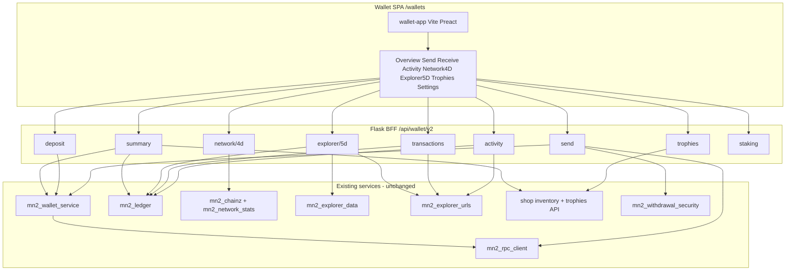
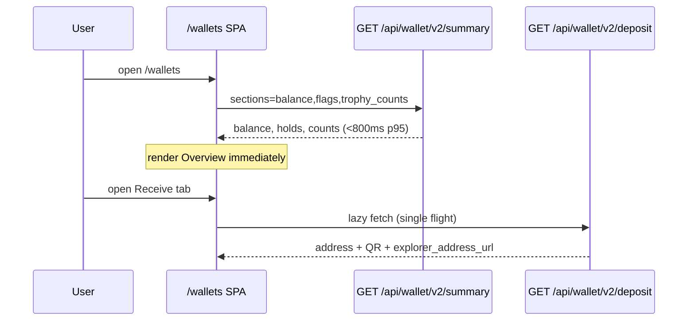

# MN2 Wallet Rebuild (From Scratch) - Plan

Companion to [`docs/plans/2026-09-16-001-feat-trophy-shop-wallet-plan.md`](2026-09-16-001-feat-trophy-shop-wallet-plan.md) (Trophy shop, trading, pricing). Plan 001 still owns trophy catalog, PayPal, auction, and peer transfer. **This plan owns the wallet product rebuild.**

---

## Goal Capsule

Replace the fragmented MN2 wallet UX (Profile card, Shop MN2 tab, stub `/wallets`, scattered global bars) with a **single greenfield wallet app** at `/wallets`: send/receive, QR deposit, tx history, balances, staking snapshot, **4D network monitor panel**, **5D explorer/wallet monitor panel**, trophy gallery (from plan 001), explorer deep links, and settings.

**From scratch** means a new TypeScript SPA and a clean **`/api/wallet/v2/*`** boundary — **not** rewriting `mn2_rpc_client.py` or the ledger on day 1.

Stop if the work expands to: a native mobile wallet, hardware wallet integration, on-chain trophy mint, or replacing the Flask monolith with a separate Go/Rust chain microservice.

Execution profile: **WR-P0 scaffold → WR-P1 MVP send/receive → WR-P2 monitors → WR-P3 trophies → WR-P4 migration sunset.**

---

## Stack Recommendation (ONE approach)

| Option | Verdict |
|--------|---------|
| **A. Flask API + Vite TypeScript SPA (recommended)** | **Ship this.** Keep Python services; new UI in `wallet-app/` built to `static/wallet-v2/`. |
| B. Go/Rust wallet microservice | Rejects: duplicates `mn2_rpc_client.py`, failover, deposit scanner, ledger — high risk on a single-node deploy. |
| C. WASM chain client in browser | Rejects: MN2 is server-custodial UTXO wallet; RPC secrets must stay server-side. |
| D. Incremental vanilla JS hub (plan 001 W-U2) | Superseded by this plan for primary `/wallets` UX; keep W-U1 summary patterns as v2 API input. |

### Rationale

- **Team velocity:** Repo is Flask + static HTML/JS today (`deploy.py` already ships `static/js/*`). Adding a Vite bundle under `static/wallet-v2/` matches deployment without new infra.
- **Chain client:** `backend/services/mn2_rpc_client.py`, `mn2_wallet_service.py`, `mn2_deposit_scanner.py`, `mn2_ledger.py`, and `mn2_withdrawal_security.py` are existing service paths with unit tests — wrap, do not rewrite.
- **Single-process deploy:** Same gunicorn/Flask process serves API + static assets; no second service to operate.
- **Language upgrade:** TypeScript + component SPA replaces 393-line IIFE `profile-mn2-wallet.js` and duplicated shop wallet loaders with typed modules and testable UI logic.

**Chosen stack:** **Python 3 Flask backend (unchanged) + Vite + TypeScript + Preact** (small bundle; React-compatible patterns if team prefers React — swap in WR-U0).

---

## Codebase Inventory (wallet-related surfaces)

### Frontends (today)

| Surface | Path | Load behavior | Notes |
|---------|------|---------------|-------|
| Profile MN2 wallet | `static/js/profile-mn2-wallet.js`, `profile/index.html#profile-mn2-wallet-card` | **4 parallel calls on `load()`** | balance, deposit-address (12–20s RPC), transactions, wallet-activity (5d chart) |
| Shop MN2 wallet | `shop/index.html` `loadMn2Wallet()` | **3 calls on every shop page load** (line ~3631) | Duplicate deposit/withdraw UI |
| Wallets stub | `wallets/index.html` | Static links only | Redirects to Profile/Exchange |
| Exchange wallet | `static/js/exchange-hub.js`, `exchange/index.html` | Lazy tab loaders | Treasury/balance tiles, not full wallet |
| MN2 crypto hub | `static/js/mn2-crypto-hub.js` | Tab-lazy | Staking leaderboard, POR, masternode hosting — adjacent, not user wallet |
| Global balance bar | `static/js/mn2-global-bar.js`, `static/js/mn2-site-bridge.js` | Balance + price on many pages | Should deep-link to `/wallets` |
| Explorer overview | `static/js/mn2-explorer-overview.js`, `explorer/index.html` | Polls `/api/mn2/network-overview` | **5D-adjacent chain monitor** (sparklines, SSE stream) |
| Aggregator 5D monitor | `static/js/story-monitor-5d.js`, `aggregator/index.html` | Holodeck narrative monitor | Site-wide σ monitor, not wallet-specific |
| Profile 5d wallet chart | `profile-mn2-5d-chart` in profile | `/api/mn2/wallet-activity?days=5` | **User 5-day ledger monitor** |
| Withdraw security UI | `static/js/mn2-withdrawal-security.js` | Profile/settings hooks | 2FA, whitelist |
| Mobile TWA | `backend/routes/all_page_routes.py` (casino PWA manifest) | **No dedicated MN2 wallet TWA** | Wallet v2 responsive web first; TWA deep-link later |

### Backend (today)

| Layer | Path | Role |
|-------|------|------|
| RPC client | `backend/services/mn2_rpc_client.py`, `mn2_rpc_failover.py` | getnewaddress, validateaddress, sendtoaddress, staking_health |
| Wallet service | `backend/services/mn2_wallet_service.py` | Per-user deposit addresses, pool, balance via unified points |
| Routes | `backend/routes/mn2_routes.py` | `/api/mn2/balance`, `deposit-address`, `transactions`, `wallet-activity`, `withdraw`, security |
| Ledger | `backend/services/mn2_ledger.py` | In-app tx history, activity buckets |
| Deposit scanner | `backend/services/mn2_deposit_scanner.py` | On-chain deposit crediting |
| Staking | `backend/services/mn2_staking_service.py`, `backend/routes/mn2_staking_routes.py` | Stake/unstake, monitor |
| **4D network data** | `backend/services/mn2_chainz.py`, `mn2_network_stats.py`, `mn2_network_peers_service.py` | `network_overview`, history jsonl, alerts |
| Network APIs | `mn2_staking_routes.py` | `/api/mn2/network-overview`, `network-history`, `network-alerts`, `/api/mn2/explorer/stream` (SSE) |
| **5D explorer data** | `backend/services/mn2_explorer_data.py` | `recent_blocks`, `masternodes` via RPC |
| Explorer URLs | `backend/services/mn2_explorer_urls.py` | Centralized address/tx/block link builders |
| Agent wallets | `backend/services/agent_wallet_service.py` | **Separate** agent treasury wallets — out of user wallet v2 scope |
| Shop payment | `backend/routes/shop_routes.py` | MN2 shop debit, on-chain order payment |

### Tests (today)

| Test file | Covers |
|-----------|--------|
| `tests/test_mn2_crypto.py` | balance, deposit-address, withdraw, wallet-activity, address pool |
| `tests/unit/test_mn2_network_monitor.py` | daemon extras, network history snapshot keys |
| `tests/unit/test_mn2_explorer_data.py` | recent blocks, masternode list |
| `tests/unit/test_mn2_withdrawal_security.py` | whitelist, TOTP |
| `tests/unit/test_mn2_staking.py` | staking routes |
| `tests/unit/test_all_page_routes.py` | `/wallets/` first-class page |
| `tests/unit/test_shop_payment_safety.py` | wallet address map in payment flows |

### Performance bottleneck (measured in plan 001)

| Call | Typical cost | First paint? |
|------|--------------|--------------|
| `GET /api/mn2/balance` | fast | yes |
| `GET /api/mn2/deposit-address` | **12–20s** (RPC getnewaddress/validateaddress) | **must NOT block overview** |
| `GET /api/mn2/transactions` | medium | lazy |
| `GET /api/mn2/wallet-activity` | fast | lazy (Activity tab) |
| `GET /api/mn2/network-overview` | medium (cached 30s) | lazy (4D tab) |

---

## Feature Matrix (wallet v2)

| Feature | MVP (P1) | Monitors (P2) | Trophies (P3) | Settings (P4) |
|---------|----------|---------------|---------------|---------------|
| Balance (liquid + held + fiat toggle) | ✓ | | | ✓ |
| Send / withdraw MN2 | ✓ | | | |
| Receive / deposit address + QR | ✓ | | | |
| Copy address / share | ✓ | | | |
| Tx history + explorer tx links | ✓ | | | |
| Trusted addresses / whitelist | | | | ✓ |
| Withdraw 2FA | | | | ✓ |
| Staking snapshot (staked, APR, link) | | ✓ | | |
| **4D network monitor** (connections, mempool, height, hash, sparklines, alerts) | | ✓ | | |
| **5D wallet monitor** (5-day in/out/net bars) | | ✓ | | |
| **5D explorer panel** (recent blocks + user tx overlay + story strip optional) | | ✓ | | |
| Trophy gallery + list/transfer CTAs | | | ✓ | |
| Explorer deep links (address, tx, block) | ✓ | ✓ | ✓ | |
| Daemon/Qt download links | | | | ✓ |
| P2P / shop quick actions | | | ✓ | |

---

## Architecture



### First-paint sequence (target ≤1.5s)



---

## API Design — `/api/wallet/v2/*`

New blueprint: `backend/routes/wallet_v2_routes.py`  
Service facade: `backend/services/wallet_v2_service.py` (thin wrappers — no duplicate ledger logic)

All routes require same-origin session / `user_id` resolution as existing MN2 routes. Guest `default_user` gets read-only or blocked send (match current withdraw rules).

| Method | Path | Purpose | Backend delegate |
|--------|------|---------|------------------|
| GET | `/api/wallet/v2/summary` | Fast overview | `get_balance`, trophy count scan, `mn2_explorer_urls.explorer_base_url`, feature flags |
| GET | `/api/wallet/v2/deposit` | Deposit address + QR payload | `get_or_create_deposit_address` + `explorer_address_url()` |
| POST | `/api/wallet/v2/deposit/refresh` | Force new address | existing wallet refresh path |
| GET | `/api/wallet/v2/transactions` | Paginated ledger | `get_entries_by_user` + explorer URLs |
| GET | `/api/wallet/v2/activity?days=5` | 5d buckets | `get_wallet_activity_days` |
| POST | `/api/wallet/v2/send` | Withdraw MN2 | `/api/mn2/withdraw` logic + security |
| GET | `/api/wallet/v2/network/4d` | Network monitor bundle | `mn2_chainz.network_overview` + `mn2_network_stats.get_history(hours=24)` + `get_alerts(limit=5)` |
| GET | `/api/wallet/v2/explorer/5d` | Explorer + wallet overlay | `mn2_explorer_data.recent_blocks(10)` + user recent txs + activity buckets |
| GET | `/api/wallet/v2/staking` | Staking snapshot | `mn2_staking_service` summary fields |
| GET | `/api/wallet/v2/trophies` | Owned trophies | proxy `GET /api/shop/trophies?user_id=` + inventory editions |
| GET/POST | `/api/wallet/v2/security/*` | 2FA, whitelist | delegate `mn2_withdrawal_security` routes |

**Query params for summary:** `?sections=balance,trophy_counts,flags,recent_activity_preview` (default: `balance,trophy_counts,flags`). **Never calls deposit RPC.**

**Deprecation:** v1 `/api/mn2/*` remains for shop/profile during migration; v2 is canonical for `/wallets` SPA.

---

## 4D Network Monitor Panel (wallet context)

**Definition:** MN2 **chain/network health monitor** (not Star Map 4D, not debugger ops-4d).

**Data sources (existing):**

- `GET /api/mn2/network-overview` — price, height, difficulty, connections, mempool, staking health, RPC failover
- `GET /api/mn2/network-history?hours=24` — sparkline series (`connections`, `mempool_tx`, `mn2_usd_price`, …)
- `GET /api/mn2/network-alerts` — stall/stop-staking alerts from `mn2_network_stats.py`
- Optional live: `EventSource /api/mn2/explorer/stream` (same as explorer page)

**UI (wallet Network tab):**

- KPI tiles + SVG sparklines (port from `mn2-explorer-overview.js` into typed components)
- Alert strip with severity colors
- Link out: “Full explorer → `/explorer`”
- Auto-refresh 30s; pause when tab hidden

---

## 5D Explorer Monitor Panel (wallet context)

Two complementary layers:

1. **5D wallet monitor (personal):** 5 UTC-day in/out/net bars — today `profile-mn2-5d-chart` + `/api/mn2/wallet-activity`. Moves to wallet **Activity** tab.
2. **5D explorer monitor (chain + narrative):** Recent blocks from `mn2_explorer_data.recent_blocks`, cross-linked to user txs; optional compact `story-monitor-5d` strip (`data-story-context="wallet"`) for brand continuity — **lazy load** script on Explorer tab only.

**Explorer deep links (mandatory):** All address, txid, block height fields use `mn2_explorer_urls.explorer_address_url`, `explorer_tx_url`, `explorer_block_url` — replace hardcoded `.dws` strings in v2 BFF responses.

---

## Migration Path

| Phase | User-visible | Legacy |
|-------|--------------|--------|
| WR-P0 | `/wallets?v=2` beta flag | Profile/shop unchanged |
| WR-P1 | `/wallets` default for logged-in users | Profile wallet card shows “Open new wallet →” banner |
| WR-P2 | Shop MN2 tab links to `/wallets?tab=receive` | Remove `loadMn2Wallet()` on shop DOMContentLoaded |
| WR-P3 | Trophy tab live | Plan 001 T-U2 transfer modal in SPA |
| WR-P4 | Nav toolbar canonical `/wallets` | `profile-mn2-wallet.js` load gated behind `?legacy_wallet=1`; delete after 2 releases |

**Feature flag:** `data/mn2_config.json` → `wallet_v2_enabled: true`, `wallet_v2_default_tab: overview`

**Redirects:**

- `/profile#profile-mn2-wallet-card` → `/wallets?from=profile`
- `mn2-global-bar.js` Wallet link → `/wallets`

---

## Implementation Units

### WR-U0. Wallet app scaffold

**Goal:** Vite + TypeScript + Preact app builds into Flask static tree.

**Files:**

- `wallet-app/` (new) — `package.json`, `vite.config.ts`, `src/main.tsx`, `src/App.tsx`
- `wallet-app/vite.config.ts` → `outDir: ../static/wallet-v2`
- `wallets/index.html` — SPA shell loading `/static/wallet-v2/assets/*`
- `deploy.py` — add wallet-app build step (or document `npm run build` in CI)
- `.gitignore` — ignore `static/wallet-v2/assets` if built in CI only (team choice: commit built assets for simpler ops)

**Test:** `npm run build` succeeds; `/wallets/` returns 200 with mount node `#wallet-root`.

---

### WR-U1. Wallet v2 API blueprint + summary

**Goal:** Fast summary endpoint; no deposit RPC.

**Dependencies:** none

**Files:**

- `backend/routes/wallet_v2_routes.py` (new)
- `backend/services/wallet_v2_service.py` (new)
- `backend/services/mn2_wallet_summary_service.py` (new — same as plan 001 W-U1)
- `tests/unit/test_wallet_v2_summary.py` (new)

**Approach:**

1. Register blueprint in auto-discovery.
2. `GET /api/wallet/v2/summary` — balance, withdrawable/held, `trophy_counts`, `explorer_base_url`, `wallet_v2_enabled`.
3. Unit assert `get_or_create_deposit_address` not called.

**Test scenarios:**

- Summary p95 <800ms with mocked balance/inventory.
- Guest user gets balance 0 or blocked flags consistent with v1.

---

### WR-U2. SPA shell + Overview tab (MVP slice)

**Goal:** First meaningful paint with balance only.

**Dependencies:** WR-U0, WR-U1

**Files:**

- `wallet-app/src/tabs/Overview.tsx`
- `wallet-app/src/api/client.ts`
- `static/js/navigation-toolbar.js` — promote `/wallets`

**Test scenarios:**

- Overview renders balance without deposit call (network tab in DevTools).
- Skeleton → data within 1.5s on warm cache (manual smoke).

---

### WR-U3. Send + Receive (MVP core)

**Goal:** Withdraw + deposit QR — full send/receive loop.

**Dependencies:** WR-U2

**Files:**

- `wallet-app/src/tabs/Send.tsx`, `Receive.tsx`
- `wallet-app/src/components/QrDeposit.tsx`
- v2 routes: `deposit`, `send` delegating to existing mn2_routes logic

**Approach:**

1. Receive tab single-flights deposit fetch; show spinner + retry.
2. Send tab reuses validation messages from v1; wires withdraw security when enabled.
3. Copy-to-clipboard + explorer address link on receive.

**Test scenarios:**

- `tests/unit/test_wallet_v2_deposit.py` — explorer URL from `mn2_explorer_urls`.
- `tests/test_mn2_crypto.py` still passes (v1 unchanged).
- Manual: send form disabled when `withdrawal_verified === false`.

---

### WR-U4. Transactions + Activity (5d wallet monitor)

**Goal:** History list + 5-day bar chart.

**Dependencies:** WR-U2

**Files:**

- `wallet-app/src/tabs/Activity.tsx`
- v2 `transactions`, `activity` routes
- Port chart styling from `profile/index.html` `.mn2-5d-*` classes into SPA CSS module

**Test scenarios:**

- Activity returns 5 buckets; empty state copy matches v1.
- Tx rows include `explorer_tx_url` when txid present.

---

### WR-U5. 4D Network monitor tab

**Goal:** Network KPIs + sparklines + alerts in wallet.

**Dependencies:** WR-U2

**Files:**

- `wallet-app/src/tabs/Network4D.tsx`
- `wallet-app/src/components/Sparkline.tsx`
- v2 `network/4d` aggregator route
- Reuse field mapping from `static/js/mn2-explorer-overview.js`

**Test scenarios:**

- `test_mn2_network_monitor.py` still passes.
- v2 network bundle includes `connections`, `mempool_tx`, `history` array, `alerts`.
- Tab fetch only when Network opened (lazy).

---

### WR-U6. 5D Explorer monitor tab

**Goal:** Recent blocks + user tx cross-links + optional story strip.

**Dependencies:** WR-U4, WR-U5

**Files:**

- `wallet-app/src/tabs/Explorer5D.tsx`
- v2 `explorer/5d` route
- Lazy import `story-monitor-5d.js` with `data-story-context="wallet"` OR lightweight inline σ readout (prefer lazy script to avoid duplicating BEATS)

**Test scenarios:**

- `tests/unit/test_mn2_explorer_data.py` — blocks appear in v2 payload.
- Block rows link via `explorer_block_url(height)`.

---

### WR-U7. Staking snapshot panel

**Goal:** Read-only staked balance, APR, link to `/staking-monitor` and profile stake actions.

**Dependencies:** WR-U2

**Files:**

- `wallet-app/src/tabs/Staking.tsx` (sub-panel or Overview widget)
- v2 `staking` route → `mn2_staking_service`

**Test scenarios:** staking summary returns without blocking overview.

---

### WR-U8. Trophies tab (plan 001 integration)

**Goal:** Trophy gallery with edition badges; List / Transfer actions.

**Dependencies:** Plan 001 U1; T-U1/T-U2 for actions

**Files:**

- `wallet-app/src/tabs/Trophies.tsx`
- v2 `trophies` route
- Reuse plan 001 inventory + `/api/shop/trophies` merge (W-U3 intent)

**Test scenarios:**

- Owned `top25-01` shows edition_no; link to shop when empty.
- Transfer modal calls `POST /api/shop/trophies/transfer` when T-U2 shipped.

---

### WR-U9. Settings + withdraw security

**Goal:** Fiat toggle, 2FA, whitelist, daemon download links.

**Dependencies:** WR-U3

**Files:**

- `wallet-app/src/tabs/Settings.tsx`
- Delegate to `/api/mn2/withdraw/security`, whitelist, 2fa routes (or v2 aliases)
- `static/js/mn2-withdrawal-security.js` — parity checklist for SPA flows

**Test scenarios:** `test_mn2_withdrawal_security.py` passes; SPA enable 2FA smoke.

---

### WR-U10. Legacy migration + perf rollout

**Goal:** Stop duplicate wallet loads on Profile/Shop.

**Dependencies:** WR-U2, WR-U3

**Files:**

- `static/js/profile-mn2-wallet.js` — defer `load()` until legacy mode or redirect banner
- `shop/index.html` — remove eager `loadMn2Wallet()` on DOMContentLoaded
- `profile/index.html` — embed link `href="/wallets?tab=trophies"`
- `wallets/index.html` — full SPA shell

**Performance targets (unchanged from plan 001):**

| Metric | Today | Target |
|--------|-------|--------|
| Wallet overview first paint | 4 parallel; deposit blocks 2–18s | summary only **<1.5s** |
| Shop initial load | 3 wallet calls always | **0** until user opens wallet |
| Deposit address | on overview load | **Receive tab only** |

---

### WR-U11. Tests + verification contract

**Files:**

- `tests/unit/test_wallet_v2_*.py` (summary, deposit, network, explorer)
- `wallet-app/vitest/` — API client + tab smoke (optional)
- `scripts/browser_smoke_profile_user.py` — extend with `/wallets` path

**Commands:**

```bash
npm --prefix wallet-app run build
pytest tests/unit/test_wallet_v2_summary.py tests/unit/test_wallet_v2_deposit.py \
  tests/unit/test_wallet_v2_network.py tests/unit/test_mn2_network_monitor.py \
  tests/unit/test_mn2_explorer_data.py tests/test_mn2_crypto.py -q
```

---

### WR-U12. Docs + PR alignment

**Files:**

- `docs/MN2_SHOP_AND_ADDRESSES.md` — canonical `/wallets` entry
- Update plan 001 W-U sections with pointer to this plan (done in 001 header cross-link)

---

## Phased Rollout Summary

| Phase | Units | Delivers |
|-------|-------|----------|
| **P0 Scaffold** | WR-U0, WR-U1 | Build pipeline + summary API |
| **P1 MVP** | WR-U2, WR-U3, WR-U4 | Send, receive, QR, tx history, 5d activity |
| **P2 Monitors** | WR-U5, WR-U6, WR-U7 | 4D network tab, 5D explorer tab, staking snapshot |
| **P3 Trophies** | WR-U8 | Gallery + trade CTAs (needs plan 001 T-U*) |
| **P4 Migration** | WR-U9, WR-U10, WR-U11, WR-U12 | Settings, legacy sunset, tests, docs |

**First MVP slice to ship:** **WR-U0 + WR-U1 + WR-U2 + WR-U3** — user can open `/wallets`, see balance immediately, receive via QR, send MN2.

---

## Risks

| Risk | Mitigation |
|------|------------|
| Deposit RPC still slow on Receive tab | Single-flight + cached address in SPA store; show last known address from localStorage with stale badge |
| Duplicated API logic v1/v2 | v2 service delegates to existing functions; no forked withdraw math |
| 4D/5D naming confusion (game starmap vs network) | Wallet tabs labeled **Network** and **Explorer**; tooltips explain chain vs personal monitors |
| Trophy edition UI ahead of plan 001 | Trophy tab hidden until `trophy_counts` in summary >0 or plan 001 U1 shipped |
| SPA deploy drift | Commit built `static/wallet-v2` or add deploy.py build hook |

---

## Relationship to Plan 001

| Plan 001 unit | Disposition |
|---------------|-------------|
| W-U1 summary API | **Merged** into WR-U1 (`/api/wallet/v2/summary`) |
| W-U2 hub page JS | **Superseded** by WR-U0/WR-U2 SPA |
| W-U3 trophy tab | **Merged** into WR-U8 |
| W-U4 explorer links | **Merged** into WR-U3/WR-U4/WR-U6 v2 BFF |
| W-U5 lazy load | **Merged** into WR-U10 |
| W-U6 docs/nav | **Merged** into WR-U12 |
| T-U*, P-U*, U* | Unchanged — consumed by wallet trophies tab |

---

## Definition of Done

- `/wallets` is the canonical MN2 wallet for logged-in users.
- Send/receive works end-to-end with explorer links on address and tx.
- Overview first paint does not call deposit RPC; p95 summary <800ms.
- Network (4D) and Explorer (5D) tabs lazy-load chain/personal monitors.
- Trophy tab integrates with plan 001 when available.
- Profile and Shop stop eager-loading full wallet on unrelated page views.
- Unit tests cover v2 summary, deposit delegation, and network bundle.
