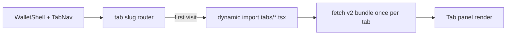
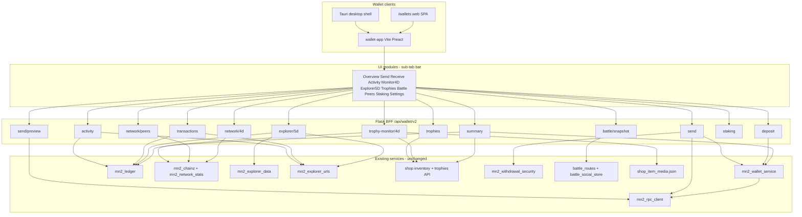
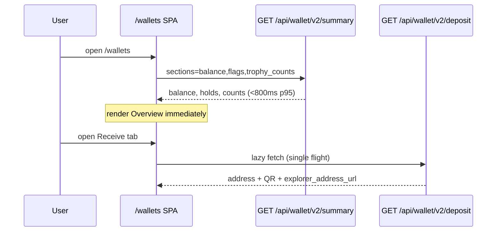
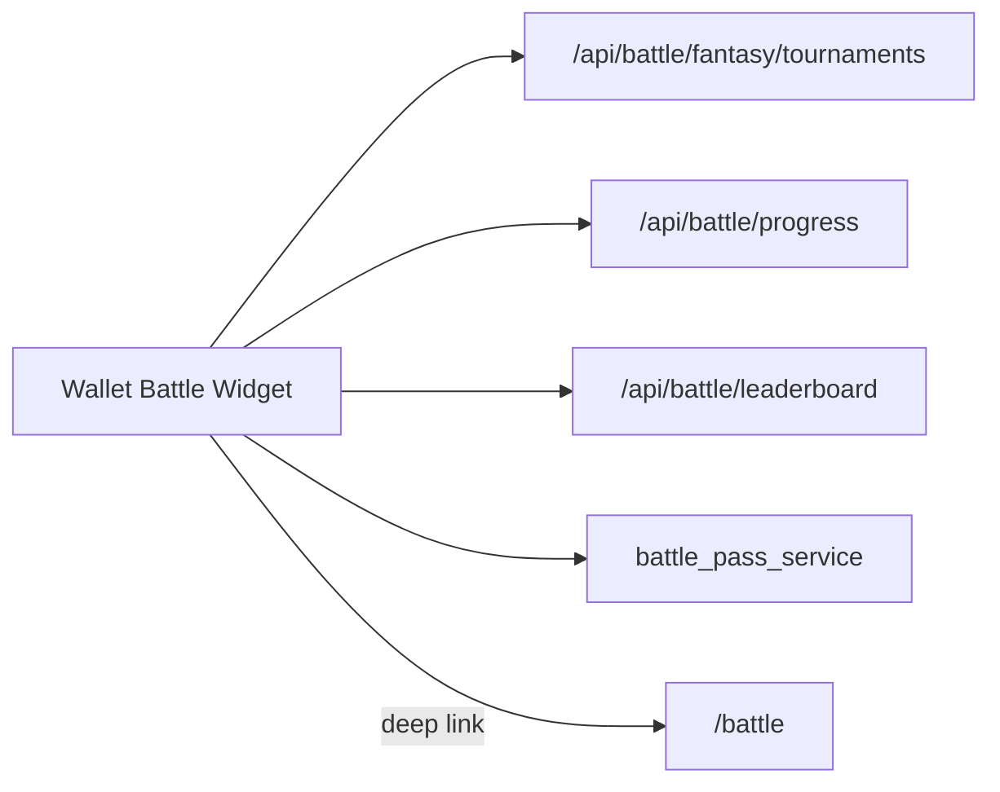

# MN2 Wallet Rebuild (From Scratch) - Plan

Companion to [`docs/plans/2026-09-16-001-feat-trophy-shop-wallet-plan.md`](2026-09-16-001-feat-trophy-shop-wallet-plan.md) (Trophy shop, trading, pricing). Plan 001 still owns trophy catalog, PayPal, auction, and peer transfer. **This plan owns the wallet product rebuild** — web SPA, desktop packaging, and fun/gamification UI layers.

---

## Goal Capsule

Replace the fragmented MN2 wallet UX (Profile card, Shop MN2 tab, stub `/wallets`, scattered global bars) with a **single greenfield wallet app** at `/wallets` **and** a **downloadable desktop wallet** (Windows, macOS, Linux): **all wallet functions in one sub-tab navigation bar**, extended send/receive, in-app explorer, peer network monitor, balances, staking snapshot, **4D Trophy Monitor** (network + owned trophies with GIF/sound/stats), **5D explorer panel**, trophy gallery (from [plan 001](2026-09-16-001-feat-trophy-shop-wallet-plan.md)), **battle contest widget**, and settings.

**Interface-first:** The user cares most about the wallet **UI** — sub-tabs, angular Sharpened Edges cards, panels, animations, sound cues, and collectible presentation. Backend stays Flask + existing MN2 services; **one TypeScript component library** (`wallet-app/`) ships in both `/wallets` (web) and the Tauri desktop shell.

**From scratch** means a new TypeScript SPA and a clean **`/api/wallet/v2/*`** boundary — **not** rewriting `mn2_rpc_client.py` or the ledger on day 1.

Stop if the work expands to: hardware wallet integration, **on-chain NFT/trophy mint**, replacing the Flask monolith with a separate Go/Rust chain microservice, or a standalone battle game rewrite inside the wallet.

Execution profile: **WR-P0 scaffold → WR-P1 MVP send/receive → WR-P2 monitors → WR-P3 trophies → WR-P4 migration → WR-P5 desktop packaging → WR-P6 gamification layer.**

---

## Stack Recommendation (ONE approach)

| Option | Verdict |
|--------|---------|
| **A. Flask API + Vite TypeScript SPA (recommended)** | **Ship this.** Keep Python services; new UI in `wallet-app/` built to `static/wallet-v2/`. |
| B. Go/Rust wallet microservice | Rejects: duplicates `mn2_rpc_client.py`, failover, deposit scanner, ledger — high risk on a single-node deploy. |
| C. WASM chain client in browser | Rejects: MN2 is server-custodial UTXO wallet; RPC secrets must stay server-side. |
| D. Incremental vanilla JS hub (plan 001 W-U2) | Superseded by this plan for primary `/wallets` UX; keep W-U1 summary patterns as v2 API input. |

### Rationale

- **Team velocity:** Repo is Flask + static HTML/JS today (`deploy.py` already ships `static/js/*`). Adding a Vite bundle under `static/wallet-v2/` matches deployment without new infra.
- **Chain client:** `backend/services/mn2_rpc_client.py`, `mn2_wallet_service.py`, `mn2_deposit_scanner.py`, `mn2_ledger.py`, and `mn2_withdrawal_security.py` are existing service paths with unit tests — wrap, do not rewrite.
- **Single-process deploy:** Same gunicorn/Flask process serves API + static assets; no second service to operate.
- **Language upgrade:** TypeScript + component SPA replaces 393-line IIFE `profile-mn2-wallet.js` and duplicated shop wallet loaders with typed modules and testable UI logic.

**Chosen stack:** **Python 3 Flask backend (unchanged) + Vite + TypeScript + Preact** (small bundle; React-compatible patterns if team prefers React — swap in WR-U0).

### Desktop wallet stack (Win / Mac / Linux) — **recommend Tauri 2**

| Option | Verdict |
|--------|---------|
| **A. Tauri 2 + shared Vite wallet-app (recommended)** | **Ship this for desktop.** Thin native shell (~5–15 MB); loads the same `wallet-app/` bundle from `static/wallet-v2/` or a bundled `dist/`. Rust side handles deep links, auto-update, OS notifications, optional system tray. |
| B. Electron + shared Vite wallet-app | Viable fallback if team already knows Electron. Larger binaries (~80–150 MB); same UI reuse. Use only if Tauri blockers appear (e.g. corporate AV policies). |
| C. PWA / TWA only (no installer) | Partial — repo already has casino TWA (`mobile/casino-twa/`) and Capacitor (`mobile/casino-app/`). Good for mobile-adjacent install; **not** a full desktop wallet with tray/offline shell branding. |
| D. Qt/C++ wallet rewrite | Rejects — daemon/Qt wallet is for **on-chain node operators** (`docs/MN2_RELEASE_BUILD.md`); custodial app-wallet stays web-tech + server BFF. |

**Rationale:**

- **UI reuse:** `wallet-app/` builds once; Tauri `WebView` loads `index.html` + assets. Desktop-only chrome (title bar, tray, `wallet://` deep links) lives in `desktop/wallet-tauri/` — **no duplicate React/Preact trees**.
- **Repo precedent:** Mobile shells wrap web (`casino-twa-shell.js`, Capacitor) — desktop follows the same pattern with Tauri instead of Bubblewrap.
- **Security:** MN2 keys/RPC stay server-side; desktop is a **logged-in session client** to `https://…/api/wallet/v2/*` (cookie or token bridge via Tauri secure store). No local private-key custody in MVP.
- **Cross-platform:** Tauri 2 ships NSIS (Win), DMG (Mac), AppImage/deb (Linux) from one CI matrix.

**Desktop config sketch:**

```
desktop/wallet-tauri/
  src-tauri/tauri.conf.json   # window 1100×800, title "MN2 Wallet"
  src-tauri/src/main.rs       # deep link wallet://tab/trophies, tray icon
wallet-app/                   # shared UI (WR-U0)
```

**Auth bridge:** Desktop opens system browser for first login OR embeds webview to the site login page; session cookie copied to Tauri cookie jar. Offline mode: read-only cached summary + trophy grid from last sync (no send).

---

## Sub-tab navigation shell

The **main wallet interface** is a single shell with a **horizontal sub-tab navigation bar** — every wallet function is a top-level tab (no hidden hamburger menus for core flows). Web `/wallets` and the Tauri desktop shell share the same `TabNav` component and lazy route map.

### Tab bar (canonical order)

| # | Tab label | Route slug | Module ID | Lazy API bundle |
|---|-----------|------------|-----------|-----------------|
| 1 | **Overview** | `overview` | `mod-overview` | `v2/summary` |
| 2 | **Portal** | `portal` | `mod-portal` | `v2/site-features` |
| 3 | **Rewards** | `rewards` | `mod-rewards` | `v2/rewards/snapshot` |
| 4 | **Casino** | `casino` | `mod-casino` | `v2/casino/snapshot` + deep-link `/casino/` |
| 5 | **Shop** | `shop` | `mod-shop` | deep-link `/shop` + trophy counts from summary |
| 6 | **Exchange** | `exchange` | `mod-exchange` | `/api/exchange/wallet` + deep-link `/exchange` |
| 7 | **Send** | `send` | `mod-send` | `v2/send`, `v2/send/preview` |
| 8 | **Receive** | `receive` | `mod-receive` | `v2/deposit`, `v2/deposit/history` |
| 9 | **Activity** | `activity` | `mod-activity` | `v2/transactions`, `v2/activity` |
| 10 | **4D Monitor** | `monitor-4d` | `mod-trophy-4d` | `v2/trophy-monitor/4d` |
| 11 | **5D Explorer** | `explorer-5d` | `mod-explorer-5d` | `v2/explorer/5d`, search proxy |
| 12 | **Trophies** | `trophies` | `mod-trophies` | `v2/trophies` + plan 001 transfer |
| 13 | **Battle** | `battle` | `mod-battle-contest` | `v2/battle/snapshot` |
| 14 | **Peers** | `peers` | `mod-peers` | `v2/network/peers` |
| 15 | **Staking** | `staking` | `mod-staking` | `v2/staking` |
| 16 | **Upgrades** | `upgrades` | `mod-upgrades` | `v2/upgrades`, `v2/upgrades/progress` |
| 17 | **Settings** | `settings` | `mod-settings` | `v2/security/*`, `v2/discord/status` |

**Settings sub-panels:** **General** (2FA, whitelist, fiat — WR-U9) · **Discord** (`?tab=settings&panel=discord`) — link/unlink, roles, notifications, server invite.

**Adjustments by capability:** Hide **Trophies** until plan 001 U1 ships or `trophy_counts > 0`. Hide **Battle** when `wallet_fun_mode: false`. **Peers** always visible for node-health transparency.

### Lazy-load contract



1. **Overview only** on first paint — `GET /api/wallet/v2/summary` (no deposit RPC).
2. Each tab `import()`s its chunk on first activation; subsequent visits reuse cached data with stale-while-revalidate (30s monitors, 5m send preview).
3. Desktop deep links: `wallet://tab/send`, `/wallets?tab=monitor-4d`, `?tab=peers`.
4. Tab bar scrolls horizontally on narrow viewports; active tab underline uses Sharpened Edges accent (see design system below).

### Shell layout

```
┌──────────────────────────────────────────────────────────────────┐
│ BalanceHero (liquid · held · fiat toggle)          [fun mode 🔊] │
├──────────────────────────────────────────────────────────────────┤
│ Overview │ **Portal** │ **Rewards** │ Shop │ Exchange │ Send │ Receive │
│ Activity │ 4D Monitor │ 5D Explorer │ Trophies │ Battle │ Peers │ …   │
├──────────────────────────────────────────────────────────────────┤
│                     [ active tab panel ]                         │
└──────────────────────────────────────────────────────────────────┘
```

**Fun layer toggles:** `data/mn2_config.json` → `wallet_fun_mode: true` enables sound, GIF hover previews, battle widget animations. Respects `prefers-reduced-motion`.

---

## Design system: Sharpened Edges

Wallet UI uses a **desktop-first, angular aesthetic** — intentionally separate from the rounded Shop design system (`modern-design-system.css`). Downloadable Win/Mac/Linux builds ship this look; shop pages keep soft radii.

### CSS tokens (`wallet-app/src/styles/sharpened-edges.css`)

| Token | Value | Use |
|-------|-------|-----|
| `--wallet-radius` | `2px` (cards) / `0` (hero, tab bar) | No pill buttons; crisp corners |
| `--wallet-border` | `1px solid var(--wallet-edge, #2a2f3a)` | High-contrast panel edges |
| `--wallet-bg-panel` | `#0d0f12` | Main panels |
| `--wallet-bg-elevated` | `#141820` | Balance cards, modals |
| `--wallet-accent` | `#00e5a0` | Active tab, success |
| `--wallet-danger` | `#ff4466` | Errors, alerts |
| `--wallet-font-mono` | `ui-monospace, 'JetBrains Mono', monospace` | Balances, addresses, fees |
| `--wallet-shadow` | none | Flat panels; border-only depth |

### Component specs

| Component | Spec |
|-----------|------|
| **BalanceHero** | Full-width top card, `border-radius: 0`, monospace `toFixed(8)` liquid balance, secondary held/withdrawable row, fiat toggle chip (2px radius). Desktop: pinned above tab bar. |
| **TabNav** | Horizontal scroll; active tab = 2px bottom accent bar + bold label; inactive = muted; icons optional (desktop hides on overflow). |
| **MonitorPanel** | Shared frame for 4D Monitor, 5D Explorer, Peers — KPI grid with SVG sparklines, alert strip, `border: 1px solid var(--wallet-border)`, zero drop shadow. |

**Do not** import shop rounded card classes into `wallet-app/`. Link-out to shop/exchange uses site chrome, not wallet tokens.

---

## Extended send and receive

Maps to existing v1 withdraw/deposit APIs via v2 BFF — **no new chain RPC paths**.

### Send tab (`mod-send`)

| Feature | UI behavior | Backend delegate |
|---------|-------------|------------------|
| Address book | Pick from whitelist + saved labels | `GET /api/mn2/withdraw/security` → `whitelist[]`; localStorage `wallet_recent_recipients` |
| Memo / note | Optional ledger note (off-chain, stored in withdraw metadata if supported) | Extend v2 send body `memo` → ledger `append_entry` metadata |
| Fee estimate | Show `withdrawal_fee` (0.001 MN2) + amount − fee = delivered | `GET /api/mn2/balance` config block + `validateaddress` |
| Multi-step confirm | Step 1 amount/address → Step 2 review (fee, 2FA) → Step 3 result + explorer tx link | `POST /api/wallet/v2/send` → `POST /api/mn2/withdraw` |
| Recent recipients | Last 5 addresses from successful sends | Client cache + optional v2 `send/recent` |
| Validation | Inline `validateaddress` debounced; block send on invalid | `mn2_rpc_client.validateaddress` via v2 preview |
| Max button | Fill withdrawable minus fee | `summary.withdrawable_mn2` − fee |
| Staking / unspent preview | Read-only chips: staked, held (PayPal), liquid | `v2/summary` + `v2/staking` on tab open |

**v2 preview endpoint (new):** `POST /api/wallet/v2/send/preview` — `{ address, amount }` → `{ valid, fee, deliverable, whitelist_ok, requires_totp }` without broadcasting.

### Receive tab (`mod-receive`)

| Feature | UI behavior | Backend delegate |
|---------|-------------|------------------|
| QR code | Large QR for deposit address | `GET /api/wallet/v2/deposit` |
| Copy address | One-click + toast | same |
| Request amount | Optional `?amount=` encoded in QR (BIP21-style URI if daemon supports) | Client-side URI builder |
| Share link | Copy page URL `/wallets?tab=receive` or `wallet://tab/receive` | N/A |
| Deposit history | Filter ledger `type=deposit` last 20 | `GET /api/wallet/v2/transactions?type=deposit` |
| Explorer link | Address opens in-app explorer search or `/explorer` | `mn2_explorer_urls.explorer_address_url` |

**Performance:** Deposit address fetch remains **Receive-tab only** (single-flight); show cached address with stale badge if RPC slow (12–20s).

---

## Codebase Inventory (wallet-related surfaces)

### Frontends (today)

| Surface | Path | Load behavior | Notes |
|---------|------|---------------|-------|
| Profile MN2 wallet | `static/js/profile-mn2-wallet.js`, `profile/index.html#profile-mn2-wallet-card` | **4 parallel calls on `load()`** | balance, deposit-address (12–20s RPC), transactions, wallet-activity (5d chart) |
| Shop MN2 wallet | `shop/index.html` `loadMn2Wallet()` | **3 calls on every shop page load** (line ~3631) | Duplicate deposit/withdraw UI |
| Wallets stub | `wallets/index.html` | Static links only | Redirects to Profile/Exchange |
| Exchange wallet | `static/js/exchange-hub.js`, `exchange/index.html` | Lazy tab loaders | Treasury/balance tiles, not full wallet |
| MN2 crypto hub | `static/js/mn2-crypto-hub.js` | Tab-lazy | Staking leaderboard, POR, masternode hosting — adjacent, not user wallet |
| Global balance bar | `static/js/mn2-global-bar.js`, `static/js/mn2-site-bridge.js` | Balance + price on many pages | Should deep-link to `/wallets` |
| Explorer overview | `static/js/mn2-explorer-overview.js`, `explorer/index.html` | Polls `/api/mn2/network-overview` | **5D-adjacent chain monitor** (sparklines, SSE stream) |
| Aggregator 5D monitor | `static/js/story-monitor-5d.js`, `aggregator/index.html` | Holodeck narrative monitor | Site-wide σ monitor, not wallet-specific |
| Profile 5d wallet chart | `profile-mn2-5d-chart` in profile | `/api/mn2/wallet-activity?days=5` | **User 5-day ledger monitor** |
| Withdraw security UI | `static/js/mn2-withdrawal-security.js` | Profile/settings hooks | 2FA, whitelist |
| Mobile TWA | `mobile/casino-twa/`, `mobile/casino-app/` | Casino only | **`mobile/wallet-twa/`**, **`mobile/wallet-app/`** — wallet v2 at `/wallets` (WR-MOBILE-1) |
| Battle page | `battle/index.html`, `static/js/battle-stats-display.js` | Tournaments, quick battle, story-monitor-5d | **Battle contest widget** source for wallet fun mode |
| Battle shop bridge | `static/js/battle-shop-integration.js` | Shop deep links from battle | Wallet quick actions → shop trophies |
| Shop media (GIF/sound) | `shop/index.html` `.shop-sound-btn`, `data/shop_item_media.json` | `gif_url`, `clip_url`, `sound_url` per SKU | Trophy card previews in 4D monitor |
| Clip generator | `scripts/generate_shop_top_clips.py` | ffmpeg → MP4 + GIF | Block trophy drops (plan 001 BM-U2) |
| 5D story audio | `static/js/story-monitor-5d.js` | Web Audio σ resonance | Optional wallet Explorer tab sound |
| Notification sounds | `static/js/notification-alarm.js` | OS notification + audio patterns | Network alert chimes in 4D monitor |
| Staking leaderboard | `staking-leaderboard/index.html`, `static/js/mn2-staking-monitor.js` | Pool stats | Staking snapshot panel |
| Agent marketplace | `static/js/agent-marketplace.js`, `exchange/index.html` | Exchange shop, agent wallets | Out of user wallet v2; link only |
| Auction house | `backend/services/shop_auction_service.py`, shop auction tab | Edition listings (plan 001 T-U1) | Trophy List CTA from wallet |
| Hunters/casino trophies | `backend/services/trophies_db_service.py`, `trophy_social_service.py` | Separate from shop trophies | Optional read-only “Hunter score” badge — not merged inventory |
| Battle pass | `backend/services/battle_pass_service.py` | Season progression | Battle contest widget cross-promo |
| Battle tournaments | `backend/services/battle_social_store.py`, `battle_routes.py` | `GET /api/battle/fantasy/tournaments` | Contest join from wallet widget |
| Daemon/Qt downloads | `docs/MN2_RELEASE_BUILD.md`, GitHub v1.2.3.0 release | Node operator binaries | Settings “Download daemon” links — not the custodial app |

### Backend (today)

| Layer | Path | Role |
|-------|------|------|
| RPC client | `backend/services/mn2_rpc_client.py`, `mn2_rpc_failover.py` | getnewaddress, validateaddress, sendtoaddress, staking_health |
| Wallet service | `backend/services/mn2_wallet_service.py` | Per-user deposit addresses, pool, balance via unified points |
| Routes | `backend/routes/mn2_routes.py` | `/api/mn2/balance`, `deposit-address`, `transactions`, `wallet-activity`, `withdraw`, security |
| Ledger | `backend/services/mn2_ledger.py` | In-app tx history, activity buckets |
| Deposit scanner | `backend/services/mn2_deposit_scanner.py` | On-chain deposit crediting |
| Staking | `backend/services/mn2_staking_service.py`, `backend/routes/mn2_staking_routes.py` | Stake/unstake, monitor |
| **4D network data** | `backend/services/mn2_chainz.py`, `mn2_network_stats.py`, `mn2_network_peers_service.py` | `network_overview`, history jsonl, alerts |
| Network APIs | `mn2_staking_routes.py` | `/api/mn2/network-overview`, `network-history`, `network-alerts`, `/api/mn2/explorer/stream` (SSE) |
| **5D explorer data** | `backend/services/mn2_explorer_data.py` | `recent_blocks`, `masternodes` via RPC |
| Explorer URLs | `backend/services/mn2_explorer_urls.py` | Centralized address/tx/block link builders |
| Agent wallets | `backend/services/agent_wallet_service.py` | **Separate** agent treasury wallets — out of user wallet v2 scope |
| Shop payment | `backend/routes/shop_routes.py` | MN2 shop debit, on-chain order payment |
| Battle APIs | `backend/routes/battle_routes.py` | stats, tournaments, arena config, season leaderboard |
| Battle social | `backend/services/battle_social_store.py` | Persistent tournaments/clans |
| Shop media manifest | `data/shop_item_media.json` | `image_url`, `gif_url`, `clip_url`, `sound_url` |
| Trophy pricing | `trophy_pricing_service.py` (plan 001 P-U1) | Effective USD for trophy cards |
| P2P / exchange | `mn2_p2p_service.py`, `crypto_exchange_service.py` | MN2 market — wallet links out |

### Tests (today)

| Test file | Covers |
|-----------|--------|
| `tests/test_mn2_crypto.py` | balance, deposit-address, withdraw, wallet-activity, address pool |
| `tests/unit/test_mn2_network_monitor.py` | daemon extras, network history snapshot keys |
| `tests/unit/test_mn2_explorer_data.py` | recent blocks, masternode list |
| `tests/unit/test_mn2_withdrawal_security.py` | whitelist, TOTP |
| `tests/unit/test_mn2_staking.py` | staking routes |
| `tests/unit/test_all_page_routes.py` | `/wallets/` first-class page |
| `tests/unit/test_shop_payment_safety.py` | wallet address map in payment flows |

### Performance bottleneck (measured in plan 001)

| Call | Typical cost | First paint? |
|------|--------------|--------------|
| `GET /api/mn2/balance` | fast | yes |
| `GET /api/mn2/deposit-address` | **12–20s** (RPC getnewaddress/validateaddress) | **must NOT block overview** |
| `GET /api/mn2/transactions` | medium | lazy |
| `GET /api/mn2/wallet-activity` | fast | lazy (Activity tab) |
| `GET /api/mn2/network-overview` | medium (cached 30s) | lazy (4D tab) |

---

## Feature Matrix — full wallet product vision

Legend: **Exists** = repo has working backend/UI today · **Wrap** = expose via v2 BFF · **New UI** = wallet-app component only · **Net-new** = new service work

| Feature | Repo today | P1 MVP | P2 Monitors | P3 Trophies | P4 Settings | P5 Desktop | P6 Fun |
|---------|------------|--------|-------------|-------------|-------------|------------|--------|
| Balance (liquid + held + fiat toggle) | **Exists** `mn2_routes` | ✓ | | | ✓ | ✓ | |
| Send / withdraw MN2 | **Exists** | ✓ | | | | ✓ | |
| **Extended send** (address book, memo, fee preview, max, multi-step confirm) | **Wrap** v1 withdraw | ✓ | | | | ✓ | |
| Receive / deposit address + QR | **Exists** (slow RPC) | ✓ | | | | ✓ | |
| **Extended receive** (request amount, share link, deposit history) | **Wrap** ledger | ✓ | | | | ✓ | |
| **In-app explorer tab** + deep links to `/explorer` | **Exists** `mn2_explorer_*` | | ✓ | | | ✓ | |
| **Peer network monitor** (peer list, mempool, latency) | **Wrap** `mn2_network_peers_service` | | ✓ | | | ✓ | |
| **Sharpened Edges** design system | **New UI** | ✓ | | | | ✓ | |
| **Sub-tab navigation shell** (all functions in tab bar) | **New UI** | ✓ | | | | ✓ | |
| Tx history + explorer links | **Exists** + `mn2_explorer_urls` | ✓ | | | | ✓ | |
| Trusted addresses / whitelist | **Exists** `mn2_withdrawal_security` | | | | ✓ | ✓ | |
| Withdraw 2FA (TOTP) | **Exists** | | | | ✓ | ✓ | |
| Staking snapshot + leaderboard link | **Exists** `mn2_staking_service` | | ✓ | | | ✓ | |
| **4D network monitor** (height, mempool, sparklines, alerts) | **Exists** `mn2_chainz`, SSE stream | | ✓ | | | ✓ | ✓ sound |
| **5D wallet activity chart** (5-day bars) | **Exists** `wallet-activity` | ✓ | ✓ | | | ✓ | |
| **5D explorer panel** (blocks + story strip) | **Exists** `mn2_explorer_data`, `story-monitor-5d.js` | | ✓ | | | ✓ | ✓ sound |
| Trophy gallery + edition badges | **Wrap** plan 001 U1 | | | ✓ | | ✓ | ✓ GIF |
| Trophy list / peer transfer | **Net-new** plan 001 T-U* | | | ✓ | | ✓ | |
| Auction house list edition | **Exists** `shop_auction_service` | | | ✓ | | ✓ | |
| Block trophy drops + GIF preview | **Net-new** plan 001 BM-U* | | | ✓ | | ✓ | ✓ GIF |
| Shop trophy GIF/sound on cards | **Exists** `shop_item_media.json` | | | ✓ | | ✓ | ✓ |
| **4D Trophy Monitor** (network + trophy cards + stats + sound) | **New UI** + **Wrap** | | | ✓ | | ✓ | ✓ |
| **Battle contest widget** (tournaments, leaderboard snippet) | **Exists** battle APIs | | | | | ✓ | ✓ |
| Battle pass season progress | **Exists** `battle_pass_service` | | | | | ✓ | ✓ |
| Quick battle / arena link-out | **Exists** `/battle` | | | | | ✓ | ✓ |
| Hunter trophy score badge (read-only) | **Exists** `trophy_social_service` | | | | | ✓ | optional |
| Exchange / agent marketplace links | **Exists** | ✓ | | | | ✓ | |
| PayPal on-ramp hold status | **Exists** on-ramp | | | | ✓ | ✓ | |
| Masternode hosting status | **Exists** `mn2_masternode_hosting_service` | | ✓ | | | ✓ | |
| Daemon/Qt download links | **Exists** release docs | | | | ✓ | ✓ | |
| **Discord link + roles** (Settings panel) | **Wrap** `discord_link_service`, linked roles OAuth | | | | ✓ | ✓ | |
| **Discord wallet notifications** (opt-in toggles) | **New UI** + future DM fanout | | | | ✓ | ✓ | optional |
| **Share trophy/edition to Discord** (embed/webhook) | **Wrap** `discord_service.post_message` | | | ✓ | | ✓ | ✓ |
| **Discord login shortcut** (web wallet) | **Wrap** `social_auth` + linked-role OAuth | ✓ | | | ✓ | ✓ | |
| Desktop installer Win/Mac/Linux | **Net-new** Tauri | | | | | ✓ | |
| System tray + deep links | **Net-new** Tauri | | | | | ✓ | |
| Offline read-only cache | **Net-new** desktop | | | | | ✓ | |
| On-chain NFT mint | **Out of scope** | — | — | — | — | — | — |
| Hardware wallet | **Out of scope** | — | — | — | — | — | — |

### Top 10 “fun + serious” features (mapped to existing code)

| # | Feature | Serious / Fun | Existing anchor |
|---|---------|---------------|-----------------|
| 1 | Fast balance + send/receive | Serious | `mn2_wallet_service`, `profile-mn2-wallet.js` |
| 2 | Sub-tab shell + Sharpened Edges balance cards | Serious | `wallet-app/` design tokens |
| 3 | 4D network monitor + alert sounds | Both | `mn2_chainz.py`, `mn2-explorer-overview.js`, `notification-alarm.js` |
| 4 | 4D Trophy Monitor (GIF cards + edition stats) | Fun | `shop_item_media.json`, plan 001 trophies API |
| 5 | Extended send/receive + explorer tab + peers monitor | Serious | `mn2_routes` withdraw/deposit, `mn2_explorer_urls` |
| 6 | 5D wallet activity + explorer story strip | Both | `wallet-activity`, `story-monitor-5d.js` |
| 7 | Trophy gallery + auction list/transfer | Both | plan 001 T-U*, `shop_auction_service.py` |
| 8 | Battle contest widget + tournament join | Fun | `battle_routes.py`, `battle_social_store.py` |
| 9 | Staking snapshot + leaderboard deep link | Serious | `mn2_staking_service`, `mn2-staking-monitor.js` |
| 10 | Desktop wallet (Tauri 2) with tray + deep links | Serious | `desktop/wallet-tauri/`, `mobile/casino-twa/` pattern |

---

## Top 25 Wallet Feature Ideas

Creative, network-first features beyond standard send/receive — grounded in repo surfaces (battle, trophies, 4D/5D monitors, staking, masternodes, shop, exchange, agents).

### Network-first Overview (main face spec)

The **Overview** tab is the wallet’s main face: network KPIs render on first paint alongside a balance skeleton.

| KPI / element | Source | First paint? |
|---------------|--------|--------------|
| Block height | `mn2_chainz.network_overview` (cached) | ✓ |
| Peer connections | `network_overview.connections` | ✓ |
| Mempool tx count | `network_overview.mempool_tx` | ✓ |
| MN2/USD price | `chainz_ticker_usd` / overview | ✓ |
| Staking pool APY snippet | `mn2_staking_service.dynamic_apr()` | ✓ |
| Trophy count badge | `shop_db_service.get_inventory` (top25-* count) | ✓ |
| Liquid / held balance | `get_balance` + `mn2_hold_registry` | ✓ (skeleton → data) |
| Deposit address | `get_or_create_deposit_address` | **Never on Overview** |

**Aggressive perf budget:**

| Metric | Target |
|--------|--------|
| First Contentful Paint (FCP) | **< 800 ms** (warm static + summary) |
| `GET /api/wallet/v2/summary` p95 | **< 400 ms** (mocked/staging); no deposit RPC |
| Zero blocking RPC on Overview | Deposit address **Receive-tab only** |
| Tab lazy-load | Each non-Overview tab `import()` on first visit |

### Top 25 feature ideas

| # | Feature | Category | Repo anchor |
|---|---------|----------|-------------|
| 1 | **Network face Overview** — live height, peers, mempool, price, APY on first paint | Network | `wallet_v2_service`, `NetworkFace.tsx` |
| 2 | **Sub-tab shell** — all 11 wallet functions in one horizontal bar | UX | `TabNav.tsx`, plan WR-U0 |
| 3 | **Sharpened Edges design** — angular 2px panels, mono balances | UX | `wallet-sharpened.css` |
| 4 | **Fast summary API** — balance + network + trophy badge, no deposit RPC | Perf | `/api/wallet/v2/summary` |
| 5 | **4D Trophy Monitor holodeck** — network strip + owned trophy GIF cards | Fun | `v2/trophy-monitor/4d`, `shop_item_media.json` |
| 6 | **5D Explorer tab** — recent blocks, search, `/explorer` deep links | Network | `mn2_explorer_data`, `story-monitor-5d.js` |
| 7 | **Peers topology tab** — sortable peer table, latency sparklines | Network | `mn2_network_peers_service` |
| 8 | **Extended send wizard** — address book, fee preview, 2FA confirm | Serious | `mn2_withdrawal_security`, `v2/send/preview` |
| 9 | **Extended receive** — QR, request amount, deposit history | Serious | `v2/deposit`, ledger filter |
| 10 | **5D wallet activity chart** — personal in/out/net bars | Serious | `wallet-activity` API |
| 11 | **Staking snapshot panel** — staked balance, APR, leaderboard link | Serious | `mn2_staking_service` |
| 12 | **Battle contest widget** — open tournaments, join CTA, top-5 LB | Fun | `battle_routes`, `battle_social_store` |
| 13 | **Trophy gallery + edition badges** — Top 25 progress, list/transfer | Fun | plan 001 T-U*, shop inventory |
| 14 | **Auction house quick-list** — list edition from wallet Trophies tab | Commerce | `shop_auction_service` |
| 15 | **Block trophy drop teaser** — latest mint height + GIF preview | Fun | plan 001 BM-U1 |
| 16 | **Masternode hosting status chip** — hosted MN count, payout link | Network | `mn2_masternode_hosting_service` |
| 17 | **PayPal hold transparency** — on-ramp held MN2 with unlock ETA | Serious | `mn2_hold_registry`, on-ramp |
| 18 | **Exchange / agent marketplace links** — treasury tiles deep-link | Commerce | `crypto_exchange_service`, agents |
| 19 | **Network alert sounds** (fun mode) — stall/sync warnings | Fun | `notification-alarm.js`, SSE stream |
| 20 | **SSE live network dot** — optional EventSource on 4D strip | Network | `/api/mn2/explorer/stream` |
| 21 | **Desktop Tauri shell** — Win/Mac/Linux, tray, `wallet://` deep links | Platform | `desktop/wallet-tauri/` |
| 22 | **Offline read-only cache** — last summary + trophy grid (desktop) | Platform | Tauri secure store |
| 23 | **Hunter trophy score badge** (read-only) — social rank chip | Fun | `trophy_social_service` |
| 24 | **Shop sound/GIF on trophy hover** — media manifest previews | Fun | `data/shop_item_media.json` |
| 25 | **Global balance bar → /wallets** — site-wide deep link to new wallet | UX | `mn2-global-bar.js` migration |
| 26 | **Discord Settings panel** — link/unlink, roles, invite, notification opt-in | Social | `v2/discord/status`, `discord_link_service`, `discord_linked_roles_service` |

**Implementation status (2026-09-16):** WR-U0 scaffold shipped (`wallet-app/`, `wallets/index.html`, Sharpened Edges). WR-U1 summary API shipped (`wallet_v2_routes`, `wallet_v2_service`, unit test). WR-U2 Overview + network face partially complete (Overview tab + `NetworkFace`; remaining tabs placeholder). **WR-DISCORD-1** shipped: Settings → Discord panel, `GET /api/wallet/v2/discord/status`, unit test. **WR-U-MAP / WR-U-STATS / WR-U-UPG250** scaffold shipped: Overview trophy carousel slot, masternode online grid, rich network stats list, 250-upgrade catalog + lazy API + Upgrades tab. **WR-EARN-1…5** scaffold shipped: micro-earn click events, daily caps, Earn tab + v2 earn API. **WR-CASINO-1** shipped: Casino hub tab, `GET /api/wallet/v2/casino/snapshot`, Overview hero CTA, Site Features Hub primary emphasis, unit test. **WR-MOBILE-1** scaffold shipped: `mobile/wallet-twa/`, `mobile/wallet-app/`, PWA manifest, download docs, CI workflow stub, Settings download links.

---

## Micro-earn & click-through events

Small engagement bonuses (0.001–0.01 MN2 per action) — **not investment returns**. Users spend time clicking lightweight events in the wallet; deeper earn surfaces deep-link to existing site games.

### Network micro-tx (wallet-native clicks)

| Unit | Event ID | Trigger | Base MN2 | Daily cap | Cooldown |
|------|----------|---------|----------|-----------|----------|
| **WR-EARN-1** | `network_pulse_click` | Tap Network Pulse button on Earn tab | 0.002 | 0.01 | 30s |
| **WR-EARN-2** | `wallet_daily_open` | First wallet open per UTC day | 0.005 | 0.005 | 24h |
| **WR-EARN-3** | `game_tap` | Quick tap before game deep-links | 0.001 | 0.008 | 15s |
| **WR-EARN-4** | `peer_heartbeat_view` | Acknowledge peer health (Peers tab tie-in) | 0.0015 | 0.006 | 60s |
| **WR-EARN-5** | `block_watch` | Block height tick — complements block trophy drops | 0.003 | 0.009 | 45s |

**Global daily cap:** 0.05 MN2 per user (configurable in `data/wallet_micro_earn_config.json`).

**Diminishing returns:** each repeat click within a day multiplies base amount by `diminishing_factor` (default 0.85), floored at `min_amount_mn2` (0.0001).

### Click-to-earn UX (Earn tab)

- **Network Pulse** — primary CTA with live cooldown display
- **Today's earnings** — earned / remaining / cap KPI row
- **Per-event rows** — next amount, clicks used, cooldown timer
- **Overview chip** — hero CTA “Earn · Micro MN2 clicks” links to Earn tab

### Embed existing games / click-through (deep links)

Configured in `wallet_micro_earn_config.json` → `game_links[]` (iframe/deep-link only — no combat embed in wallet MVP):

| Surface | Path | Notes |
|---------|------|-------|
| Battle | `/battle` | Tournaments, quick battle |
| Casino | `/casino/` | Mini-games, social casino |
| Generator | `/generator` | Tiered content generation |
| Hunters Game | `/game` | Main game MN2 progression |
| PTC | `/shop?category=marketing` | Paid-to-click quests |
| Quests | `/quests` | Quest MN2 rewards |

### Abuse controls

| Control | Implementation |
|---------|----------------|
| Per-event cooldown | `cooldown_seconds` in config; `cooldown_remaining_sec` in status API |
| Per-event daily cap | `daily_cap_mn2` + `max_clicks_per_day` |
| Global daily cap | `global_daily_cap_mn2` (0.05 default) |
| Diminishing returns | `diminishing_factor` per repeat click |
| Auth gate | `mn2_earn_auth.require_earn_user` — guests blocked |
| Idempotent credits | `game_mn2_rewards.credit_mn2` + ledger reference per click |
| Captcha hook | `captcha_hook_enabled` + `captcha_hook_url` (off by default; wire when abuse spikes) |

**Engagement disclaimer** shown on Earn tab: micro amounts are platform engagement, not pay-to-win or investment.

### API

| Method | Path | Purpose |
|--------|------|---------|
| GET | `/api/wallet/v2/earn/status` | Today earned, caps, per-event availability + game links |
| POST | `/api/wallet/v2/earn/click` | Body `{ event_id }` → credit micro MN2 via ledger |

**Service:** `backend/services/wallet_micro_earn_service.py`  
**Config:** `data/wallet_micro_earn_config.json`  
**State:** `data/wallet_micro_earn_state.json` (per-user daily click tallies)  
**Tests:** `tests/unit/test_wallet_micro_earn.py` **WR-PORTAL / WR-REWARDS / WR-SHOP / WR-EXCH** shipped: Portal + Rewards tier-1 tabs and Overview hero CTAs; Shop + Exchange hub tabs; `SiteFeaturesHub` matrix via `GET /api/wallet/v2/site-features`; rewards snapshot via `GET /api/wallet/v2/rewards/snapshot`.

---

## Site Features Hub (WR-PORTAL)

The wallet exposes **all major site sections** as a lazy-loaded feature matrix. **Portal** (Command Center) and **Rewards** (unified points) are **tier-1** — bold tab labels, accent-bordered Overview hero CTAs, and top row in the hub grid.

### Site feature map (canonical paths)

| Feature | Path | Category |
|---------|------|----------|
| **Command Center (Portal)** | `/command-center` | portal |
| **Rewards & Points** | `/profile?tab=points` | rewards |
| Shop | `/shop` | commerce |
| Exchange | `/exchange` | commerce |
| Wallets | `/wallets` | wallet |
| Generator | `/generator` | create |
| Game | `/game` | play |
| Battle | `/battle` | play |
| Trophies | `/trophies` | collect |
| Quests | `/quests` | rewards |
| Explorer | `/explorer` | network |
| Staking Monitor | `/staking-monitor` | network |
| Staking Leaderboard | `/staking-leaderboard` | network |
| Masternode Hosting | `/hosting` | network |
| Proof of Reserves | `/proof-of-reserves` | network |
| P2P Market | `/market` | commerce |
| Casino | `/casino/` | play |
| Battlegrounds | `/battlegrounds` | play |
| Star Map 25 | `/starmap25` | play |
| Aggregator | `/aggregator` | agents |
| AI Agents | `/agents` | agents |
| Agents Control | `/dashboard/agents_control` | agents |
| Podcast | `/podcast` | social |
| Social | `/social` | social |
| Profile | `/profile` | account |
| Compendium | `/compendium/?calm=1` | library |
| Lab | `/lab` | create |
| Gallery | `/gallery` | create |
| News | `/news` | social |
| Profit Daemon | `/profit/` | commerce |
| Business Control | `/business-control` | admin |
| Debugger | `/debugger` | tools |
| Agent Support | `/agent_support` | tools |
| Customers | `/customers` | admin |

**API:** `GET /api/wallet/v2/site-features` — returns `features[]` with `primary: true` on portal + rewards.

**UI:** `SiteFeaturesHub.tsx` on Portal tab; Shop/Exchange tabs deep-link to full site pages with wallet-native category cards.

---

## Trophy + Masternode Map layout (Overview expansion)

The **Overview** tab is expanded into three vertical zones below the compact `NetworkFace` KPI strip:

```
┌──────────────────────────────────────────────────────────────────┐
│ NetworkFace — 6 compact KPIs (height, peers, mempool, price…)    │
├──────────────────────────────┬─────────────────────────────────────┤
│ TROPHY CAROUSEL SLOT       │ MASTERNODE ONLINE MAP (grid)        │
│ horizontal edition cards   │ enabled/total + rank grid cells     │
│ placeholder → WR-G1 GIFs   │ lazy GET /v2/network/masternodes    │
├──────────────────────────────┴─────────────────────────────────────┤
│ RICH NETWORK STATS LIST — exhaustive KPI rows from summary.network │
├──────────────────────────────────────────────────────────────────┤
│ CTA → Upgrades tab (250 catalog lazy-loaded)                     │
└──────────────────────────────────────────────────────────────────┘
```

| Zone | Component | Data source | First paint? |
|------|-----------|-------------|--------------|
| Trophy carousel | `TrophySlot.tsx` | `summary.trophy_counts` | ✓ (counts only; GIFs lazy in 4D tab) |
| Masternode map | `MasternodeMap.tsx` | `GET /api/wallet/v2/network/masternodes` | Lazy after Overview mount |
| Rich stats | `NetworkStatsRichList.tsx` | `summary.network` (expanded snapshot) | ✓ |

**Perf contract:** Summary still **never** calls deposit RPC or full masternode list. Masternode grid and upgrades catalog load **after** summary paint.

---

## Rich Network Stats List (KPI spec)

`wallet_v2_service._network_snapshot()` exposes every stat the backend can surface without blocking RPC beyond cached `mn2_chainz.network_overview()`:

| KPI key | Label | Source |
|---------|-------|--------|
| `block_height` | Block height | `mn2_chainz.network_overview` |
| `headers` | Headers | `daemon.headers` |
| `connections` | Peer connections | `daemon.connections` / `getconnectioncount` |
| `mempool_tx` | Mempool transactions | `daemon.mempool_tx` |
| `mempool_bytes` | Mempool bytes | `daemon.mempool_bytes` |
| `mn2_usd_price` | MN2 / USD | Chainz median / overview |
| `pool_apr_percent` | Staking pool APR | `mn2_staking_service.dynamic_apr()` |
| `pool_total_staked` | Pool total staked | `mn2_staking_service.total_staked()` |
| `masternode_count` | Masternode count | RPC `getmasternodecount` / Chainz |
| `masternode_enabled` | Masternodes enabled | `mn2_explorer_data.masternodes` (cached head) |
| `difficulty` | Difficulty | RPC `getmininginfo` / Chainz |
| `network_hashps` | Network hash rate | RPC `getmininginfo` |
| `staking_weight` | Staking weight | RPC `getstakinginfo` |
| `expected_stake_time_sec` | Expected stake time | RPC `getstakinginfo` |
| `circulating_supply` | Circulating supply | iquidus / `money_supply` |
| `chain` | Chain name | `getblockchaininfo` |
| `daemon_version` | Daemon version | `getnetworkinfo` |
| `daemon_subversion` | Daemon subversion | `getnetworkinfo` |
| `verification_progress` | Verification progress | `getblockchaininfo` |
| `median_time` | Median block time | `getblockchaininfo` |
| `sync_ok` | Daemon reachable | `daemon.reachable` |
| `rpc_degraded` | RPC failover active | `mn2_rpc_failover.status_summary` |
| `peer_health` | Peer health summary | `mn2_network_peers_service.peer_health_from_overview` |
| `staking_health` | Staking health | `mn2_rpc_client.staking_health()` |
| `source` | Per-field data provenance | overview `source` map |

`NetworkStatsRichList.tsx` renders all rows; null values show `—`.

---

## 250 Wallet Upgrades catalog

**Data file:** `data/wallet_upgrades_catalog.json` — **WR-UPG-001…250** with schema:

```json
{
  "id": "WR-UPG-001",
  "name": "Deposit address cache",
  "effect": "Enables deposit address cache — Cuts wait time vs legacy profile wallet load.",
  "category": "speed",
  "tier": "common",
  "unlock": { "type": "default", "value": 0, "label": "Available at wallet launch" }
}
```

**Categories (30 each except fun/desktop/discord/security = 25):**

| Category | Count | Grounded pain point |
|----------|-------|---------------------|
| `speed` | 30 | Profile wallet blocked 12–20s on deposit RPC at load |
| `network_visibility` | 30 | Old card had balance only — no chain context |
| `trophies` | 30 | Trophies buried in shop/profile tabs |
| `send_receive` | 30 | No fee preview, address book, or receive lazy-load |
| `monitors` | 30 | 4D/5D/peers only on separate site pages |
| `fun` | 25 | No sound/GIF/battle hooks in wallet |
| `desktop` | 25 | No Tauri tray/deep-link parity |
| `discord` | 25 | Discord only on Profile card |
| `security` | 25 | 2FA/whitelist scattered in profile JS |

**Unlock types:** `default` (first 10), `level` (wallet level 2–50), `achievement` (`wallet_<category>_<nnn>`), `mn2_spent` (escalating MN2 spent threshold).

**API (lazy — not on summary):**

| Method | Path | Purpose |
|--------|------|---------|
| GET | `/api/wallet/v2/upgrades` | Full catalog; `?category=speed` filter |
| GET | `/api/wallet/v2/upgrades/progress` | Per-user unlocked/locked IDs |
| GET | `/api/wallet/v2/network/masternodes` | Masternode grid for map strip |

**Generator:** `scripts/generate_wallet_upgrades_catalog.py` regenerates JSON.

---

## Discord integration (Settings → Discord)

Wallet surfaces existing repo Discord features — **no new OAuth stack**. Maps to services already used by Profile and Casino.

### Existing backend (do not reinvent)

| Capability | Repo anchor |
|------------|-------------|
| Manual link / unlink | `POST /api/discord/link`, `POST /api/discord/link/unlink`, `GET /api/discord/link/status` → `discord_link_service.py` |
| Linked Roles OAuth | `GET /api/discord/linked-role` → `discord_linked_roles_service.py` (`role_connections.write`) |
| Sign in with Discord | `social_auth_service.py` (OAuth `identify email`); auto-calls `link_user` on callback |
| Casino VIP eligibility | `link_status` → `casino_vip_eligible` + `CASINO_DISCORD_VIP_MIN_MN2` |
| Hosting VIP | `discord_hosting_vip_service.py` |
| Outbound webhooks / embeds | `discord_service.post_message`, `casino_discord_fanout`, `market_discord_fanout`, `game_discord_fanout` |
| Shop promo codes | `shop_discord_promo_service.py` (`DISCORD-STARTER`, etc.) |
| Server invite | `data/casino_config.json` → `discord_integration.invite_url` or `DISCORD_INVITE_URL` env |
| Profile UI (reference) | `profile/index.html` `#discord-link-card`, `#social-login-discord` |

### Wallet UI (`?tab=settings&panel=discord`)

| Feature | Behavior | Backend |
|---------|----------|---------|
| Link / unlink | **Connect Discord** → linked-role OAuth when configured; else `/api/auth/discord/start` or deep link to Profile card | `v2/discord/status` + existing link routes |
| Linked state | Show `discord_id`, username, avatar from profile `social_auth` prefs | `build_discord_status` |
| Server roles | Chips for `casino_vip`, `hosting_vip`, `account_linked` from link + metadata | `link_status`, `build_metadata_for_user` |
| Notifications (opt-in) | Toggles: balance alerts, trophy drops, block trophy mint, battle results | **WR-DISCORD-1:** localStorage; **WR-DISCORD-2:** per-user prefs + bot DM fanout |
| Share trophy/edition | “Share to Discord” on trophy card → rich embed via ops webhook | `discord_service.post_message` (user-initiated, WR-DISCORD-3) |
| Discord login shortcut | Settings CTA + Overview guest banner → OAuth or Profile | `social_auth` / linked-role |
| Join server | Link when `server_invite_url` present | `casino_config` / env |

### v2 API

| Method | Path | Purpose |
|--------|------|---------|
| GET | `/api/wallet/v2/discord/status` | Link state, roles, OAuth URLs, invite, notification defaults |

Link/unlink POSTs remain on `/api/discord/link*` (same as Profile) to avoid duplicating `discord_link_service`.

### Assumptions (WR-DISCORD-1)

1. **OAuth priority:** Linked-role flow (`/api/discord/linked-role`) preferred when `DISCORD_CLIENT_ID` + secret set; falls back to Profile manual ID paste.
2. **Discord social login** via `/api/auth/discord/start` is configured in `social_auth_service` but may be disabled in `social_auth_routes` (`_ALLOWED_PROVIDERS` = github/google only) — wallet deep-links to Profile when route disabled.
3. **Per-user DM notifications** are not implemented server-side yet; toggles persist in `localStorage` until WR-DISCORD-2 adds profile prefs + bot DM scope.
4. **Share to Discord** requires user-facing webhook or bot channel post — deferred to WR-DISCORD-3; `share_supported` flag reflects `DISCORD_WEBHOOK_URL` ops config.

---

## Architecture



### First-paint sequence (target ≤1.5s)



---

## API Design — `/api/wallet/v2/*`

New blueprint: `backend/routes/wallet_v2_routes.py`  
Service facade: `backend/services/wallet_v2_service.py` (thin wrappers — no duplicate ledger logic)

All routes require same-origin session / `user_id` resolution as existing MN2 routes. Guest `default_user` gets read-only or blocked send (match current withdraw rules).

| Method | Path | Purpose | Backend delegate |
|--------|------|---------|------------------|
| GET | `/api/wallet/v2/summary` | Fast overview | `get_balance`, trophy count scan, `mn2_explorer_urls.explorer_base_url`, feature flags |
| GET | `/api/wallet/v2/deposit` | Deposit address + QR payload | `get_or_create_deposit_address` + `explorer_address_url()` |
| POST | `/api/wallet/v2/deposit/refresh` | Force new address | existing wallet refresh path |
| GET | `/api/wallet/v2/transactions` | Paginated ledger | `get_entries_by_user` + explorer URLs |
| GET | `/api/wallet/v2/activity?days=5` | 5d buckets | `get_wallet_activity_days` |
| POST | `/api/wallet/v2/send/preview` | Validate address, fee, whitelist/TOTP gates (no broadcast) | `validateaddress` + `mn2_withdrawal_security` + balance withdrawable |
| POST | `/api/wallet/v2/send` | Withdraw MN2 | `/api/mn2/withdraw` logic + security |
| GET | `/api/wallet/v2/network/4d` | Network monitor bundle (embedded in 4D Monitor strip) | `mn2_chainz.network_overview` + `mn2_network_stats.get_history(hours=24)` + `get_alerts(limit=5)` |
| GET | `/api/wallet/v2/network/peers` | **Peers tab bundle** | `GET /api/mn2/network-peers` + `network_overview` (connections, mempool) + `network-history` latency series |
| GET | `/api/wallet/v2/explorer/5d` | Explorer + wallet overlay | `mn2_explorer_data.recent_blocks(10)` + user recent txs + activity buckets |
| GET | `/api/wallet/v2/explorer/search?q=` | Block / tx / address lookup | `mn2_explorer_urls` + `validateaddress` / RPC `getblock` |
| GET | `/api/wallet/v2/staking` | Staking snapshot | `mn2_staking_service` summary fields |
| GET | `/api/wallet/v2/trophies` | Owned trophies | proxy `GET /api/shop/trophies?user_id=` + inventory editions |
| GET | `/api/wallet/v2/trophy-monitor/4d` | **4D Trophy Monitor bundle** | `network/4d` + owned trophies + `shop_item_media` URLs + block-mint latest drop |
| GET | `/api/wallet/v2/battle/snapshot` | Battle contest widget data | `battle_social_store` tournaments + user progress + season leaderboard top 5 |
| GET/POST | `/api/wallet/v2/security/*` | 2FA, whitelist | delegate `mn2_withdrawal_security` routes |
| GET | `/api/wallet/v2/discord/status` | Discord link state + OAuth URLs + invite | `discord_link_service.link_status`, `discord_linked_roles_service`, `casino_config` |
| GET | `/api/wallet/v2/site-features` | Site feature matrix for Site Features Hub | `wallet_v2_service.build_site_features` |
| GET | `/api/wallet/v2/rewards/snapshot` | Unified points snapshot for Rewards tab | `unified_points_database.get_all_points` |
| GET | `/api/wallet/v2/casino/snapshot` | Casino hub: balance, VIP, featured games, Discord VIP | `casino_service.get_balance`, `get_vip_lounge`, `discord_link_service.link_status` |
| GET | `/api/wallet/v2/casino/snapshot` | Casino hub: balance, VIP, featured games, Discord VIP | `casino_service.get_balance`, `get_vip_lounge`, `discord_link_service.link_status` |

**`trophy-monitor/4d` response shape (sketch):**

```json
{
  "network": { "height": 0, "connections": 0, "mempool_tx": 0, "alerts": [], "history": [] },
  "trophies": [
    {
      "item_id": "top25-01",
      "edition_no": 3,
      "name": "...",
      "gif_url": "/static/shop/clips/....gif",
      "sound_url": "/static/shop/sounds/....wav",
      "stats": { "effective_price_usd": 0, "acquired_via": "paypal" }
    }
  ],
  "block_drop_teaser": { "height": 0, "gif_url": null, "explorer_block_url": "..." },
  "fun_mode": true
}
```

**Query params for summary:** `?sections=balance,trophy_counts,flags,recent_activity_preview` (default: `balance,trophy_counts,flags`). **Never calls deposit RPC.**

**Deprecation:** v1 `/api/mn2/*` remains for shop/profile during migration; v2 is canonical for `/wallets` SPA.

---

## Explorer access (5D Explorer tab)

**Definition:** In-app **explorer tab** inside the wallet sub-tab bar — search, recent blocks, and deep links to the full site explorer. Complements Activity (personal ledger) with chain-level views.

### In-app explorer (`mod-explorer-5d`)

| Surface | Behavior |
|---------|----------|
| **Embedded recent blocks** | Last 10 blocks from `mn2_explorer_data.recent_blocks` with height, time, tx count |
| **Search** | Input for block height, txid, or address → resolves via v2 search proxy → navigates to result panel or opens `/explorer` |
| **Deep links** | All fields use `mn2_explorer_urls`: `explorer_block_url`, `explorer_tx_url`, `explorer_address_url` |
| **Full explorer CTA** | “Open full explorer → `/explorer`” opens site explorer in same tab or new window (desktop: system browser option in Settings) |
| **User tx overlay** | Highlight rows matching wallet ledger txids (from `v2/transactions`) |
| **Story strip (optional)** | Lazy `story-monitor-5d.js` with `data-story-context="wallet"` when `wallet_fun_mode: true` |

**v2 search proxy (new):** `GET /api/wallet/v2/explorer/search?q=` — detects query type (height / txid / address), returns `{ type, url, summary }` using `mn2_explorer_urls` + `validateaddress` / `getblock` as needed.

**Routing:** `/wallets?tab=explorer-5d&block=12345` or `wallet://explorer/block/12345` deep-link to block detail sub-view.

---

## Peer network monitor (Peers tab)

**Definition:** Dedicated **Peers** sub-tab — P2P health for operators and curious users. Distinct from **4D Monitor** (trophy holodeck + network strip); Peers focuses on connection topology and latency.

**Data sources (existing + wrap):**

| Field | Source |
|-------|--------|
| Peer list (host, port, services) | `GET /api/mn2/network-peers` or `data/mn2_network_peers.json` via `mn2_network_peers_service` |
| Connection count | `mn2_chainz.network_overview` → `connections` |
| Mempool size | `network_overview` → `mempool_tx` / `mempool_bytes` |
| Latency / health sparklines | `GET /api/mn2/network-history?hours=24` — `connections`, optional ping series |
| Peer health summary | `peer_health_from_overview` (used in `mn2_staking_routes.py`) |
| Live updates | Optional `EventSource /api/mn2/explorer/stream` |

**UI (Peers tab — `MonitorPanel` frame):**

- Header KPIs: **connections** / target peers, **mempool tx**, sync status
- Sortable peer table: address, version, ping/latency, inbound/outbound badge
- SVG sparklines for connections + mempool (port from `mn2-explorer-overview.js`)
- Copy `addnode=` lines for daemon bootstrap (links `docs/MN2_OPS.md`)
- Auto-refresh 30s; pause when tab hidden

**v2 bundle:** `GET /api/wallet/v2/network/peers` aggregates peers list + overview + 24h history in one lazy fetch.

---

## Activity vs Explorer (personal vs chain)

| Layer | Tab | Content |
|-------|-----|---------|
| **Personal 5D monitor** | **Activity** | 5 UTC-day in/out/net bars — `profile-mn2-5d-chart` + `/api/mn2/wallet-activity` |
| **Chain 5D explorer** | **5D Explorer** | See [Explorer access](#explorer-access-5d-explorer-tab) — blocks, search, `/explorer` deep links |

**Explorer deep links (mandatory):** All address, txid, block height fields across wallet tabs use `mn2_explorer_urls` — replace hardcoded `.dws` strings in v2 BFF responses.

---

## 4D Trophy Monitor (dedicated panel — WR-G1)

**Definition:** A **wallet-native holodeck** combining the 4D **chain/network monitor** with the user’s **trophy collection** as animated cards — stats, sound cues, and GIF previews. This is the “fun” centerpiece the user asked for; distinct from the **Peers** tab (WR-U5) which is serious P2P topology only.

**Layout (split viewport):**

```
┌─────────────────────────────────────────────────────────────┐
│ 4D NETWORK STRIP — height · mempool · connections · price   │
│ [sparklines]  [alert bell]  [SSE live dot]                  │
├──────────────────────────┬──────────────────────────────────┤
│ TROPHY CARD DECK         │ STATS RAIL                       │
│ ┌─────┐ ┌─────┐ ┌─────┐  │ • edition count / series progress│
│ │ GIF │ │ GIF │ │ PNG │  │ • trophy_points (hunter badge) │
│ │ #03 │ │ #07 │ │block│  │ • battle wins (if linked)        │
│ └─────┘ └─────┘ └─────┘  │ • effective_price trend          │
│ hover → play sound       │ • latest block drop teaser       │
└──────────────────────────┴──────────────────────────────────┘
```

**Data sources (existing + wrap):**

| Layer | Source | Notes |
|-------|--------|-------|
| Network KPIs + history | `mn2_chainz.network_overview`, `mn2_network_stats` | Embedded network strip (subset of `v2/network/4d`) |
| Live updates | `EventSource /api/mn2/explorer/stream` | Optional; fallback 30s poll |
| Owned trophies + editions | plan 001 `GET /api/shop/trophies?user_id=` + inventory | Edition badges |
| GIF / clip / sound URLs | `data/shop_item_media.json` | Merge by `item_id`; pattern from `shop/index.html` `.shop-sound-btn` |
| Block trophy teaser | plan 001 `GET /api/shop/block-mint/drops` (BM-U1) | Latest height + GIF when series live |
| Hunter score (optional) | `trophy_social_service.get_leaderboard` | Read-only rank chip — not shop inventory |

**Sound cues (fun mode, user gesture to enable):**

| Event | Sound pattern | Existing pattern |
|-------|---------------|------------------|
| New network alert (stall) | Short warning tone | `notification-alarm.js` |
| Trophy card focus / hover | Item `sound_url` from media manifest | Shop `.shop-sound-btn` |
| New block height tick | Soft chime (debounced 1/block) | New — reuse Web Audio from `story-monitor-5d.js` |
| Block trophy drop available | Celebratory sting | Shop sound or generated WAV |

**GIF behavior:**

- Cards show `gif_url` on hover/focus (respect `prefers-reduced-motion` → static `image_url`).
- Block trophies animate 3s loop (`generate_shop_top_clips.py` output).
- Lazy-load GIFs; preload only top 3 visible cards.

**Stats rail:**

- Per-trophy: `edition_no`, `effective_price_usd`, `price_factors` (plan 001 P-U1), acquisition rail.
- Aggregate: total editions, Top 25 series progress (`/api/shop/trophies` series field).
- Battle cross-stat: `GET /api/battle/stats` win_rate when user has battle history.

**Tab placement:** **4D Monitor** sub-tab (`monitor-4d`) in the main tab bar — not nested under Trophies. Desktop can default-open here when `wallet_fun_mode: true`.

---

## Battle contest integration (fun mode — WR-BC1)

**Definition:** Lightweight **wallet widget** surfacing active battle tournaments, season progress, and a leaderboard snippet — not a full battle client. Links out to `/battle` for play.

**Data sources (existing):**

| Endpoint | Use in widget |
|----------|---------------|
| `GET /api/battle/fantasy/tournaments` | Open contests list (name, entry_fee, prize_pool, status) |
| `POST /api/battle/fantasy/tournaments/<id>/join` | Join CTA (confirm modal) |
| `GET /api/battle/progress` | User tournament/clan completion |
| `GET /api/battle/leaderboard` | Top 5 snippet |
| `GET /api/battle/season/<id>/leaderboard` | Season ranks |
| `battle_pass_service.get_battle_pass_status` | Premium lane progress bar |

**UI widget (compact card on Overview or dedicated Battle tab):**

- **Active contests** — 1–3 tournament cards with “Join” / “View arena → `/battle`”.
- **Your stats** — wins, streak, rank (from `battle-stats-display.js` field mapping).
- **Trophy stakes** — copy-only MVP: “Win battles to earn hunter trophies” + link to shop trophies (no automatic trophy grant from battle in wallet scope).
- **Leaderboard snippet** — top 5 + highlight current user row.

**Scope boundary:** Wallet does **not** embed quick-battle combat UI (`quick-battle-frontend.js` stays on `/battle`). Widget is discovery + join + stats.



---

## Migration Path

| Phase | User-visible | Legacy |
|-------|--------------|--------|
| WR-P0 | `/wallets?v=2` beta flag | Profile/shop unchanged |
| WR-P1 | `/wallets` default for logged-in users | Profile wallet card shows “Open new wallet →” banner |
| WR-P2 | Shop MN2 tab links to `/wallets?tab=receive` | Remove `loadMn2Wallet()` on shop DOMContentLoaded |
| WR-P3 | Trophy tab live | Plan 001 T-U2 transfer modal in SPA |
| WR-P4 | Nav toolbar canonical `/wallets` | `profile-mn2-wallet.js` load gated behind `?legacy_wallet=1`; delete after 2 releases |
| WR-P5 | Desktop installers (Win/Mac/Linux) published | Web remains primary; desktop downloads from Settings |
| WR-P6 | 4D Trophy Monitor + Battle widget + fun sounds | Toggle `wallet_fun_mode`; reduced-motion respected |

**Feature flags:** `data/mn2_config.json` → `wallet_v2_enabled: true`, `wallet_v2_default_tab: overview`, `wallet_fun_mode: false`, `wallet_desktop_download_url: null`

**Redirects:**

- `/profile#profile-mn2-wallet-card` → `/wallets?from=profile`
- `mn2-global-bar.js` Wallet link → `/wallets`

---

## Implementation Units

### WR-U0. Wallet app scaffold + Sharpened Edges shell — **partial ✓ (2026-09-16)**

**Goal:** Vite + TypeScript + Preact app builds into Flask static tree with sub-tab navigation shell and angular design tokens.

**Files:**

- `wallet-app/` (new) — `package.json`, `vite.config.ts`, `src/main.tsx`, `src/App.tsx`
- `wallet-app/src/shell/WalletShell.tsx`, `TabNav.tsx`, `BalanceHero.tsx`
- `wallet-app/src/styles/sharpened-edges.css` — `--wallet-radius`, mono balance, panel borders
- `wallet-app/src/router/tabRoutes.ts` — slug → lazy chunk map (11 tabs)
- `wallet-app/vite.config.ts` → `outDir: ../static/wallet-v2`
- `wallets/index.html` — SPA shell loading `/static/wallet-v2/assets/*`
- `deploy.py` — add wallet-app build step (or document `npm run build` in CI)
- `.gitignore` — ignore `static/wallet-v2/assets` if built in CI only (team choice: commit built assets for simpler ops)

**Test:** `npm run build` succeeds; `/wallets/` returns 200 with mount node `#wallet-root`; tab bar renders all 11 labels; BalanceHero uses monospace balance.

---

### WR-U1. Wallet v2 API blueprint + summary — **partial ✓ (2026-09-16)**

**Goal:** Fast summary endpoint; no deposit RPC.

**Dependencies:** none

**Files:**

- `backend/routes/wallet_v2_routes.py` (new)
- `backend/services/wallet_v2_service.py` (new)
- `backend/services/mn2_wallet_summary_service.py` (new — same as plan 001 W-U1)
- `tests/unit/test_wallet_v2_summary.py` (new)

**Approach:**

1. Register blueprint in auto-discovery.
2. `GET /api/wallet/v2/summary` — balance, withdrawable/held, `trophy_counts`, `explorer_base_url`, `wallet_v2_enabled`.
3. Unit assert `get_or_create_deposit_address` not called.

**Test scenarios:**

- Summary p95 <800ms with mocked balance/inventory.
- Guest user gets balance 0 or blocked flags consistent with v1.

---

### WR-U2. SPA shell + Overview tab (MVP slice)

**Goal:** First meaningful paint with balance only.

**Dependencies:** WR-U0, WR-U1

**Files:**

- `wallet-app/src/tabs/Overview.tsx`
- `wallet-app/src/api/client.ts`
- `static/js/navigation-toolbar.js` — promote `/wallets`

**Test scenarios:**

- Overview renders balance without deposit call (network tab in DevTools).
- Skeleton → data within 1.5s on warm cache (manual smoke).

---

### WR-U-MAP. Trophy slot + masternode map strip — **partial ✓ (2026-09-16)**

**Goal:** Overview zones for trophy carousel placeholder and masternode online grid.

**Dependencies:** WR-U2

**Files:**

- `wallet-app/src/components/TrophySlot.tsx`
- `wallet-app/src/components/MasternodeMap.tsx`
- `wallet-app/src/tabs/Overview.tsx` — two-column row
- `backend/services/wallet_upgrades_service.py` — `build_masternode_map`
- `backend/routes/wallet_v2_routes.py` — `GET /api/wallet/v2/network/masternodes`

**Test:** Masternode endpoint returns `nodes[]` with `online` flag; map lazy-loads after summary.

---

### WR-U-STATS. Rich network stats list — **partial ✓ (2026-09-16)**

**Goal:** Exhaustive KPI list on Overview from expanded `summary.network`.

**Dependencies:** WR-U1

**Files:**

- `wallet-app/src/components/NetworkStatsRichList.tsx`
- `backend/services/wallet_v2_service.py` — expanded `_network_snapshot`

**Test:** Summary network block includes `pool_total_staked`, `masternode_enabled`, `staking_health` keys (nullable).

---

### WR-PORTAL. Portal tab + Site Features Hub — **partial ✓ (2026-09-16)**

**Goal:** Command Center portal and full site feature matrix from wallet.

**Files:** `wallet-app/src/tabs/PortalHub.tsx`, `wallet-app/src/components/SiteFeaturesHub.tsx`, `wallet_v2_service.build_site_features`, `GET /api/wallet/v2/site-features`, `tests/unit/test_wallet_v2_site_features.py`

**Test:** Site features returns ≥30 entries; portal path is `/command-center`; primary_ids includes portal + rewards.

---

### WR-REWARDS. Rewards tab + unified points snapshot — **partial ✓ (2026-09-16)**

**Goal:** Bold Rewards tab with unified points KPIs and profile/quests deep links.

**Files:** `wallet-app/src/tabs/RewardsHub.tsx`, `wallet_v2_service.build_rewards_snapshot`, `GET /api/wallet/v2/rewards/snapshot`

**Test:** Guest returns `guest: true` without DB call; signed-in user gets level + xp_total from `unified_points_db`.

---

### WR-SHOP. Shop hub tab — **partial ✓ (2026-09-16)**

**Goal:** Shop category cards (trophies, boosts, digital goods, PayPal) + link to `/shop`.

**Files:** `wallet-app/src/tabs/ShopHub.tsx`, Overview hero CTA, TabNav Shop tab.

**Test:** Shop tab renders category grid; trophy count from summary when present.

---

### WR-CASINO-1. Casino hub tab + snapshot API — **partial ✓ (2026-09-16)**

**Goal:** First-class Casino tab in wallet — MN2 balance, VIP status, featured games, Discord VIP tie-in, responsible gaming disclaimer.

**Files:** `wallet-app/src/tabs/CasinoHub.tsx`, `wallet_v2_service.build_casino_snapshot`, `GET /api/wallet/v2/casino/snapshot`, `TabNav` Casino tab (primary), Overview hero CTA, `SiteFeaturesHub` casino primary, `tests/unit/test_wallet_v2_casino.py`

**Test:** Snapshot returns `casino_url`, `mn2_balance`, `featured_games_count`, `discord_vip_eligible`; guest gets `guest: true`; site features lists casino as primary.

---

### WR-EXCH. Exchange hub tab — **partial ✓ (2026-09-16)**

**Goal:** Exchange wallet balance snippet + swap/staking/tax deep links to `/exchange`.

**Files:** `wallet-app/src/tabs/ExchangeHub.tsx`, client `fetchExchangeWallet` → `/api/exchange/wallet`

**Test:** Exchange tab loads wallet API without blocking summary.

---

### WR-U-UPG250. Wallet upgrades catalog + tab — **partial ✓ (2026-09-16)**

**Goal:** 250 numbered upgrades with lazy list/progress APIs and Upgrades tab.

**Dependencies:** WR-U0

**Files:**

- `data/wallet_upgrades_catalog.json` (WR-UPG-001…250)
- `scripts/generate_wallet_upgrades_catalog.py`
- `backend/services/wallet_upgrades_service.py`
- `backend/routes/wallet_v2_routes.py` — upgrades + progress routes
- `wallet-app/src/tabs/Upgrades.tsx`
- `wallet-app/src/components/TabNav.tsx` — Upgrades tab
- `tests/unit/test_wallet_v2_upgrades.py`

**Test:** Catalog returns 250 entries; progress returns `unlocked_count` + `by_category`; not called from summary.

---

### WR-U3. Extended Send + Receive

**Goal:** Full send/receive loop with address book, fee preview, multi-step confirm, QR deposit, request amount, deposit history.

**Dependencies:** WR-U2

**Files:**

- `wallet-app/src/tabs/Send.tsx`, `Receive.tsx`
- `wallet-app/src/components/QrDeposit.tsx`, `SendConfirmWizard.tsx`, `AddressBookPicker.tsx`, `FeeEstimate.tsx`
- v2 routes: `deposit`, `deposit/history`, `send`, `send/preview` delegating to `mn2_routes` withdraw + `mn2_withdrawal_security`

**Approach:**

1. Receive tab single-flights deposit fetch; show spinner + retry; deposit history from filtered transactions.
2. Send tab: address book from whitelist + recent recipients; `POST send/preview` before confirm wizard; max button uses withdrawable − fee.
3. Multi-step confirm: review → 2FA if required → result with `explorer_tx_url`.
4. Copy-to-clipboard + explorer address link on receive; share link `wallet://tab/receive`.

**Test scenarios:**

- `tests/unit/test_wallet_v2_deposit.py` — explorer URL from `mn2_explorer_urls`.
- `tests/unit/test_wallet_v2_send_preview.py` — invalid address rejected; fee math correct.
- `tests/test_mn2_crypto.py` still passes (v1 unchanged).
- Manual: send form disabled when `withdrawal_verified === false`.

---

### WR-U4. Transactions + Activity (5d wallet monitor)

**Goal:** History list + 5-day bar chart.

**Dependencies:** WR-U2

**Files:**

- `wallet-app/src/tabs/Activity.tsx`
- v2 `transactions`, `activity` routes
- Port chart styling from `profile/index.html` `.mn2-5d-*` classes into SPA CSS module

**Test scenarios:**

- Activity returns 5 buckets; empty state copy matches v1.
- Tx rows include `explorer_tx_url` when txid present.

---

### WR-U5. Peers network monitor tab

**Goal:** Peer list, connection count, mempool size, latency sparklines in dedicated Peers sub-tab.

**Dependencies:** WR-U2

**Files:**

- `wallet-app/src/tabs/Peers.tsx` (uses shared `MonitorPanel.tsx`)
- `wallet-app/src/components/Sparkline.tsx`, `PeerTable.tsx`
- v2 `GET /api/wallet/v2/network/peers` aggregator route
- Delegate to `mn2_network_peers_service`, `mn2_chainz.network_overview`, `mn2_network_stats.get_history`

**Test scenarios:**

- `tests/unit/test_wallet_v2_peers.py` — bundle includes `peers[]`, `connections`, `mempool_tx`, `history`.
- Tab fetch only when Peers opened (lazy).
- Copy `addnode=` line produces valid host:port from peer row.

---

### WR-U6. Explorer access tab (5D Explorer)

**Goal:** In-app explorer with embedded recent blocks, search, deep links to `/explorer`, user tx overlay.

**Dependencies:** WR-U4

**Files:**

- `wallet-app/src/tabs/Explorer5D.tsx` (uses `MonitorPanel.tsx`)
- `wallet-app/src/components/ExplorerSearch.tsx`, `BlockList.tsx`
- v2 `explorer/5d` route + `explorer/search` proxy
- Lazy import `story-monitor-5d.js` with `data-story-context="wallet"` when fun mode

**Test scenarios:**

- `tests/unit/test_mn2_explorer_data.py` — blocks appear in v2 payload.
- `tests/unit/test_wallet_v2_explorer_search.py` — height/txid/address query resolves correct URL.
- Block rows link via `explorer_block_url(height)`; “Open full explorer” href is `/explorer`.

---

### WR-U7. Staking snapshot panel

**Goal:** Read-only staked balance, APR, link to `/staking-monitor` and profile stake actions.

**Dependencies:** WR-U2

**Files:**

- `wallet-app/src/tabs/Staking.tsx` (sub-panel or Overview widget)
- v2 `staking` route → `mn2_staking_service`

**Test scenarios:** staking summary returns without blocking overview.

---

### WR-U8. Trophies tab (plan 001 integration)

**Goal:** Trophy gallery with edition badges; List / Transfer actions.

**Dependencies:** Plan 001 U1; T-U1/T-U2 for actions

**Files:**

- `wallet-app/src/tabs/Trophies.tsx`
- v2 `trophies` route
- Reuse plan 001 inventory + `/api/shop/trophies` merge (W-U3 intent)

**Test scenarios:**

- Owned `top25-01` shows edition_no; link to shop when empty.
- Transfer modal calls `POST /api/shop/trophies/transfer` when T-U2 shipped.

---

### WR-G1. 4D Trophy Monitor panel

**Goal:** Dedicated holodeck tab — network strip + animated trophy cards with GIF/sound/stats.

**Dependencies:** WR-U8, plan 001 U1 (trophies API); network strip uses `v2/network/4d` inline; optional BM-U1 for block drops

**Files:**

- `wallet-app/src/tabs/TrophyMonitor4D.tsx`
- `wallet-app/src/components/TrophyCard.tsx`, `NetworkStrip.tsx`, `SoundToggle.tsx`
- `wallet-app/src/hooks/useNetworkStream.ts` — SSE or 30s poll
- v2 `GET /api/wallet/v2/trophy-monitor/4d`
- `backend/services/wallet_v2_trophy_monitor_service.py` (new — aggregates chainz + shop + media)

**Approach:**

1. BFF merges `network/4d` + trophies + `shop_item_media.json` in one lazy fetch.
2. Port shop sound button pattern (`new Audio(sound_url)`) with user-gesture gate.
3. GIF on hover; static image when `prefers-reduced-motion`.
4. Block drop teaser slot when `series=block_mint` SKUs exist.

**Test scenarios:**

- Bundle includes `network`, `trophies[]` with `gif_url` when manifest has it.
- Sound does not autoplay without toggle click.
- Tab lazy-loads; no SSE until panel visible.

---

### WR-BC1. Battle contest widget

**Goal:** Compact battle tournaments + leaderboard snippet + join CTA; link to `/battle`.

**Dependencies:** WR-U2

**Files:**

- `wallet-app/src/components/BattleContestWidget.tsx` (Overview embed + optional Battle tab)
- v2 `GET /api/wallet/v2/battle/snapshot`
- Reuse field mapping from `static/js/battle-stats-display.js`

**Approach:**

1. BFF wraps `battle_social_store.get_tournaments_filtered`, user progress, top-5 leaderboard.
2. Join button calls existing `POST /api/battle/fantasy/tournaments/<id>/join` via wallet API client.
3. No combat UI — deep link `href="/battle?tab=tournaments"`.

**Test scenarios:**

- Snapshot returns `tournaments[]`, `user_progress`, `leaderboard_top5`.
- Guest sees CTA to log in; no join POST.
- Widget hidden when `wallet_fun_mode: false` (config).

---

### WR-D1. Desktop shell (Tauri 2 — Win / Mac / Linux)

**Goal:** Downloadable desktop wallet loading the same `wallet-app` bundle.

**Dependencies:** WR-U0, WR-U2 (MVP UI exists)

**Files:**

- `desktop/wallet-tauri/` (new) — `tauri.conf.json`, `src-tauri/`, icons
- `wallet-app/vite.config.ts` — `base: './'` for file:// or custom protocol in Tauri
- CI workflow or `scripts/build_wallet_desktop.sh` — `tauri build` matrix (win, mac, linux)
- `wallet-app/src/platform/desktop.ts` — tray menu, `wallet://` deep link router
- Settings tab: link to GitHub releases / auto-update feed

**Approach:**

1. Tauri window loads the hosted wallet URL **or** bundled `static/wallet-v2` for offline shell (online required for send).
2. Session: open login in webview → persist cookies in Tauri store.
3. System tray: balance peek (summary poll 60s), “Open wallet”, “Quit”.
4. Deep links: `wallet://tab/receive`, `wallet://tab/trophy-4d` map to SPA router.
5. Auto-update: Tauri updater pointing at release manifest (post-MVP).

**Test scenarios:**

- `tauri build` succeeds on Linux CI.
- App opens to Overview with same bundle hash as web `/wallets`.
- Deep link `wallet://tab=trophies` activates tab.
- Send disabled when offline (banner).

**Electron fallback (WR-D1b):** Only if Tauri blocked — duplicate structure under `desktop/wallet-electron/` with `electron-builder`; same `wallet-app` dist.

---

### WR-MOBILE-1. Mobile shell (Android TWA + Capacitor + PWA) — **partial ✓ (2026-09-16)**

**Goal:** Downloadable Android APK scaffold, iOS TestFlight placeholder, and PWA install from `/wallets`.

**Dependencies:** WR-U0 (wallet SPA at `/wallets`)

**Files:**

- `mobile/wallet-twa/` — Bubblewrap `twa-manifest.json`, README
- `mobile/wallet-app/` — Capacitor package (Android + iOS), store listing drafts
- `wallets/manifest.webmanifest` — PWA scope `/wallets/`
- `static/js/wallet-mobile.js`, `static/css/wallet-mobile.css` — shell hooks, safe areas
- `static/img/wallet/icon-*.svg` — launcher icons
- `docs/WALLET_DOWNLOAD.md` — platform download matrix
- `.github/workflows/wallet-mobile-build.yml` — APK build on tag `wallet-mobile-v0.1.0-preview`
- `wallet-app/src/tabs/Settings.tsx` — “Download mobile app” links

**Approach:**

1. TWA (`?app=wallet-twa`) and Capacitor (`?app=wallet-capacitor`) load hosted `/wallets` — same session as web.
2. PWA manifest enables Add to Home Screen on iOS/Android without store review.
3. GitHub Release tag publishes preview APK; Play/TestFlight listings follow signing + assetlinks.
4. Settings + Overview link to `docs/WALLET_DOWNLOAD.md#android`.

**Test scenarios:**

- `/wallets/manifest.webmanifest` returns valid JSON with icons.
- `?app=wallet-twa` adds `wallet-mobile-active` class; tab deep links work via `?tab=send`.
- Capacitor `npm run cap:sync` succeeds; Android debug APK builds in CI workflow.
- Settings shows Android + iOS download links.

---

### WR-U9. Settings + withdraw security

**Goal:** Fiat toggle, 2FA, whitelist, daemon download links.

**Dependencies:** WR-U3

**Files:**

- `wallet-app/src/tabs/Settings.tsx`
- Delegate to `/api/mn2/withdraw/security`, whitelist, 2fa routes (or v2 aliases)
- `static/js/mn2-withdrawal-security.js` — parity checklist for SPA flows

**Test scenarios:** `test_mn2_withdrawal_security.py` passes; SPA enable 2FA smoke.

---

### WR-DISCORD-1. Settings → Discord panel — **partial ✓ (2026-09-16)**

**Goal:** Link/unlink Discord, show roles/VIP eligibility, server invite, notification opt-in UI.

**Dependencies:** WR-U0, WR-U2 (Settings tab shell)

**Files:**

- `wallet-app/src/tabs/Discord.tsx`, `wallet-app/src/tabs/Settings.tsx` (sub-panel nav)
- `backend/services/wallet_v2_service.py` — `build_discord_status`
- `backend/routes/wallet_v2_routes.py` — `GET /api/wallet/v2/discord/status`
- `tests/unit/test_wallet_v2_discord.py`

**Approach:**

1. BFF wraps `discord_link_service.link_status` + linked-role OAuth URL + profile avatar.
2. Connect button uses linked-role OAuth when configured; manual ID paste matches Profile.
3. Notification toggles: localStorage MVP; server prefs in WR-DISCORD-2.

**Test scenarios:**

- Guest `default_user` returns `guest: true` without error.
- Linked user bundle includes `discord_id`, `roles_available`, `server_invite_url`.

### WR-DISCORD-2. Discord notification prefs (server) — **planned**

**Goal:** Persist per-user notification opt-in; fan out wallet events to linked Discord (DM or #wallet channel).

**Dependencies:** WR-DISCORD-1; bot DM scope or dedicated webhook channel

**Delegates:** `activity_events_service`, `discord_service.post_message`

### WR-DISCORD-3. Share trophy/edition to Discord — **planned**

**Goal:** Trophy card “Share” → rich embed with edition, GIF preview, shop link.

**Dependencies:** WR-U8 trophies tab; `discord_service` or user webhook

---

### WR-U10. Legacy migration + perf rollout

**Goal:** Stop duplicate wallet loads on Profile/Shop.

**Dependencies:** WR-U2, WR-U3

**Files:**

- `static/js/profile-mn2-wallet.js` — defer `load()` until legacy mode or redirect banner
- `shop/index.html` — remove eager `loadMn2Wallet()` on DOMContentLoaded
- `profile/index.html` — embed link `href="/wallets?tab=trophies"`
- `wallets/index.html` — full SPA shell

**Performance targets (unchanged from plan 001):**

| Metric | Today | Target |
|--------|-------|--------|
| Wallet overview first paint | 4 parallel; deposit blocks 2–18s | summary only **<1.5s** |
| Shop initial load | 3 wallet calls always | **0** until user opens wallet |
| Deposit address | on overview load | **Receive tab only** |

---

### WR-U11. Tests + verification contract

**Files:**

- `tests/unit/test_wallet_v2_*.py` (summary, deposit, network, explorer)
- `wallet-app/vitest/` — API client + tab smoke (optional)
- `scripts/browser_smoke_profile_user.py` — extend with `/wallets` path

**Commands:**

```bash
npm --prefix wallet-app run build
pytest tests/unit/test_wallet_v2_summary.py tests/unit/test_wallet_v2_deposit.py \
  tests/unit/test_wallet_v2_send_preview.py tests/unit/test_wallet_v2_peers.py \
  tests/unit/test_wallet_v2_explorer_search.py tests/unit/test_mn2_network_monitor.py \
  tests/unit/test_mn2_explorer_data.py tests/test_mn2_crypto.py -q
```

---

### WR-U12. Docs + PR alignment

**Files:**

- `docs/MN2_SHOP_AND_ADDRESSES.md` — canonical `/wallets` entry
- Update plan 001 W-U sections with pointer to this plan (done in 001 header cross-link)

---

## Phased Rollout Summary

| Phase | Units | Delivers |
|-------|-------|----------|
| **P0 Scaffold** | WR-U0, WR-U1 | Build pipeline + summary API |
| **P1 MVP** | WR-U2, WR-U3, WR-U4 | Send, receive, QR, tx history, 5d activity |
| **P2 Monitors** | WR-U5, WR-U6, WR-U7 | Peers tab, 5D Explorer tab, staking snapshot |
| **P3 Trophies** | WR-U8 | Gallery + trade CTAs (needs plan 001 T-U*) |
| **P4 Migration** | WR-U9, WR-U10, WR-U11, WR-U12 | Settings, legacy sunset, tests, docs |
| **P5 Desktop** | WR-D1 | Tauri installers Win/Mac/Linux; tray + deep links |
| **P6 Gamification** | WR-G1, WR-BC1 | 4D Trophy Monitor, battle widget, sounds/GIFs |

**Recommended ship order:** Web MVP (P0–P4) first → desktop packaging (P5) reuses frozen UI → gamification layer (P6) ships when plan 001 trophies + battle APIs stable.

**First MVP slice to ship:** **WR-U0 + WR-U1 + WR-U2 + WR-U3** — user can open `/wallets`, see balance immediately, receive via QR, send MN2.

**First fun slice (after P3):** **WR-G1** alone — 4D Trophy Monitor tab with network + owned trophy GIFs (no battle widget required).

---

## Risks

| Risk | Mitigation |
|------|------------|
| Deposit RPC still slow on Receive tab | Single-flight + cached address in SPA store; show last known address from localStorage with stale badge |
| Duplicated API logic v1/v2 | v2 service delegates to existing functions; no forked withdraw math |
| 4D/5D naming confusion (game starmap vs network) | Tabs labeled **4D Monitor**, **5D Explorer**, **Peers**; tooltips explain chain vs collectible holodeck |
| Sharpened Edges clashes with shop CSS | Scope wallet tokens to `wallet-app/` only; no global override of `modern-design-system.css` |
| Tab bar overflow on mobile | Horizontal scroll + priority tabs (Overview, Send, Receive) pinned left |
| Trophy edition UI ahead of plan 001 | Trophy tab hidden until `trophy_counts` in summary >0 or plan 001 U1 shipped |
| SPA deploy drift | Commit built `static/wallet-v2` or add deploy.py build hook |
| Desktop auth / cookie bridge fragile | Document login flow; fallback “Open in browser” button; no local key storage |
| GIF/sound perf on low-end devices | Lazy load; `wallet_fun_mode` default false; cap visible animated cards to 6 |
| Battle widget implies trophy rewards | Copy clarifies hunter trophies ≠ shop trophies; no false on-chain mint claims |
| Tauri CI matrix cost | Linux-only CI build; Mac/Win on release tags; Electron fallback documented |
| Users expect on-chain NFTs in 4D monitor | Honest banner: platform-ledger trophies; `on_chain_mint: false` on every card |

---

## Relationship to Plan 001

| Plan 001 unit | Disposition |
|---------------|-------------|
| W-U1 summary API | **Merged** into WR-U1 (`/api/wallet/v2/summary`) |
| W-U2 hub page JS | **Superseded** by WR-U0/WR-U2 SPA |
| W-U3 trophy tab | **Merged** into WR-U8 |
| W-U4 explorer links | **Merged** into WR-U3/WR-U4/WR-U6 v2 BFF |
| W-U5 lazy load | **Merged** into WR-U10 |
| W-U6 docs/nav | **Merged** into WR-U12 |
| T-U*, P-U*, U* | Unchanged — consumed by wallet trophies tab |

---

## Definition of Done

**Web (P0–P4):**

- `/wallets` is the canonical MN2 wallet for logged-in users.
- Send/receive works end-to-end with explorer links on address and tx.
- Overview first paint does not call deposit RPC; p95 summary <800ms.
- Sub-tab navigation bar exposes all 11 wallet functions; each tab lazy-loads its API bundle.
- Extended send/receive (address book, fee preview, multi-step confirm, deposit history) maps to v1 withdraw/deposit APIs.
- Peers tab and 5D Explorer tab lazy-load chain monitors; explorer deep links to `/explorer`.
- Sharpened Edges design (`--wallet-radius: 2px`) applied to balance cards and panels — separate from shop rounded UI.
- Trophy tab integrates with plan 001 when available.
- Profile and Shop stop eager-loading full wallet on unrelated page views.
- Unit tests cover v2 summary, deposit delegation, and network bundle.

**Desktop (P5):**

- Tauri builds produce Win/Mac/Linux artifacts; Settings tab links to download.
- Desktop loads same `wallet-app` bundle as web (version pin in `tauri.conf.json`).
- Tray + `wallet://` deep links documented.

**Gamification (P6):**

- 4D Trophy Monitor tab shows network strip + owned trophy cards with GIF/sound (fun mode).
- Battle contest widget shows open tournaments + leaderboard snippet; joins via existing battle API.
- `wallet_fun_mode` respects `prefers-reduced-motion`; no autoplay audio without user gesture.
- Copy states platform-ledger trophies — **no on-chain mint promises**.

---

## Appendix: Mega Integration Hub (WR-INT)

Phase-1 functional scaffold wiring exchange, encoder, shop, news, podcast, network chat, and camgirls into the wallet v2 SPA via a single BFF hub and grouped tab navigation.

### Assumptions

- **Exchange / shop / encoder** reuse existing site APIs (`/api/exchange/wallet`, `/api/shop/*`, `/api/generator/history`) — wallet only BFF-wraps counts and deep links.
- **News / podcast** read from `data/platform_news.json` and `data/podcast_episodes.json` via existing routes.
- **Network chat** is JSONL persistence + presence heartbeat stub — not full WebSocket infra in phase 1.
- **Camgirls** wallet tab shows SFW cards; full studio experience remains on `/camgirls` module.
- **Micro MN2** chat rewards use `network_chat_config.json` caps; credits via `game_mn2_rewards.credit_mn2`.

### Units

| Unit ID | Tab | API | Data |
|---------|-----|-----|------|
| **WR-INT-EXCH** | Exchange | `GET /api/wallet/v2/integration/hub` + `/api/exchange/wallet` | Exchange wallet assets |
| **WR-INT-ENC** | Encoder | hub + `/api/generator/history` | Generator job count |
| **WR-INT-SHOP** | Shop | hub + `/shop?tab=trophies` | Trophy / shop SKU counts |
| **WR-INT-NEWS** | News | hub + `GET /api/news/platform` | `platform_news.json` |
| **WR-INT-POD** | Podcast | hub + `GET /api/podcast/episodes` | `podcast_episodes.json` |
| **WR-INT-CHAT** | Network Chat | `GET/POST /api/wallet/v2/network-chat/*` | `network_chat_config.json`, JSONL messages |
| **WR-INT-CAM** | Camgirls | `GET /api/wallet/v2/camgirls/catalog` | `camgirls_catalog.json` (25 performers) |
| **WR-INT-CAM-UPG** | Camgirls → Upgrades | `GET/POST /api/wallet/v2/camgirls/upgrades/*` | `camgirls_upgrades_catalog.json` (250) |
| **WR-INT-CAM-WAL** | Camgirls wallets | `GET /api/wallet/v2/camgirls/<id>/wallet`, `POST …/tip` | Synthetic `wallet_user_id` = `camgirl_{id}` in platform ledger |
| **WR-CAM-AI-100** | Camgirls → AI Features | `GET/POST /api/wallet/v2/camgirls/ai-features/*` | `camgirls_ai_features_catalog.json` (100 bundles: animation + payment + sound) |

### Camgirl AI features (WR-CAM-AI-100)

Each of **100 unified bundles** combines animation, MN2 payment, and sound cue:

- Catalog ids `CAM-AI-001` … `CAM-AI-100` in `data/camgirls_ai_features_catalog.json`
- Categories (10 each): greetings, reactions, dances, games, tips, vip_moments, network_events, trophy_tie_ins, ai_chat_moods, seasonal
- `GET /api/wallet/v2/camgirls/ai-features` — list/filter by category or performer
- `GET /api/wallet/v2/camgirls/ai-features/<id>` — bundle detail with effective price
- `POST /api/wallet/v2/camgirls/ai-features/<id>/trigger` — pay MN2 (or free if `unlock_upgrade_id` WR-CAM-UPG unlocked), return playback payload; credits performer synthetic wallet
- Wallet Camgirls tab: **AI Features** sub-panel with category filter, hover/tap preview, trigger button showing MN2 price
- SFW wallet cards; full studio experience links to `studio_path` on `/camgirls`

### Camgirl MN2 wallets (WR-INT-CAM-WAL)

Each wallet-catalog camgirl has a **synthetic ledger account**:

- `wallet_user_id` pattern: `camgirl_{camgirl_id}` (e.g. `camgirl_cg_wallet_nova`)
- Auto-provisioned on catalog load via `camgirls_wallet_registry.json` (0 MN2 start)
- Balance from `mn2_wallet_service.get_balance` / unified points — **no deposit RPC** in phase 1
- Tips: `POST /api/wallet/v2/camgirls/<id>/tip` debits tipper via `mn2_gift_service.transfer`
- Explorer link shown only when a deposit address already exists in `mn2_user_addresses.json`

### Tab groups (wallet TabNav)

| Group | Tabs |
|-------|------|
| **Core** | Overview, Portal, Send, Receive, Activity, Settings |
| **Earn** | Rewards, Earn, Casino, Upgrades |
| **Media** | Encoder, News, Podcast |
| **Social** | Network Chat, Exchange, Shop |
| **Camgirls** | Camgirls (performers + upgrades sub-panel) |

### Tests

- `tests/unit/test_wallet_integration_hub.py`
- `tests/unit/test_camgirls_wallet.py`
- `tests/unit/test_camgirls_ai_features.py`
- `tests/unit/test_network_chat.py`
