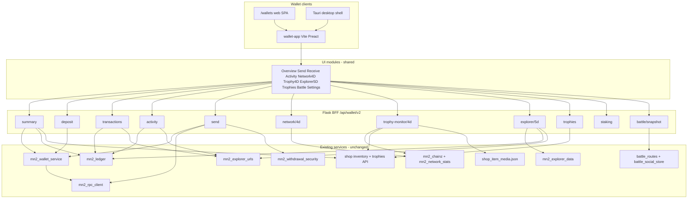
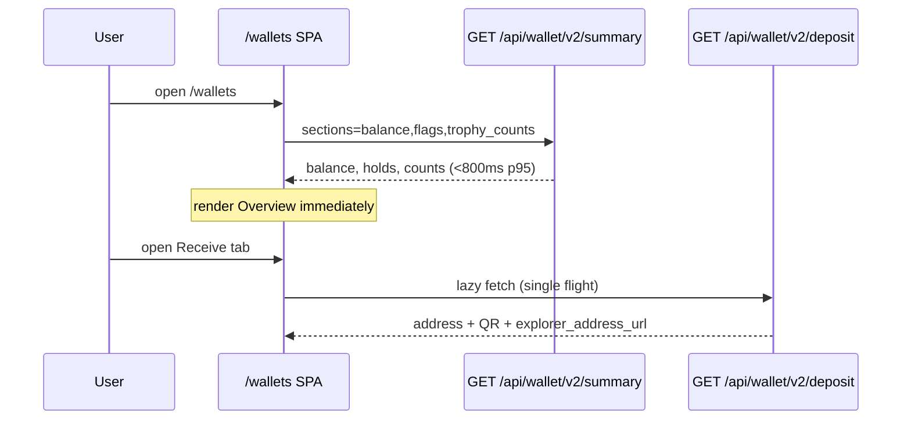
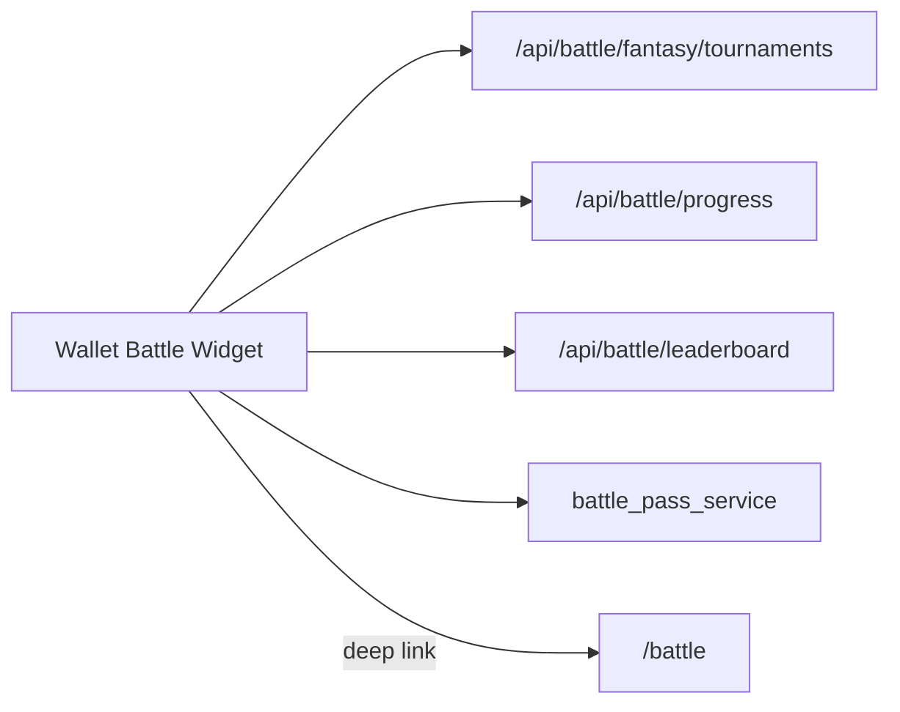

# MN2 Wallet Rebuild (From Scratch) - Plan

Companion to [`docs/plans/2026-09-16-001-feat-trophy-shop-wallet-plan.md`](2026-09-16-001-feat-trophy-shop-wallet-plan.md) (Trophy shop, trading, pricing). Plan 001 still owns trophy catalog, PayPal, auction, and peer transfer. **This plan owns the wallet product rebuild** — web SPA, desktop packaging, and fun/gamification UI layers.

---

## Goal Capsule

Replace the fragmented MN2 wallet UX (Profile card, Shop MN2 tab, stub `/wallets`, scattered global bars) with a **single greenfield wallet app** at `/wallets` **and** a **downloadable desktop wallet** (Windows, macOS, Linux): send/receive, QR deposit, tx history, balances, staking snapshot, **4D Trophy Monitor** (network + owned trophies with GIF/sound/stats), **5D explorer/wallet monitor panel**, trophy gallery (from plan 001), **battle contest widget**, explorer deep links, and settings.

**Interface-first:** The user cares most about the wallet **UI** — tabs, panels, animations, sound cues, and collectible presentation. Backend stays Flask + existing MN2 services; **one TypeScript component library** ships in both `/wallets` (web) and the desktop shell.

**From scratch** means a new TypeScript SPA and a clean **`/api/wallet/v2/*`** boundary — **not** rewriting `mn2_rpc_client.py` or the ledger on day 1.

Stop if the work expands to: hardware wallet integration, **on-chain NFT/trophy mint**, replacing the Flask monolith with a separate Go/Rust chain microservice, or a standalone battle game rewrite inside the wallet.

Execution profile: **WR-P0 scaffold → WR-P1 MVP send/receive → WR-P2 monitors → WR-P3 trophies → WR-P4 migration → WR-P5 desktop packaging → WR-P6 gamification layer.**

---

## Stack Recommendation (ONE approach)

| Option | Verdict |
|--------|---------|
| **A. Flask API + Vite TypeScript SPA (recommended)** | **Ship this.** Keep Python services; new UI in `wallet-app/` built to `static/wallet-v2/`. |
| B. Go/Rust wallet microservice | Rejects: duplicates `mn2_rpc_client.py`, failover, deposit scanner, ledger — high risk on a single-node deploy. |
| C. WASM chain client in browser | Rejects: MN2 is server-custodial UTXO wallet; RPC secrets must stay server-side. |
| D. Incremental vanilla JS hub (plan 001 W-U2) | Superseded by this plan for primary `/wallets` UX; keep W-U1 summary patterns as v2 API input. |

### Rationale

- **Team velocity:** Repo is Flask + static HTML/JS today (`deploy.py` already ships `static/js/*`). Adding a Vite bundle under `static/wallet-v2/` matches deployment without new infra.
- **Chain client:** `backend/services/mn2_rpc_client.py`, `mn2_wallet_service.py`, `mn2_deposit_scanner.py`, `mn2_ledger.py`, and `mn2_withdrawal_security.py` are existing service paths with unit tests — wrap, do not rewrite.
- **Single-process deploy:** Same gunicorn/Flask process serves API + static assets; no second service to operate.
- **Language upgrade:** TypeScript + component SPA replaces 393-line IIFE `profile-mn2-wallet.js` and duplicated shop wallet loaders with typed modules and testable UI logic.

**Chosen stack:** **Python 3 Flask backend (unchanged) + Vite + TypeScript + Preact** (small bundle; React-compatible patterns if team prefers React — swap in WR-U0).

### Desktop wallet stack (Win / Mac / Linux) — **recommend Tauri 2**

| Option | Verdict |
|--------|---------|
| **A. Tauri 2 + shared Vite wallet-app (recommended)** | **Ship this for desktop.** Thin native shell (~5–15 MB); loads the same `wallet-app/` bundle from `static/wallet-v2/` or a bundled `dist/`. Rust side handles deep links, auto-update, OS notifications, optional system tray. |
| B. Electron + shared Vite wallet-app | Viable fallback if team already knows Electron. Larger binaries (~80–150 MB); same UI reuse. Use only if Tauri blockers appear (e.g. corporate AV policies). |
| C. PWA / TWA only (no installer) | Partial — repo already has casino TWA (`mobile/casino-twa/`) and Capacitor (`mobile/casino-app/`). Good for mobile-adjacent install; **not** a full desktop wallet with tray/offline shell branding. |
| D. Qt/C++ wallet rewrite | Rejects — daemon/Qt wallet is for **on-chain node operators** (`docs/MN2_RELEASE_BUILD.md`); custodial app-wallet stays web-tech + server BFF. |

**Rationale:**

- **UI reuse:** `wallet-app/` builds once; Tauri `WebView` loads `index.html` + assets. Desktop-only chrome (title bar, tray, `wallet://` deep links) lives in `desktop/wallet-tauri/` — **no duplicate React/Preact trees**.
- **Repo precedent:** Mobile shells wrap web (`casino-twa-shell.js`, Capacitor) — desktop follows the same pattern with Tauri instead of Bubblewrap.
- **Security:** MN2 keys/RPC stay server-side; desktop is a **logged-in session client** to `https://…/api/wallet/v2/*` (cookie or token bridge via Tauri secure store). No local private-key custody in MVP.
- **Cross-platform:** Tauri 2 ships NSIS (Win), DMG (Mac), AppImage/deb (Linux) from one CI matrix.

**Desktop config sketch:**

```
desktop/wallet-tauri/
  src-tauri/tauri.conf.json   # window 1100×800, title "MN2 Wallet"
  src-tauri/src/main.rs       # deep link wallet://tab/trophies, tray icon
wallet-app/                   # shared UI (WR-U0)
```

**Auth bridge:** Desktop opens system browser for first login OR embeds webview to the site login page; session cookie copied to Tauri cookie jar. Offline mode: read-only cached summary + trophy grid from last sync (no send).

---

## Interface-first UI architecture

Wallet product = **shell + feature modules**. Each module is a Preact tab/panel with its own lazy route, shared design tokens (`modern-design-system.css` palette), and typed API client.

| Module ID | Tab / panel | Web `/wallets` | Desktop shell | Primary APIs |
|-----------|-------------|----------------|---------------|--------------|
| `mod-overview` | Overview | ✓ | ✓ | `v2/summary` |
| `mod-send` | Send | ✓ | ✓ | `v2/send` |
| `mod-receive` | Receive + QR | ✓ | ✓ | `v2/deposit` |
| `mod-activity` | Tx history + 5d chart | ✓ | ✓ | `v2/transactions`, `v2/activity` |
| `mod-network-4d` | 4D network KPIs | ✓ | ✓ | `v2/network/4d` |
| `mod-trophy-4d` | **4D Trophy Monitor** | ✓ | ✓ | `v2/trophies`, `v2/network/4d`, media |
| `mod-explorer-5d` | 5D explorer + story strip | ✓ | ✓ | `v2/explorer/5d` |
| `mod-trophies` | Trophy gallery + trade | ✓ | ✓ | `v2/trophies`, plan 001 transfer |
| `mod-battle-contest` | Battle contest widget | ✓ | ✓ | `/api/battle/*` |
| `mod-staking` | Staking snapshot | ✓ | ✓ | `v2/staking` |
| `mod-settings` | 2FA, whitelist, downloads | ✓ | ✓ | `v2/security/*` |

**Fun layer toggles:** `data/mn2_config.json` → `wallet_fun_mode: true` enables sound, GIF hover previews, battle widget animations. Respects `prefers-reduced-motion`.

---

## Codebase Inventory (wallet-related surfaces)

### Frontends (today)

| Surface | Path | Load behavior | Notes |
|---------|------|---------------|-------|
| Profile MN2 wallet | `static/js/profile-mn2-wallet.js`, `profile/index.html#profile-mn2-wallet-card` | **4 parallel calls on `load()`** | balance, deposit-address (12–20s RPC), transactions, wallet-activity (5d chart) |
| Shop MN2 wallet | `shop/index.html` `loadMn2Wallet()` | **3 calls on every shop page load** (line ~3631) | Duplicate deposit/withdraw UI |
| Wallets stub | `wallets/index.html` | Static links only | Redirects to Profile/Exchange |
| Exchange wallet | `static/js/exchange-hub.js`, `exchange/index.html` | Lazy tab loaders | Treasury/balance tiles, not full wallet |
| MN2 crypto hub | `static/js/mn2-crypto-hub.js` | Tab-lazy | Staking leaderboard, POR, masternode hosting — adjacent, not user wallet |
| Global balance bar | `static/js/mn2-global-bar.js`, `static/js/mn2-site-bridge.js` | Balance + price on many pages | Should deep-link to `/wallets` |
| Explorer overview | `static/js/mn2-explorer-overview.js`, `explorer/index.html` | Polls `/api/mn2/network-overview` | **5D-adjacent chain monitor** (sparklines, SSE stream) |
| Aggregator 5D monitor | `static/js/story-monitor-5d.js`, `aggregator/index.html` | Holodeck narrative monitor | Site-wide σ monitor, not wallet-specific |
| Profile 5d wallet chart | `profile-mn2-5d-chart` in profile | `/api/mn2/wallet-activity?days=5` | **User 5-day ledger monitor** |
| Withdraw security UI | `static/js/mn2-withdrawal-security.js` | Profile/settings hooks | 2FA, whitelist |
| Mobile TWA | `mobile/casino-twa/`, `mobile/casino-app/` | Casino only | Wallet v2 responsive web first; optional `?app=wallet-twa` later mirroring casino pattern |
| Battle page | `battle/index.html`, `static/js/battle-stats-display.js` | Tournaments, quick battle, story-monitor-5d | **Battle contest widget** source for wallet fun mode |
| Battle shop bridge | `static/js/battle-shop-integration.js` | Shop deep links from battle | Wallet quick actions → shop trophies |
| Shop media (GIF/sound) | `shop/index.html` `.shop-sound-btn`, `data/shop_item_media.json` | `gif_url`, `clip_url`, `sound_url` per SKU | Trophy card previews in 4D monitor |
| Clip generator | `scripts/generate_shop_top_clips.py` | ffmpeg → MP4 + GIF | Block trophy drops (plan 001 BM-U2) |
| 5D story audio | `static/js/story-monitor-5d.js` | Web Audio σ resonance | Optional wallet Explorer tab sound |
| Notification sounds | `static/js/notification-alarm.js` | OS notification + audio patterns | Network alert chimes in 4D monitor |
| Staking leaderboard | `staking-leaderboard/index.html`, `static/js/mn2-staking-monitor.js` | Pool stats | Staking snapshot panel |
| Agent marketplace | `static/js/agent-marketplace.js`, `exchange/index.html` | Exchange shop, agent wallets | Out of user wallet v2; link only |
| Auction house | `backend/services/shop_auction_service.py`, shop auction tab | Edition listings (plan 001 T-U1) | Trophy List CTA from wallet |
| Hunters/casino trophies | `backend/services/trophies_db_service.py`, `trophy_social_service.py` | Separate from shop trophies | Optional read-only “Hunter score” badge — not merged inventory |
| Battle pass | `backend/services/battle_pass_service.py` | Season progression | Battle contest widget cross-promo |
| Battle tournaments | `backend/services/battle_social_store.py`, `battle_routes.py` | `GET /api/battle/fantasy/tournaments` | Contest join from wallet widget |
| Daemon/Qt downloads | `docs/MN2_RELEASE_BUILD.md`, GitHub v1.2.3.0 release | Node operator binaries | Settings “Download daemon” links — not the custodial app |

### Backend (today)

| Layer | Path | Role |
|-------|------|------|
| RPC client | `backend/services/mn2_rpc_client.py`, `mn2_rpc_failover.py` | getnewaddress, validateaddress, sendtoaddress, staking_health |
| Wallet service | `backend/services/mn2_wallet_service.py` | Per-user deposit addresses, pool, balance via unified points |
| Routes | `backend/routes/mn2_routes.py` | `/api/mn2/balance`, `deposit-address`, `transactions`, `wallet-activity`, `withdraw`, security |
| Ledger | `backend/services/mn2_ledger.py` | In-app tx history, activity buckets |
| Deposit scanner | `backend/services/mn2_deposit_scanner.py` | On-chain deposit crediting |
| Staking | `backend/services/mn2_staking_service.py`, `backend/routes/mn2_staking_routes.py` | Stake/unstake, monitor |
| **4D network data** | `backend/services/mn2_chainz.py`, `mn2_network_stats.py`, `mn2_network_peers_service.py` | `network_overview`, history jsonl, alerts |
| Network APIs | `mn2_staking_routes.py` | `/api/mn2/network-overview`, `network-history`, `network-alerts`, `/api/mn2/explorer/stream` (SSE) |
| **5D explorer data** | `backend/services/mn2_explorer_data.py` | `recent_blocks`, `masternodes` via RPC |
| Explorer URLs | `backend/services/mn2_explorer_urls.py` | Centralized address/tx/block link builders |
| Agent wallets | `backend/services/agent_wallet_service.py` | **Separate** agent treasury wallets — out of user wallet v2 scope |
| Shop payment | `backend/routes/shop_routes.py` | MN2 shop debit, on-chain order payment |
| Battle APIs | `backend/routes/battle_routes.py` | stats, tournaments, arena config, season leaderboard |
| Battle social | `backend/services/battle_social_store.py` | Persistent tournaments/clans |
| Shop media manifest | `data/shop_item_media.json` | `image_url`, `gif_url`, `clip_url`, `sound_url` |
| Trophy pricing | `trophy_pricing_service.py` (plan 001 P-U1) | Effective USD for trophy cards |
| P2P / exchange | `mn2_p2p_service.py`, `crypto_exchange_service.py` | MN2 market — wallet links out |

### Tests (today)

| Test file | Covers |
|-----------|--------|
| `tests/test_mn2_crypto.py` | balance, deposit-address, withdraw, wallet-activity, address pool |
| `tests/unit/test_mn2_network_monitor.py` | daemon extras, network history snapshot keys |
| `tests/unit/test_mn2_explorer_data.py` | recent blocks, masternode list |
| `tests/unit/test_mn2_withdrawal_security.py` | whitelist, TOTP |
| `tests/unit/test_mn2_staking.py` | staking routes |
| `tests/unit/test_all_page_routes.py` | `/wallets/` first-class page |
| `tests/unit/test_shop_payment_safety.py` | wallet address map in payment flows |

### Performance bottleneck (measured in plan 001)

| Call | Typical cost | First paint? |
|------|--------------|--------------|
| `GET /api/mn2/balance` | fast | yes |
| `GET /api/mn2/deposit-address` | **12–20s** (RPC getnewaddress/validateaddress) | **must NOT block overview** |
| `GET /api/mn2/transactions` | medium | lazy |
| `GET /api/mn2/wallet-activity` | fast | lazy (Activity tab) |
| `GET /api/mn2/network-overview` | medium (cached 30s) | lazy (4D tab) |

---

## Feature Matrix — full wallet product vision

Legend: **Exists** = repo has working backend/UI today · **Wrap** = expose via v2 BFF · **New UI** = wallet-app component only · **Net-new** = new service work

| Feature | Repo today | P1 MVP | P2 Monitors | P3 Trophies | P4 Settings | P5 Desktop | P6 Fun |
|---------|------------|--------|-------------|-------------|-------------|------------|--------|
| Balance (liquid + held + fiat toggle) | **Exists** `mn2_routes` | ✓ | | | ✓ | ✓ | |
| Send / withdraw MN2 | **Exists** | ✓ | | | | ✓ | |
| Receive / deposit address + QR | **Exists** (slow RPC) | ✓ | | | | ✓ | |
| Tx history + explorer links | **Exists** + `mn2_explorer_urls` | ✓ | | | | ✓ | |
| Trusted addresses / whitelist | **Exists** `mn2_withdrawal_security` | | | | ✓ | ✓ | |
| Withdraw 2FA (TOTP) | **Exists** | | | | ✓ | ✓ | |
| Staking snapshot + leaderboard link | **Exists** `mn2_staking_service` | | ✓ | | | ✓ | |
| **4D network monitor** (height, mempool, sparklines, alerts) | **Exists** `mn2_chainz`, SSE stream | | ✓ | | | ✓ | ✓ sound |
| **5D wallet activity chart** (5-day bars) | **Exists** `wallet-activity` | ✓ | ✓ | | | ✓ | |
| **5D explorer panel** (blocks + story strip) | **Exists** `mn2_explorer_data`, `story-monitor-5d.js` | | ✓ | | | ✓ | ✓ sound |
| Trophy gallery + edition badges | **Wrap** plan 001 U1 | | | ✓ | | ✓ | ✓ GIF |
| Trophy list / peer transfer | **Net-new** plan 001 T-U* | | | ✓ | | ✓ | |
| Auction house list edition | **Exists** `shop_auction_service` | | | ✓ | | ✓ | |
| Block trophy drops + GIF preview | **Net-new** plan 001 BM-U* | | | ✓ | | ✓ | ✓ GIF |
| Shop trophy GIF/sound on cards | **Exists** `shop_item_media.json` | | | ✓ | | ✓ | ✓ |
| **4D Trophy Monitor** (network + trophy cards + stats + sound) | **New UI** + **Wrap** | | | ✓ | | ✓ | ✓ |
| **Battle contest widget** (tournaments, leaderboard snippet) | **Exists** battle APIs | | | | | ✓ | ✓ |
| Battle pass season progress | **Exists** `battle_pass_service` | | | | | ✓ | ✓ |
| Quick battle / arena link-out | **Exists** `/battle` | | | | | ✓ | ✓ |
| Hunter trophy score badge (read-only) | **Exists** `trophy_social_service` | | | | | ✓ | optional |
| Exchange / agent marketplace links | **Exists** | ✓ | | | | ✓ | |
| PayPal on-ramp hold status | **Exists** on-ramp | | | | ✓ | ✓ | |
| Masternode hosting status | **Exists** `mn2_masternode_hosting_service` | | ✓ | | | ✓ | |
| Daemon/Qt download links | **Exists** release docs | | | | ✓ | ✓ | |
| Desktop installer Win/Mac/Linux | **Net-new** Tauri | | | | | ✓ | |
| System tray + deep links | **Net-new** Tauri | | | | | ✓ | |
| Offline read-only cache | **Net-new** desktop | | | | | ✓ | |
| On-chain NFT mint | **Out of scope** | — | — | — | — | — | — |
| Hardware wallet | **Out of scope** | — | — | — | — | — | — |

### Top 10 “fun + serious” features (mapped to existing code)

| # | Feature | Serious / Fun | Existing anchor |
|---|---------|---------------|-----------------|
| 1 | Fast balance + send/receive | Serious | `mn2_wallet_service`, `profile-mn2-wallet.js` |
| 2 | 4D network monitor + alert sounds | Both | `mn2_chainz.py`, `mn2-explorer-overview.js`, `notification-alarm.js` |
| 3 | 4D Trophy Monitor (GIF cards + edition stats) | Fun | `shop_item_media.json`, plan 001 trophies API |
| 4 | 5D wallet activity + explorer story strip | Both | `wallet-activity`, `story-monitor-5d.js` |
| 5 | Trophy gallery + auction list/transfer | Both | plan 001 T-U*, `shop_auction_service.py` |
| 6 | Block trophy drop animations (per-height GIF) | Fun | `generate_shop_top_clips.py`, BM-U* |
| 7 | Battle contest widget + tournament join | Fun | `battle_routes.py`, `battle_social_store.py` |
| 8 | Staking snapshot + leaderboard deep link | Serious | `mn2_staking_service`, `mn2-staking-monitor.js` |
| 9 | Withdraw 2FA + whitelist | Serious | `mn2_withdrawal_security.py` |
| 10 | Desktop wallet (Tauri) with tray + deep links | Serious | Pattern from `mobile/casino-twa/` |

---

## Architecture



### First-paint sequence (target ≤1.5s)



---

## API Design — `/api/wallet/v2/*`

New blueprint: `backend/routes/wallet_v2_routes.py`  
Service facade: `backend/services/wallet_v2_service.py` (thin wrappers — no duplicate ledger logic)

All routes require same-origin session / `user_id` resolution as existing MN2 routes. Guest `default_user` gets read-only or blocked send (match current withdraw rules).

| Method | Path | Purpose | Backend delegate |
|--------|------|---------|------------------|
| GET | `/api/wallet/v2/summary` | Fast overview | `get_balance`, trophy count scan, `mn2_explorer_urls.explorer_base_url`, feature flags |
| GET | `/api/wallet/v2/deposit` | Deposit address + QR payload | `get_or_create_deposit_address` + `explorer_address_url()` |
| POST | `/api/wallet/v2/deposit/refresh` | Force new address | existing wallet refresh path |
| GET | `/api/wallet/v2/transactions` | Paginated ledger | `get_entries_by_user` + explorer URLs |
| GET | `/api/wallet/v2/activity?days=5` | 5d buckets | `get_wallet_activity_days` |
| POST | `/api/wallet/v2/send` | Withdraw MN2 | `/api/mn2/withdraw` logic + security |
| GET | `/api/wallet/v2/network/4d` | Network monitor bundle | `mn2_chainz.network_overview` + `mn2_network_stats.get_history(hours=24)` + `get_alerts(limit=5)` |
| GET | `/api/wallet/v2/explorer/5d` | Explorer + wallet overlay | `mn2_explorer_data.recent_blocks(10)` + user recent txs + activity buckets |
| GET | `/api/wallet/v2/staking` | Staking snapshot | `mn2_staking_service` summary fields |
| GET | `/api/wallet/v2/trophies` | Owned trophies | proxy `GET /api/shop/trophies?user_id=` + inventory editions |
| GET | `/api/wallet/v2/trophy-monitor/4d` | **4D Trophy Monitor bundle** | `network/4d` + owned trophies + `shop_item_media` URLs + block-mint latest drop |
| GET | `/api/wallet/v2/battle/snapshot` | Battle contest widget data | `battle_social_store` tournaments + user progress + season leaderboard top 5 |
| GET/POST | `/api/wallet/v2/security/*` | 2FA, whitelist | delegate `mn2_withdrawal_security` routes |

**`trophy-monitor/4d` response shape (sketch):**

```json
{
  "network": { "height": 0, "connections": 0, "mempool_tx": 0, "alerts": [], "history": [] },
  "trophies": [
    {
      "item_id": "top25-01",
      "edition_no": 3,
      "name": "...",
      "gif_url": "/static/shop/clips/....gif",
      "sound_url": "/static/shop/sounds/....wav",
      "stats": { "effective_price_usd": 0, "acquired_via": "paypal" }
    }
  ],
  "block_drop_teaser": { "height": 0, "gif_url": null, "explorer_block_url": "..." },
  "fun_mode": true
}
```

**Query params for summary:** `?sections=balance,trophy_counts,flags,recent_activity_preview` (default: `balance,trophy_counts,flags`). **Never calls deposit RPC.**

**Deprecation:** v1 `/api/mn2/*` remains for shop/profile during migration; v2 is canonical for `/wallets` SPA.

---

## 4D Network Monitor Panel (wallet context)

**Definition:** MN2 **chain/network health monitor** (not Star Map 4D, not debugger ops-4d).

**Data sources (existing):**

- `GET /api/mn2/network-overview` — price, height, difficulty, connections, mempool, staking health, RPC failover
- `GET /api/mn2/network-history?hours=24` — sparkline series (`connections`, `mempool_tx`, `mn2_usd_price`, …)
- `GET /api/mn2/network-alerts` — stall/stop-staking alerts from `mn2_network_stats.py`
- Optional live: `EventSource /api/mn2/explorer/stream` (same as explorer page)

**UI (wallet Network tab):**

- KPI tiles + SVG sparklines (port from `mn2-explorer-overview.js` into typed components)
- Alert strip with severity colors
- Link out: “Full explorer → `/explorer`”
- Auto-refresh 30s; pause when tab hidden

---

## 5D Explorer Monitor Panel (wallet context)

Two complementary layers:

1. **5D wallet monitor (personal):** 5 UTC-day in/out/net bars — today `profile-mn2-5d-chart` + `/api/mn2/wallet-activity`. Moves to wallet **Activity** tab.
2. **5D explorer monitor (chain + narrative):** Recent blocks from `mn2_explorer_data.recent_blocks`, cross-linked to user txs; optional compact `story-monitor-5d` strip (`data-story-context="wallet"`) for brand continuity — **lazy load** script on Explorer tab only.

**Explorer deep links (mandatory):** All address, txid, block height fields use `mn2_explorer_urls.explorer_address_url`, `explorer_tx_url`, `explorer_block_url` — replace hardcoded `.dws` strings in v2 BFF responses.

---

## 4D Trophy Monitor (dedicated panel — WR-G1)

**Definition:** A **wallet-native holodeck** combining the 4D **chain/network monitor** with the user’s **trophy collection** as animated cards — stats, sound cues, and GIF previews. This is the “fun” centerpiece the user asked for; distinct from the plain Network tab (WR-U5) which is serious ops KPIs only.

**Layout (split viewport):**

```
┌─────────────────────────────────────────────────────────────┐
│ 4D NETWORK STRIP — height · mempool · connections · price   │
│ [sparklines]  [alert bell]  [SSE live dot]                  │
├──────────────────────────┬──────────────────────────────────┤
│ TROPHY CARD DECK         │ STATS RAIL                       │
│ ┌─────┐ ┌─────┐ ┌─────┐  │ • edition count / series progress│
│ │ GIF │ │ GIF │ │ PNG │  │ • trophy_points (hunter badge) │
│ │ #03 │ │ #07 │ │block│  │ • battle wins (if linked)        │
│ └─────┘ └─────┘ └─────┘  │ • effective_price trend          │
│ hover → play sound       │ • latest block drop teaser       │
└──────────────────────────┴──────────────────────────────────┘
```

**Data sources (existing + wrap):**

| Layer | Source | Notes |
|-------|--------|-------|
| Network KPIs + history | `mn2_chainz.network_overview`, `mn2_network_stats` | Same as WR-U5 |
| Live updates | `EventSource /api/mn2/explorer/stream` | Optional; fallback 30s poll |
| Owned trophies + editions | plan 001 `GET /api/shop/trophies?user_id=` + inventory | Edition badges |
| GIF / clip / sound URLs | `data/shop_item_media.json` | Merge by `item_id`; pattern from `shop/index.html` `.shop-sound-btn` |
| Block trophy teaser | plan 001 `GET /api/shop/block-mint/drops` (BM-U1) | Latest height + GIF when series live |
| Hunter score (optional) | `trophy_social_service.get_leaderboard` | Read-only rank chip — not shop inventory |

**Sound cues (fun mode, user gesture to enable):**

| Event | Sound pattern | Existing pattern |
|-------|---------------|------------------|
| New network alert (stall) | Short warning tone | `notification-alarm.js` |
| Trophy card focus / hover | Item `sound_url` from media manifest | Shop `.shop-sound-btn` |
| New block height tick | Soft chime (debounced 1/block) | New — reuse Web Audio from `story-monitor-5d.js` |
| Block trophy drop available | Celebratory sting | Shop sound or generated WAV |

**GIF behavior:**

- Cards show `gif_url` on hover/focus (respect `prefers-reduced-motion` → static `image_url`).
- Block trophies animate 3s loop (`generate_shop_top_clips.py` output).
- Lazy-load GIFs; preload only top 3 visible cards.

**Stats rail:**

- Per-trophy: `edition_no`, `effective_price_usd`, `price_factors` (plan 001 P-U1), acquisition rail.
- Aggregate: total editions, Top 25 series progress (`/api/shop/trophies` series field).
- Battle cross-stat: `GET /api/battle/stats` win_rate when user has battle history.

**Tab placement:** Dedicated **Trophy 4D** tab (or sub-tab under Trophies). Desktop default can pin as second tab when `wallet_fun_mode: true`.

---

## Battle contest integration (fun mode — WR-BC1)

**Definition:** Lightweight **wallet widget** surfacing active battle tournaments, season progress, and a leaderboard snippet — not a full battle client. Links out to `/battle` for play.

**Data sources (existing):**

| Endpoint | Use in widget |
|----------|---------------|
| `GET /api/battle/fantasy/tournaments` | Open contests list (name, entry_fee, prize_pool, status) |
| `POST /api/battle/fantasy/tournaments/<id>/join` | Join CTA (confirm modal) |
| `GET /api/battle/progress` | User tournament/clan completion |
| `GET /api/battle/leaderboard` | Top 5 snippet |
| `GET /api/battle/season/<id>/leaderboard` | Season ranks |
| `battle_pass_service.get_battle_pass_status` | Premium lane progress bar |

**UI widget (compact card on Overview or dedicated Battle tab):**

- **Active contests** — 1–3 tournament cards with “Join” / “View arena → `/battle`”.
- **Your stats** — wins, streak, rank (from `battle-stats-display.js` field mapping).
- **Trophy stakes** — copy-only MVP: “Win battles to earn hunter trophies” + link to shop trophies (no automatic trophy grant from battle in wallet scope).
- **Leaderboard snippet** — top 5 + highlight current user row.

**Scope boundary:** Wallet does **not** embed quick-battle combat UI (`quick-battle-frontend.js` stays on `/battle`). Widget is discovery + join + stats.



---

## Migration Path

| Phase | User-visible | Legacy |
|-------|--------------|--------|
| WR-P0 | `/wallets?v=2` beta flag | Profile/shop unchanged |
| WR-P1 | `/wallets` default for logged-in users | Profile wallet card shows “Open new wallet →” banner |
| WR-P2 | Shop MN2 tab links to `/wallets?tab=receive` | Remove `loadMn2Wallet()` on shop DOMContentLoaded |
| WR-P3 | Trophy tab live | Plan 001 T-U2 transfer modal in SPA |
| WR-P4 | Nav toolbar canonical `/wallets` | `profile-mn2-wallet.js` load gated behind `?legacy_wallet=1`; delete after 2 releases |
| WR-P5 | Desktop installers (Win/Mac/Linux) published | Web remains primary; desktop downloads from Settings |
| WR-P6 | 4D Trophy Monitor + Battle widget + fun sounds | Toggle `wallet_fun_mode`; reduced-motion respected |

**Feature flags:** `data/mn2_config.json` → `wallet_v2_enabled: true`, `wallet_v2_default_tab: overview`, `wallet_fun_mode: false`, `wallet_desktop_download_url: null`

**Redirects:**

- `/profile#profile-mn2-wallet-card` → `/wallets?from=profile`
- `mn2-global-bar.js` Wallet link → `/wallets`

---

## Implementation Units

### WR-U0. Wallet app scaffold

**Goal:** Vite + TypeScript + Preact app builds into Flask static tree.

**Files:**

- `wallet-app/` (new) — `package.json`, `vite.config.ts`, `src/main.tsx`, `src/App.tsx`
- `wallet-app/vite.config.ts` → `outDir: ../static/wallet-v2`
- `wallets/index.html` — SPA shell loading `/static/wallet-v2/assets/*`
- `deploy.py` — add wallet-app build step (or document `npm run build` in CI)
- `.gitignore` — ignore `static/wallet-v2/assets` if built in CI only (team choice: commit built assets for simpler ops)

**Test:** `npm run build` succeeds; `/wallets/` returns 200 with mount node `#wallet-root`.

---

### WR-U1. Wallet v2 API blueprint + summary

**Goal:** Fast summary endpoint; no deposit RPC.

**Dependencies:** none

**Files:**

- `backend/routes/wallet_v2_routes.py` (new)
- `backend/services/wallet_v2_service.py` (new)
- `backend/services/mn2_wallet_summary_service.py` (new — same as plan 001 W-U1)
- `tests/unit/test_wallet_v2_summary.py` (new)

**Approach:**

1. Register blueprint in auto-discovery.
2. `GET /api/wallet/v2/summary` — balance, withdrawable/held, `trophy_counts`, `explorer_base_url`, `wallet_v2_enabled`.
3. Unit assert `get_or_create_deposit_address` not called.

**Test scenarios:**

- Summary p95 <800ms with mocked balance/inventory.
- Guest user gets balance 0 or blocked flags consistent with v1.

---

### WR-U2. SPA shell + Overview tab (MVP slice)

**Goal:** First meaningful paint with balance only.

**Dependencies:** WR-U0, WR-U1

**Files:**

- `wallet-app/src/tabs/Overview.tsx`
- `wallet-app/src/api/client.ts`
- `static/js/navigation-toolbar.js` — promote `/wallets`

**Test scenarios:**

- Overview renders balance without deposit call (network tab in DevTools).
- Skeleton → data within 1.5s on warm cache (manual smoke).

---

### WR-U3. Send + Receive (MVP core)

**Goal:** Withdraw + deposit QR — full send/receive loop.

**Dependencies:** WR-U2

**Files:**

- `wallet-app/src/tabs/Send.tsx`, `Receive.tsx`
- `wallet-app/src/components/QrDeposit.tsx`
- v2 routes: `deposit`, `send` delegating to existing mn2_routes logic

**Approach:**

1. Receive tab single-flights deposit fetch; show spinner + retry.
2. Send tab reuses validation messages from v1; wires withdraw security when enabled.
3. Copy-to-clipboard + explorer address link on receive.

**Test scenarios:**

- `tests/unit/test_wallet_v2_deposit.py` — explorer URL from `mn2_explorer_urls`.
- `tests/test_mn2_crypto.py` still passes (v1 unchanged).
- Manual: send form disabled when `withdrawal_verified === false`.

---

### WR-U4. Transactions + Activity (5d wallet monitor)

**Goal:** History list + 5-day bar chart.

**Dependencies:** WR-U2

**Files:**

- `wallet-app/src/tabs/Activity.tsx`
- v2 `transactions`, `activity` routes
- Port chart styling from `profile/index.html` `.mn2-5d-*` classes into SPA CSS module

**Test scenarios:**

- Activity returns 5 buckets; empty state copy matches v1.
- Tx rows include `explorer_tx_url` when txid present.

---

### WR-U5. 4D Network monitor tab

**Goal:** Network KPIs + sparklines + alerts in wallet.

**Dependencies:** WR-U2

**Files:**

- `wallet-app/src/tabs/Network4D.tsx`
- `wallet-app/src/components/Sparkline.tsx`
- v2 `network/4d` aggregator route
- Reuse field mapping from `static/js/mn2-explorer-overview.js`

**Test scenarios:**

- `test_mn2_network_monitor.py` still passes.
- v2 network bundle includes `connections`, `mempool_tx`, `history` array, `alerts`.
- Tab fetch only when Network opened (lazy).

---

### WR-U6. 5D Explorer monitor tab

**Goal:** Recent blocks + user tx cross-links + optional story strip.

**Dependencies:** WR-U4, WR-U5

**Files:**

- `wallet-app/src/tabs/Explorer5D.tsx`
- v2 `explorer/5d` route
- Lazy import `story-monitor-5d.js` with `data-story-context="wallet"` OR lightweight inline σ readout (prefer lazy script to avoid duplicating BEATS)

**Test scenarios:**

- `tests/unit/test_mn2_explorer_data.py` — blocks appear in v2 payload.
- Block rows link via `explorer_block_url(height)`.

---

### WR-U7. Staking snapshot panel

**Goal:** Read-only staked balance, APR, link to `/staking-monitor` and profile stake actions.

**Dependencies:** WR-U2

**Files:**

- `wallet-app/src/tabs/Staking.tsx` (sub-panel or Overview widget)
- v2 `staking` route → `mn2_staking_service`

**Test scenarios:** staking summary returns without blocking overview.

---

### WR-U8. Trophies tab (plan 001 integration)

**Goal:** Trophy gallery with edition badges; List / Transfer actions.

**Dependencies:** Plan 001 U1; T-U1/T-U2 for actions

**Files:**

- `wallet-app/src/tabs/Trophies.tsx`
- v2 `trophies` route
- Reuse plan 001 inventory + `/api/shop/trophies` merge (W-U3 intent)

**Test scenarios:**

- Owned `top25-01` shows edition_no; link to shop when empty.
- Transfer modal calls `POST /api/shop/trophies/transfer` when T-U2 shipped.

---

### WR-G1. 4D Trophy Monitor panel

**Goal:** Dedicated holodeck tab — network strip + animated trophy cards with GIF/sound/stats.

**Dependencies:** WR-U5, WR-U8, plan 001 U1 (trophies API); optional BM-U1 for block drops

**Files:**

- `wallet-app/src/tabs/TrophyMonitor4D.tsx`
- `wallet-app/src/components/TrophyCard.tsx`, `NetworkStrip.tsx`, `SoundToggle.tsx`
- `wallet-app/src/hooks/useNetworkStream.ts` — SSE or 30s poll
- v2 `GET /api/wallet/v2/trophy-monitor/4d`
- `backend/services/wallet_v2_trophy_monitor_service.py` (new — aggregates chainz + shop + media)

**Approach:**

1. BFF merges `network/4d` + trophies + `shop_item_media.json` in one lazy fetch.
2. Port shop sound button pattern (`new Audio(sound_url)`) with user-gesture gate.
3. GIF on hover; static image when `prefers-reduced-motion`.
4. Block drop teaser slot when `series=block_mint` SKUs exist.

**Test scenarios:**

- Bundle includes `network`, `trophies[]` with `gif_url` when manifest has it.
- Sound does not autoplay without toggle click.
- Tab lazy-loads; no SSE until panel visible.

---

### WR-BC1. Battle contest widget

**Goal:** Compact battle tournaments + leaderboard snippet + join CTA; link to `/battle`.

**Dependencies:** WR-U2

**Files:**

- `wallet-app/src/components/BattleContestWidget.tsx` (Overview embed + optional Battle tab)
- v2 `GET /api/wallet/v2/battle/snapshot`
- Reuse field mapping from `static/js/battle-stats-display.js`

**Approach:**

1. BFF wraps `battle_social_store.get_tournaments_filtered`, user progress, top-5 leaderboard.
2. Join button calls existing `POST /api/battle/fantasy/tournaments/<id>/join` via wallet API client.
3. No combat UI — deep link `href="/battle?tab=tournaments"`.

**Test scenarios:**

- Snapshot returns `tournaments[]`, `user_progress`, `leaderboard_top5`.
- Guest sees CTA to log in; no join POST.
- Widget hidden when `wallet_fun_mode: false` (config).

---

### WR-D1. Desktop shell (Tauri 2 — Win / Mac / Linux)

**Goal:** Downloadable desktop wallet loading the same `wallet-app` bundle.

**Dependencies:** WR-U0, WR-U2 (MVP UI exists)

**Files:**

- `desktop/wallet-tauri/` (new) — `tauri.conf.json`, `src-tauri/`, icons
- `wallet-app/vite.config.ts` — `base: './'` for file:// or custom protocol in Tauri
- CI workflow or `scripts/build_wallet_desktop.sh` — `tauri build` matrix (win, mac, linux)
- `wallet-app/src/platform/desktop.ts` — tray menu, `wallet://` deep link router
- Settings tab: link to GitHub releases / auto-update feed

**Approach:**

1. Tauri window loads the hosted wallet URL **or** bundled `static/wallet-v2` for offline shell (online required for send).
2. Session: open login in webview → persist cookies in Tauri store.
3. System tray: balance peek (summary poll 60s), “Open wallet”, “Quit”.
4. Deep links: `wallet://tab/receive`, `wallet://tab/trophy-4d` map to SPA router.
5. Auto-update: Tauri updater pointing at release manifest (post-MVP).

**Test scenarios:**

- `tauri build` succeeds on Linux CI.
- App opens to Overview with same bundle hash as web `/wallets`.
- Deep link `wallet://tab=trophies` activates tab.
- Send disabled when offline (banner).

**Electron fallback (WR-D1b):** Only if Tauri blocked — duplicate structure under `desktop/wallet-electron/` with `electron-builder`; same `wallet-app` dist.

---

### WR-U9. Settings + withdraw security

**Goal:** Fiat toggle, 2FA, whitelist, daemon download links.

**Dependencies:** WR-U3

**Files:**

- `wallet-app/src/tabs/Settings.tsx`
- Delegate to `/api/mn2/withdraw/security`, whitelist, 2fa routes (or v2 aliases)
- `static/js/mn2-withdrawal-security.js` — parity checklist for SPA flows

**Test scenarios:** `test_mn2_withdrawal_security.py` passes; SPA enable 2FA smoke.

---

### WR-U10. Legacy migration + perf rollout

**Goal:** Stop duplicate wallet loads on Profile/Shop.

**Dependencies:** WR-U2, WR-U3

**Files:**

- `static/js/profile-mn2-wallet.js` — defer `load()` until legacy mode or redirect banner
- `shop/index.html` — remove eager `loadMn2Wallet()` on DOMContentLoaded
- `profile/index.html` — embed link `href="/wallets?tab=trophies"`
- `wallets/index.html` — full SPA shell

**Performance targets (unchanged from plan 001):**

| Metric | Today | Target |
|--------|-------|--------|
| Wallet overview first paint | 4 parallel; deposit blocks 2–18s | summary only **<1.5s** |
| Shop initial load | 3 wallet calls always | **0** until user opens wallet |
| Deposit address | on overview load | **Receive tab only** |

---

### WR-U11. Tests + verification contract

**Files:**

- `tests/unit/test_wallet_v2_*.py` (summary, deposit, network, explorer)
- `wallet-app/vitest/` — API client + tab smoke (optional)
- `scripts/browser_smoke_profile_user.py` — extend with `/wallets` path

**Commands:**

```bash
npm --prefix wallet-app run build
pytest tests/unit/test_wallet_v2_summary.py tests/unit/test_wallet_v2_deposit.py \
  tests/unit/test_wallet_v2_network.py tests/unit/test_mn2_network_monitor.py \
  tests/unit/test_mn2_explorer_data.py tests/test_mn2_crypto.py -q
```

---

### WR-U12. Docs + PR alignment

**Files:**

- `docs/MN2_SHOP_AND_ADDRESSES.md` — canonical `/wallets` entry
- Update plan 001 W-U sections with pointer to this plan (done in 001 header cross-link)

---

## Phased Rollout Summary

| Phase | Units | Delivers |
|-------|-------|----------|
| **P0 Scaffold** | WR-U0, WR-U1 | Build pipeline + summary API |
| **P1 MVP** | WR-U2, WR-U3, WR-U4 | Send, receive, QR, tx history, 5d activity |
| **P2 Monitors** | WR-U5, WR-U6, WR-U7 | 4D network tab, 5D explorer tab, staking snapshot |
| **P3 Trophies** | WR-U8 | Gallery + trade CTAs (needs plan 001 T-U*) |
| **P4 Migration** | WR-U9, WR-U10, WR-U11, WR-U12 | Settings, legacy sunset, tests, docs |
| **P5 Desktop** | WR-D1 | Tauri installers Win/Mac/Linux; tray + deep links |
| **P6 Gamification** | WR-G1, WR-BC1 | 4D Trophy Monitor, battle widget, sounds/GIFs |

**Recommended ship order:** Web MVP (P0–P4) first → desktop packaging (P5) reuses frozen UI → gamification layer (P6) ships when plan 001 trophies + battle APIs stable.

**First MVP slice to ship:** **WR-U0 + WR-U1 + WR-U2 + WR-U3** — user can open `/wallets`, see balance immediately, receive via QR, send MN2.

**First fun slice (after P3):** **WR-G1** alone — 4D Trophy Monitor tab with network + owned trophy GIFs (no battle widget required).

---

## Risks

| Risk | Mitigation |
|------|------------|
| Deposit RPC still slow on Receive tab | Single-flight + cached address in SPA store; show last known address from localStorage with stale badge |
| Duplicated API logic v1/v2 | v2 service delegates to existing functions; no forked withdraw math |
| 4D/5D naming confusion (game starmap vs network) | Wallet tabs labeled **Network**, **Trophy 4D**, **Explorer**; tooltips explain chain vs collectible holodeck |
| Trophy edition UI ahead of plan 001 | Trophy tab hidden until `trophy_counts` in summary >0 or plan 001 U1 shipped |
| SPA deploy drift | Commit built `static/wallet-v2` or add deploy.py build hook |
| Desktop auth / cookie bridge fragile | Document login flow; fallback “Open in browser” button; no local key storage |
| GIF/sound perf on low-end devices | Lazy load; `wallet_fun_mode` default false; cap visible animated cards to 6 |
| Battle widget implies trophy rewards | Copy clarifies hunter trophies ≠ shop trophies; no false on-chain mint claims |
| Tauri CI matrix cost | Linux-only CI build; Mac/Win on release tags; Electron fallback documented |
| Users expect on-chain NFTs in 4D monitor | Honest banner: platform-ledger trophies; `on_chain_mint: false` on every card |

---

## Relationship to Plan 001

| Plan 001 unit | Disposition |
|---------------|-------------|
| W-U1 summary API | **Merged** into WR-U1 (`/api/wallet/v2/summary`) |
| W-U2 hub page JS | **Superseded** by WR-U0/WR-U2 SPA |
| W-U3 trophy tab | **Merged** into WR-U8 |
| W-U4 explorer links | **Merged** into WR-U3/WR-U4/WR-U6 v2 BFF |
| W-U5 lazy load | **Merged** into WR-U10 |
| W-U6 docs/nav | **Merged** into WR-U12 |
| T-U*, P-U*, U* | Unchanged — consumed by wallet trophies tab |

---

## Definition of Done

**Web (P0–P4):**

- `/wallets` is the canonical MN2 wallet for logged-in users.
- Send/receive works end-to-end with explorer links on address and tx.
- Overview first paint does not call deposit RPC; p95 summary <800ms.
- Network (4D) and Explorer (5D) tabs lazy-load chain/personal monitors.
- Trophy tab integrates with plan 001 when available.
- Profile and Shop stop eager-loading full wallet on unrelated page views.
- Unit tests cover v2 summary, deposit delegation, and network bundle.

**Desktop (P5):**

- Tauri builds produce Win/Mac/Linux artifacts; Settings tab links to download.
- Desktop loads same `wallet-app` bundle as web (version pin in `tauri.conf.json`).
- Tray + `wallet://` deep links documented.

**Gamification (P6):**

- 4D Trophy Monitor tab shows network strip + owned trophy cards with GIF/sound (fun mode).
- Battle contest widget shows open tournaments + leaderboard snippet; joins via existing battle API.
- `wallet_fun_mode` respects `prefers-reduced-motion`; no autoplay audio without user gesture.
- Copy states platform-ledger trophies — **no on-chain mint promises**.
