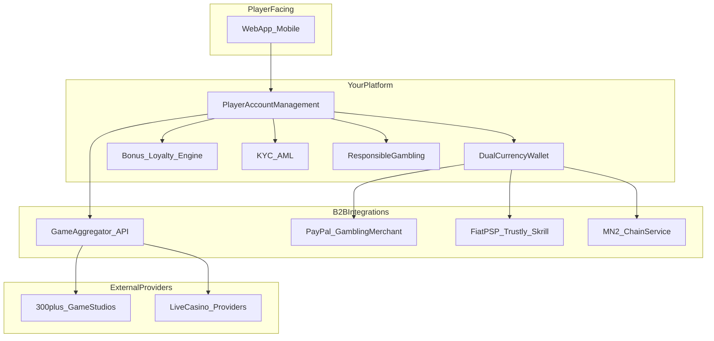
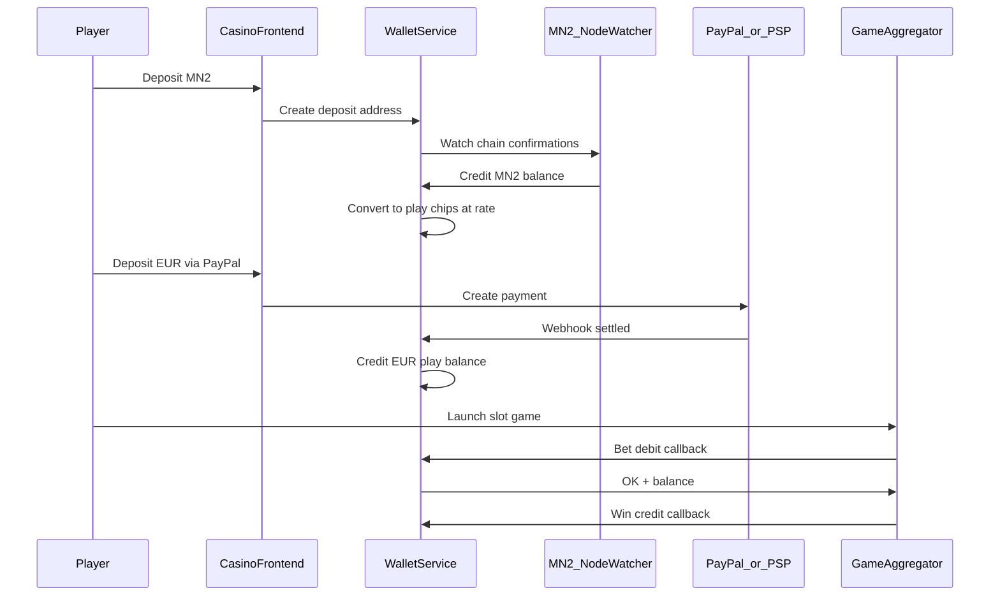
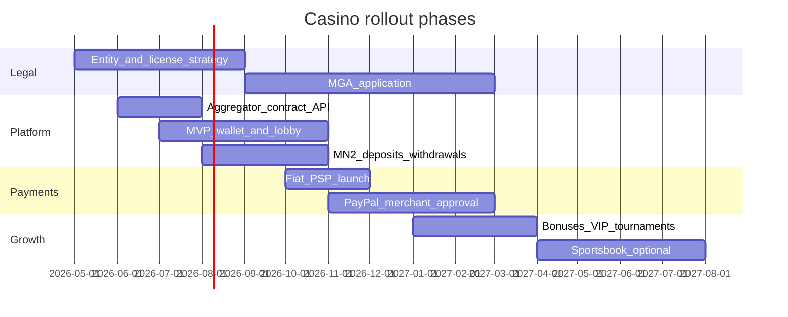

# EU Casino with Masternoder2 + PayPal — Options and Recommended Plan

## What you are building

A **real-money EU online casino** with:
- **Thousands of slots and live games** via a **single game-aggregator API** (not built in-house)
- **Dual currency**: Masternoder2 (your own chain) + **EUR fiat** (PayPal target, plus backup rails)
- **Custom branded frontend** and player wallet, integrated to aggregator + payment providers

You chose: **custom site + aggregator**, **EU jurisdiction**, **own blockchain for Masternoder2**. There is no existing codebase in the current workspace — this is greenfield.

---

## Critical reality checks (read first)

### 1. You cannot realistically build “all the slot machines” yourself
Slot catalogs come from **studios** (Pragmatic Play, NetEnt, Evolution, etc.) licensed through **aggregators**. Expect **15,000–30,000+ games** from one API integration, not custom development.

### 2. PayPal is possible but not the fast path
PayPal **only allows gambling for pre-approved merchants** in jurisdictions where gambling is legal, and you must **geo-block** the US and other prohibited regions ([PayPal gambling policy](https://www.paypal.com/us/cshelp/article/what-gambling-activities-does-paypal-prohibit-help391)).

**Implication for EU launch:** Plan **PayPal as Phase 2**. For Phase 1 fiat deposits, EU casinos typically use **Trustly, Skrill, Neteller, Paysafecard, cards via a gambling PSP** — these onboard faster than PayPal gambling approval.

### 3. EU = license + compliance before code matters most
Without an **EU gambling license** (commonly **MGA Malta**, or a specific national license), you cannot legally offer real-money play to EU customers. Budget and timeline for licensing often exceed initial dev work.

### 4. Custom-chain Masternoder2 is the hardest payment integration
Own-chain coins require you to run **nodes, deposit address generation, chain monitoring, confirmations, hot/cold treasury, and withdrawal signing**. Plan this as a dedicated **Wallet/Treasury service**, not a simple plugin.

---

## Architecture options (3 viable paths)

| Approach | What you build | Game catalog speed | Control | Best when |
|----------|----------------|---------------------|---------|-----------|
| **A. Custom PAM + Aggregator only** (recommended) | Frontend, wallet, KYC, bonuses, admin; integrate aggregator API | Fast (weeks to months after contracts) | Highest | You want your brand + MN2 economics |
| **B. Aggregator full platform + custom skin** (e.g. SOFTSWISS Casino Platform) | Mostly theming + MN2/fiat payment adapters | Fastest | Medium | Speed-to-market beats deep customization |
| **C. Turnkey white-label + MN2 overlay** | Minimal custom code; provider runs most backend | Fastest ops | Lowest | Small team, accept revenue share |

**Recommendation:** **Approach A** — matches your aggregator choice and keeps Masternoder2 wallet logic under your control.

---

## Game content: how to get “as many slots as possible”

### Top aggregator options (single API → massive catalog)

| Provider | Catalog claim | Notes |
|----------|---------------|-------|
| [Slotegrator APIgrator](https://slotegrator.pro/apigrator.html) | 30,000+ games, 180+ providers | Strong aggregator-only play |
| [SOFTSWISS Game Aggregator](https://www.softswiss.com/game-aggregator/) | 20,000+ games, 200+ studios | Also offers full casino platform if you want hybrid |
| EveryMatrix, BetConstruct, SoftGamings | Large catalogs | Compare commercial terms per market |

**What one aggregator API typically includes:**
- **Slots** (video, classic, megaways, jackpots)
- **Live casino** (blackjack, roulette, baccarat, game shows)
- **RNG table games**
- **Instant / crash games** (Aviator-style — market-dependent)
- **Optional sportsbook** (often separate product/module)

**Integration pattern:** Aggregator calls **your wallet API** (debit/credit/rollback) on each bet — you own balances; they serve game UI via iframe/redirect.

---

## Dual-currency wallet design (Masternoder2 + EUR)

**Key product decisions:**
- **Display currency**: Let players choose MN2-denominated or EUR-denominated play, or one unified “chip” with conversion at deposit.
- **Exchange rate**: Fixed admin rate vs oracle vs DEX/CEX mid-price; publish rate + spread transparently.
- **Segregation**: Separate **MN2 treasury** from **EUR fiat float** for regulatory reporting.
- **Withdrawals**: MN2 → on-chain send; EUR → PayPal/PSP payout with KYC tier limits.

**MN2 chain service (minimum components):**
- Full node / reliable RPC cluster
- HD wallet or per-user deposit addresses
- Confirmation policy (e.g. 6 confirmations)
- Withdrawal queue + manual review thresholds
- Block explorer or internal indexer
- Rate limiting, replay protection, address validation

**Optional later:** Wrapped MN2 on an EVM chain if you want DeFi liquidity or easier third-party wallet support.

---

## PayPal strategy (EU)

**Phase 1 (launch):** Fiat via gambling-friendly PSPs (Trustly/Skrill/cards) under your EU license.

**Phase 2 (PayPal):**
1. Obtain EU gambling license and corporate entity
2. Apply as **PayPal approved gambling merchant** (business summary + geo-blocking proof)
3. Implement PayPal Checkout + webhooks; strict **geo-IP + KYC country** enforcement
4. Expect **higher scrutiny**, lower approval rate than standard e-commerce

Treat PayPal as a **conversion booster**, not your only fiat rail.

---

## EU licensing path (recommended default: MGA)

For broad EU market access, **Malta Gaming Authority (MGA)** is the common anchor ([MGA](https://www.mga.org.mt/), [licensing overview](https://www.softswiss.com/knowledge-base/malta-igaming-license-guide/)).

**You will need before real-money launch:**
- Malta (or other) **gaming company** + compliance officer
- **KYC/AML** (Sumsub, Onfido, etc.)
- **Responsible gambling**: deposit/loss limits, self-exclusion, reality checks
- **GDPR** data handling
- **Game + payment audit trail** for regulator reporting
- **RNG/fairness** handled by licensed studios via aggregator

**Country note:** “EU” is not one license — some countries (DE, NL, etc.) require **additional local licensing** even with MGA. Pick **launch countries** explicitly in Phase 0.

---

## Full gaming feature set (beyond slots)

Prioritize in waves:

**Wave 1 — MVP (prove payments + games)**
- Registration/login (email + 2FA)
- KYC basic tier
- Aggregator slots + a few live tables
- MN2 deposit/withdraw
- Fiat deposit (PSP)
- Bet history, basic admin

**Wave 2 — Retention**
- Welcome bonus, free spins, wagering rules
- VIP / loyalty points
- Tournaments & leaderboards
- Jackpots (if aggregator supports networked jackpots)
- Refer-a-friend

**Wave 3 — Full casino**
- Full live casino lobby
- Instant/crash games
- Sportsbook (separate aggregator module — big scope add)
- Mobile apps (PWA first, native later)
- Affiliate system
- Advanced fraud/risk (SEON, device fingerprinting)

**Wave 4 — MN2-native differentiation**
- MN2-only promotions (lower house edge, boosted rakeback)
- Staking-linked VIP tiers (if your chain supports masternode staking)
- On-chain transparency page (treasury, hot wallet policy)
- Original provably-fair mini-games (optional; small catalog vs aggregator)

---

## Recommended tech stack (implementation phase — not locked yet)

| Layer | Suggested direction |
|-------|---------------------|
| Frontend | Next.js or Nuxt — casino lobby, game launcher, wallet UI |
| Backend | Node/NestJS or Go — wallet callbacks, payments, user accounts |
| DB | PostgreSQL + Redis (sessions, rate limits) |
| MN2 | Dedicated `wallet-service` talking to your node RPC |
| Admin | Internal dashboard for support, bonuses, treasury approvals |
| Infra | EU-hosted (AWS eu-central / GCP europe-west) for GDPR |

---

## Cost and timeline (rough order of magnitude)

| Item | Typical range |
|------|----------------|
| MGA license + setup | €25k–€100k+ upfront; months of process |
| Aggregator integration | Setup fee + monthly + revenue share (negotiated) |
| MVP engineering | 3–6 months with experienced iGaming team |
| PayPal gambling approval | Weeks to months; not guaranteed |
| Ongoing | Compliance, game provider fees, hosting, treasury ops |

---

## Recommended phased roadmap

---

## Biggest risks

1. **Operating without license** — legal shutdown, payment blocks
2. **PayPal denial or sudden freeze** — never sole fiat rail
3. **Custom chain ops** — node downtime = deposits/withdrawals halt
4. **Aggregator geo-restrictions** — some studios blocked in certain EU countries
5. **Bonus abuse / fraud** — needs risk tooling from day one
6. **Treasury security** — hot wallet hacks; use multisig + withdrawal limits

---

## Recommended next decisions (before build)

1. **Target launch countries** within EU (Malta-only vs DE/IE/NL/etc.)
2. **Primary aggregator shortlist** — request commercial demos from Slotegrator + SOFTSWISS
3. **MN2 chain specs** — block time, TX format, existing explorer/wallets, current liquidity
4. **Business model** — MN2 as primary incentive currency vs equal to EUR
5. **Team** — iGaming-experienced backend + compliance hire/consultant

---

## Suggested MVP scope (what to build first)

1. Licensed EU entity path confirmed
2. Sign **one game aggregator** contract
3. Build **PAM + dual wallet** with MN2 + one fiat PSP
4. Launch with **500+ slots** (subset of full catalog) + **10 live tables**
5. Add **bonuses + KYC tier withdrawals**
6. Pursue **PayPal gambling merchant** approval in parallel
7. Expand catalog to full aggregator library once stable

This delivers “lots of slots” quickly while keeping Masternoder2 and PayPal in a realistic, legal architecture.

---

## News channels + Discord (integrated with Masternoder.dk build)

- **News channel `casino`:** jackpots, tournaments, MN2 rail promos, responsible-gambling reminders → `data/platform_news.json` (extend existing API).
- **Discord `#casino`:** anonymized win highlights (opt-in only, geo-aware); never target blocked markets; link to `/casino/` with RG copy.
- **Income via Discord (M8):** Discord-Exclusive Promo Codes (#52), Casino Win Highlights (#58), Upsell Orchestrator (#31) after Discord click-through, VIP Discord Role for MN2 holders (#51).
- **Compliance:** all Discord gambling promos respect EU license geo-blocks; affiliate/partner posts disclosed.
- **Technical hook:** `casino_service.py` → `activity_events.jsonl` → `discord_service` off-request cron (Gate S).
