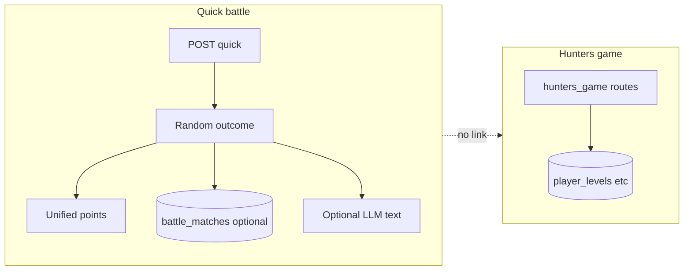

# Game and battle: current state and options

## What exists today

### Battle ([backend/routes/battle_routes.py](backend/routes/battle_routes.py))

The file header states it is **stub logic** extracted from `battle.py.backup` until dedicated battle services exist.

| Area | Behavior |
|------|------------|
| **Quick battle** (`POST /api/battle/quick`) | Outcome is **`random.choice(['win','loss','draw'])`** — not driven by player input, difficulty, or skill. Points and streaks update [unified_points_database](backend/services/unified_points_database.py); optional LLM commentary via `llm_service.complete`. |
| **Persistence** | [battle_db_service.py](backend/services/battle_db_service.py) writes `battle_matches` **only if** `battle_tables_exist()`; otherwise history/leaderboard DB paths no-op and [leaderboard falls back](backend/routes/battle_routes.py) to scanning unified-points JSON files. |
| **Agent vs agent** (`POST /api/battle/agents/match`) | Sum of `battle_power` from skill profiles + random jitter; tie-break random; optional LLM narrative. |
| **Fantasy / clans** | Tournaments and clans are **in-process Python lists** (`_BATTLE_TOURNAMENTS`, `_BATTLE_CLANS`) — joins mutate shared state and **reset on process restart**. |
| **Explicit stubs** | `GET` fantasy resources, battle intelligence statistics, PVP trophies return empty/minimal payloads with `implementation_status: 'stub'` (or similar). |

There is **no** call from battle routes into Hunters `award_xp`, so **battle wins do not automatically grant Hunter XP** unless another layer does (none found in `battle_routes.py`).

### Game / Hunters ([backend/routes/hunters_game.py](backend/routes/hunters_game.py))

- Large blueprint: level, rewards (list/claim/next/by-points), XP history, profile, stats, specials, rulebook, stories, geo-ref, walkthroughs, guides, leaderboard, Nexus endpoints, `award-game-points`, etc.
- [get_user_level_info](backend/routes/hunters_game.py) deliberately returns defaults when **not** in app+request context (documented 502-avoidance pattern).
- Uses raw SQL via `db.session.execute(...)` in many places; worth normalizing to `sqlalchemy.text()` for SQLAlchemy 2.x consistency and auditing **column index** usage in rewards mapping (fragile if schema order changes).

### Frontend / contract gaps

- [static/js/enhanced-game-mechanics.js](static/js/enhanced-game-mechanics.js) calls **`/api/battle/tournaments`** and **`/api/battle/tournament/join`**, while the live blueprint exposes **`/api/battle/fantasy/tournaments`** and **`/api/battle/fantasy/tournaments/<id>/join`**. Those tournament UI paths are likely **404** unless aliased elsewhere (no match in `missing_endpoints_routes.py` for `battle/tournament`).
- [static/js/game-timeline.js](static/js/game-timeline.js) hits `/api/game/hunters/xp-history` and separate achievements/milestones endpoints — worth verifying those achievement routes exist where this script is loaded.

---

## What can be done (prioritized directions)

### A. Correctness and wiring (low risk, high clarity)

1. **Align tournament API** — Either update `enhanced-game-mechanics.js` to use `/api/battle/fantasy/tournaments` (and join URL), or add thin **alias routes** on `battle_bp` that forward to the fantasy handlers (keeps old clients working).
2. **Run register intelligence / 404 log** — Per [.cursor/rules/register-intelligence.mdc](.cursor/rules/register-intelligence.mdc), audit `logs/register_intelligence/404_occurrences.jsonl` for `game` and `battle` paths to find more mismatches.
3. **Ensure `battle_matches` migration** — If you want durable history and DB leaderboard as source of truth, apply the migration that creates `battle_matches` (scripts/docs already reference battle migration patterns); today the app **degrades gracefully** without it.

### B. Product: make battle “real” (medium–large scope)

Pick one product stance:

- **Skill / input based** — Short minigame, quiz, or rock-paper-scissors with difficulty affecting odds; outcome then drives points (replaces pure random).
- **Keep lightweight “casino” battle** — If intentional, document in UI (“instant outcome”) and tune probabilities by difficulty instead of uniform random.

### C. Integration: game + battle (medium scope)

- On `battle_quick` success paths, optionally call **`award_xp`** from [hunters_game](backend/routes/hunters_game.py) (or a small service) with a capped amount by result/difficulty so Hunter level reflects battles.
- Optionally emit unified “activity” events already partially used (`on_user_activity`, `push_activity`) for feed consistency.

### D. Persistence for social battle features (medium scope)

- Replace in-memory `_BATTLE_TOURNAMENTS` / `_BATTLE_CLANS` with DB tables or reuse existing social/guild models if any, so joins survive restarts and can support real PvP later.

### E. Implement or hide stubs (product decision)

- **Trophies / intelligence / fantasy resources** — Either implement minimal real data (even static JSON from `data/`) or **remove or gate** UI that promises these features to avoid empty states.

### F. Tests and maintainability

- [tests/unit/test_02_battle.py](tests/unit/test_02_battle.py) only covers `battle_db_service`; add route-level tests for `battle_quick` (mock unified_points + LLM) and a contract test that **frontend URLs** used by key pages resolve.
- Optionally mine [backend/routes/battle.py.backup](backend/routes/battle.py.backup) for endpoints the UI still expects vs delete if dead weight.

---

## Suggested default sequence

If the goal is **stability first**: **A1 (tournament URL fix or aliases)** → **A3 (migration if you want DB history)** → **F (small tests)**.

If the goal is **player trust**: **B** (replace random quick battle with input-based outcome) plus **C** (Hunter XP on battle).

No code changes were made in this pass; this is an assessment and roadmap only.

---

## News + Discord integration (orchestrator Phase 5 / M8)

- **News channel `game`:** battle wins, tournament starts, Hunter level-ups, Starmap milestones → `platform_news.json` + home feed.
- **Discord `#game`:** embed alerts (opt-in, no PII); link back to `/battle`, `/game`, `/starmap25`.
- **Income streams:** Discord Quest Bot (#56) posts daily battle/quest links; MN2 reward on-site after Discord account link; Cross-Game Combo Engine surfaces next earn action in Discord digest.
- **Monitor:** game monitor tab shows latest Discord-posted events from `activity_events.jsonl`.

---
