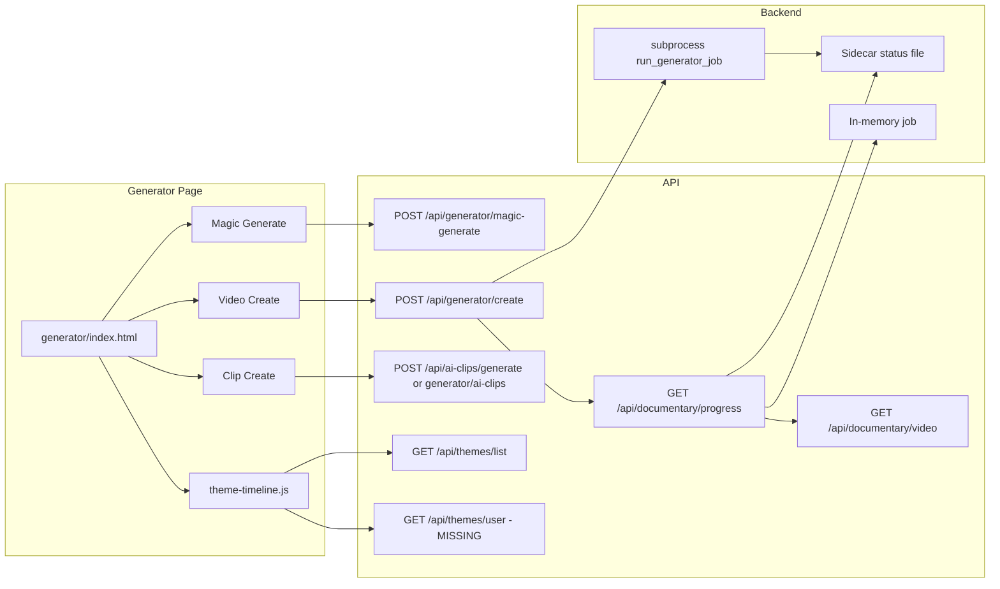

# Generator Page — Plan, Criticals, and One-Week Roadmap

## 1. What the Generator Page Is and What It Uses

- **Frontend:** [vidgenerator/generator/index.html](vidgenerator/generator/index.html) — Magic Generate (1-click), Video tab (title, description, theme), Clip tab. Loads: `theme-timeline.js`, `unified-generator-battle.js`, `error-manager.js`, `load-time-measurement.js`, `service-worker-gatherer.js`, `navigation-toolbar.js`.
- **APIs used:**  
  - `POST /api/generator/magic-generate`  
  - `POST /api/generator/create` (video)  
  - `GET /api/documentary/progress/<doc_id>`  
  - `GET /api/documentary/video/<doc_id>`  
  - `POST /api/ai-clips/generate` then fallback `POST /api/generator/ai-clips` (clips).
- **Theme selector:** [vidgenerator/static/js/theme-timeline.js](vidgenerator/static/js/theme-timeline.js) calls `GET /api/themes/list` (exists) and `**GET /api/themes/user?user_id=...` (missing — 404)**.
- **Backend:** All above routes live in [backend/routes/missing_endpoints_routes.py](backend/routes/missing_endpoints_routes.py). Job state: DB via `generator_db_service` when tables exist, else in-memory dict (per uWSGI worker). Progress is also written to a sidecar file for cross-worker visibility. Encoding is started via **subprocess** (`backend.run_generator_job`) when config is written to disk, else **thread** inside the worker.
- **Pipeline:** [backend/services/video_generator_service.py](backend/services/video_generator_service.py) — segments, MoviePy, optional AI enhancement, points award. Heavy (FFmpeg, disk, CPU).

---

## 2. Criticals (Must Fix)

| Priority | Issue                                  | Where                                                                                                 | What to do                                                                                                                                                                                                                                                                                                                      |
| -------- | -------------------------------------- | ----------------------------------------------------------------------------------------------------- | ------------------------------------------------------------------------------------------------------------------------------------------------------------------------------------------------------------------------------------------------------------------------------------------------------------------------------- |
| P0       | **Missing `/api/themes/user`**         | Frontend calls it; no route                                                                           | Add `GET /api/themes/user` (and `/vidgenerator/api/themes/user`) in `missing_endpoints_routes.py`; return `{ success: true, themes: [] }` or user-unlocked theme IDs from profile/DB so theme-timeline does not 404.                                                                                                            |
| P0       | **Progress visibility across workers** | `_get_video_job` reads DB or in-memory; subprocess writes sidecar; thread path only updates in-memory | Ensure documentary progress endpoint **always** prefers sidecar file (and DB if used) over in-memory job so any worker can serve progress. Already partially done; verify and document. Add a short note in [docs/GATEWAY_504_502.md](docs/GATEWAY_504_502.md) or a generator doc that progress is cross-worker via sidecar/DB. |
| P1       | **No dedicated generator deploy**      | [scripts/deploy.py](scripts/deploy.py) has no `generator` manifest                                    | Add a `generator` manifest that includes `vidgenerator/generator/index.html`, `vidgenerator/static/js/theme-timeline.js`, `vidgenerator/static/css/theme-timeline.css`, `vidgenerator/static/js/unified-generator-battle.js`, and any generator-specific assets so you can deploy with `python scripts/deploy.py generator`.    |
| P1       | **Cache and versioning**               | Generator HTML and static refs have no or old cache version                                           | Add cache-busting query params (e.g. `?v=20260304`) to theme-timeline.js/css and set a meta or comment version in generator `index.html` so deploys are visible without hard refresh.                                                                                                                                           |

---

## 3. Biggest Trouble Areas

- **Encoding environment:** Subprocess needs correct `PYTHONPATH`, `VIDEOS_DIR`, and write access to `vidgenerator/videos` (or configured output dir). FFmpeg must be installed. If subprocess fails, fallback is in-process thread — can hit uWSGI harakiri and 504s. **Mitigation:** Prefer subprocess; document server requirements (FFmpeg, disk, env) in a short generator ops doc.
- **Theme timeline 404:** `theme-timeline.js` calls `/api/themes/user` on every load; 404 can break or empty the theme selector. **Mitigation:** Implement `/api/themes/user` (stub or real) so the page does not depend on a missing endpoint.
- **Inconsistent UX with rest of site:** Generator uses minimal CSS and inline nav links; profile and other pages use modern-design-system, sync-status, full toolbar. Docs ([GENERATOR_REDESIGN_PLAN.md](docs/GENERATOR_REDESIGN_PLAN.md), [GENERATOR_PAGE_AND_POINTS_OVERVIEW.md](docs/GENERATOR_PAGE_AND_POINTS_OVERVIEW.md)) recommend making the generator the main attraction and aligning points/history. **Mitigation:** Phase 1 = criticals above; Phase 2 = align nav and add points/history section per redesign plan.
- **Error messaging and timeouts:** Long encoding can cause 504 on other requests; generator UI shows generic “Fejl” or timeout after 200 polls. **Mitigation:** Clearer error copy in [vidgenerator/generator/index.html](vidgenerator/generator/index.html) (e.g. “Encoding is running in the background; check again in a few minutes” or “Server busy; try again later”), and ensure progress endpoint returns a clear `error_message` when status is failed.

---

## 4. Todo List (Ordered)

1. **Add `GET /api/themes/user`** in `missing_endpoints_routes.py` (and `/vidgenerator/api/themes/user`). Return `{ success: true, themes: [] }` or list of user-unlocked theme IDs.
2. **Verify progress cross-worker:** In `documentary_progress`, ensure sidecar (and DB if present) is always read before in-memory job; add a one-line comment or doc note.
3. **Add `generator` manifest** in `scripts/deploy.py`: generator `index.html`, theme-timeline.js/css, unified-generator-battle.js, and any other generator-only assets.
4. **Cache-bust generator assets:** Version query param on theme-timeline.js/css in generator `index.html`; bump generator page version meta/comment.
5. **Improve error copy** on generator page for timeout and server errors (user-facing messages in Danish/English).
6. **(Optional) Align generator nav:** Use same navigation toolbar as profile/home so generator does not feel like a different app.
7. **(Optional) “My recent clips” on generator:** Use `GET /api/generator/jobs` or history to show recent jobs with links to video and points (as in GENERATOR_PAGE_AND_POINTS_OVERVIEW.md).

---

## 5. Full Report (Short)

- **Implemented:** Magic Generate, Video create (with progress poll), Clip create (ai-clips/generate + generator/ai-clips), documentary progress and video serve, theme list API, subprocess-based encoding with sidecar, DB job storage when tables exist, points award on completion.
- **Missing / broken:** `/api/themes/user` (404); no dedicated deploy manifest; progress can be worker-local if sidecar/DB not used consistently; generator UX and error messages lag the rest of the site.
- **Risks:** Encoding in thread if subprocess fails (harakiri/timeouts); server must have FFmpeg and disk; many concurrent jobs can overload the server.
- **Docs to use:** [docs/GENERATOR_PAGE_AND_POINTS_OVERVIEW.md](docs/GENERATOR_PAGE_AND_POINTS_OVERVIEW.md), [docs/GENERATOR_REDESIGN_PLAN.md](docs/GENERATOR_REDESIGN_PLAN.md), [docs/GATEWAY_504_502.md](docs/GATEWAY_504_502.md).

---

## 6. One-Week Term — Assignments

| Day       | Focus                    | Assignments                                                                                                                                                                                                                       |
| --------- | ------------------------ | --------------------------------------------------------------------------------------------------------------------------------------------------------------------------------------------------------------------------------- |
| **Day 1** | Critical APIs and deploy | Implement `GET /api/themes/user` (and vidgenerator variant). Add `generator` manifest in `deploy.py` and deploy generator once to verify.                                                                                         |
| **Day 2** | Progress and cache       | Verify documentary progress reads sidecar/DB first; add a one-sentence note in docs. Add cache-busting to generator page (theme-timeline refs + page version).                                                                    |
| **Day 3** | UX and errors            | Improve error messages on generator page (timeout, server error, “encoding in background”). Optionally wire same navigation toolbar as profile so generator feels part of the same site.                                          |
| **Day 4** | Robustness               | Document server requirements for generator (FFmpeg, VIDEOS_DIR, disk). Optionally add a simple “Generator status” or health note on the page (e.g. “Video encoding runs in the background”) so users know long runs are expected. |
| **Day 5** | History and points       | Optional: Add “My recent clips” section using `GET /api/generator/jobs` or history; show last 5 jobs with link to video and points earned. Ensure points refresh after completion (already partially there; sanity-check).        |
| **Day 6** | Testing and polish       | Manually test: Magic Generate, Video create (progress bar, download link), Clip create, theme selector. Fix any regressions. Bump generator cache version and deploy.                                                             |
| **Day 7** | Report and handoff       | Write a short **Generator Week Report**: what was done (themes/user, deploy manifest, cache, errors, optional nav/history), what remains (full redesign, per-segment progress), and 2–3 next priorities.                          |

---

## 7. Diagram — Generator Flow

---

No code or config changes were made (plan-only). Implement in the order above; adjust days if you have less or more time.

---

## 8. News + Discord (orchestrator Phase 5 / M8)

- **News channel:** tag generator milestones in `data/platform_news.json` (`channels: ["generator", "home", "discord"]`) when jobs complete or premium encode finishes.
- **Discord:** `discord_service.post_message("generator", embed)` with thumbnail, title, link to video page; rate-limited off-request via hook in `_run_video_generation_impl` (never block encode).
- **Income:** Discord Generator Showcase (M8 #59) + Creator Tipping Router; Discord-exclusive MN2 discount codes for express queue (M8 #52).
- **Env:** `DISCORD_CHANNEL_ID_GENERATOR`, `DISCORD_WEBHOOK_URL` (see ecosystem plan Phase 5).