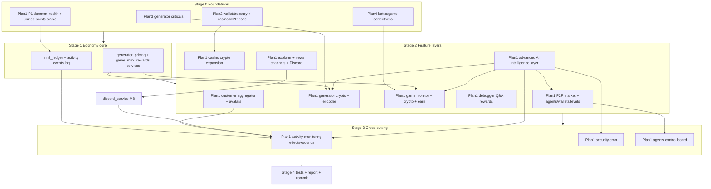

# Master Build Orchestrator - build all four when ready

This is the "last overall special" plan. It does not duplicate the four plans; it sequences and connects them so they build in the right order on one shared backbone, each stage gated on the previous being "ready" (green health + passing tests).

## The four plans it orchestrates
- Plan 1 - [Masternoder MN2 Ecosystem](.cursor/plans/masternoder_mn2_ecosystem_ea39bed0.plan.md): the crypto umbrella (wallet, P2P market, agents, explorer, debugger Q&A, casino crypto, generator crypto, game monitor, activity monitoring, security cron).
- Plan 2 - [EU Crypto Casino Platform](.cursor/plans/eu_crypto_casino_platform_82455a41.plan.md): casino + dual-currency wallet/treasury + compliance (MVP todos already completed; feeds wallet/treasury + casino-crypto).
- Plan 3 - [Generator Page Roadmap](.cursor/plans/generator_page_roadmap_f92f237f.plan.md): generator criticals (missing `GET /api/themes/user`, cross-worker progress, deploy manifest, cache, UX) - foundation under generator crypto.
- Plan 4 - [Game and Battle Review](.cursor/plans/game_and_battle_review_1ea4a6ee.plan.md): battle/Hunters correctness (tournament URL alignment, DB migration, Hunter-XP bridge, tests) - foundation under the unified game monitor + game crypto rewards.

## The connection (shared backbone)
All four converge on the same files, which is why they must be sequenced, not built in isolation:
- Economy source of truth: [backend/services/unified_points_database.py](backend/services/unified_points_database.py) (`mn2_balance`, `coins`, `*_points`).
- MN2 money + audit: [backend/services/mn2_wallet_service.py](backend/services/mn2_wallet_service.py), [backend/services/mn2_rpc_client.py](backend/services/mn2_rpc_client.py), [backend/services/mn2_ledger.py](backend/services/mn2_ledger.py), [data/mn2_config.json](data/mn2_config.json).
- Wiring: blueprints in [backend/register_blueprints.py](backend/register_blueprints.py); pages in [backend/routes/all_page_routes.py](backend/routes/all_page_routes.py) + [static/js/navigation-toolbar.js](static/js/navigation-toolbar.js).
- Generator + game already award into the same economy ([backend/services/video_generator_service.py](backend/services/video_generator_service.py) `_award_generation_points`; battle/starmap `/crypto/claim`).

## Readiness gates ("when ready" = objective, checkable)
- Gate A (enter Stage 1): `GET /api/health` and `GET /api/mn2/health` green (Plan 1 P1); `unified_points_db` read/write verified; `GET /api/themes/user` returns 200 (Plan 3); battle tournament URLs resolve + battle tests pass (Plan 4); casino MN2 rail confirmed (Plan 2).
- Gate B (enter Stage 2): `mn2_ledger` append + `logs/activity_events.jsonl` emitting; `generator_pricing_service` + `game_mn2_rewards` services importable with unit tests passing.
- Gate C (enter Stage 3): market, generator-crypto, game-rewards, casino-crypto, multi-channel news, and Discord outbound all emit activity events and have passing tests (so monitoring/cron/control board have real data + agents to govern).
- Gate D (finish): full `pytest` green; report + Critical/Upgrades TODO written.

## A+ critical-to-service requirements (hardening gate - verified against the real code)
These are blocking for production and were confirmed by code inspection. Gate S below must pass before any money-moving feature (market, agent funding, generator pay/earn, casino crypto, game rewards) goes live.

- Money-write integrity (CRITICAL): [backend/services/unified_points_database.py](backend/services/unified_points_database.py) writes balances file-first with NO locking/atomic write (no `flock`/`os.replace`/`tempfile`), so concurrent bets/trades/funding/claims can race and double-spend. Add a serialized money path: per-user lock + atomic write (`tempfile` + `os.replace`) or move money-critical mutations into a single SQL transaction; enforce unique idempotency `reference` on every credit/debit (reuse the casino ledger pattern). Required before market/funding/generator-pay.
- Runtime stability (CRITICAL): the app already suffers worker death/OOM/504 under load (see [Migrate to Stable System](.cursor/plans/migrate_to_stable_system_8069d7db.plan.md)). New heavy load (video encoding, agent runner, SSE) must not run in request workers: keep encoding in subprocess (never the in-worker thread fallback), run the agent trader/runner via cron (not in-request), serve `GET /api/activity/stream` SSE off a path/worker that cannot starve the pool (or short-poll fallback), and set uWSGI `max-requests`/`harakiri`/concurrency caps. Verify against `LITE_APP=1` (production-lite) blueprint set.
- Treasury / hot-wallet custody (CRITICAL): a 600k+ MN2 agent treasury is a hot-wallet risk. Keep only an operating float hot; cold/multisig the remainder; isolate withdrawal signing; the treasury address is ops-only (never rendered on public pages); cap per-run distribution; reconcile pool vs `agent_wallets` vs `mn2_ledger` every cycle and surface in `proof-of-reserves`. Note `data/mn2_config.json` caps real withdrawals (`max_withdrawal_amount_per_day: 1000`, `withdrawal_risk`) - internal funding bypasses these, so add its own caps + audit.
- Reward-farming / sybil abuse (CRITICAL): MN2 is earnable via Q&A, generator, and game; `ai_user_lifecycle_middleware` auto-creates anonymous accounts. Require a real authenticated identity (reject `default_user`/anon) for any MN2-earning action, add per-account/day caps, and apply [backend/middleware/rate_limit_middleware.py](backend/middleware/rate_limit_middleware.py) + an anomaly cron.
- Admin/ops authorization: the agents control board and treasury/distribute endpoints move funds - require real admin auth (not only a shared secret) and an append-only admin action audit log.
- Backups / DR: JSON balance + `mn2_ledger` stores need a scheduled backup job (extend `cron/`) plus a pre-migration snapshot and a documented restore procedure.
- Migrations: new tables (`agent_wallets`, market orders/trades, activity events) need idempotent migration scripts under `migrations/` consistent with the `db.create_all()` + ad-hoc pattern; guard against partial schema.
- Deploy + cache: every new page (market, agents control, monitor tab) needs a `scripts/deploy.py` manifest + cache-busting (the Generator plan already flags a missing manifest); confirm blueprints register in both full and `LITE_APP` modes.
- Observability/alerting: route cron-job failures, daemon-down, and failed agent-funding distributions to `MN2_ALERT_USER_ID` + structured logs; reuse `mn2_network_stats` alerts.
- Compliance/responsible-gambling: casino crypto is real money - reuse deposit/loss limits, KYC gates, and geo rules; align with [EU Crypto Casino Platform](.cursor/plans/eu_crypto_casino_platform_82455a41.plan.md).

- Gate S (must pass before Stage 2 money features and AI features): atomic+locked money path with idempotency live and unit-tested under concurrency; encoding/agent/SSE/AI model execution confirmed off request workers with uWSGI recycle caps; treasury custody + reconciliation + ops-only address enforced; earn endpoints auth-gated + rate-limited; admin auth on control board/treasury; backup job running; AI jobs must be enqueue/cache/read-only from request routes.

## Build sequence
- Stage 0 - Foundations (parallelizable): execute Plan 3 criticals, Plan 4 section A (URL alignment + migration + tests), Plan 1 Phase 0-1 (audit + daemon health), confirm Plan 2 wallet/treasury + casino baseline. Verify Gate A.
- Stage 1 - Economy core: Plan 1 Phase 2 (wallet multi-address) + ledger/activity event log + `generator_pricing_service` + `game_mn2_rewards`. Also generate the ONE agent treasury deposit address (`GET /api/agents/treasury/address`) so the user can send the total trader-agent funding (default 6 x 100,000 = 600,000 MN2). Verify Gate B.
- Stage 1.5 - Hardening (the A+ critical-to-service items): atomic+locked money path with idempotency, encoding/agent/SSE off request workers + uWSGI recycle caps, treasury custody + reconciliation + ops-only address, earn-action auth + rate limits, admin auth + audit on control board/treasury, backup/DR job, migrations. Verify Gate S. (Blocks all Stage 2 money features.)
- Stage 2 - Feature layers (each gated on its Stage 0 foundation AND Gate S): Plan 1 Phase 3 (market+agents) + run the agent treasury auto-distribution once the deposit lands (100,000 MN2 credited to each trader agent wallet); Plan 1 Phase 12 (customer aggregator directory + auto avatars, off-request avatar backfill); Plan 1 Phase 13 (advanced AI intelligence layer - first produce the AI model/provider matrix, then build 25 off-request features across trading, games, generator, security, ops/support); Phase 10 (generator crypto - needs Plan 3), Phase 11 (game monitor+crypto - needs Plan 4), Phase 7 (casino crypto - needs Plan 2), Phase 5 (explorer+news), Phase 6 (debugger Q&A). Verify Gate C.
- Stage 3 - Cross-cutting: Plan 1 Phase 8 (activity monitoring effects+sounds, incl. the customer aggregator "Customers" tile + `customer_new`/`customer_active` events), Phase 9 (security cron, incl. avatar backfill job), Phase 4 control board + leveling (governs market+game agents). 
- Stage 4 - Hardening: run full `pytest`, finalize `docs/MN2_ECOSYSTEM_REPORT.md` + `docs/MN2_TODO.md`, commit. Verify Gate D.

## Integration points to keep consistent (avoid conflicts between plans)
- One pricing/reward path: generator pay/earn and game rewards both go through the same MN2 debit/credit helpers + `mn2_ledger` (no parallel ad-hoc balance writes).
- One activity event schema: market, generator, game, casino, cron all append to `logs/activity_events.jsonl` consumed by the SSE monitor.
- One nav + page registration: every new page (market, agents control, monitor tab) added via `all_page_routes.py` PAGES + `navigation-toolbar.js`.
- One agent identity: trader agents (market) and game agents share `agent_db_service` + `agent_wallet_service` + the control board.
- One customer identity: the customer aggregator is read-only over the SAME `user_accounts` + `unified_points` + `user_identifiers` stores used by casino/generator/game/market (no separate customer table); customer avatars follow the agent avatar convention and feed the shared activity event log.
- One news + Discord contract: `data/platform_news.json` is the source of truth for on-site news; `discord_service.py` mirrors selected channels/events off-request; Discord never holds custody — rewards/purchases always complete on-site with auth.
- One AI execution contract: all AI intelligence runs through cron, subprocess, or background jobs; endpoints enqueue jobs or read cached decisions only. AI output must emit structured events into `logs/activity_events.jsonl` and respect Gate S idempotency/auth/rate-limit requirements. The AI model/provider matrix must define purpose, cost limit, timeout, fallback, data allowed, and human-review rules for every model used.

## M7 + M8 (final monetization waves)

- **M7** — `ai_staking_advisor_service.py` + cron `staking_advisor.sh`; Stage 3; Gate S; read-cache only on request paths.
- **M8** — `discord_service.py` + `discord_routes.py` + outbox; streams 51–60 phased after Phase 5 news+Discord outbound; Gate S + legal + Discord ToS.
- Full per-stream table: see `docs/PLAN.md` and `docs/plans/masternoder_mn2_ecosystem.plan.md` M8 section.

## Execution note
This orchestrator and the four sub-plans are plan-only. Building them (and committing - the `Masternoder.dk` repo has a `.git`) requires leaving plan mode; on approval I will execute Stage 0 -> Stage 4 in order, checking each gate before proceeding.