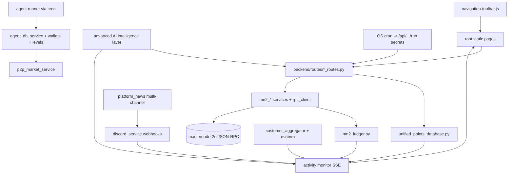

# Masternoder MN2 Ecosystem (retargeted to Masternoder.dk Flask app)

Supersedes the earlier `mn2-casino` plan. All work lands in `C:\Users\jonkh\UsecaseSampler\Masternoder.dk`.

## Conventions (from codebase audit)
- New API: add `backend/routes/<feature>_routes.py` with a `Blueprint` using full `/api/...` paths and `resolve_user_id()`; register in [backend/register_blueprints.py](backend/register_blueprints.py) (and lite list if needed).
- New page: static `<feature>/index.html` at repo root + add to `PAGES` in [backend/routes/all_page_routes.py](backend/routes/all_page_routes.py) + nav in [static/js/navigation-toolbar.js](static/js/navigation-toolbar.js).
- Money/points: always read/write via [backend/services/unified_points_database.py](backend/services/unified_points_database.py); for MN2 movements also append to [backend/services/mn2_ledger.py](backend/services/mn2_ledger.py). MN2 chain ops via [backend/services/mn2_rpc_client.py](backend/services/mn2_rpc_client.py).
- Tests mirror `tests/unit/` (e.g. `test_mn2_network_monitor.py`) with mocked RPC; run via `pytest`.

## Phase 0 - Audit + report
- Audit MN2 mechanics end to end (deposit scan, withdraw + risk, staking, ledger reconcile, unified balance read path). Capture in `docs/MN2_ECOSYSTEM_REPORT.md`.

## Phase 1 - Coin "super check" + daemon health + tests
- Extend the EXISTING `backend/routes/health_routes.py` (do not duplicate) with an `mn2` section + `GET /api/mn2/health`: RPC reachability via `mn2_rpc_client`, block-height monotonicity using `data/mn2_network_history.jsonl`, deposit-scanner freshness, staking-stopped alerts; surface it in the Health Ops Hub contract.
- Harden `mn2_deposit_scanner.py` / `mn2_chainz.network_overview()` against RPC outages (already best-effort; add explicit health flags).
- Tests: `tests/unit/test_mn2_health.py` plus fill coverage gaps for `recent_blocks()` / `masternodes()` (mock RPC).

## Phase 2 - Wallet: multi-connect, address refresh, top 10 features
- Address rotation: extend `mn2_wallet_service.py` + `data/mn2_user_addresses.json` to hold multiple labeled addresses per user; add `POST /api/mn2/wallet/refresh` (rotate/derive + rescan) and `POST /api/mn2/wallet/connect` for external wallet types (Core/QT via RPC, web, extension stub, hardware stub).
- Top 10 wallet features: (1) multi-wallet connect, (2) address rotation/refresh, (3) richer withdrawals UX on existing `/api/mn2/withdraw`, (4) MN2<->coins swap (config `coins_per_mn2`), (5) user-to-user MN2 send, (6) QR + address book, (7) per-wallet balance/history split, (8) labels/notes, (9) staking/masternode rewards view (reuse `staking-monitor`), (10) CSV export from `mn2_ledger`.
- UI: extend `profile/index.html` wallet panel + `static/js`.

## Phase 3 - P2P market + agent liquidity + points
- New `backend/services/p2p_market_service.py` + `backend/routes/p2p_market_routes.py` (`/api/market/*`): MN2<->coins limit/market orders, escrow via `unified_points_db`, matching engine, order book/ticker, cancel. (Generalizes the disabled MN2-for-USD `mn2_p2p_service.py`.)
- New page `market/index.html` + nav entry.
- Points on every market action through `unified_points_db` (`activity_points`) and `mn2_ledger` for MN2 legs.
- Tests: `tests/unit/test_p2p_market.py` (matching, escrow, no negative balances, idempotency).

## Phase 4 - Agents: wallets, points, levels, trader skills, control board
- Agent wallets: new `backend/services/agent_wallet_service.py` + table `agent_wallets` (agent_id, coins, mn2) funded from the treasury; record via `agent_db_service.record_agent_activity`.
- Trader agents: new `backend/services/agent_trader_service.py` with strategies (market-maker, momentum, mean-reversion, liquidity/random-walk, arbitrage, sniper) that place/fill `/api/market` orders to keep it liquid and trade with real users; expand skills in `agent_skillset.py`. Default fleet = one agent per strategy (configurable `trader_agent_count`, default 6).
- Agent treasury funding (real on-chain, fund trader agents only, 100,000 MN2 each):
  - Config in `data/mn2_config.json` -> `agent_funding`: `{ per_agent_mn2: 100000, trader_agent_count: 6, top_up: true }`. Required total = `per_agent_mn2 * trader_agent_count` (default 600,000 MN2; auto-scales with fleet size).
  - ONE treasury deposit address generated via `mn2_rpc_client.getnewaddress("agent-treasury")`, persisted to `data/agent_treasury.json` and mapped in `data/mn2_user_addresses.json` to a reserved `agent_treasury` account so the existing `mn2_deposit_scanner` auto-credits it (in-app `mn2_balance` of the treasury account).
  - `GET /api/agents/treasury/address` (ops-secret guarded) returns the funding address + required total + per-agent amount + current pool balance + distribution status (this is where the actual address is surfaced at execution time).
  - Auto-distribution job `distribute_agent_funding()` (preset in `agent_cron_service.py` + `cron/agents_treasury_distribute.sh`, also callable via `POST /api/agents/treasury/distribute`): tops each trader agent wallet up to `per_agent_mn2`, debiting the treasury pool, appending one `mn2_ledger` entry per transfer. Idempotent (only funds the gap to target), guarded so total debits never exceed the pool, and emits an `activity_events` entry per funding.
  - Surfaced in the agents control board with a "Fund agents" action + live treasury/pool/per-agent status.
- Tests: `tests/unit/test_agent_treasury.py` (address generation mocked RPC, scanner credit, idempotent top-up to 100k, no over-distribution beyond pool).
- Runner: add `agent_trader` job to `agent_cron_service.py` + `cron/agents_trader.sh` (existing secret pattern) so agents stay active on schedule.
- Leveling: agents already level at 500 XP/level (`agent_db_service.py`); add configurable thresholds + level-gated unlocks (more strategies/capital/risk).
- Control board: restore the missing `backend/services/point_system_control_board.py` + `backend/routes/point_control_board_routes.py` (referenced by `dashboard/point_control_board.html` and `integrate_178_systems_to_control_board.py`); add `backend/routes/agent_admin_routes.py` + `dashboard/agents_control/index.html` to start/stop/pause the runner, fund/defund agent wallets, switch strategy/risk, and set/add levels, with per-agent status/P&L/points/level.
- Tests: `tests/unit/test_agent_trader.py`, `tests/unit/test_agent_wallets.py`.

## Phase 5 - Explorer + multi-channel news + Discord integration
### Explorer (unchanged scope)
- Implement iquidus-first branch in `mn2_chainz.network_overview()` per `docs/MN2_EXPLORER_PLAN.md`; add in-page tx/address detail routes in `mn2_explorer_data.py` + `mn2_staking_routes.py`; wire `explorer/index.html` + `static/js/mn2-explorer-overview.js`.
- Top 10 explorer features: (1) in-page tx detail, (2) in-page address detail, (3) internal search, (4) rich list, (5) supply/emission stats, (6) masternode detail, (7) mempool/pending, (8) tx-volume charts, (9) auto-refresh, (10) JSON API parity.
- Tests: `tests/unit/test_mn2_explorer_data.py`.

### Multi-channel news (extend existing `platform_news_routes.py`)
- Extend `data/platform_news.json` schema with `channels[]` per post: `home`, `explorer`, `casino`, `generator`, `game`, `market`, `agents`, `discord`, `ops`.
- API: extend `GET /api/news/platform?channel=&limit=&featured=` (already exists — add channel filter); add `GET /api/news/channels` (channel list + subscriber counts); add ops-only `POST /api/news/publish` (admin) with auto-discord flag.
- Refactor `news/index.html` to fetch `/api/news/platform` (remove static drift vs JSON); add channel tabs/filters; wire `static/js/frontpage-home.js` to pass channel where relevant.
- Auto-publish hooks: when explorer ships, market events, agent funding, generator milestones, casino jackpots, or security cron alerts fire → append to `platform_news.json` AND queue Discord message (see below).
- Optional: `GET /api/news/rss/<channel>` for external syndication (Discord bots, partners).

### Discord connection (new — no Discord code exists today; only idea #14 in `aggregator_ideas_top15.json`)
- New `backend/services/discord_service.py` + `backend/routes/discord_routes.py`; register in `register_blueprints.py` + lite list if needed.
- Config in `.env.example`: `DISCORD_WEBHOOK_URL` (outbound), `DISCORD_BOT_TOKEN`, `DISCORD_GUILD_ID`, `DISCORD_CHANNEL_ID_*` per news channel (e.g. `_EXPLORER`, `_CASINO`, `_GENERATOR`, `_GAME`, `_MARKET`, `_OPS`, `_ANNOUNCEMENTS`), `DISCORD_OPS_SECRET` for cron/admin triggers.
- **Outbound (platform → Discord):** webhook/embed posts from `discord_service.post_message(channel, payload)`; triggered by news publish, `activity_events.jsonl` high-signal events (big deposit, market fill, agent funded, generator complete, casino jackpot), and daily AI digest cron (`cron/discord_digest.sh` → `POST /api/discord/digest/run`).
- **Inbound (Discord → platform):** optional bot slash commands or webhook callbacks: `/mn2price`, `/market`, `/link-account` (OAuth or one-time code → bind Discord user_id to `user_accounts` via `logs/user_identifiers/discord_<id>.json`); never trust Discord identity for withdrawals without verified link + Gate S auth.
- Message format: rich embeds with title, summary, link back to site (`href` from news item), optional avatar/thumbnail from customer/agent SVG; rate-limit Discord API (429 backoff) off-request only.
- Monitoring tie-in: Discord post success/failure → `logs/activity_events.jsonl` (`discord_post_ok`, `discord_post_failed`); show "Discord feed" status tile in Phase 8 monitor + Health Ops Hub.
- Tests: `tests/unit/test_discord_service.py` (mock webhook, channel routing, idempotent message_id dedup in `logs/discord_outbox.jsonl`).

### Discord income streams (M8 wave — add to AI monetization section)
51. **Discord Role Gating (MN2 Holder)** — bot verifies linked account + min `mn2_balance`; grants Discord role for premium channel access; drives MN2 acquisition/staking.
52. **Discord-Exclusive Promo Codes** — shop/casino codes posted only in Discord; AI rotates codes and tracks redemption in `shop_routes` / `casino_service`.
53. **Discord Alert Funnel** — market/explorer/agent win alerts → click-through to site → Upsell Orchestrator (M3); measure conversion in `customer_aggregator`.
54. **Discord Partner Spotlight** — paid B2B slot for other crypto projects to announce in `#partners`; fee in MN2 or USD invoice.
55. **Discord Daily Digest (AI)** — LLM summarizes platform_news + activity_events; premium digest tier unlockable with MN2 or shop SKU.
56. **Discord Quest Bot** — posts daily quest link; completing on-site awards MN2 (`game_mn2_rewards` / debugger quiz); anti-farm via linked Discord account.
57. **Discord Affiliate Link Rotator** — AI picks best affiliate offer per message (on-ramp, exchange, tools); track clicks in `logs/discord_clicks.jsonl`.
58. **Discord Casino Win Highlights** — anonymized big-win embeds (RG-safe, opt-in); social proof → fiat/MN2 deposits.
59. **Discord Generator Showcase** — featured creator videos + tipping link; Creator Tipping Router (M2) funnel.
60. **Discord Support Bot** — RAG/LLM answers FAQs; escalates to Customer Support Copilot; reduces churn (M3).

**M8 build wave:** after news channels + discord_service live; Gate S (no money moves from Discord without site auth); legal: disclose affiliates, no gambling solicitation in blocked geos.

## Phase 6 - Debugger Q&A crypto rewards
- Wire the existing "Top 50 Q&A" quiz in `debugger/index.html` to a backend: `POST /api/debugger/quiz/submit` that grades server-side, awards MN2 via `unified_points_db.add_points(..., 'mn2_balance', ...)` + `mn2_ledger`, and adds a `'quiz'` entry to `TAB_POINTS` in `debugger_agent_tasks_routes.py`. Guard against repeat/self-reward farming.
- Tests: `tests/unit/test_debugger_quiz_rewards.py`.

## Phase 7 - Casino crypto expansion
- Casino already supports `mn2_balance` rail (`casino_service.py`). Add MN2-denominated jackpots/tournaments, MN2 cashback, and surface the MN2<->coins swap from Phase 2; document casino-crypto policy in the report.

## Phase 8 - Wallet crypto-activity monitoring (effects + sounds)
- Backend: new `backend/routes/activity_stream_routes.py` exposing `GET /api/activity/stream` (Server-Sent Events) + `GET /api/activity` history, sourced from `mn2_ledger` + unified-points deltas + market/agent/quiz/game events (lightweight append log `logs/activity_events.jsonl`).
- Frontend: a monitor panel (on `profile/` and `/game`) subscribed to SSE with per-event visual effects (balance pulse, toasts, animated ticker, confetti on big deposits/wins) and sound effects (deposit chime, win/jackpot, trade tick, withdrawal, alert) via Web Audio API; global mute + volume + per-type toggles persisted in `localStorage`. Include **news channel widgets** (filter by channel) and **Discord feed status** tile (last post, failures from `logs/discord_outbox.jsonl`).
- Tests: `tests/unit/test_activity_stream.py`.

## Phase 9 - Security dynamics (cron jobs)
- Add security-oriented scheduled jobs following the existing `cron/*.sh` -> authenticated HTTP pattern (secrets in `.env`): periodic withdrawal-risk sweep (batch `mn2_withdrawal_risk`), anomaly/velocity detection on deposits/trades with auto-flag/auto-freeze (`account_security_service`), ledger/balance reconciliation drift alarms, expired-session cleanup, deposit-address rescan, agent-wallet reconciliation.
- Implement as new presets in `agent_cron_service.py` (so logging lands in `logs/agent_cron/`) + `cron/*.cron.d` + `scripts/deploy.py` manifest entries; each job emits to `logs/activity_events.jsonl` (Phase 8) and `platform_news.json` on notable events.
- Tests: `tests/unit/test_security_cron.py`.

## Phase 10 - Generator crypto (pay + earn) + top 10 encoder ideas
- Pay-to-generate: new `backend/services/generator_pricing_service.py` (cost by duration/quality/provider) + `backend/services/generator_mn2_service.py` (debit/refund via `unified_points_db` + `mn2_ledger`); enforce in `generator_create` / `generator_magic_generate` / `unified_generate_video` (pre-thread check, mirroring the tier check) and refund on failure in `_run_video_generation_impl`. Add `GET /api/generator/pricing`.
- Earn MN2: in `_award_generation_points` (`video_generator_service.py`) also credit `mn2_balance` (configurable), shown in the existing history UI.
- Top 10 encoder ideas: (1) HD/1080p + 60fps premium profiles, (2) selectable codec/CRF presets, (3) on-chain content hash stamped into job + `mn2_ledger` (proof-of-creation), (4) optional MN2/wallet watermark overlay, (5) crypto-themed templates (price ticker, masternode stats intro), (6) priority/express encode queue (MN2-gated), (7) longer-duration unlock, (8) multi-provider "max quality" fan-out as paid tier, (9) audio mastering tier (DeepFilterNet/loudnorm), (10) shareable mint/export with creator tipping.
- Tests: `tests/unit/test_generator_mn2.py`.

## Phase 11 - Game site: unified monitor + crypto rewards + top 10 earn
- Unified monitor: add a "Monitor" tab to `game/index.html` (or `profile/`) pulling `GET /api/aggregator/unified-dashboard/data` + per-game pings (`/api/battle/progress`, `/api/star-map/25/status`, `/api/lab/overview`, `/api/game/hunters/profile`, `/api/trophies/list`); nav entry in `navigation-toolbar.js`.
- Crypto rewards: shared `backend/services/game_mn2_rewards.py` called from battle/starmap/quests/trophies to credit `mn2_balance` (extends the existing `/api/battle/crypto/claim` + `/api/star-map/25/crypto/claim` pattern).
- Top 10 new earn functions (via `unified_points_db.add_points`): daily multi-game streak, cross-game combo bonus, first-win-of-day, quest+trophy chain, leaderboard-rank payouts, referral/social, watch-to-earn from generator videos, compendium-completion MN2, casino-playthrough rebate, monitor-check-in.
- Fixes: quest-complete arg order bug in `quest_routes.py` (~line 249) and `/api/quests/user/<id>` alias.
- Tests: `tests/unit/test_game_mn2_rewards.py`.

## Phase 12 - Customer aggregator (unified customer directory + avatars)
- New `backend/services/customer_aggregator_service.py` + `backend/routes/customer_aggregator_routes.py` (`/api/customers/*`): aggregate every platform customer from `src/db/models.py` `user_accounts` + `logs/user_identifiers/` + `logs/unified_points/*.json`, joining per customer: identity/provider, balances (`coins`, `mn2_balance`), level/points, last-active, and participation across casino/generator/game/market + agent assignments.
- Endpoints: `GET /api/customers` (paginated, search/sort/filter), `GET /api/customers/<id>` (detail), `GET /api/customers/stats` (total, new today, active). Admin/ops-auth gated (PII) + rate-limited; GDPR-aware (no secrets/hashes exposed).
- Pictures (auto avatars): reuse the existing avatar approach (`scripts/generate_agent_avatars.py`, `static/img/agents/*.svg`, `agent_db_service._avatar_url`) to deterministically generate `static/img/customers/<id>.svg` for each customer; add an `avatar_url` resolver. Generate on account creation (hook `user_db_service.ensure_user_account` / onboarding) and backfill existing customers via a one-off script + cron. Avatar generation runs off the request path (Gate S stability).
- Page: `customers/index.html` at repo root + add to `PAGES` in `all_page_routes.py` + nav entry; card grid showing avatar + key stats.
- Monitoring tie-in: emit `customer_new` and `customer_active` events to `logs/activity_events.jsonl` so the Phase 8 activity monitor shows new customers (with avatar) using the shared effects + sounds; add a "Customers" tile to the monitor.
- Tests: `tests/unit/test_customer_aggregator.py` (aggregation join correctness, avatar generation idempotent, admin-auth required, monitoring events emitted).

## Phase 13 - Advanced AI intelligence layer (25 features, Gate S compliant)
AI is not a chatbot layer. It is an off-request intelligence layer that powers market-making, game dynamics, generator quality, fraud defense, and autonomous ops. All model calls run through cron, subprocess jobs, cached snapshots, or background workers; request routes only enqueue jobs or read already-computed outputs.

### AI model/provider matrix to evaluate and use
- **Agent reasoning / tool use:** evaluate Qwen3-Coder/Qwen3, DeepSeek, Kimi, and GLM-class open models for local/off-request agent jobs; use existing `llm_service.py` provider routing as the abstraction. Hosted fallback stays behind `llm_service.py` (OpenAI/Gemini/Anthropic/OpenRouter/etc. when configured).
- **Ops/debugger support:** use a strong reasoning LLM through `llm_service.py` for log triage and blueprint audits, but store only sanitized summaries in `logs/activity_events.jsonl` and debugger reports.
- **Market forecasting:** use lightweight time-series models first (EWMA/ARIMA/gradient boosting) and evaluate open libraries such as PyOD, Merlion, and dtaianomaly for anomaly/forecast jobs. These run in cron against `data/mn2_network_history.jsonl`, market trades, and `mn2_ledger.py` exports.
- **Security/anomaly:** start with deterministic rules + robust z-score/isolation forest; graduate to PyOD/Merlion/dtaianomaly style detectors only after labeled events exist. No black-box model may directly move funds; models only flag/hold/recommend.
- **Generator/video:** keep current provider bridge (`video_ai_bridge.py`, `ai_providers_routes.py`) and evaluate Wan/LTX-style open video models plus existing hosted providers (Runway/Pika/Replicate/Stability/Pollinations/TTS). Provider choice is made by the Provider Selection Brain and must respect cost/latency/failure caches.
- **Embeddings/RAG:** add a small embedding model (e.g. BGE/Sentence-Transformers family) for customer support, debugger docs, and plan/code retrieval; store indexes off-request and never generate embeddings inside request workers.
- **Model governance:** each model/provider gets a config row or JSON entry with `purpose`, `cost_limit`, `timeout`, `fallback`, `data_allowed`, and `human_review_required`. All AI outputs that affect money require deterministic validation and idempotent references before execution.

### AI trading agents & market intelligence
1. **MN2 Market-Maker Brain** - `agent_trader_service.py`, `p2p_market_service.py`, `agent_wallet_service.py`, `logs/activity_events.jsonl`; heuristic agent + small ML model for spread/volatility/liquidity; keeps the P2P market alive without draining agent wallets.
2. **Price Oracle Forecaster** - `mn2_chainz.py`, `data/mn2_network_history.jsonl`, `/api/market/ticker`; time-series or gradient boosting model; improves MN2 pricing for swaps, casino, generator, and market trades.
3. **Agent Risk Governor** - `agent_wallets`, `agent_db_service`, `agent_admin_routes.py`; rule-based risk AI + anomaly scoring; caps strategy size by level, drawdown, and market stress.
4. **Liquidity Gap Detector** - `p2p_market_service.py`, `agent_cron_service.py`, `logs/activity_events.jsonl`; clustering/order-book heuristics; detects buy/sell gaps and schedules trader-agent fills.
5. **Agent Strategy Evolution** - `agent_skillset.py`, `agent_db_service.agent_progress`, `agent_trader_service.py`; multi-armed bandit; promotes strategies that create volume with acceptable P&L/risk.

### AI opponents & game mechanics
6. **Adaptive Hunter Opponents** - `hunters_game.py`, `battle_routes.py`, `game_mn2_rewards.py`; LLM persona + difficulty heuristic; makes battles feel alive and adjusts challenge to player skill.
7. **StarMap Tactical AI** - `star_map_routes.py`, `data/star_map_25_*.json`, `unified_points_database.py`; planner agent generating enemy moves and mission modifiers; turns Starmap into dynamic progression.
8. **Casino Responsible Odds Guard** - `casino_service.py`, `account_security_service.py`, `mn2_ledger.py`; fairness/risk heuristics, not manipulative odds; detects harmful patterns and recommends limits.
9. **Dynamic Quest Crafter** - `quest_routes.py`, `trophies_routes.py`, `/api/quests/daily`, `logs/activity_events.jsonl`; LLM-generated quests with reward caps; creates new daily goals across game/battle/generator.
10. **Cross-Game Combo Engine** - `game/index.html`, `/api/aggregator/unified-dashboard/data`, `game_mn2_rewards.py`; recommender + LLM copy; suggests the next best earn action across the platform.

### Intelligent generator optimization
11. **Prompt Refinement Agent** - `generator_create`, `video_generator_service._prepare_generation_config`, `video_ai_bridge.py`; LLM prompt refinement with template/safety constraints; improves video quality from short prompts.
12. **Auto Theme Unlocker** - `GET /api/themes/user`, `unified_points_database.py`, `theme-timeline.js`; recommender over user activity; personalizes generator themes and progression.
13. **Smart Encode Queue** - `generator_shared.py`, `video_generation_jobs`, `run_generator_job.py`; priority model using MN2 payment, job cost, server load, and user status; prevents 504/OOM while giving premium priority.
14. **Provider Selection Brain** - `ai_providers_routes.py`, `llm_service.py`, `video_ai_bridge.py`, `cogs_metering_service.py`; bandit model; picks cheapest/best AI provider per generation stage.
15. **Proof-of-Creation AI Packager** - `video_generator_service.py`, `mn2_ledger.py`, `job_artifacts`, `activity_events`; LLM metadata + content hash ledger stamp; makes MN2 useful for creator proof and tipping.

### AI security & anomaly detection
16. **MN2 Ledger Anomaly Scanner** - `mn2_ledger.py`, `logs/mn2_withdrawal_risk.jsonl`, security cron; isolation forest or robust z-score; flags suspicious transfers before treasury damage.
17. **Sybil Identity Risk Score** - `user_identification.py`, `user_accounts`, `logs/user_identifiers`, earn endpoints; graph/fingerprint clustering; blocks reward farming by anonymous account clusters.
18. **Reward Farming Sentinel** - `game_mn2_rewards.py`, `generator_mn2_service.py`, debugger quiz submit, `rate_limit_middleware.py`; anomaly scoring over repeated earn loops; protects MN2 emission.
19. **Treasury Distribution Guard** - `agent_wallet_service.py`, `agent_treasury.json`, `agent_wallets`, `mn2_ledger.py`; rule-based + ML risk score before 100k-agent top-ups; prevents accidental overfunding.
20. **Market Manipulation Detector** - `p2p_market_service.py`, `market_trades`, `agent_trader_service.py`; graph analysis + wash-trade heuristics; protects market integrity and MN2 price signals.

### Autonomous system operations & support
21. **AI Log Triage Operator** - `logs/`, `agent_cron_service.py`, `debugger/index.html`, `activity_events`; offline LLM ops agent; groups logs by root cause and writes debugger summaries.
22. **uWSGI/OOM Doctor** - `uwsgi*.ini`, `performance_monitor.py`, health routes, cron reports; heuristic diagnostics + LLM explanations; reduces 502/504 and protects generator/video load.
23. **Debugger Challenge Generator** - `debugger_agent_tasks_routes.py`, `debugger/index.html`, `TAB_POINTS`; LLM-generated daily technical Q&A with server-side grading; turns debugger into an earn/learning loop.
24. **Autonomous Blueprint Auditor** - `register_blueprints.py`, `all_page_routes.py`, `logs/register_intelligence/404_occurrences.jsonl`; static analysis + LLM summaries; finds broken endpoints like `/api/themes/user` before users hit them.
25. **Customer Support Copilot** - `customer_aggregator_service.py`, `/api/customers/<id>`, `mn2_ledger.py`, `activity_events`; RAG/LLM over customer activity and safe balances; helps support resolve issues without exposing secrets.

Tests: add `tests/unit/test_ai_intelligence_jobs.py` for job enqueue/cache behavior, no request-worker model execution, Gate S auth/rate-limit checks, and event emission into `logs/activity_events.jsonl`.

### AI monetization brainstorm — crypto + USD income streams (external sources included)
Goal: AI should not only optimize the platform — it should **create and protect revenue**. All money-moving AI decisions remain off-request, idempotent, and human-reviewable where required (Gate S + EU casino compliance).

**Income rails already in codebase to extend:** `mn2_balance`, `casino_fiat_balance`, `coins`, `mn2_onramp_routes.py`, `mn2_p2p_service.py`, `shop_mn2_purchase_core.py`, `generator_pricing_service` (planned), `cogs_metering_service.py`, `data/monetization_config.json`.

#### A. MN2-native revenue (platform earns / retains MN2)
26. **Dynamic MN2 Pricing Brain** — `generator_pricing_service.py`, `p2p_market_service.py`, `data/mn2_config.json` (`coins_per_mn2`); time-series + elasticity model; adjusts pay-to-generate, swap spread, and market fees by demand/supply. **Value:** maximizes MN2 capture without killing usage.
27. **AI Spread & Fee Optimizer** — `p2p_market_service.py`, `agent_trader_service.py`; bandit over maker/taker fees; learns fee level that maximizes volume × spread. **Value:** sustainable market revenue in MN2.
28. **Creator Tipping Router** — `Proof-of-Creation AI Packager`, `mn2_ledger.py`, generator history; LLM suggests tip amount + creator pitch; optional MN2 micro-tips on video share. **Value:** creator economy keeps MN2 circulating.
29. **Staking Yield Advisor (informational)** — `mn2_staking_service.py`, `staking-monitor/`; LLM + forecast model explains optimal stake/unstake timing (no auto-move without user confirm). **Value:** increases staked MN2 → network health + retention.
30. **MN2 Burn/Sink Recommender** — `unified_points_database.py`, shop/casino/generator; AI proposes sinks (premium themes, express queue, tournament entry) where MN2 leaves circulation by design. **Value:** controls inflation while funding features users want.

#### B. USD / fiat income streams (PayPal, PSP, casino)
31. **AI Upsell Orchestrator** — `casino_service.py`, `shop_routes.py`, `profile/index.html`; recommender + LLM copy; surfaces USD coin packs / premium tiers at high-intent moments (after win, low balance, streak break). **Value:** higher ARPU without dark patterns; respect RG limits.
32. **Churn Prevention Agent** — `customer_aggregator_service.py`, `activity_events`, email/notification hooks; ML churn score + LLM personalized win-back offer (bonus, not unlimited credit). **Value:** retains paying users; reduces CAC waste.
33. **Responsible VIP Tier Predictor** — `casino_service.py`, `unified_points`; ML segments whales vs casual; ops-approved VIP invites only. **Value:** targets high-LTV USD players compliantly.
34. **PayPal/PSP Conversion Optimizer** — `mn2_onramp_routes.py`, `paypal_routes.py`; A/B bandit on checkout copy, rail order (Trustly vs card vs PayPal phase-2); **Value:** more completed fiat deposits.
35. **COGS-Aware Margin Guard** — `cogs_metering_service.py`, `generator_pricing_service`, `llm_service.py`; AI flags when AI provider costs exceed revenue per job; auto-suggest price increase or cheaper provider route. **Value:** generator/casino stay profitable in USD terms.

#### C. External crypto sources (other coins/chains/on-ramps/APIs)
36. **Multi-Asset On-Ramp Router** — extend `mn2_onramp_routes.py` + new `ai_onramp_router_service.py`; compares BTC/ETH/USDT/USDC on-ramp quotes (affiliate APIs: MoonPay, Transak, etc. where licensed); LLM explains best route to user. **Value:** affiliate/referral USD + easier MN2 acquisition; user pays in familiar crypto.
37. **Cross-Chain Price Arbitrage Scout (alert-only)** — cron job reading CEX/DEX/Chainz APIs; ML detects MN2 mispricing vs BTC/ETH pairs on external venues; emits ops alerts, never auto-trades without treasury policy. **Value:** treasury can capture external arb safely.
38. **Wrapped/Bridge Opportunity Analyzer** — `docs/` + `mn2_config.json`; LLM research agent summarizes bridge/wrap options for MN2 on EVM (future); scores liquidity/partner risk. **Value:** roadmap for external liquidity without blind integration.
39. **Affiliate Offer Matcher** — `customer_aggregator_service.py`, `news/platform_news.json`; RAG over partner programs (exchanges, wallets, VPN/crypto tools); personalized affiliate tiles per user geo/KYC tier. **Value:** USD commission from third parties; no custody.
40. **External Wallet Connect Intelligence** — Phase 2 multi-wallet + WalletConnect stub; AI ranks which external wallet UX to prioritize by user agent/geo; **Value:** faster connect → more deposits from MetaMask/Trust/etc.

#### D. B2B / API / white-label (sell intelligence, not custody)
41. **MN2 Market Data API (paid)** — `mn2_chainz.py`, `p2p_market_service.py`, `explorer`; sanitized ticker/history/volume JSON API with API keys (`agent_support` pattern); AI generates daily market briefs as premium tier. **Value:** recurring USD/MN2 subscription from other projects.
42. **White-Label Generator API** — `generator_create`, `generator_mn2_service.py`; other coin communities pay MN2 or USD for branded video generation; AI handles prompt localization per project. **Value:** B2B revenue without building new frontends.
43. **Agent-as-a-Service for Other Markets** — `agent_trader_service.py` packaged as `/api/b2b/market-maker` (read-only signals or licensed bot configs); **Value:** sell playbooks, not keys.
44. **Anomaly-Detection-as-a-Service** — export Gate S scanners (`mn2_ledger` anomaly, sybil score) as API for partner casinos/shops; **Value:** compliance product in USD.
45. **Embeddings/RAG Knowledge Pack** — sell anonymized compendium/rulebook RAG index to partners; LLM answers with MN2 attribution; **Value:** licensing content + AI infra.

#### E. Agent economy & marketplace (users pay agents / agents earn)
46. **Paid Agent Skill Marketplace** — `agent_skillset.py`, `shop_routes.py`; users spend MN2/coins to unlock agent strategies (momentum, sniper); AI prices skills by backtested performance. **Value:** MN2 sink + skill progression monetization.
47. **Copy-Trade Signals (non-custodial)** — trader agents publish signals; followers pay MN2 subscription for feed; AI summarizes risk per signal. **Value:** subscription MN2 stream; agents remain separate wallets.
48. **Agent vs Agent Spectator Bets (coins-only, RG)** — `casino_service.py` + `agent_trader_service.py`; cosmetic/social betting on agent match outcomes using coins not MN2 first; AI generates commentary. **Value:** engagement + coin sink; legal review required.
49. **Agent Performance NFT-Alternative (ledger proof)** — hash agent P&L snapshots to `mn2_ledger` + shareable badge; LLM writes season recap; **Value:** status + tipping without on-chain NFT complexity.
50. **Referral Agent** — dedicated AI agent that optimizes referral copy/links per channel; pays referrers MN2 from marketing pool; fraud-scored by Sybil Sentinel. **Value:** growth with controlled MN2 CAC.

#### F. Compliance-safe constraints (all monetization AI)
- No autonomous movement of user funds or treasury without idempotent job + audit row in `mn2_ledger.py`.
- USD/gambling offers must respect `launchMarkets`/geo, KYC, and responsible-gambling limits (`casino_service`, `account_security_service`).
- External crypto affiliates/on-ramps: geo-block + disclose affiliate relationship; no unlicensed money transmission.
- All pricing/fee AI outputs versioned in `data/ai_monetization_decisions.jsonl` for regulator/ops review.

**Build priority (user request: implement ALL monetization streams — phased after Gate S):**

| Wave | Streams (idea #) | Stage | Gate |
|------|------------------|-------|------|
| **M1** Foundation pricing | 26 Dynamic MN2 Pricing, 35 COGS Margin Guard, 14 Provider Selection (cost) | Stage 2 early | S + B |
| **M2** Platform MN2 capture | 27 Spread/Fee Optimizer, 28 Creator Tipping, 30 MN2 Burn/Sink, 46 Agent Skill Marketplace | Stage 2 | C |
| **M3** USD/fiat casino | 31 Upsell, 32 Churn Prevention, 33 VIP Predictor, 34 PSP Conversion | Stage 2 | S (RG) + C |
| **M4** External crypto | 36 On-Ramp Router, 37 Arb Scout, 38 Bridge Analyzer, 39 Affiliate Matcher, 40 Wallet Connect Intel | Stage 2–3 | S + legal review |
| **M5** B2B/API | 41 Market Data API, 42 White-Label Generator, 43 Agent-as-a-Service, 44 Anomaly-as-a-Service, 45 RAG Knowledge Pack | Stage 3 | C + API keys |
| **M6** Agent economy | 47 Copy-Trade Signals, 48 Spectator Bets (coins), 49 Performance Proof, 50 Referral Agent | Stage 3 | C + legal |
| **M7** Staking advisory | 29 Staking Yield Advisor (informational only) | Stage 3 | S |
| **M8** Discord channel economy | 51–60 Discord Role Gating, Promo Codes, Alert Funnel, Partner Spotlight, Daily Digest, Quest Bot, Affiliate Rotator, Casino Highlights, Generator Showcase, Support Bot | Stage 2–3 (after Phase 5 news+Discord) | S + legal + Discord ToS |

All waves emit decisions to `data/ai_monetization_decisions.jsonl` and revenue events to `logs/activity_events.jsonl` for monitoring. Discord posts also log to `logs/discord_outbox.jsonl`. No wave may auto-move funds without idempotent ledger refs.

### M7 implementation spec (Staking Yield Advisor — idé #29)

**Status:** Implemented in `backend/services/ai_staking_advisor_service.py`

| Component | Path |
|-----------|------|
| Service | `backend/services/ai_staking_advisor_service.py` |
| Routes | `GET /api/ai/staking-advisor`, `POST /api/ai/staking-advisor/refresh` (ops) in `discord_routes.py` |
| Cache | `data/ai_staking_advisor_cache.json` |
| Decisions log | `data/ai_monetization_decisions.jsonl` |
| Cron | `cron/staking_advisor.sh` |
| Tests | `tests/unit/test_ai_staking_advisor.py` |

**Rules:** Informational only; never calls `stake()`/`unstake()`; disclaimer required in UI.

### M8 implementation spec (Discord channel economy — idéer 51–60)

**Status:** Infrastructure live; per-stream rollout phased after Gate S + Phase 5 news channels.

| # | Stream | Trigger | Backend hooks |
|---|--------|---------|---------------|
| 51 | Role Gating | Link + balance cron | `discord_service`, `unified_points_database` |
| 52 | Promo Codes | Cron + ops | `shop_routes`, `data/discord_promo_codes.json` |
| 53 | Alert Funnel | `activity_events.jsonl` | `discord_service` + UTM |
| 54 | Partner Spotlight | Ops POST | `platform_news` channel=market |
| 55 | Daily Digest | `cron/discord_digest.sh` | `platform_news_digest.run_daily_digest` |
| 56 | Quest Bot | Daily cron | `game_mn2_rewards`, quest routes |
| 57 | Affiliate Rotator | Digest posts | `discord_clicks.jsonl` |
| 58 | Casino Highlights | Opt-in wins | `casino_service`, RG geo-block |
| 59 | Generator Showcase | Job complete | `video_generator_service` |
| 60 | Support Bot | Inbound webhook | RAG + support copilot |

**Build order:** 51 → 52+56 → 53+55 → 58+59 → 57+54+60. **Compliance:** No custody on Discord; auth on-site; affiliate disclosure; geo-block gambling promos.

## Phase 14 - Overall tests + deliverables + commit
- Run `pytest`; fix failures. Deliver `docs/MN2_ECOSYSTEM_REPORT.md` and `docs/MN2_TODO.md` split into **Critical** (correctness/security/financial integrity) and **Upgrades**.
- Commit: the repo has a `.git`, so once you approve leaving plan mode I will commit the plan (`docs/PLAN.md`) and subsequent work here.

## Assumptions / notes
- "Agents" = in-app autonomous bot accounts; they get wallets, points, levels, and a control board.
- The MN2 daemon may not be reachable locally; health/tests use mocked RPC and the code already degrades gracefully to Chainz.
- Monitoring uses SSE (no new dependency); sounds via Web Audio API.
- Several referenced backends (point control board, battlegrounds, champions-league, victory tech tree) are missing locally and will be (re)created where in scope.
- Execution and any git commit require leaving plan mode.