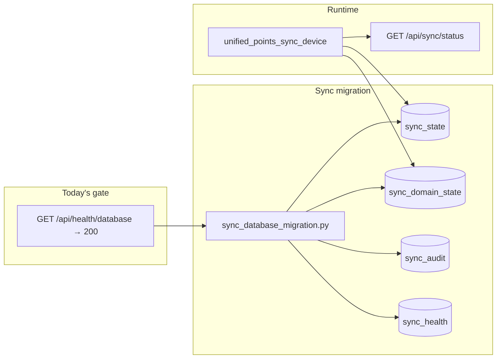

# Today: Sync migration + database health green

**Date:** 2026-07-20  
**Single WIP:** Database health 200 first, then sync migration. Do not parallelize server fixes.

## Recommendation (what is best to do)

| Order | Why |
|-------|-----|
| **1. Database health green** | Sync migration writes to the same DB. If `DATABASE_URL` or permissions are wrong, migration silently falls back to JSON and you get a false “done.” |
| **2. Sync migration** | Once DB is reachable from uwsgi, run `sync_database_migration.py` and verify sync APIs use the four sync tables. |
| **3. Defer system health** | `/api/health/system` timeout (MN2 RPC, heavy checks) is a separate track. Database green ≠ system green per `DATABASE_HEALTH_GREEN_CHECKLIST.md`. |

**Do not** bundle sync migration into `run_all_migrations.py` today — run the dedicated script on server after DB health is green.

---

## Current state (from repo)

| Check | Status | Notes |
|-------|--------|-------|
| `GET /api/health` | **200** on prod | Basic liveness OK |
| `GET /api/health/database` | **200** (2026-07-20 probe) | `missing_tables: []`, 11 tables |
| `GET /api/health/system` | **Timeout** | Out of scope for today's done-state |
| Sync tables on prod | **Unknown** | Not in `tables_to_check`; may be missing while DB health “core” tables pass |
| Sync migration in registry | **Missing** | `sync_database_migration.py` not listed in `docs/db/migration_registry.md` |

---

## Architecture (what we're wiring)



**Fallback risk:** If migration is not run or DB is unreadable, `unified_points_sync.py` writes to `logs/unified_points_sync/sync_state.json` — sync “works” but is not DB-backed.

---

## Phase 0 — Baseline diagnose (15–30 min)

**Where:** SSH on prod (`/var/www/html`)

```bash
cd /var/www/html
sudo bash scripts/verify_server_env_db.sh
curl -sS -m 30 http://127.0.0.1:5000/api/health/database | jq .
sudo journalctl -u uwsgi-vidgenerator -n 80 --no-pager
```

**Capture:**

- HTTP code from `/api/health/database`
- Error body if 503 (`error` field in JSON)
- `DATABASE_URL` target exists and is readable by uwsgi user (`www-data`)
- `instance/` directory writable
- Disk space (`df -h`)

**Common 503 causes (fix in Phase 1):**

| Symptom | Fix |
|---------|-----|
| `unable to open database file` | Fix path in `.env`; `chown`/`chmod` on `instance/` and `.db` |
| `database is locked` | Stop concurrent migrations; check WAL; retry |
| Missing core table in `missing_tables` | Run relevant migration from `migration_registry.md` |
| uwsgi not loading `.env` | Confirm `EnvironmentFile=-/var/www/html/.env` in systemd unit; restart |

---

## Phase 1 — Database health green (gate)

**Definition of done:**

```json
GET /api/health/database → 200
{
  "success": true,
  "status": "healthy",
  "database": { "connected": true, "missing_tables": [] }
}
```

**Tables checked** (`backend/routes/health_routes.py`):

`user_accounts`, `user_profiles`, `player_levels`, `user_points`, `xp_history`, `system_point_snapshots`, `shop_items`, `user_inventory`, `shop_purchases`, `battle_matches`, `user_storage`

**Steps:**

1. Fix `DATABASE_URL` / permissions per `docs/DATABASE_HEALTH_GREEN_CHECKLIST.md` §1–2.
2. If `missing_tables` non-empty, run the owning migration script (see `docs/db/migration_registry.md`).
3. Deploy latest `backend/routes/health_routes.py` if server is behind repo.
4. Restart:

   ```bash
   sudo systemctl restart uwsgi-vidgenerator uwsgi-vidgenerator-5001
   ```

5. Re-curl until 200.

**Smoke (gate 1b):**

```bash
BASE_URL=http://127.0.0.1:5000 bash scripts/smoke_db_health_flows.sh
```

Both database health calls must return **200**. User create should not 5xx.

---

## Phase 2 — Sync migration (after Phase 1 green)

### 2a. Run migration on server

```bash
cd /var/www/html
python3 scripts/sync_database_migration.py
```

**Expected output:** four `[OK]` lines for `sync_state`, `sync_domain_state`, `sync_audit`, `sync_health`.

**Verify tables:**

```bash
python3 -c "
from src.app import create_app
from sqlalchemy import inspect
from src.db.models import db
app = create_app()
with app.app_context():
    names = set(inspect(db.engine).get_table_names())
    for t in ['sync_state','sync_domain_state','sync_audit','sync_health']:
        print(t, 'OK' if t in names else 'MISSING')
"
```

### 2b. Deploy sync code (if stale)

From dev machine (requires `DEPLOY_PASS`):

```bash
python3 scripts/deploy_sync_changes.py
```

This uploads `unified_points_sync.py`, `missing_endpoints_routes.py`, migration script, rulebook, and restarts uwsgi.

### 2c. Verify sync APIs

```bash
curl -sS http://127.0.0.1:5000/api/sync/status | jq '.success, .domains | keys | length'
curl -sS -X POST http://127.0.0.1:5000/api/sync/now | jq .
```

**Confirm DB-backed (not JSON fallback):**

```bash
python3 -c "
from src.app import create_app
from sqlalchemy import text
from src.db.models import db
app = create_app()
with app.app_context():
    r = db.session.execute(text('SELECT sync_count, last_sync_at FROM sync_state WHERE id=1')).fetchone()
    print('sync_state row:', r)
"
```

After `POST /api/sync/now`, `sync_count` or `last_sync_at` should change. Check uwsgi logs for `"JSON fallback"` — there should be none after migration.

### 2d. Optional UI check

- Open profile/dashboard; sync status widget should show domain counts.
- See `docs/PROBLEM_SOLVING_TODOS.md` if widget empty.

---

## Phase 3 — Repo hygiene (same day, low risk)

| Task | File | Why |
|------|------|-----|
| Register sync migration | `docs/db/migration_registry.md` | Prevents “forgot to run on new env” |
| Label as `ops_script` or `active` | same | Distinct from `run_all_migrations.py` pack |
| Session report | `docs/MASTERNODES_UDREDNING_SESSION_REPORT.md` | Audit trail |

**Not today (follow-up):**

- Add sync tables to `/api/health/database` or `/api/health/data-schema`
- Expose `get_sync_health()` on `/api/sync/status`
- Fix `/api/health/system` timeout (MN2 RPC / worker pressure)

---

## Done checklist

- [x] `verify_server_env_db.sh` → `[OK] database health endpoint: 200`
- [x] `smoke_db_health_flows.sh` → both DB health curls **200**, `missing_tables: []`
- [x] `sync_database_migration.py` → four tables exist on prod
- [x] `POST /api/sync/now` → success; `sync_state` row updates in DB
- [x] No `"JSON fallback"` in uwsgi logs during sync
- [x] `MASTERNODES_UDREDNING_SESSION_REPORT.md` updated with date + evidence

---

## Rollback / safety

- Sync migration is **idempotent** (skips existing tables).
- Take SQLite backup before migration: `cp instance/database.db instance/database.db.bak-$(date +%Y%m%d)`
- If sync breaks after migration: device still falls back to JSON; DB health unaffected.

---

## References

- `docs/DATABASE_HEALTH_GREEN_CHECKLIST.md` — full “120% grøn” procedure
- `docs/MASTERNODES_UDREDNING_SESSION_REPORT.md` — prod status (503/timeout)
- `docs/SYNC_AND_AGENT_KNOWLEDGE.md` — sync device architecture
- `scripts/sync_database_migration.py` — migration script
- `scripts/deploy_sync_changes.py` — deploy + run migration on server
- `backend/services/unified_points_sync.py` — runtime sync device
